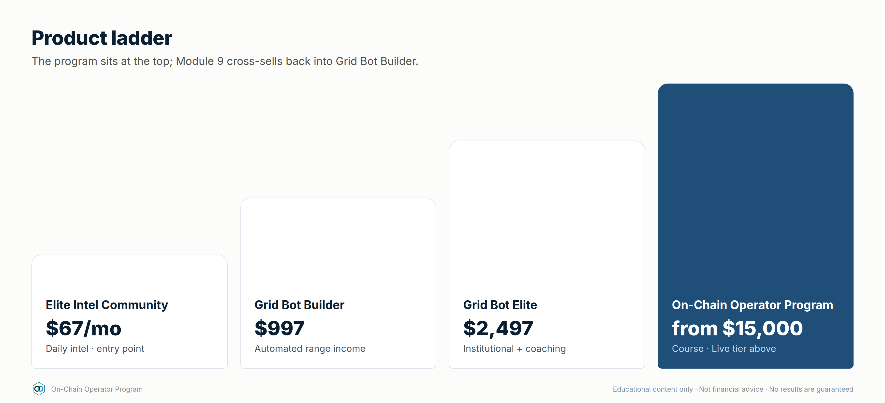
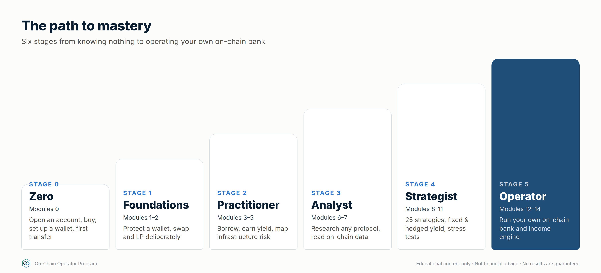

# DeFi Program — Offer & Curriculum (DRAFT for approval)

Status: **draft, nothing created on Whop yet.** Items marked **DECIDE** need
your call before phase 3 (Whop setup).

## Decisions so far (2026-09-24)
| Item | Decision |
|---|---|
| Name | **On-Chain Operator Program** |
| Format | **Two tiers:** self-paced course + a higher tier with live sessions |
| Sales path | **Application → call → checkout** |
| Audience | **Everyone at once:** GBB customers, Elite Intel members and cold ad traffic from launch |
| Price | **Course $15,000 one-time** · Live tier on application |
| Refund policy | **14-day conditional refund** (≤ 10% of lessons, no capstone, no live session used); full text in `07-program-operations.md` §9 |
| Starter tier / GBB pricing conflict | Open |
| Structure | **15 modules, 107 lessons (incl. 15 expert) + a Mastery Starter per module, 6 stages: zero to operator** (expanded 2026-09-24) |

**What $15,000 changes (recommendations, your call):**
- It becomes the top of the ladder (above Grid Bot Elite at $2,497), so it
  needs a **high-ticket sales path**: cold traffic → application → call →
  checkout, not straight-to-checkout ads. `gbb-new-lead` scoring (capital
  20k+ = 4) becomes the qualifier.
- Buyers at this price expect access to you: the live tier (calls, reviews,
  capstone feedback) carries most of the value. The course alone is hard to
  justify at $15k.
- High-ticket crypto education attracts consumer-protection scrutiny. Keep
  every page and call script free of income/return claims, and put terms,
  refund policy and "educational, not financial advice" at checkout.

Built from: Notion → ATLAS → *DeFi & On-Chain (Complete Module)* (42 chapters,
16 strategy frameworks, 20 on-chain metrics) and the existing Grid Bot Builder
offer stack.

---

## Phase 1 — Offer

### Positioning
Grid Bot Builder automates trading **on exchanges**. The DeFi program teaches
people to operate **on-chain** safely: research a protocol, size a position,
know the exit. Your module already has a strong line to lead with:

> **"If you can't explain the unwind, you don't understand the position yet."**

**Promise (skills, not returns):** *Research any DeFi protocol with a 6-step
risk loop, understand exactly where yield comes from, and never sign a
transaction you can't unwind.*

### Working name — DECIDE
*Superseded: see "Decisions so far" at the top. Kept for the record.*
| Option | Why |
|---|---|
| **DeFi Operator Blueprint** (recommended) | Matches "Grid Bot Building Blueprint" on Whop; "operator" = process, not hype |
| Risk-First DeFi | States the differentiator |
| On-Chain Operator Program | Neutral, broader |

### Who it's for — DECIDE
*Superseded: see "Decisions so far" at the top. Kept for the record.*
| Audience | Fit | How they arrive |
|---|---|---|
| **GBB customers** (recommended primary) | Already trust you, already think in systems/risk | Cross-sell email ~14 days after GBB onboarding |
| Elite Intel Community members | Warm, recurring, already reading intel briefs | In-community offer + LAUNCH-style code |
| Cold ad traffic | Largest pool, needs most education | Separate ad campaign → lead skill with `defi-lead` tag |

Recommendation: launch to GBB customers + Elite Intel members first (warm,
lower CAC, real feedback), open to cold traffic once conversion is proven.

### Format — DECIDE
*Superseded: see "Decisions so far" at the top. Kept for the record.*
- **Core (recommended):** self-paced Whop course (15 modules below) + worksheets
  (the two Notion trackers as templates) + quizzes + capstone.
- **Optional higher tier:** Core + live monthly DeFi Q&A / portfolio review.
  Your Calendly already has `vip-defi-consult` and `defi` links — are those
  for this program? (The GBB skills are told never to use them, so they're
  free for DeFi.)

### Pricing — DECIDE (proposal only)
*Superseded: see "Decisions so far" at the top. Kept for the record.*
Mirror GBB's one-time + 3-pay pattern, priced **below** GBB so it works as
a cross-sell rather than competing with it:

| Plan | Proposal | Reasoning |
|---|---|---|
| One-time | $497 | Half of GBB; education product, not software |
| 3-pay | 3 × $197 ($591) | ~19% payment-plan premium, in line with GBB's 20% (3 × $399 vs $997) |
| GBB customer price | $397 or bundle | Rewards the cross-sell |
| Higher tier (if live calls) | $997 | Only if you'll run the calls |

Refund policy — DECIDE: GBB has 30-day money-back on the software. For a
course, suggest **14 days, if under 30% of lessons completed**.

> Still open from before: `gbb ad performance` mentions a "Grid Bot Starter"
> (A$47–97) and GBB at A$497. Other skills say $997, no Starter. Which is
> current? It affects where DeFi sits in the ladder.

### Ladder after launch

---

## Phase 2 — Curriculum: zero to mastery

**Expanded 2026-09-24:** the program now takes someone who knows nothing all
the way to operating as their own bank. That's **15 modules and 107 lessons in
6 stages**, with expert lessons (marked *expert*) in every stage from Foundations up, and **every module opens with a Mastery Starter** (lesson N.0): a
plain-English primer, the words you need, a first safe step and a
beginner → practitioner → master ladder, so anyone can enter any module from zero. Modules 1–9 keep their numbers. Module 0 and Modules 10–14 are new.
All 42 ATLAS chapters are still used exactly once; the new modules are
original content.

Every lesson follows one template: **Objective → Explanation → Worked example
→ Checklist → 3 quiz questions**, with at least one diagram or chart. A full
sample lesson is in `02-sample-lesson-amm-math.md`.

| Stage | Modules | You can… |
|---|---|---|
| **0 · Zero** | 0 | Open and secure an account, buy, set up and back up a wallet, make a first transfer and a first practice DeFi transaction |
| **1 · Foundations** | 1–2 | Protect a wallet, read a transaction, swap and LP deliberately |
| **2 · Practitioner** | 3–5 | Borrow, earn yield and map infrastructure risk |
| **3 · Analyst** | 6–7 | Research any protocol and read on-chain data |
| **4 · Strategist** | 8–11 | Run the 30-strategy library, engineer fixed and hedged yield, stress-test a portfolio |
| **5 · Operator** | 12–14 | Run your own on-chain bank: balance sheet, credit line, income engine, automation |

---

## Stage 0 · Zero

### Module 0 — Crypto From Zero *(8 lessons + Mastery Starter, new)*
Outcome: go from never having owned crypto to a secured exchange account, a backed-up wallet, a first transfer and a first practice DeFi transaction. Ends with the **Day-1 Setup Kit** checklist.

| # | Lesson | Source |
|---|---|---|
| 0.0 | **Mastery Starter:** plain-English primer, key words, first safe step, mastery ladder | new |
| 0.1 | Money, ledgers and why blockchains exist | new |
| 0.2 | Opening and securing an exchange account (KYC, 2FA, allowlists) | new |
| 0.3 | Buying your first crypto without overpaying | new |
| 0.4 | Exchange account vs your own wallet: who holds the keys? | new |
| 0.5 | Setting up your wallet and backing it up (restore test) | new |
| 0.6 | Networks, gas and your first transfer | new |
| 0.7 | Your first DeFi steps (testnet practice first) | new |
| 0.8 | Your security baseline, and the language of DeFi | new |

---

## Stage 1 · Foundations

### Module 1 — Foundations & Safety *(9 lessons + Mastery Starter)*
Outcome: set up and use a wallet safely; know what can go irreversibly wrong.
| # | Lesson | ATLAS ch. |
|---|---|---|
| 1.0 | **Mastery Starter:** plain-English primer, key words, first safe step, mastery ladder | new |
| 1.1 | What DeFi is — and the risk-first mindset | 1 |
| 1.2 | How a transaction actually happens (gas, nonce, finality) | 2 |
| 1.3 | Wallets, keys, hardware & multisig | 3 |
| 1.4 | Tokens, approvals & allowances | 4 |
| 1.5 | Stablecoins and how they break | 5 |
| 1.6 | Scam defence: phishing, drainers, address poisoning | 36 |
| 1.7 | Reading signatures and simulating transactions | new |
| 1.8 | Privacy and physical security | new |
| 1.9 | Smart accounts and account abstraction *(expert)* | new |

Assets: before-signing checklist (ch. 42) introduced here and reused in every module.

### Module 2 — Trading On-Chain *(8 lessons + Mastery Starter)*
Outcome: execute a swap deliberately, understanding price impact and MEV.

| # | Lesson | ATLAS ch. |
|---|---|---|
| 2.0 | **Mastery Starter:** plain-English primer, key words, first safe step, mastery ladder | new |
| 2.1 | DEXs, aggregators & routing | 6 |
| 2.2 | AMM mathematics (x·y=k) — *sample lesson* | 7 |
| 2.3 | Providing liquidity | 8 |
| 2.4 | Impermanent loss & true LP P&L | 9 |
| 2.5 | MEV and how to protect your trades | 35 |
| 2.6 | Advanced execution: limit, TWAP and intent-based orders | new |
| 2.7 | Advanced AMM design and LVR *(expert)* | new |
| 2.8 | The MEV supply chain *(expert)* | new |

Assets: AMM flow diagram, 100 ETH / 300k USDC worked example, LP-vs-hold benchmark.

---

## Stage 2 · Practitioner

### Module 3 — Lending & Leverage *(7 lessons + Mastery Starter)*
Outcome: borrow against collateral with a buffer and a written defence plan.

| # | Lesson | ATLAS ch. |
|---|---|---|
| 3.0 | **Mastery Starter:** plain-English primer, key words, first safe step, mastery ladder | new |
| 3.1 | How lending markets work (utilisation, rate curves) | 10 |
| 3.2 | LTV, liquidation threshold & health factor | 11 |
| 3.3 | Liquidations and cascades | 12 |
| 3.4 | Borrowing strategies & looping | 13 |
| 3.5 | Perpetual futures and margin on-chain | new |
| 3.6 | Lending design deep dive: e-mode, caps, auctions, soft liquidation, bad debt *(expert)* | new |
| 3.7 | CDP stablecoins: minting your own dollars *(expert)* | new |

Assets: liquidation feedback-loop diagram, Aave health-factor primary source.

### Module 4 — Yield *(8 lessons + Mastery Starter)*
Outcome: split any APY into organic vs subsidised, and name the risk being paid for.

| # | Lesson | ATLAS ch. |
|---|---|---|
| 4.0 | **Mastery Starter:** plain-English primer, key words, first safe step, mastery ladder | new |
| 4.1 | Yield farming: base yield vs emissions | 14 |
| 4.2 | Native staking | 15 |
| 4.3 | Liquid staking (LSTs) | 16 |
| 4.4 | Restaking & shared security | 17 |
| 4.5 | Vaults & yield optimisers | 18 |
| 4.6 | Airdrops & points — opportunity cost | 37 |
| 4.7 | Stablecoin savings rates and yield-bearing stablecoins | new |
| 4.8 | Tokenized treasuries and real-world assets (RWAs) | new |

### Module 5 — Infrastructure Risk *(8 lessons + Mastery Starter)*
Outcome: map every bridge, oracle, L2 and contract a position depends on.

| # | Lesson | ATLAS ch. |
|---|---|---|
| 5.0 | **Mastery Starter:** plain-English primer, key words, first safe step, mastery ladder | new |
| 5.1 | Bridges and trust assumptions | 19 |
| 5.2 | Layer 2s, sequencers & withdrawal paths | 20 |
| 5.3 | Oracles, TWAPs & manipulation | 21 |
| 5.4 | Smart contracts: state, proxies, admin keys | 22 |
| 5.5 | Smart-contract risk & what audits don't prove | 23 |
| 5.6 | Beyond Ethereum: Solana, Bitcoin and other ecosystems | new |
| 5.7 | Operating across chains: gas, routes and chain abstraction | new |
| 5.8 | Reading smart-contract code: enough to verify claims *(expert)* | new |

---

## Stage 3 · Analyst

### Module 6 — Protocol Research *(7 lessons + Mastery Starter)*
Outcome: complete a full due-diligence file on a real protocol.

| # | Lesson | ATLAS ch. |
|---|---|---|
| 6.0 | **Mastery Starter:** plain-English primer, key words, first safe step, mastery ladder | new |
| 6.1 | Protocol due diligence | 24 |
| 6.2 | Tokenomics: supply, unlocks, FDV, value capture | 25 |
| 6.3 | Governance & DAOs | 26 |
| 6.4 | The on-chain research workflow | 41 |
| 6.5 | Case studies: how DeFi failures happened | new |
| 6.6 | Vote-escrow tokenomics, bribes and governance markets *(expert)* | new |
| 6.7 | Valuing DeFi protocols: fees, revenue, earnings, multiples *(expert)* | new |

Assets: **DeFi Protocol Due Diligence Tracker** (Notion) + `defi-due-diligence` 6-step loop.

### Module 7 — On-Chain Analytics *(9 lessons + Mastery Starter)*
Outcome: read on-chain data without over-interpreting it.

| # | Lesson | ATLAS ch. |
|---|---|---|
| 7.0 | **Mastery Starter:** plain-English primer, key words, first safe step, mastery ladder | new |
| 7.1 | On-chain data foundations (address ≠ person) | 27 |
| 7.2 | Block explorer mastery | 28 |
| 7.3 | Exchange flows | 29 |
| 7.4 | Whale & entity analysis | 30 |
| 7.5 | Holder & supply metrics (MVRV, SOPR, HODL waves) | 31 |
| 7.6 | Network activity | 32 |
| 7.7 | DEX & liquidity analytics | 33 |
| 7.8 | Derivatives on-chain (perps, funding, OI) | 34 |
| 7.9 | Querying chain data yourself (SQL, indexers) *(expert)* | new |

Assets: 20-metric directory as a downloadable reference card.

---

## Stage 4 · Strategist

### Module 8 — The DeFi Operating System *(7 lessons + Mastery Starter)*
Outcome: a written portfolio plan with risk buckets, limits and an emergency plan.

| # | Lesson | ATLAS ch. |
|---|---|---|
| 8.0 | **Mastery Starter:** plain-English primer, key words, first safe step, mastery ladder | new |
| 8.1 | DeFi portfolio construction | 38 |
| 8.2 | The DeFi risk framework | 39 |
| 8.3 | Strategy library (30 strategies in 7 levels, Core → Expert), full content in `03-defi-strategy-mastery.md` | 40 |
| 8.4 | The operating playbook: deploy, monitor, respond, review | 42 |
| 8.5 | Measuring performance honestly | new |
| 8.6 | Psychology and discipline | new |
| 8.7 | Quantitative risk: volatility, VaR, drawdown, correlation, sizing *(expert)* | new |

### Module 9 — DeFi vs Grid Bots *(3 lessons + Mastery Starter, new content)*
Outcome: choose the right tool for the market — and the natural bridge into GBB.

| # | Lesson | ATLAS ch. |
|---|---|---|
| 9.0 | **Mastery Starter:** plain-English primer, key words, first safe step, mastery ladder | new |
| 9.1 | LP position vs grid bot: same idea (sell high/buy low inside a range), different risks | new |
| 9.2 | When a CEX grid beats on-chain LP, and when it doesn't (fees, custody, IL vs inventory risk, regime) | new |
| 9.3 | Building a combined system: grid bots for range markets, DeFi for yield/collateral | new |

Cross-sell: GBB checkout link for non-customers; Elite Intel invite for everyone.

### Module 10 — Advanced Yield Engineering *(9 lessons + Mastery Starter, new)*
Outcome: build fixed, hedged and structured yield, and know exactly what each one is short.

| # | Lesson | Source |
|---|---|---|
| 10.0 | **Mastery Starter:** plain-English primer, key words, first safe step, mastery ladder | new |
| 10.1 | Fixed-rate yield: principal and yield tokens (PT/YT) | new |
| 10.2 | Cash-and-carry basis trades | new |
| 10.3 | Delta-neutral funding carry, done properly | new |
| 10.4 | Options income: covered calls, cash-secured puts, options vaults | new |
| 10.5 | Active concentrated-liquidity management | new |
| 10.6 | Restaking and points: pricing speculative yield | new |
| 10.7 | Being the house: perp-exchange liquidity vaults *(expert)* | new |
| 10.8 | DeFi rates: term structure, fixed vs floating *(expert)* | new |
| 10.9 | Peg and redemption arbitrage *(expert)* | new |

### Module 11 — Hedging & Risk Engineering *(5 lessons + Mastery Starter, new)*
Outcome: hedge the risks you don't want, stress-test the portfolio, and have an incident plan ready.

| # | Lesson | Source |
|---|---|---|
| 11.0 | **Mastery Starter:** plain-English primer, key words, first safe step, mastery ladder | new |
| 11.1 | Hedging price exposure with perps and options | new |
| 11.2 | Depeg, protocol and smart-contract cover | new |
| 11.3 | Liquidation protection: buffers, alerts and automated deleveraging | new |
| 11.4 | Stress-testing a portfolio: −50% days, depegs, rate spikes | new |
| 11.5 | Incident response: what to do in the first 60 minutes | new |

---

## Stage 5 · Operator — operate as your own bank

### Module 12 — Operate as Your Own Bank *(8 lessons + Mastery Starter, new)*
Outcome: run your crypto like a bank runs its book: a balance sheet, custody policy, a credit line, a liquidity ladder and records.

| # | Lesson | Source |
|---|---|---|
| 12.0 | **Mastery Starter:** plain-English primer, key words, first safe step, mastery ladder | new |
| 12.1 | Your balance sheet: assets, liabilities, equity | new |
| 12.2 | Custody architecture: vault, multisig and spending policies | new |
| 12.3 | The credit line: borrowing against your assets like a bank client | new |
| 12.4 | Treasury and the liquidity ladder | new |
| 12.5 | Being the lender: supplying, curating and pricing credit risk | new |
| 12.6 | Books, records and succession: if you're gone, can your family recover it? | new |
| 12.7 | Tax, regulation and compliance awareness | new |
| 12.8 | Institutional-grade custody: MPC, custodians, policy engines *(expert)* | new |

### Module 13 — The Income Engine *(5 lessons + Mastery Starter, new)*
Outcome: design an income portfolio, measure expected income after expected losses, and set a payout you can sustain.

| # | Lesson | Source |
|---|---|---|
| 13.0 | **Mastery Starter:** plain-English primer, key words, first safe step, mastery ladder | new |
| 13.1 | Income sources ranked by durability | new |
| 13.2 | Risk-adjusted yield: subtracting expected losses | new |
| 13.3 | Building the income portfolio | new |
| 13.4 | The payout policy: how much you can take out | new |
| 13.5 | Scaling, compounding and the annual review | new |

### Module 14 — Automation & Mastery *(6 lessons + Mastery Starter, new)*
Outcome: monitor and automate safely, run multisig operations, and complete the operator capstone.

| # | Lesson | Source |
|---|---|---|
| 14.0 | **Mastery Starter:** plain-English primer, key words, first safe step, mastery ladder | new |
| 14.1 | Monitoring: dashboards, alerts and on-chain watchers | new |
| 14.2 | Automation: keepers, bots and agents without handing over the keys | new |
| 14.3 | Operating procedures: multisig signing, change control, reviews | new |
| 14.4 | Operator capstone and certification | new |
| 14.5 | Building your own tools: reading contracts, data and simple scripts | new |
| 14.6 | Searchers, keepers and arbitrage bots *(expert)* | new |

---

### Capstones
- **Analyst capstone (after Module 7):** a complete due-diligence file on one real protocol.
- **Operator capstone (Module 14):** a full personal "bank": balance sheet, custody
  policy, credit-line policy, income portfolio with risk-adjusted expected income,
  payout policy, stress test and incident plan. Reviewed on the Live tier.

### Totals
15 modules · 107 lessons (42 ATLAS + 65 new, 15 of them expert) + 15 Mastery Starters · 323 quiz questions · 30 strategy playbooks in 7 levels · 2 capstones · strategy calculator with 20 commands. Full topic coverage: `09-mastery-map.md`.

---

## Decided
All launch decisions are made: pricing (Course $15,000; Live on application), the 14-day conditional refund policy, lifetime access, and the 6-stage structure.
