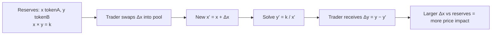

# Sample Lesson 2.2 — AMM Mathematics (x · y = k)

*Module 2 · Trading On-Chain · Source: ATLAS ch. 7*
*Template every lesson follows: Objective → Explanation → Worked example → Checklist → Quiz.*

> Educational content only. Not financial advice. Examples are illustrative.

## Objective
By the end of this lesson you can calculate what a swap will actually pay out
in a constant-product pool, and explain why bigger trades get worse prices.

## Explanation
A constant-product AMM holds two tokens in a pool. It doesn't use an order
book. It keeps one rule: **reserves of token A × reserves of token B = k**, and
k must stay constant (ignoring fees) after every trade.

- **Pool price** is the ratio of reserves. 100 ETH and 300,000 USDC means 1 ETH ≈ 3,000 USDC.
- When you add ETH to the pool, the pool must *remove* enough USDC to keep x·y = k.
- The more of the pool you move, the further the price moves against you. That gap is **price impact**.
- **Arbitrageurs** then trade the pool back in line with other markets, and that changes what LPs hold. You'll see why that matters in Lesson 2.4.

## Worked example
Pool: **100 ETH** and **300,000 USDC**, so k = 30,000,000. Spot price = 3,000 USDC/ETH.

You swap in **10 ETH** (fees ignored):
1. x' = 100 + 10 = 110
2. y' = 30,000,000 ÷ 110 ≈ 272,727
3. You receive 300,000 − 272,727 ≈ **27,273 USDC**
4. Effective price ≈ 27,273 ÷ 10 = **2,727 USDC/ETH**, which is **~9.1% worse** than spot.

Now try **1 ETH**: x' = 101 → y' ≈ 297,030 → you receive ≈ 2,970 USDC, which is ~1% worse.
Ten times the size cost about nine times more in price impact. **Size relative to
pool depth is what matters, not the size of the trade in dollars.**

## Checklist before any swap
- [ ] Check the price impact the interface shows; if it isn't shown, work it out
- [ ] Compare with an aggregator quote
- [ ] Set slippage tolerance on purpose (too tight: the swap fails; too loose: you get a bad fill or a sandwich attack, see 2.5)
- [ ] Split large trades or use deeper pools
- [ ] Run the before-signing checklist (chain, contract, token, amount, spender)

## Quiz

1. A pool holds 50 ETH / 150,000 USDC. What is k and the spot price?

k = 7,500,000; spot = 3,000 USDC/ETH.

2. Why does a 10 ETH swap get a worse average price than a 1 ETH swap in the same pool?

Each unit you add moves the reserve ratio further, so later units in the same trade are priced worse. Price impact grows with trade size relative to reserves.

3. Who moves the pool price back in line after your trade, and why does that matter to LPs?

Arbitrageurs do. Their trades rebalance what the LP holds, which is where impermanent loss comes from (Lesson 2.4).

