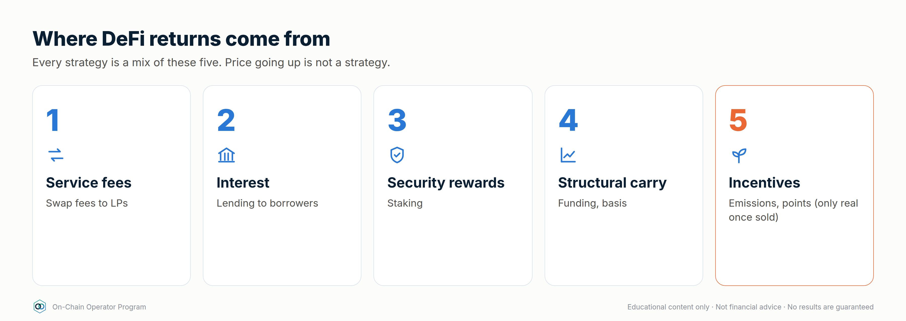
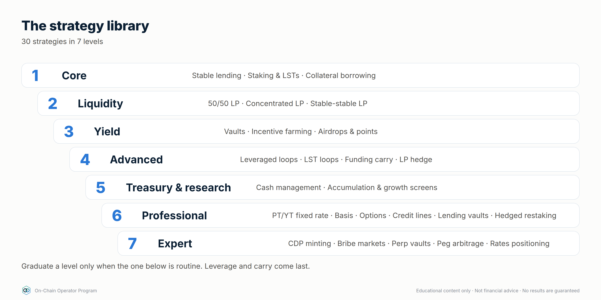
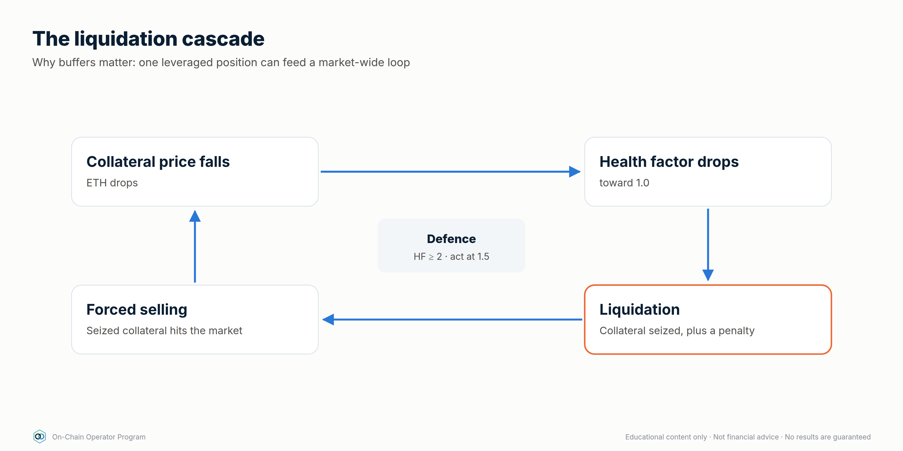
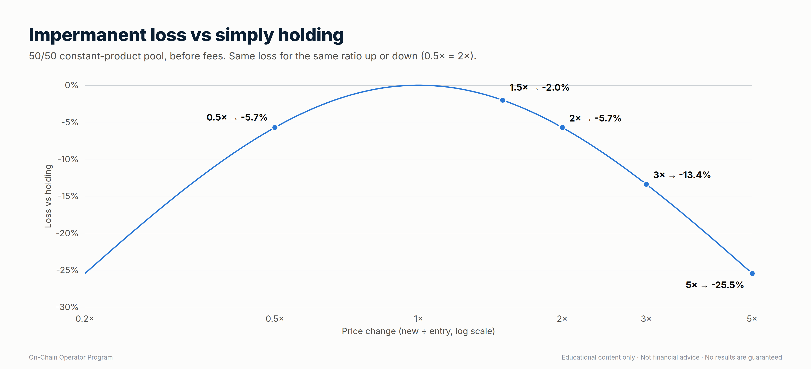
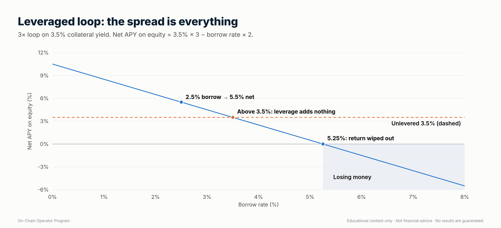

# DeFi Strategy Mastery — How Strategies Make (and Lose) Money

*On-Chain Operator Program · Strategy module · Built on ATLAS "DeFi & On-Chain" ch. 7–18, 38–42 and the 16-framework Strategy Library, expanded to 30 strategies.*

> **Read this first.** This is educational material, not financial advice.
> No DeFi strategy guarantees profit. Every return in DeFi is payment for
> taking a risk. This module shows **where each strategy's return comes from,
> the maths to test it before you enter, how to run it, and exactly how it
> loses money**, so you only keep positions whose expected return still makes
> sense after costs and risk. All numbers below are illustrative. Use live
> rates from protocol dashboards and independent data (e.g. DefiLlama) when
> you model a real position.

Calculator for every formula here:
`python3 .claude/skills/defi-strategies/scripts/defi_calc.py <command> --help`

---

## Part 1 — Where profit actually comes from

There are only five sources of return in DeFi. Every strategy is a mix of them.



| # | Source | You are paid for… | Example | Lasts? |
|---|---|---|---|---|
| 1 | **Service fees** | providing liquidity traders need | swap fees to LPs | As long as volume lasts |
| 2 | **Interest** | lending capital borrowers need | stablecoin supply APY | As long as borrow demand lasts |
| 3 | **Security rewards** | staking to secure a network | ETH staking yield | Structural, but changes over time |
| 4 | **Structural carry** | taking the other side of crowded positioning | perp funding, basis | Comes and goes with the market |
| 5 | **Incentives** | bringing capital to a protocol | token emissions, points, airdrops | Temporary, and often dilutive |

Price moves (beta) are not a strategy. If a position only made money because
ETH went up, it was a directional bet with extra steps. Strategies 1–4 can pay
in flat markets. Source 5 is only real once the tokens are sold.

### The one equation that matters

```
Net return = base yield (fees + interest + staking)
           + incentives (valued at the price you can actually sell at)
           − impermanent loss / inventory loss
           − borrow cost
           − gas + swap + bridge costs
           − protocol / vault fees
           − losses from risk events
           ± price change on assets held
```

A position is only worth running if **net return beats the simplest
alternative** (holding the assets, or plain stablecoin lending) **by enough to
pay for the extra risk**. Masters compare against a benchmark. Beginners
compare against zero.

### APR vs APY
APY assumes compounding. `APY = (1 + APR/n)^n − 1`. 10% APR compounded daily ≈
10.52% APY, **but only if compounding is free**. On-chain, each compound costs
gas. Compound only when `pending rewards ≥ ~10–20× the gas cost`, or use a vault
that batches it (and charges a fee for doing so).

---

## Part 2 — Strategy selector by market regime

This uses the same thinking as the Grid Bot module: **pick the market regime
first, then the strategy.**

| Regime | Strategies that tend to work | Avoid / reduce |
|---|---|---|
| **Sideways, low–moderate volatility** | Concentrated LP around the range · stable-stable LP · lending · grid bots (CEX) | Leverage loops with thin buffers |
| **Uptrend** | Hold + liquid staking · delta-neutral funding carry (longs usually pay) · conservative borrow against collateral | Narrow LP ranges (they sell your winners early) |
| **Downtrend** | Stablecoin lending · stable-stable LP · cash management | Leveraged loops · volatile/volatile LP · incentive farms paid in falling tokens |
| **High volatility / event risk** | Wider LP ranges or none · larger health-factor buffers · smaller size | New positions right before major news (FOMC, CPI), new or unaudited protocols |

---

## Part 3 — The strategy playbook



Each strategy card has the same sections:
**Profit engine · Key maths · Execute · Monitor · Exit/kill rules · How it loses · Size cap**.
Size caps are suggested maximums as a share of the DeFi portfolio. Tighten
them to fit your own risk budget.

### LEVEL 1 — CORE (start here)

#### 1. Stablecoin lending
- **Profit engine:** interest paid by borrowers (source 2).
- **Key maths:** `supply APY ≈ borrow APY × utilisation × (1 − reserve factor)`.
  Example: 8% borrow × 80% utilisation × 0.9 = **5.76%**.
- **Execute:** pick a stablecoin with a clear peg mechanism (Module 1.5) → pick a
  lending market that passed due diligence (`defi-due-diligence`) → check
  current utilisation and withdrawal liquidity → supply → record the receipt token.
- **Monitor:** utilisation (above ~90% = withdrawals may be stuck), stablecoin
  peg, governance changes, incidents.
- **Exit/kill:** peg below ~0.99 for a sustained period, utilisation pinned at
  100%, exploit news, or the rate falls below your benchmark.
- **How it loses:** stablecoin depeg, protocol exploit, bad debt, frozen withdrawals.
- **Size cap:** can be the largest bucket, but **split across ≥2 independent
  protocols and ≥2 stablecoin issuers**.

#### 2. Native / liquid staking (LSTs)
- **Profit engine:** network security rewards (source 3), minus the provider's fee.
- **Key maths:** `net yield = staking APR × (1 − provider fee)`. Your real
  return is still dominated by the asset's price, so this only improves on
  holding if you'd hold the asset anyway.
- **Execute:** choose the provider (validator spread, fee, track record,
  redemption path) → stake → confirm how the LST earns (rebasing, or an
  exchange rate that rises).
- **Monitor:** LST/underlying ratio on markets (discount), validator
  incidents/slashing, withdrawal queue length.
- **Exit/kill:** discount widens beyond your threshold, a slashing event,
  or the provider's governance or custody changes.
- **How it loses:** asset price falls (main risk), LST depeg, slashing,
  smart-contract risk.
- **Size cap:** "hold-anyway" capital only.

#### 3. Borrowing against collateral (liquidity without selling)



- **Profit engine:** none by itself. It's a tool. The gain comes from what
  the borrowed funds do, or from not triggering a sale.
- **Key maths:**
  - `Health factor (HF) = Σ(collateral value × liquidation threshold) ÷ debt`
  - `Liquidation price = debt ÷ (collateral qty × liquidation threshold)`
  - Example: 10 ETH at $3,000, LT 0.80, borrow $12,000 → HF = 2.0 → liquidation at **$1,500** (−50%).
- **Execute:** borrow only enough that liquidation is beyond a move you'd
  realistically expect to survive (**HF ≥ 2 for volatile collateral** is a
  sane starting rule) → write the defence plan before borrowing.
- **Monitor:** HF daily, borrow rate, oracle price.
- **Exit/kill:** HF < 1.5 → repay or add collateral. Don't wait for 1.1.
- **How it loses:** liquidation penalty (commonly 5–10%+ of the collateral
  seized), borrow rate spikes, oracle issues.
- **Size cap:** debt ≤ what you could repay from outside the position.

### LEVEL 2 — LIQUIDITY

#### 4. 50/50 AMM liquidity (full range)



- **Profit engine:** swap fees (source 1), sometimes plus incentives.
- **Key maths — impermanent loss (IL) vs just holding**, where `r` = price ratio change:
  `IL = 2√r ÷ (1 + r) − 1`

  | Price change | 1.25× | 1.5× | 2× | 3× | 4× | 5× |
  |---|---|---|---|---|---|---|
  | IL vs holding | −0.6% | −2.0% | −5.7% | −13.4% | −20.0% | −25.5% |

  (Same IL whether price goes up or down by the same ratio. 0.5× = 2×.)
- **Break-even rule:** `fees earned over the holding period ≥ IL`.
  Example: expect up to a 1.5× move within 90 days → IL ≈ 2.0% → you need fee
  APR ≥ **~8.2%** just to match holding.
- **Execute:** pick a pair you're happy to own either side of → check real
  fee APR over 30 days (not the peak day) → deposit → record entry prices.
- **Monitor:** fees accrued vs IL vs "just hold" benchmark, weekly.
- **Exit/kill:** fees stop covering IL, volume dies, or the pair enters a strong trend.
- **How it loses:** strong trends (you end up holding more of the losing asset), low volume, token risk.

#### 5. Concentrated liquidity (the on-chain grid bot)
- **Profit engine:** swap fees on a chosen range. It's economically very close
  to a grid bot: it sells as price rises through the range and buys as it
  falls (Module 9).
- **Key maths:** capital efficiency vs full range (price at the geometric
  middle of the range) ≈ `1 ÷ (1 − (P_low / P_high)^¼)`.
  A ±10% range (P_high/P_low ≈ 1.22) is ~**20×** as capital-efficient, so it
  earns ~20× the fees per dollar *while in range*. IL is also amplified by
  about the same factor, and **out of range earns 0% and leaves you holding
  100% of one asset.**
- **Execute:** set the range from structure and volatility, exactly like a
  grid range (`grid-bot-design`: regime → range → invalidation) → wider in
  high volatility → decide the rebalance rule *before* entry.
- **Monitor:** % of time in range, fees vs IL, gas cost of each rebalance.
- **Exit/kill:** range invalidated (price breaks structure) → don't chase
  every move. Rebalancing too often locks in losses and burns gas.
- **How it loses:** trending markets, over-rebalancing, gas on small positions.
- **Size cap:** active capital only. Needs weekly (or better) attention.

#### 6. Stable-stable LP
- **Profit engine:** swap fees between similarly priced assets. Very low IL *while the pegs hold*.
- **Execute:** only pair stables you'd accept holding 100% of (in a depeg the
  pool fills up with the weaker coin).
- **Kill:** either stable trades below ~0.99, or the pool balance goes heavily one-sided.
- **How it loses:** depeg (you end up holding the broken coin), contract risk.

### LEVEL 3 — YIELD

#### 7. Auto-compounding vaults
- **Profit engine:** the underlying strategy, plus compounding without you paying the gas.
- **Key maths:** `net APY = gross APY − performance fee share − management fee`.
  Compare against doing it yourself: vaults win on small positions (gas) and
  lose on large ones (fees).
- **Due diligence:** vault contract + **every** protocol it deposits into
  (the risks stack). Read withdrawal limits and fees.
- **How it loses:** any protocol in the chain fails, strategy change by the vault operator, withdrawal limits.

#### 8. Incentive farming
- **Profit engine:** token emissions (source 5) on top of a base yield.
- **The rule:** value rewards at the price you can **actually sell at after
  slippage**, and assume the token price falls while emissions continue.
  Harvest and sell on a schedule (e.g. weekly) unless you'd buy the token with cash.
- **Quick test:** remove the incentive APR. If the base yield alone doesn't
  justify the risk, you're being paid in a token that's likely to keep falling.
- **How it loses:** reward token price collapse, mercenary liquidity leaving,
  IL on the underlying LP.

#### 9. Airdrops and points
- **Profit engine:** possible future token distribution.
- **Key maths:** `EV = P(airdrop) × expected value to you − (gas + bridge + opportunity cost + risk)`.
- **Rule:** only farm with actions you'd do anyway, or with capital you've
  capped as speculative. Claim only from verified links (scam defence, Module 1.6).

### LEVEL 4 — ADVANCED (only after Levels 1–3 are routine)

#### 10. Leveraged lending loop



- **Profit engine:** amplifies a *positive spread* between collateral yield and borrow cost.
- **Key maths:**
  - Leverage after n loops at LTV L: `(1 − L^(n+1)) ÷ (1 − L)`, max `1 ÷ (1 − L)` (L = 0.7 → 3.33×)
  - `Net APY on equity = collateral yield × Lev − borrow rate × (Lev − 1)`
  - Example: 3.5% collateral yield, 2.5% borrow, 3× → **5.5%**. If borrow rises
    to 4.5% → **1.5%**. If it rises to 5.25% → **0%**. The spread is everything.
- **Execute:** only loop assets that move closely together (e.g. an LST
  against its underlying, or stable against stable) → stay well below max
  leverage → set HF alerts.
- **Kill:** spread turns negative, HF < your floor, depeg of the collateral.
- **How it loses:** borrow rate spikes (they can happen quickly), liquidation
  cascades, depeg of correlated collateral, unwind costs.

#### 11. LST collateral loop
Strategy 10 using an LST as collateral against its own underlying asset.
Liquidation risk depends mainly on the **LST/underlying ratio and on how the
protocol's oracle prices it**, less on the asset's price. Check which oracle
the market uses before assuming "it can't be liquidated".

#### 12. Delta-neutral funding carry
- **Profit engine:** perpetual funding (source 4). In bullish markets longs
  usually pay shorts. Hold spot long + perp short at equal size, so price
  moves roughly cancel and you collect funding.
- **Key maths:** `funding APR ≈ rate per 8h × 3 × 365`. 0.01%/8h ≈ **10.95% APR on the hedged size**.
  Return on *total capital* is lower because capital sits in both legs:
  $10k spot + $10k margin (1× short) → ~5.5% on $20k; 2× short ($5k margin)
  → ~7.3% on $15k, but the short gets liquidated if price rises ~50%.
- **Execute:** open both legs at the same time, at the same size → keep a
  margin buffer → track funding every period.
- **Kill:** funding negative for a sustained period (you now pay), margin
  buffer thin, venue risk.
- **How it loses:** funding flips negative, short-leg liquidation in a squeeze,
  execution slippage/basis, exchange/venue failure (CEX or perp DEX).

#### 13. LP hedge
Concentrated or 50/50 LP plus a partial perp short to offset its directional
exposure. The hedge ratio changes as price moves (LP inventory changes), so it
needs rebalancing. It narrows the P&L range but adds funding + execution cost.
Only worth doing if fees exceed IL + hedge cost.

### LEVEL 5 — TREASURY & RESEARCH

#### 14. DeFi cash management
Build a ladder for idle stablecoins: instant-access tier (lending), core tier
(split across protocols and issuers), and a cap per protocol. Goal: earn a
reasonable return on cash **without any single failure costing more than
you've decided you can afford to lose**.

#### 15–16. On-chain accumulation screen / protocol growth screen
Research, not yield. Track users, fees/revenue, TVL quality, holder
concentration, exchange flows and unlocks to decide *what* to hold or provide
liquidity for. Never act on one metric (ATLAS ch. 27–34).

---

### LEVEL 6 — PROFESSIONAL (structured, fixed and hedged yield)

These are the strategies professional desks and treasuries use. Each one
swaps a risk you don't want for one you've chosen, so **name what you're
short before you enter.** Full lessons: Module 10 (Advanced Yield
Engineering), Module 11 (Hedging) and Module 12 (Own Bank).

#### 17. Fixed-rate yield with principal tokens (PT)


- **Profit engine:** yield tokenization splits a yield-bearing asset into a
  **principal token (PT)**, which redeems 1:1 for the underlying at maturity,
  and a **yield token (YT)**, which collects all the variable yield until then.
  Buying PT at a discount locks in a fixed return (source 2/3, bought forward).
- **Key maths:** `fixed APY = (1 ÷ PT price)^(365 ÷ days) − 1`.
  PT at 0.96 with 180 days left → **8.63%** fixed if held to maturity.
  `defi_calc.py pt --price 0.96 --days 180`
- **Execute:** pick a PT on an underlying you'd hold anyway → check pool depth
  (for early exit) → buy → hold to maturity → redeem.
- **Kill:** underlying depeg or exploit. You're still exposed to the underlying asset; the rate is fixed, the asset risk isn't.
- **How it loses:** underlying fails; selling before maturity at a worse price; illiquid PT pools.

#### 18. Yield tokens (YT): buying variable yield
- **Profit engine:** YT collects all yield (and often points) on the underlying until maturity, then goes to zero.
- **Key maths:** a YT costs ~`1 − PT price` (0.04 above). It profits only if
  **realised variable yield plus points beats the implied rate (~8.6%)**.
- **Use:** a speculative, time-decaying position. Size it as speculation.
- **How it loses:** yields fall, points turn out worthless; the YT is worth zero at maturity by design.

#### 19. Cash-and-carry basis
- **Profit engine:** dated futures often trade above spot in bull markets.
  Buy spot, short the future at the same size, and the premium (basis) converges to zero at expiry (source 4).
- **Key maths:** `annualised basis = (future ÷ spot − 1) × 365 ÷ days`.
  Spot 3,000, 90-day future 3,060 → 2% → **8.11%** annualised.
  `defi_calc.py basis --spot 3000 --future 3060 --days 90`
- **Execute:** open both legs together → keep enough margin that the short survives a large rally → hold to expiry.
- **How it loses:** short-leg margin call in a squeeze, venue/counterparty failure, closing early at a wider basis.

#### 20. Covered calls and options vaults
- **Profit engine:** sell upside you're willing to give away. The option premium is paid to you (source 4: selling volatility).
- **Key maths:** ETH at 3,000, sell a 7-day 3,300 call for 0.4% →
  **20.9%** annualised *if* repeated at that premium (it won't be exactly).
  Max gain per week = 0.4% + 10% = 10.4%. Break-even price 2,988.
  `defi_calc.py covered-call --spot 3000 --strike 3300 --premium 0.4`
- **Execute:** only on assets you'd hold anyway → strikes above levels you'd happily sell at → roll weekly or monthly.
- **How it loses:** the asset falls (the premium is a small cushion); you miss big rallies; options-vault contract risk.

#### 21. Cash-secured puts: getting paid to wait for a lower entry
- **Profit engine:** sell a put at a price you'd buy at anyway, holding the cash to pay for it.
- **Key maths:** sell a 2,700 put for $12 with $2,700 of stablecoins reserved
  → **0.44%** for the week on the cash. If assigned, your effective entry is **$2,688**.
- **How it loses:** price falls far below the strike (you buy at 2,688 while the market is lower); you miss the move if price rips upward.

#### 22. Fixed-rate borrowing
- **Profit engine:** none by itself. It's insurance on your cost of credit (Module 12.3).
- **Worked comparison:** borrow $50,000 for a year. Fixed at 6% costs **$3,000**.
  Variable at 4% for 9 months, then spiking to 12% for 3 months, costs
  50,000 × (4% × 0.75 + 12% × 0.25) = **$3,000**. Same cost, but fixed let you plan.
  If the spike lasted longer, variable costs more; if rates stayed at 4%, fixed cost $1,000 more.
- **Use:** when the borrowing funds something with a fixed payoff, or when a rate spike would force a bad sale.

#### 23. Being the lender: curated lending vaults
- **Profit engine:** supply stablecoins to a vault whose curator spreads them
  across isolated lending markets (source 2). You're the bank's depositor
  *and* its credit committee.
- **Key maths:** judge risk-adjusted, not headline: 7% headline with an
  assumed 2%/yr chance of a loss event losing half → **6.0%** risk-adjusted.
  `defi_calc.py expected --yield-apy 7 --loss-prob 0.02 --lgd 0.5`
- **Due diligence:** which markets, which collateral, which oracles, what
  liquidation LTVs, the curator's record, and how fast you can withdraw.
- **How it loses:** bad debt in any one market, oracle failure, curator error, withdrawal queues in stress.

#### 24. Hedged restaking / points farming
- **Profit engine:** hold a liquid restaking token (staking yield + points)
  and short the underlying perp to remove price exposure. When funding is
  positive, the short *receives* funding too.
- **Key maths:** `net ≈ staking yield + funding received + points value − costs`.
  **Value the points at zero for planning.** Anything they pay is upside.
- **How it loses:** the restaking token depegs from the asset you hedged with
  (the hedge doesn't cover that), slashing, funding turns negative, short-leg liquidation.

#### 25. The yield-covered credit line
- **Profit engine:** borrow against yield-bearing collateral where the collateral's yield pays the interest.
- **Key maths:** $200,000 of an LST at 3.2% earns **$6,400/yr**. A $40,000
  stablecoin loan at 5% costs **$2,000/yr**, so yield covers interest 3.2×.
  LTV 20%, health factor 4.0 at an 0.8 liquidation threshold.
  `defi_calc.py bank --collateral 200000 --debt 40000 --borrow-apy 5`
- **Use:** access to liquidity without selling, as a bank client would (Module 12.3).
- **How it loses:** the collateral price falls (the LTV rises even if the
  interest is covered), the borrow rate spikes above the yield, the LST depegs.

### LEVEL 7 — EXPERT (market structure)

Strategies that come from understanding how DeFi's machinery works: minting,
governance markets, being the counterparty, arbitrage and rates. Full lessons in
Modules 3, 6 and 10 (3.7, 6.6, 10.7, 10.8, 10.9).

#### 26. Minting against collateral (CDP stablecoins)
- **Profit engine:** none by itself. It's how you create liquidity from your assets (Module 12's credit line), paying a stability fee.
- **Key maths:** 10 ETH at $3,000, 150% minimum ratio: max mint $20,000. Mint $10,000 → ratio 300%, liquidation at $1,500, fee $600/yr at 6%. `defi_calc.py cdp --qty 10 --price 3000 --mint 10000 --fee 6`
- **How it loses:** collateral falls through the ratio (liquidation penalty), stability fee rises, the minted stablecoin depegs.

#### 27. Vote-escrow and bribe income
- **Profit engine:** voting incentives (bribes) and fee shares paid to locked governance tokens (source 5, sometimes 1).
- **Key maths:** $10,000 locked earning 15% in bribes = $1,500/yr, *valued at the price you can sell the bribe tokens*; subtract the locked token's price risk over the whole lock.
- **How it loses:** the locked token falls while you can't sell; bribe markets dry up; liquid-locker discounts.

#### 28. Being the house: perp liquidity vaults
- **Profit engine:** trading fees, funding and traders' losses on a perp exchange.
- **Key maths:** split history into fees vs trader P&L; the trader-P&L part can swing from +7% to −20% in a trend.
- **How it loses:** profitable traders, one-sided open interest, oracle problems, withdrawal cooldowns.

#### 29. Peg and redemption arbitrage (patient version)
- **Profit engine:** buying an asset below its redemption value and redeeming (source 4: providing liquidity to forced sellers).
- **Key maths:** 2% LST discount with a 20-day redemption queue ≈ 36.5% annualised simple, *once*, if redemption works.
- **How it loses:** the discount was pricing a real problem; the queue lengthens; redemption is restricted.

#### 30. Rates positioning: fixed vs floating
- **Profit engine:** choosing when to lock fixed rates (PTs, fixed borrowing) or stay floating, based on the yield curve (source 2/3).
- **Key maths:** 3-month 7% vs 12-month 9%: lock 12 months at 9% if you need the money in a year and expect rates to fall.
- **How it loses:** rates move the other way (opportunity cost); PT liquidity if you exit early; the underlying's risk remains.

---

## Part 4 — Execution system (what turns strategies into results)

### Position sizing rules (starting point, tighten as needed)
- Max **20–25%** of DeFi capital in any one protocol. Max **10%** in anything
  unaudited, new (< 6 months) or reliant on a single bridge.
- Max **~30–40%** on any one non-Ethereum chain / L2.
- Keep **10–20%** instantly liquid (not in any position) to defend debt and
  take opportunities.
- Leverage: total debt small enough that a −50% market day doesn't liquidate anything.

### Before every entry (5 gates)
1. **Due diligence** file complete (`defi-due-diligence`: 6-step loop).
2. **Profit engine named.** Which of the 5 sources pays you?
3. **Maths done.** Net return after costs beats the benchmark (use `defi_calc.py`).
4. **Kill rules written down.** Exact numbers: HF floor, peg level, spread, range break.
5. **Before-signing checklist** (chain, contract, token, amount, spender, slippage, gas).

### Journal (one row per position)
Protocol · chain · strategy # · entry date · amount · entry prices · profit
engine · expected net APY · benchmark · kill rules · approvals granted ·
weekly: fees/interest earned, IL, costs, net vs benchmark.

### Review rhythm
- **Daily:** health factors, pegs, LP ranges, incident feeds.
- **Weekly:** net P&L vs benchmark per position, harvest and sell incentive
  tokens, revoke unused approvals.
- **Monthly:** cut the bottom performer when judged against its risk, rebalance buckets,
  simplify anything you can't explain in one sentence.

### Take profits and keep them
- Sweep realised yield to stablecoins or cold storage on a schedule. Rewards
  sitting in a farm are still exposed to the farm's risks.
- Compound only what still passes the 5 gates. Compounding into a
  deteriorating position is how gains are given back.
- Track **net realised gains** after all costs. That's the only number that counts.

---

## Part 5 — Progression path

| Stage | Strategies | Graduate when… |
|---|---|---|
| 1. Foundation | #1 stable lending, #2 staking | You can do the full before-signing checklist without notes |
| 2. Liquidity | #4 50/50 LP, #6 stable LP | You've tracked LP vs hold for 30+ days |
| 3. Active | #5 concentrated LP, #7 vaults, #8 farming | You can say how much of a position's return is fees, IL and incentives |
| 4. Leverage | #3 borrowing, #10–11 loops | You've written and rehearsed a defence plan |
| 5. Carry & hedging | #12 funding carry, #13 LP hedge | You understand perp margin, funding and venue risk |
| 6. Operator | #14 treasury + #15–16 research | Your portfolio has caps, a journal, and a review you actually run |
| 7. Professional | #17–21 fixed, basis and options yield · #22–25 credit and hedged yield | You can state what every position is short, and your stress test survives a −50% day |
| 8. Expert | #26 CDP minting · #27 ve/bribe income · #28 perp vaults · #29 peg arbitrage · #30 rates positioning | You understand the machinery (AMM design, MEV, lending internals, rates) well enough to explain why each opportunity exists |

---

## Part 6 — Mastery quiz

<details><summary>1. A farm shows 60% APY: 5% fees, 55% token emissions. What's your first question?</summary>
What does the base 5% pay me for the risk, and at what price can I actually sell the reward token? Judge the farm on base yield plus rewards valued at a realistic, falling price.</details>

<details><summary>2. ETH doubles while you're in a 50/50 ETH/USDC pool. How did you do vs holding?</summary>
About 5.7% behind holding, before fees. Fees need to exceed that for LPing to have been worth it.</details>

<details><summary>3. A loop earns 3.5% on collateral and pays 2.5% to borrow at 3×. What borrow rate wipes out the return?</summary>
0 = 3.5×3 − b×2 → b = 5.25%.</details>

<details><summary>4. Funding is +0.01% per 8 hours. What is the APR on the hedged size, and why is your return on capital lower?</summary>
~10.95%. Capital sits in both the spot leg and the perp margin, so the return on total capital is roughly half to three-quarters of that, depending on the short's leverage.</details>

<details><summary>5. Your concentrated LP just went out of range after a breakout. What's the operator move?</summary>
Treat it as a range invalidation, just as with a grid bot: follow the pre-written rule (re-centre with a wider range, or exit). Don't chase every move with narrow rebalances.</details>

---

*Operating rule: if you can't name the profit engine and explain the unwind,
don't enter the position.*
