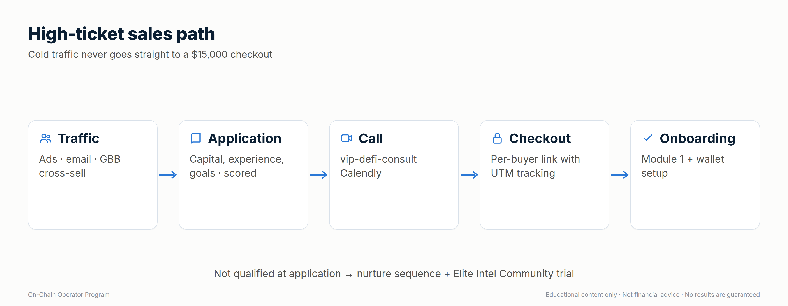

# On-Chain Operator Program — Whop Setup (Phase 3)

## Decisions locked (2026-09-24)
| Item | Decision |
|---|---|
| Name | On-Chain Operator Program |
| Tier 1 — Course (self-paced, 15 modules, 92 lessons + Mastery Starters, worksheets, 2 capstones) | **$15,000 one-time** (no payment plan) |
| Tier 2 — Live (course + live sessions) | **Priced above $15,000 — number TBD** |
| Audience | Everyone at launch (GBB customers, Elite Intel members, cold ads) |
| Sales path | **Application → call → checkout** (no straight-to-checkout ads) |
| Call link | `vip-defi-consult` Calendly (verify the exact URL is live) |

Still open: Tier 2 price · refund policy · GBB-customer price (if any) ·
the Starter tier / GBB price conflict.

## Blockers found
1. **Whop is not connected in Zapier** (0 connected accounts on WhopCLIAPI).
   Reconnect it in Zapier before any Whop step below. The existing `gbb-*`
   skills also need it to run.
2. **Zapier can't create Whop products.** It can create *plans*, checkout
   sessions, leads, promo codes and invoices. The product itself must be
   created in the Whop dashboard.

## Step 1 — You, in the Whop dashboard
1. Create a product named **On-Chain Operator Program**. Keep it **hidden /
   unlisted** until launch. Upload the icon, banner and gallery images and
   paste the copy from `06-whop-store-listing.md`.
2. Add a course experience and create the 9 module sections (titles in
   `01-offer-and-curriculum.md`).
3. Add terms of sale: refund policy (once decided) and "Educational content
   only. Not financial advice. No results are guaranteed."
4. Send me the product ID (starts with `prod_`).

## Step 2 — Me, via Zapier (after you confirm)
| Action | Zapier tool | Values |
|---|---|---|
| Course plan | `whop_create_plan` | product = your `prod_` ID, one-time, $15,000, hidden until launch |
| Live-tier plan | `whop_create_plan` | once the price is set |
| Checkout links per campaign | `whop_create_checkout_session` | metadata `utm_campaign`, `utm_adset`, `utm_creative` so ad reports attribute sales |
| Applications | `whop_create_lead` | one lead per application, product-specific |

Nothing gets created until you've seen the exact values and said yes.

## Step 3 — Upload content
All 92 lessons and 15 Mastery Starters are written and ready to paste in (`lessons/`, `02-…`,
`03-…`), with module banners, diagrams, the Day-1 Setup Kit PDF, the welcome
video and 15 module intro videos (`video/`). Course layout and drip plan:
`07-program-operations.md` section 1.

## Step 4 — High-ticket sales path

Suggested qualification (adjust as you like): lead score ≥ 6 (capital 20k+ /
major exchange / some experience) **and** completed application.
