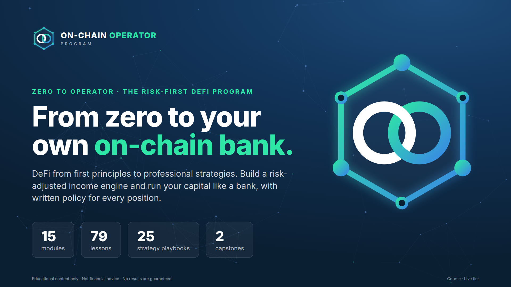
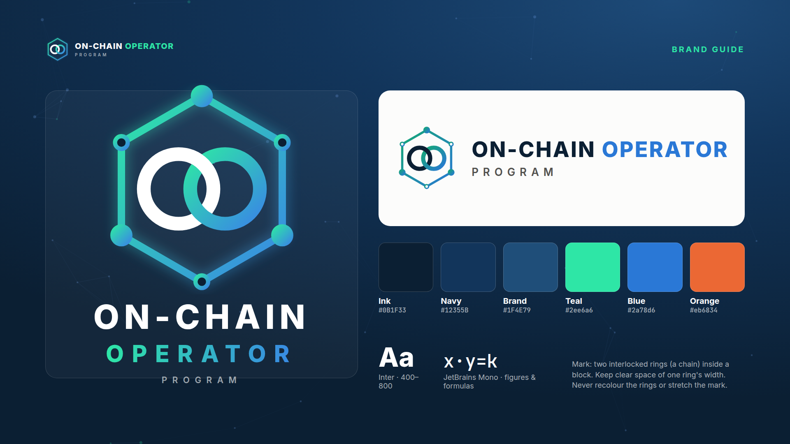
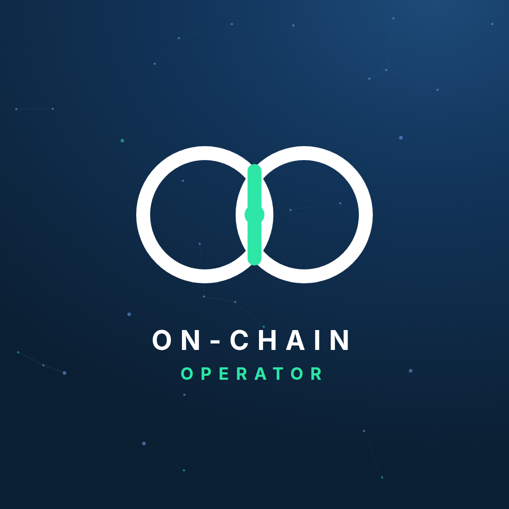
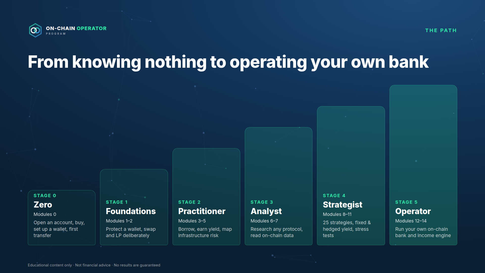
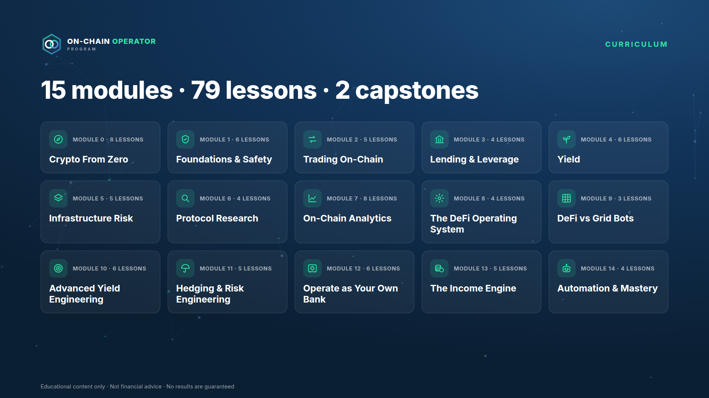
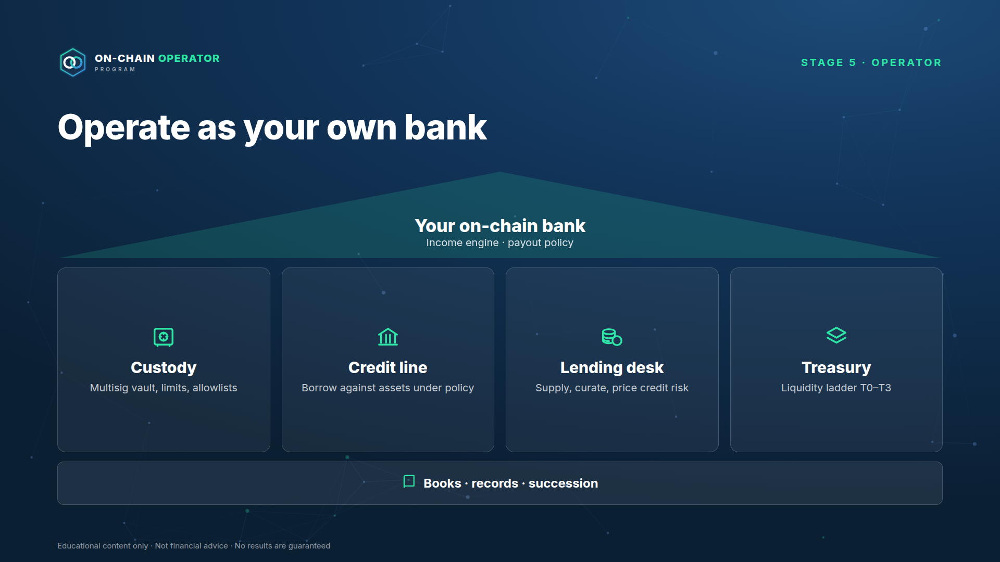
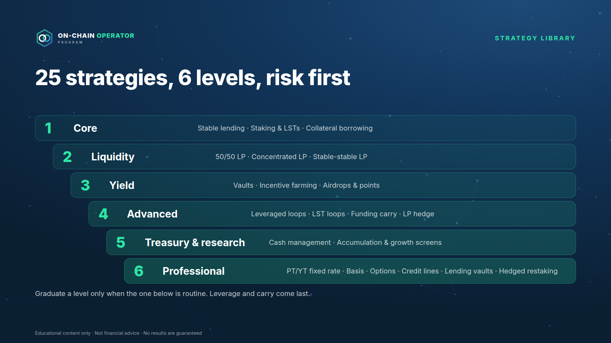
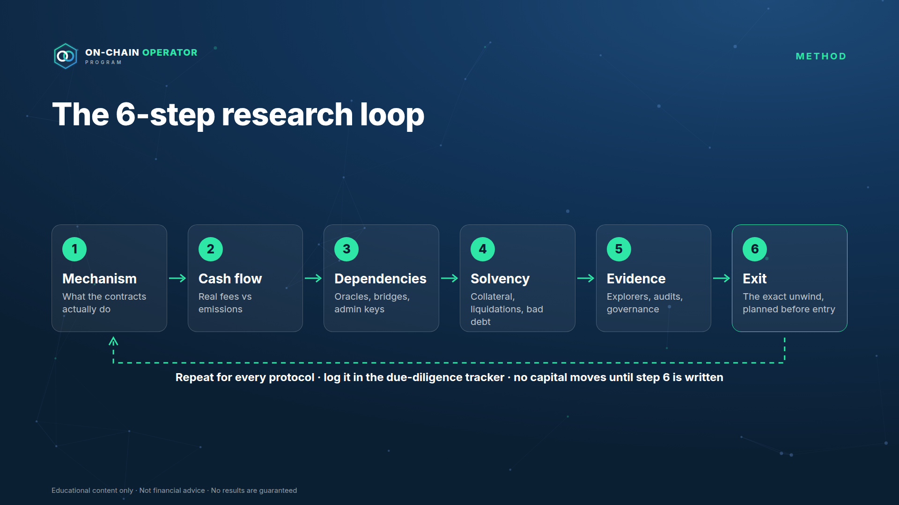
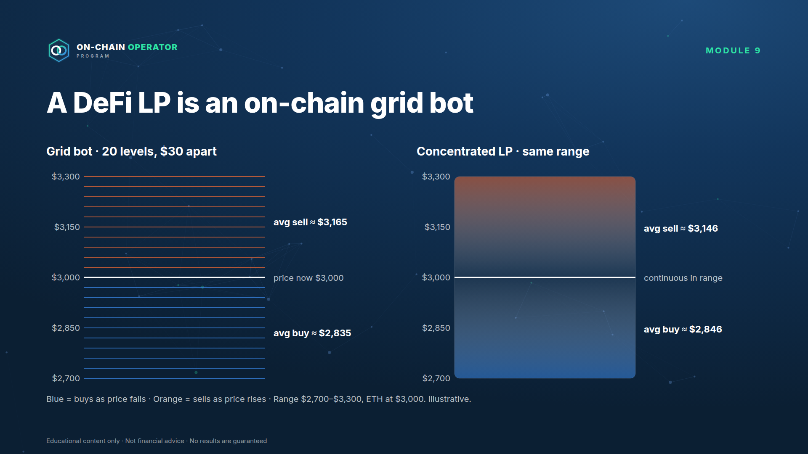
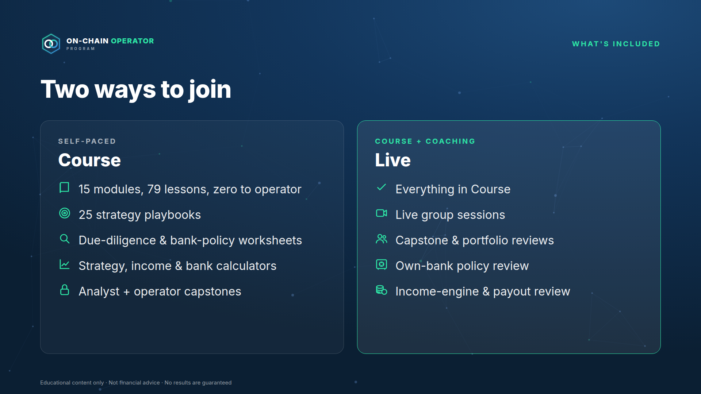

# On-Chain Operator Program — Whop Store Listing

Everything needed to add the program to your Whop store as a new product:
logo, images, copy and upload order. **Nothing is published.** You create the
product in the Whop dashboard (Zapier can't create products), paste this in,
and keep it hidden until launch.

> Check Whop's current image size limits in the dashboard when you upload.
> These files are produced at standard sizes (1024×1024 square, 1920×1080
> 16:9) and can be re-exported at any size with `npm run images`.

---

## 1. The logo

The mark is **two interlocked chain rings inside a hexagonal block**, with
nodes on its corners: a chain (on-chain), a block, and a network. The rings
link, like the two halves of the program: DeFi strategy and running your own bank.

| File | Use |
|---|---|
| `assets/brand/logo-icon-1024.png` | **Whop product icon**, social avatars (stacked lockup on navy) |
| `assets/brand/logo-mark-dark-1024.png` | App icon / square badge without text |
| `assets/brand/logo-mark-transparent-dark-1024.png` | Mark over dark backgrounds (transparent PNG) |
| `assets/brand/logo-mark-transparent-light-1024.png` | Mark over light backgrounds (transparent PNG) |
| `assets/brand/logo-horizontal-dark.png` | Headers, email banners on dark |
| `assets/brand/logo-horizontal-light.png` | Documents, invoices, light pages |
| `assets/brand/favicon-256.png` | Favicon / tiny sizes (no corner nodes) |
| `assets/brand/brand-guide.png` | Colours, type and usage rules |

Rules: keep clear space of one ring's width around the mark; never recolour
the rings, stretch the mark or put the light version on a dark background.

---

## 2. Images: upload map

| Whop slot | File | Size |
|---|---|---|
| Product icon / logo | `assets/store/icon-1024.png` (same as `brand/logo-icon-1024.png`) | 1024×1024 |
| Cover / hero banner | `assets/store/banner-1920x1080.png` | 1920×1080 |
| Gallery 1 | `assets/store/gallery-01-path-to-mastery.png` | 1920×1080 |
| Gallery 2 | `assets/store/gallery-02-curriculum.png` | 1920×1080 |
| Gallery 3 | `assets/store/gallery-03-own-bank.png` | 1920×1080 |
| Gallery 4 | `assets/store/gallery-04-strategy-levels.png` | 1920×1080 |
| Gallery 5 | `assets/store/gallery-05-research-loop.png` | 1920×1080 |
| Gallery 6 | `assets/store/gallery-06-grid-vs-lp.png` | 1920×1080 |
| Gallery 7 | `assets/store/gallery-07-whats-included.png` | 1920×1080 |
| Course module headers | `assets/modules/module-00.png` … `module-14.png` | 1600×500 @2x |
| In-lesson diagrams & charts | `assets/diagrams/*.png`, `assets/charts/*.png` | 1800 wide @2x |

---

## 3. Listing copy

**Product name:** On-Chain Operator Program

**Tagline (short):** From zero to your own on-chain bank.

**Short description (≈150 characters):**
DeFi from first principles to professional strategies. Build a risk-adjusted
income engine and run your capital like a bank. 15 modules · 79 lessons.

**Headline:** From zero to your own on-chain bank.

**Full description:**

> Most people enter DeFi through a number: an APY. Operators start with a
> different question: *what am I being paid to risk, and how do I get out?*
>
> The On-Chain Operator Program takes you from never having owned crypto to
> running your capital the way a bank runs its book: a balance sheet, a custody
> policy, a credit line, a liquidity ladder, and an income engine with a
> payout you can sustain.
>
> Six stages, 15 modules and 79 lessons: wallets and safety, trading and
> liquidity, lending and yield, protocol research and on-chain analytics, 25
> strategy playbooks up to fixed-rate, basis, options and hedged yield, and
> finally operating your own on-chain bank. Every strategy is taught with its
> maths, its kill rules and exactly how it loses money.

**What you'll learn**
- Stage 0: from knowing nothing to set up. Secure accounts, open an exchange, buy your first crypto without overpaying, set up and back up a wallet, make your first transfer on the right network, and practise DeFi on a free test network (with the Day-1 Setup Kit)
- Stage 1: protect a wallet, read any transaction, swap and provide liquidity deliberately
- Stage 2–3: lending, health factors and liquidations; yield, staking and restaking; a 6-step research loop for any protocol; on-chain analytics
- Stage 4: 25 strategy playbooks in 6 levels, including fixed-rate yield (PT/YT), cash-and-carry basis, delta-neutral funding carry, covered calls and cash-secured puts, hedging and stress testing
- Stage 5: operate as your own bank. Balance sheet, multisig custody, a credit line against your assets, a liquidity ladder, lending-desk decisions, books and succession, and an income engine that pays out less than it expects to earn

**What's included**

| | Course | Live |
|---|---|---|
| 15 modules, 79 lessons, zero to operator | ✓ | ✓ |
| 25 strategy playbooks with maths and kill rules | ✓ | ✓ |
| Printable Day-1 Setup Kit for complete beginners | ✓ | ✓ |
| Checklists and quizzes in every lesson | ✓ | ✓ |
| Due-diligence, pre-launch and bank-policy worksheets | ✓ | ✓ |
| Strategy, income and balance-sheet calculators | ✓ | ✓ |
| Analyst and operator capstones | ✓ | ✓ |
| Live group sessions | | ✓ |
| Capstone and portfolio reviews | | ✓ |
| Own-bank policy and income-engine reviews | | ✓ |
| **Price** | **$15,000 one-time** | **`<LIVE_PRICE>`** |

**Who it's for**
- Complete beginners who want to learn DeFi properly, from zero, with a process
- Traders and Grid Bot Builder customers ready to operate on-chain
- Holders of meaningful crypto who want income and liquidity from it without taking risks they don't understand

**Who it's not for**
- Anyone looking for guaranteed returns or signals to copy
- Anyone unwilling to self-custody or follow a written policy

**How to join:** Apply → short call → enrolment link. (Application link:
`<DEFI_APPLICATION_URL>`)

**FAQ**
- *I've never owned crypto. Is this for me?* Yes. Module 0 assumes zero knowledge and walks you through every setup step in order: securing your email, opening and locking down an exchange account, your first purchase, setting up and backing up a wallet, your first transfer, and a first practice DeFi transaction on a free test network. It ends with a printable Day-1 Setup Kit checklist.
- *Do you manage my funds or need my keys?* Never. You keep custody. We will never ask for a seed phrase, private key or API key.
- *Will I make money / earn an income?* The program teaches you to build and run an income portfolio and to measure it honestly: expected income after expected losses, with a payout below that. It doesn't promise or project returns, and every strategy is taught alongside how it loses money.
- *What does "operate as your own bank" mean?* Running your crypto with the disciplines a bank uses: a balance sheet, custody controls, a credit policy, liquidity management and records. It's a method, not a licence or a financial service.
- *How does this relate to Grid Bot Builder?* Module 9 shows how on-chain liquidity and exchange grid bots do similar jobs, and how to run both in one portfolio.
- *Refunds?* `<REFUND_POLICY>`

**Footer disclaimer (put on the listing and at checkout):**
Educational content only. Not financial, tax or legal advice. Digital assets
are volatile and you can lose some or all of your capital. No results or
income are guaranteed.

---

## 4. Store setup checklist
- [ ] Product created in the Whop dashboard as **hidden**, named "On-Chain Operator Program"
- [ ] Logo icon, banner and 7 gallery images uploaded in the order above
- [ ] Copy pasted; `<LIVE_PRICE>`, `<REFUND_POLICY>`, `<DEFI_APPLICATION_URL>` filled
- [ ] Course experience added with 15 modules; module headers uploaded; lessons pasted with their diagrams
- [ ] Plans created via Zapier (course $15,000 one-time; live tier once priced), approved first
- [ ] Checkout tested end to end on a hidden plan
- [ ] Listing reviewed for any income or return claims before going public
