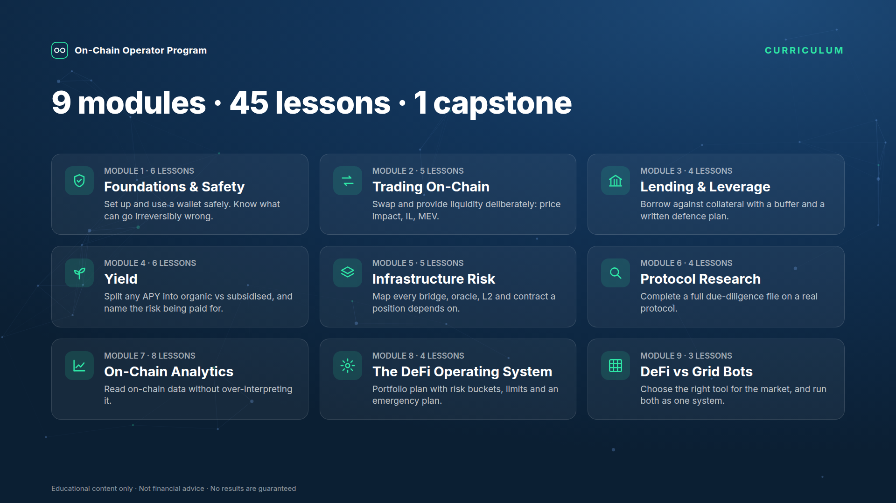
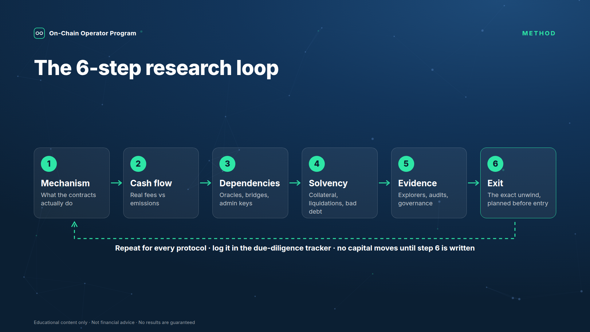
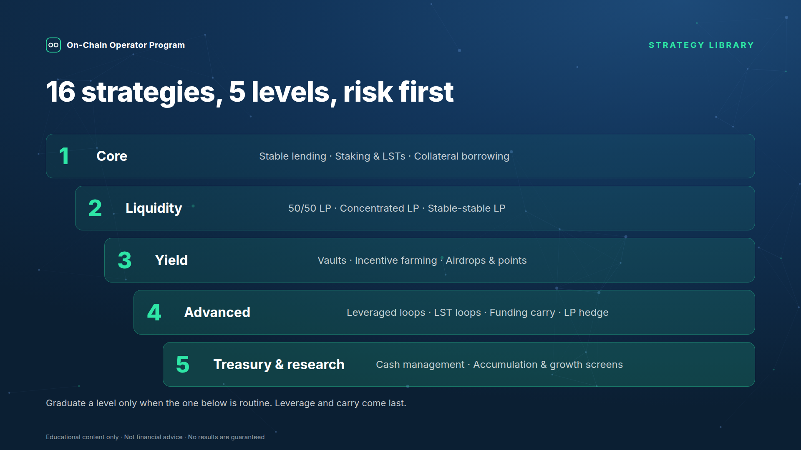
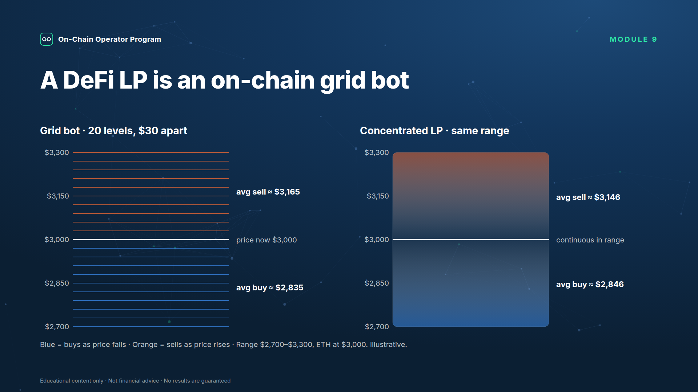
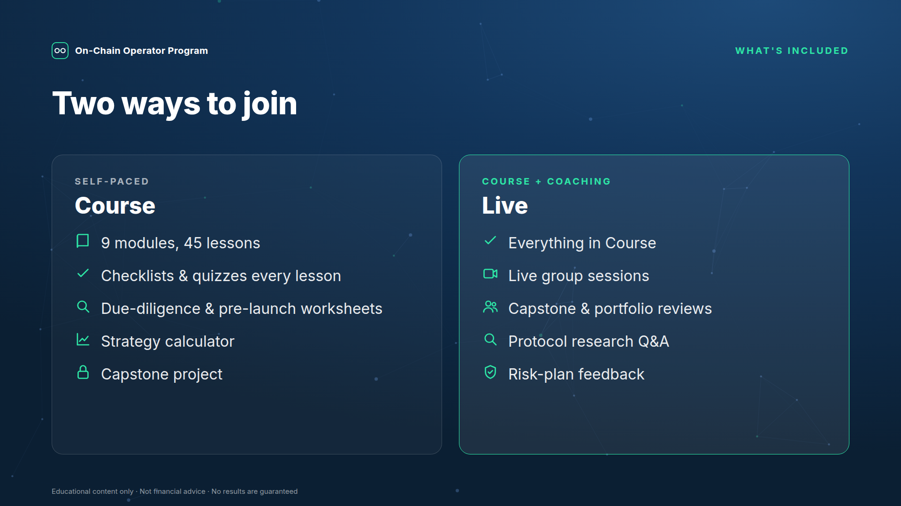
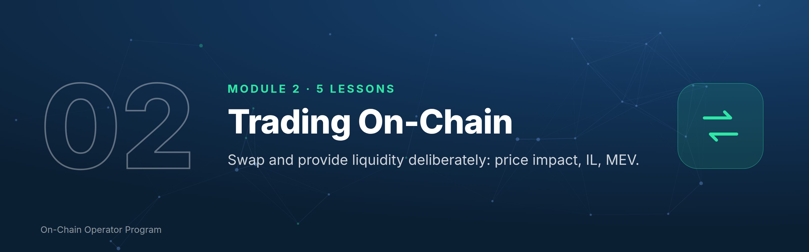
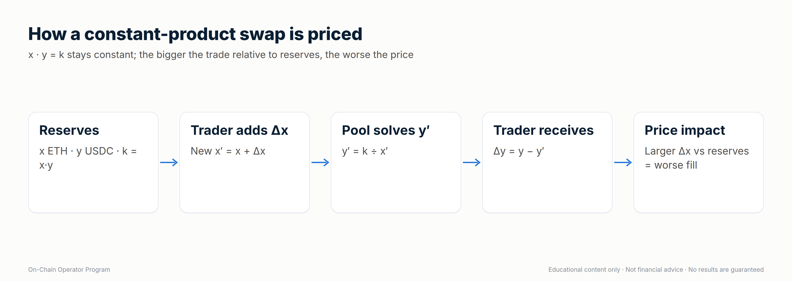
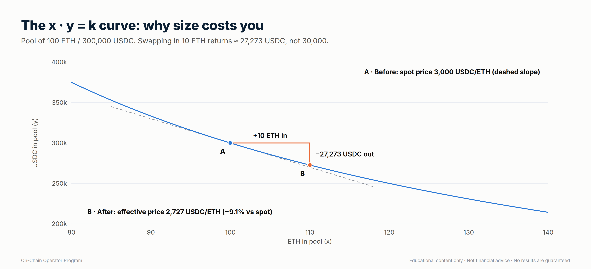
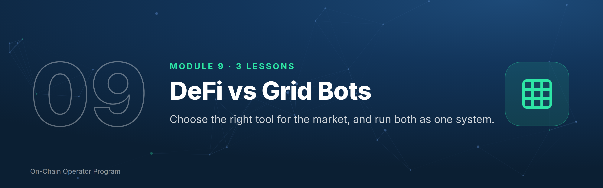
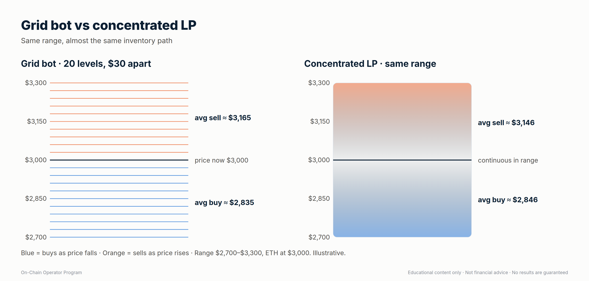

# On-Chain Operator Program — Master File

*Generated 2026-09-24 from `programs/defi-program/`. Don't edit this file directly: edit the source files and run `python3 programs/defi-program/build_master.py`.*

## Contents
1. Build status
2. Offer, decisions & curriculum
3. Whop setup
4. Whop store listing
5. Funnel changes
6. Course content (finished lessons)
7. Skills archive
8. Build prompt (hand this to Claude Code)

---

# 1. Build status


**Everything in one file:** `ON-CHAIN-OPERATOR-PROGRAM.md`, also as `On-Chain-Operator-Program.docx` (Word) and `On-Chain-Operator-Program.pdf`.
Rebuild: `python3 programs/defi-program/build_master.py`, then `cd programs/defi-program/export && npm install && npm run build`.
**To finish the build with AI:** paste `BUILD-PROMPT.md` into Claude Code.

| File | Phase | Status |
|---|---|---|
| `01-offer-and-curriculum.md` | 1–2 Offer + curriculum | Draft, waiting on your decisions |
| `02-sample-lesson-amm-math.md` | Lesson 2.2 | Written |
| `03-defi-strategy-mastery.md` | Lesson 8.3 (strategy library) | Written |
| `04-funnel-changes.md` | 4 Funnel wiring | Draft, not applied to Zapier |
| `05-whop-setup.md` | 3 Whop setup | Decisions locked; waiting on Whop reconnect + product ID |
| `06-whop-store-listing.md` | Store product listing: copy + image upload map | Ready to paste (3 placeholders) |
| `assets/` | 28 images: store icon/banner/gallery, 9 module banners, diagrams, charts | Rendered by `export/build_images.js` |
| `lessons/module-01-foundations-safety.md` | Module 1 (6 lessons) | Written |
| `lessons/module-02-trading-on-chain.md` | Module 2 (2.1, 2.3–2.5; 2.2 is the sample) | Written |
| `lessons/module-09-defi-vs-grid-bots.md` | Module 9 (3 lessons) | Written |

Lessons written: Modules 1, 2 and 9 in full, plus 8.3 (15 of 45).
Still to write: Module 3 · 4 · 5 · 6 · 7 · 8.1, 8.2, 8.4.
Phase 3: blocked until Whop is reconnected in Zapier and the product is created in the Whop dashboard (see `05-whop-setup.md`).

---

# 2. Offer, decisions & curriculum


Status: **draft, nothing created on Whop yet.** Items marked **DECIDE** need
your call before phase 3 (Whop setup).

## Decisions so far (2026-09-24)
| Item | Decision |
|---|---|
| Name | **On-Chain Operator Program** |
| Format | **Two tiers:** self-paced course + a higher tier with live sessions |
| Sales path | **Application → call → checkout** |
| Audience | **Everyone at once:** GBB customers, Elite Intel members and cold ad traffic from launch |
| Price | **Course $15,000 one-time** · live tier priced higher (TBD) |
| Refund policy | Open |
| Starter tier / GBB pricing conflict | Open |
| 9-module structure | Assumed OK unless you say otherwise |

**What $15,000 changes (recommendations, your call):**
- It becomes the top of the ladder (above Grid Bot Elite at $2,497), so it
  needs a **high-ticket sales path**: cold traffic → application → call →
  checkout, not straight-to-checkout ads. `gbb-new-lead` scoring (capital
  20k+ = 4) becomes the qualifier.
- Buyers at this price expect access to you: the live tier (calls, reviews,
  capstone feedback) carries most of the value. The course alone is hard to
  justify at $15k.
- High-ticket crypto education attracts consumer-protection scrutiny. Keep
  every page and call script free of income/return claims, and put terms,
  refund policy and "educational, not financial advice" at checkout.

Built from: Notion → ATLAS → *DeFi & On-Chain (Complete Module)* (42 chapters,
16 strategy frameworks, 20 on-chain metrics) and the existing Grid Bot Builder
offer stack.

---

## Phase 1 — Offer

### Positioning
Grid Bot Builder automates trading **on exchanges**. The DeFi program teaches
people to operate **on-chain** safely: research a protocol, size a position,
know the exit. Your module already has a strong line to lead with:

> **"If you can't explain the unwind, you don't understand the position yet."**

**Promise (skills, not returns):** *Research any DeFi protocol with a 6-step
risk loop, understand exactly where yield comes from, and never sign a
transaction you can't unwind.*

### Working name — DECIDE
*Superseded: see "Decisions so far" at the top. Kept for the record.*
| Option | Why |
|---|---|
| **DeFi Operator Blueprint** (recommended) | Matches "Grid Bot Building Blueprint" on Whop; "operator" = process, not hype |
| Risk-First DeFi | States the differentiator |
| On-Chain Operator Program | Neutral, broader |

### Who it's for — DECIDE
*Superseded: see "Decisions so far" at the top. Kept for the record.*
| Audience | Fit | How they arrive |
|---|---|---|
| **GBB customers** (recommended primary) | Already trust you, already think in systems/risk | Cross-sell email ~14 days after GBB onboarding |
| Elite Intel Community members | Warm, recurring, already reading intel briefs | In-community offer + LAUNCH-style code |
| Cold ad traffic | Largest pool, needs most education | Separate ad campaign → lead skill with `defi-lead` tag |

Recommendation: launch to GBB customers + Elite Intel members first (warm,
lower CAC, real feedback), open to cold traffic once conversion is proven.

### Format — DECIDE
*Superseded: see "Decisions so far" at the top. Kept for the record.*
- **Core (recommended):** self-paced Whop course (9 modules below) + worksheets
  (the two Notion trackers as templates) + quizzes + capstone.
- **Optional higher tier:** Core + live monthly DeFi Q&A / portfolio review.
  Your Calendly already has `vip-defi-consult` and `defi` links — are those
  for this program? (The GBB skills are told never to use them, so they're
  free for DeFi.)

### Pricing — DECIDE (proposal only)
*Superseded: see "Decisions so far" at the top. Kept for the record.*
Mirror GBB's one-time + 3-pay pattern, priced **below** GBB so it works as
a cross-sell rather than competing with it:

| Plan | Proposal | Reasoning |
|---|---|---|
| One-time | $497 | Half of GBB; education product, not software |
| 3-pay | 3 × $197 ($591) | ~19% payment-plan premium, in line with GBB's 20% (3 × $399 vs $997) |
| GBB customer price | $397 or bundle | Rewards the cross-sell |
| Higher tier (if live calls) | $997 | Only if you'll run the calls |

Refund policy — DECIDE: GBB has 30-day money-back on the software. For a
course, suggest **14 days, if under 30% of lessons completed**.

> Still open from before: `gbb ad performance` mentions a "Grid Bot Starter"
> (A$47–97) and GBB at A$497. Other skills say $997, no Starter. Which is
> current? It affects where DeFi sits in the ladder.

### Ladder after launch


---

## Phase 2 — Curriculum



**Change from the skill's default:** I split "Research" (12 chapters) into
two modules, so it's **9 modules** instead of 8 and every module is 3–8
lessons. All 42 chapters are used exactly once.

Every lesson follows one template: **Objective → Explanation → Worked example
→ Checklist → 3 quiz questions.** A full sample lesson is in
`02-sample-lesson-amm-math.md`.

### Module 1 — Foundations & Safety *(6 lessons)*
Outcome: set up and use a wallet safely; know what can go irreversibly wrong.
| # | Lesson | ATLAS ch. |
|---|---|---|
| 1.1 | What DeFi is — and the risk-first mindset | 1 |
| 1.2 | How a transaction actually happens (gas, nonce, finality) | 2 |
| 1.3 | Wallets, keys, hardware & multisig | 3 |
| 1.4 | Tokens, approvals & allowances | 4 |
| 1.5 | Stablecoins and how they break | 5 |
| 1.6 | Scam defence: phishing, drainers, address poisoning | 36 |

Assets: before-signing checklist (ch. 42) introduced here and reused in every module.

### Module 2 — Trading On-Chain *(5 lessons)*
Outcome: execute a swap deliberately, understanding price impact and MEV.

| # | Lesson | ATLAS ch. |
|---|---|---|
| 2.1 | DEXs, aggregators & routing | 6 |
| 2.2 | AMM mathematics (x·y=k) — *sample lesson* | 7 |
| 2.3 | Providing liquidity | 8 |
| 2.4 | Impermanent loss & true LP P&L | 9 |
| 2.5 | MEV and how to protect your trades | 35 |

Assets: AMM flow diagram, 100 ETH / 300k USDC worked example, LP-vs-hold benchmark.

### Module 3 — Lending & Leverage *(4 lessons)*
Outcome: borrow against collateral with a buffer and a written defence plan.

| # | Lesson | ATLAS ch. |
|---|---|---|
| 3.1 | How lending markets work (utilisation, rate curves) | 10 |
| 3.2 | LTV, liquidation threshold & health factor | 11 |
| 3.3 | Liquidations and cascades | 12 |
| 3.4 | Borrowing strategies & looping | 13 |

Assets: liquidation feedback-loop diagram, Aave health-factor primary source.

### Module 4 — Yield *(6 lessons)*
Outcome: split any APY into organic vs subsidised, and name the risk being paid for.

| # | Lesson | ATLAS ch. |
|---|---|---|
| 4.1 | Yield farming: base yield vs emissions | 14 |
| 4.2 | Native staking | 15 |
| 4.3 | Liquid staking (LSTs) | 16 |
| 4.4 | Restaking & shared security | 17 |
| 4.5 | Vaults & yield optimisers | 18 |
| 4.6 | Airdrops & points — opportunity cost | 37 |

### Module 5 — Infrastructure Risk *(5 lessons)*
Outcome: map every bridge, oracle, L2 and contract a position depends on.

| # | Lesson | ATLAS ch. |
|---|---|---|
| 5.1 | Bridges and trust assumptions | 19 |
| 5.2 | Layer 2s, sequencers & withdrawal paths | 20 |
| 5.3 | Oracles, TWAPs & manipulation | 21 |
| 5.4 | Smart contracts: state, proxies, admin keys | 22 |
| 5.5 | Smart-contract risk & what audits don't prove | 23 |

### Module 6 — Protocol Research *(4 lessons)*
Outcome: complete a full due-diligence file on a real protocol.

| # | Lesson | ATLAS ch. |
|---|---|---|
| 6.1 | Protocol due diligence | 24 |
| 6.2 | Tokenomics: supply, unlocks, FDV, value capture | 25 |
| 6.3 | Governance & DAOs | 26 |
| 6.4 | The on-chain research workflow | 41 |

Assets: **DeFi Protocol Due Diligence Tracker** (Notion) + `defi-due-diligence` 6-step loop.


### Module 7 — On-Chain Analytics *(8 lessons)*
Outcome: read on-chain data without over-interpreting it.

| # | Lesson | ATLAS ch. |
|---|---|---|
| 7.1 | On-chain data foundations (address ≠ person) | 27 |
| 7.2 | Block explorer mastery | 28 |
| 7.3 | Exchange flows | 29 |
| 7.4 | Whale & entity analysis | 30 |
| 7.5 | Holder & supply metrics (MVRV, SOPR, HODL waves) | 31 |
| 7.6 | Network activity | 32 |
| 7.7 | DEX & liquidity analytics | 33 |
| 7.8 | Derivatives on-chain (perps, funding, OI) | 34 |

Assets: 20-metric directory as a downloadable reference card.

### Module 8 — The DeFi Operating System *(4 lessons)*
Outcome: a written portfolio plan with risk buckets, limits and an emergency plan.

| # | Lesson | ATLAS ch. |
|---|---|---|
| 8.1 | DeFi portfolio construction | 38 |
| 8.2 | The DeFi risk framework | 39 |
| 8.3 | Strategy library (16 frameworks, Core → Advanced), full content in `03-defi-strategy-mastery.md` | 40 |
| 8.4 | The operating playbook: deploy, monitor, respond, review | 42 |

### Module 9 — DeFi vs Grid Bots *(3 lessons, new content)*
Outcome: choose the right tool for the market — and the natural bridge into GBB.

| # | Lesson | ATLAS ch. |
|---|---|---|
| 9.1 | LP position vs grid bot: same idea (sell high/buy low inside a range), different risks | new |
| 9.2 | When a CEX grid beats on-chain LP, and when it doesn't (fees, custody, IL vs inventory risk, regime) | new |
| 9.3 | Building a combined system: grid bots for range markets, DeFi for yield/collateral | new |

Cross-sell: GBB checkout link for non-customers; Elite Intel invite for everyone.

### Capstone
Pick one real protocol → complete the due-diligence file (Module 6) → write a
position plan with sizing, monitoring triggers and exact unwind (Module 8).
Submitted via Whop; optional review on the higher tier.

### Totals
9 modules · 45 lessons (42 ATLAS + 3 new) · 135 quiz questions · 2 worksheets · 1 capstone.

---

## What I need from you to move to Phase 3 (Whop setup)
1. Name
2. Primary audience (warm-first recommended?)
3. Format: core only, or core + live tier (and are `vip-defi-consult` / `defi` Calendly links for this?)
4. Prices + refund policy
5. Starter tier: does it exist?
6. 9-module structure OK?

---

# 3. Whop setup

## Decisions locked (2026-09-24)
| Item | Decision |
|---|---|
| Name | On-Chain Operator Program |
| Tier 1 — Course (self-paced, 9 modules, worksheets, capstone) | **$15,000 one-time** (no payment plan) |
| Tier 2 — Live (course + live sessions) | **Priced above $15,000 — number TBD** |
| Audience | Everyone at launch (GBB customers, Elite Intel members, cold ads) |
| Sales path | **Application → call → checkout** (no straight-to-checkout ads) |
| Call link | `vip-defi-consult` Calendly (verify the exact URL is live) |

Still open: Tier 2 price · refund policy · GBB-customer price (if any) ·
the Starter tier / GBB price conflict.

## Blockers found
1. **Whop is not connected in Zapier** (0 connected accounts on WhopCLIAPI).
   Reconnect it in Zapier before any Whop step below. The existing `gbb-*`
   skills also need it to run.
2. **Zapier can't create Whop products.** It can create *plans*, checkout
   sessions, leads, promo codes and invoices. The product itself must be
   created in the Whop dashboard.

## Step 1 — You, in the Whop dashboard
1. Create a product named **On-Chain Operator Program**. Keep it **hidden /
   unlisted** until launch. Upload the icon, banner and gallery images and
   paste the copy from `06-whop-store-listing.md`.
2. Add a course experience and create the 9 module sections (titles in
   `01-offer-and-curriculum.md`).
3. Add terms of sale: refund policy (once decided) and "Educational content
   only. Not financial advice. No results are guaranteed."
4. Send me the product ID (starts with `prod_`).

## Step 2 — Me, via Zapier (after you confirm)
| Action | Zapier tool | Values |
|---|---|---|
| Course plan | `whop_create_plan` | product = your `prod_` ID, one-time, $15,000, hidden until launch |
| Live-tier plan | `whop_create_plan` | once the price is set |
| Checkout links per campaign | `whop_create_checkout_session` | metadata `utm_campaign`, `utm_adset`, `utm_creative` so ad reports attribute sales |
| Applications | `whop_create_lead` | one lead per application, product-specific |

Nothing gets created until you've seen the exact values and said yes.

## Step 3 — Upload content
Written and ready to paste in: Modules 1, 2 and 9, plus lesson 8.3
(`lessons/`, `02-…`, `03-…`). Modules 3–8 are still being written.

## Step 4 — High-ticket sales path


Suggested qualification (adjust as you like): lead score ≥ 6 (capital 20k+ /
major exchange / some experience) **and** completed application.

---

# 4. Whop store listing


Everything needed to add the program to your Whop store as a new product:
copy, images and upload order. **Nothing is published.** You create the
product in the Whop dashboard (Zapier can't create products), paste this in,
and keep it hidden until launch.

> Check Whop's current image size limits in the dashboard when you upload.
> These files are produced at standard sizes (1024×1024 square, 1920×1080
> 16:9) and can be re-exported at any size with `npm run images`.

---

## 1. Images: upload map

| Whop slot | File | Size |
|---|---|---|
| Product icon / logo | `assets/store/icon-1024.png` | 1024×1024 |
| Cover / hero banner | `assets/store/banner-1920x1080.png` | 1920×1080 |
| Gallery 1 | `assets/store/gallery-01-curriculum.png` | 1920×1080 |
| Gallery 2 | `assets/store/gallery-02-research-loop.png` | 1920×1080 |
| Gallery 3 | `assets/store/gallery-03-strategy-levels.png` | 1920×1080 |
| Gallery 4 | `assets/store/gallery-04-grid-vs-lp.png` | 1920×1080 |
| Gallery 5 | `assets/store/gallery-05-whats-included.png` | 1920×1080 |
| Course module headers | `assets/modules/module-01.png` … `module-09.png` | 1600×500 @2x |
| In-lesson diagrams & charts | `assets/diagrams/*.png`, `assets/charts/*.png` | 1800 wide @2x |







---

## 2. Listing copy

**Product name:** On-Chain Operator Program

**Tagline (short):** The risk-first DeFi operating system.

**Short description (≈150 characters):**
Research any protocol, know where yield really comes from, and never sign a
position you can't unwind. 9 modules · 45 lessons · capstone.

**Headline:** Research. Size. Exit. On-chain.

**Full description:**

> Most people enter DeFi through a number: an APY. Operators start with a
> different question: *what am I being paid to risk, and how do I get out?*
>
> The On-Chain Operator Program is a structured, application-only program
> that teaches you to run DeFi positions the way a professional runs a
> desk: with a research process, position limits, written exit rules and a
> weekly review.
>
> You'll learn to set up wallets that survive mistakes, read any protocol
> from contract to cash flow, model liquidity, lending and yield strategies
> before capital moves, and combine on-chain positions with automated grid
> bots without doubling your risk.

**What you'll learn**
- A 6-step research loop for any protocol: mechanism, cash flow, dependencies, solvency, evidence, exit
- Where DeFi returns actually come from, and how each one fails
- Liquidity providing, impermanent loss and true LP P&L, measured against holding
- Lending, health factors and liquidations, with a written defence plan
- 16 strategy playbooks across 5 levels, each with its maths, kill rules and failure modes
- How a concentrated LP compares to a grid bot, and how to run both as one system
- Wallet security, approvals, and the scams that drain wallets

**What's included**

| | Course | Live |
|---|---|---|
| 9 modules, 45 lessons | ✓ | ✓ |
| Checklists and quizzes in every lesson | ✓ | ✓ |
| Due-diligence and pre-launch worksheets | ✓ | ✓ |
| Strategy calculator | ✓ | ✓ |
| Capstone project | ✓ | ✓ |
| Live group sessions | | ✓ |
| Capstone and portfolio reviews | | ✓ |
| Protocol research Q&A | | ✓ |
| **Price** | **$15,000 one-time** | **`<LIVE_PRICE>`** |

**Who it's for**
- Traders and Grid Bot Builder customers ready to operate on-chain with a process
- Investors holding crypto who want to put it to work without taking risks they don't understand

**Who it's not for**
- Anyone looking for guaranteed returns or signals to copy
- Anyone unwilling to self-custody or follow a checklist

**How to join:** Apply → short call → enrolment link. (Application link:
`<DEFI_APPLICATION_URL>`)

**FAQ**
- *Do I need DeFi experience?* No. Module 1 starts from wallets and transactions. You do need to be comfortable with crypto exchanges.
- *Do you manage my funds or need my keys?* Never. You keep custody. We will never ask for a seed phrase, private key or API key.
- *Will I make money?* The program teaches a process for researching, sizing and exiting positions. It doesn't promise or project returns, and every strategy is taught alongside how it loses money.
- *How does this relate to Grid Bot Builder?* Module 9 shows how on-chain liquidity and exchange grid bots do similar jobs, and how to run both in one portfolio.
- *Refunds?* `<REFUND_POLICY>`

**Footer disclaimer (put on the listing and at checkout):**
Educational content only. Not financial advice. Digital assets are volatile
and you can lose some or all of your capital. No results are guaranteed.

---

## 3. Store setup checklist
- [ ] Product created in the Whop dashboard as **hidden**, named "On-Chain Operator Program"
- [ ] Icon, banner and 5 gallery images uploaded in the order above
- [ ] Copy pasted; `<LIVE_PRICE>`, `<REFUND_POLICY>`, `<DEFI_APPLICATION_URL>` filled
- [ ] Course experience added; module headers uploaded; lessons pasted with their diagrams
- [ ] Plans created via Zapier (course $15,000 one-time; live tier once priced), approved first
- [ ] Checkout tested end to end on a hidden plan
- [ ] Listing reviewed for any income or return claims before going public

---

# 5. Funnel changes (draft, not applied)

Proposed changes to the four live Zapier skills so they handle the DeFi
program alongside Grid Bot Builder. **Nothing has been changed in Zapier.**
Once you approve, the edits go into Zapier (`update_zapier_skill`) and are
mirrored into `.claude/skills/gbb-*`.

Product name: **On-Chain Operator Program**, course $15,000 one-time, sold through application → call → checkout (see `05-whop-setup.md`). This changes the emails below: hot/warm DeFi leads get the **application + call** link, not a direct checkout link. Placeholders still open: `<DEFI_LIVE_PRICE>`, `<DEFI_GBB_PRICE>`,
`<DEFI_CHECKOUT_URL>`, `<DEFI_PLAN_IDS>`, `<DEFI_ACCESS_URL>` (the program's Whop hub link), `<DEFI_APPLICATION_URL>` (Typeform application), `<DEFI_CALL_LINK>` (your `vip-defi-consult` Calendly link; verify the URL).

---

## 1. gbb new lead → handles DeFi interest

**Add fixed values**
- DeFi product: `On-Chain Operator Program`, `$15,000` one-time; checkout `<DEFI_CHECKOUT_URL>`.
- Mailchimp tags: `defi-lead`, `defi-nurture`.
- HubSpot deal name: `DEFI - <First Last>`.

**Add an interest field** to the form / intake: `interest = grid | defi | both`.

**Routing change (after scoring, step 3):**
| interest | Deal(s) created | Tags | Email |
|---|---|---|---|
| grid | `GBB - …` (unchanged) | `gbb-lead` (+ hot/nurture) | unchanged |
| defi | `DEFI - …`, amount `$15,000` | `defi-lead` (+ `defi-nurture` if cold) | DeFi email by tier (below) |
| both | GBB deal only; DeFi mentioned as next step | `gbb-lead`, `defi-lead` | GBB email + one line on DeFi |

Scoring stays the same. Capital and experience predict fit for both products.

**Draft emails (plain text, under 120 words, no profit promises)**

*DeFi — warm/hot*
> Hi {first},
> Thanks for your interest in On-Chain Operator Program. It's a step-by-step program for operating in DeFi safely: how to research a protocol, where yield actually comes from, and how to plan the exit before you enter.
> 9 modules, worksheets and a capstone, all self-paced.
> It's application-only. Apply here: <DEFI_APPLICATION_URL>
> Qualified applicants book a call to see if it's the right fit: <DEFI_CALL_LINK>
> Stewart
> *Educational content, not financial advice.*

*DeFi — cold (nurture)*
> Hi {first},
> One rule before you put anything into DeFi: if you can't explain how you'd get out, don't get in.
> Over the next few emails I'll share the checklist we use before signing any transaction.
> If you want daily market intel in the meantime, Elite Intel Community has a 3-day free trial: https://elite-intel-community.whop.site/
> Stewart

---

## 2. gbb customer onboarding → DeFi branch + cross-sell

**When product = `On-Chain Operator Program`:**
1. HubSpot: lifecycle `customer`; deal `DEFI - …` → closedwon, amount = actual plan price.
2. Mailchimp: remove `defi-lead`, add `defi-customer`.
3. Gmail onboarding (draft below).
4. Sheets → Payments (product = DeFi) and ExcludeList.
5. Elite Intel Community invite, same rules as GBB (separate email, paid trial, never granted free).
6. If *not* a GBB customer: tag `gbb-crosssell-candidate` (no email yet; see the sequence below).

*DeFi onboarding email*
> Welcome to On-Chain Operator Program, {first}.
> Your access is live: <DEFI_ACCESS_URL> (log in with this email).
> Start with Module 1 — Foundations & Safety. Do the practical (3-wallet setup) before anything else.
> Two rules for the whole program:
> 1. Never share your seed phrase or private keys. We will never ask.
> 2. Run the before-signing checklist every time.
> Reply to this email if you get stuck.
> Stewart

**When product = Grid Bot Builder** (existing flow, plus one addition):
- Tag `defi-crosssell-candidate`. The cross-sell email goes **14 days after
  onboarding**, not in the welcome sequence, so they're set up and trading first.

*GBB → DeFi cross-sell (day 14)*
> Hi {first},
> By now your grid bots should be running. Here's where most of our builders go next: putting idle stablecoins and reserves to work on-chain, without taking on risks they don't understand.
> On-Chain Operator Program covers this, including a module on how a DeFi liquidity position is basically an on-chain grid bot, and when each one wins.
> It's application-only: <DEFI_APPLICATION_URL>
> Stewart

---

## 3. gbb ad performance → report DeFi

- Add `On-Chain Operator Program` to "products" with its plan IDs.
- Per campaign: DeFi sales (# and $), CAC-to-DeFi.
- New cross-sell metric: **GBB → DeFi attach rate** = GBB buyers who later buy DeFi ÷ GBB buyers ≥ 14 days old.
- Budget rule unchanged (it uses total net Whop revenue).

## 4. gbb pipeline check → DeFi deals

- Include deals starting `DEFI -` with the same stages.
- Revenue by product adds DeFi.
- Stale DeFi leads → offer `defi-nurture` tagging (same confirm rule).

---

## New Zapier skill (proposed): `defi-crosssell-sweep`
Weekly: find `defi-crosssell-candidate` contacts whose GBB onboarding is ≥ 14
days old and who haven't bought DeFi → show the list → on a yes, send the day-14
email and remove the tag. Same guardrails: no Slack/Discord/Skool, confirm
before sending, no profit promises.

---

# 6. Course content

Finished lessons in curriculum order. Lesson 8.3 (strategy mastery) appears before Module 9.

---

# Module 1 — Foundations & Safety


*Outcome: set up and use a wallet safely, and know what can go irreversibly wrong before any capital moves.*
*Source: ATLAS "DeFi & On-Chain" ch. 1–5, 36. Educational content only. Not financial advice.*

The **before-signing checklist** is introduced in this module and used in every module after it:

- [ ] Chain confirmed
- [ ] Contract address verified from an authoritative source
- [ ] Token and amount double-checked
- [ ] Spender / allowance reviewed
- [ ] Slippage set deliberately
- [ ] Gas estimate reviewed
- [ ] Intended outcome stated in one sentence

---

## Lesson 1.1 — What DeFi is, and the risk-first mindset *(ch. 1)*

### Objective
Describe the DeFi stack and explain why every yield is payment for a risk.

### Explanation
DeFi replaces intermediaries (banks, brokers, exchanges) with **smart
contracts**: public programs on a blockchain that hold assets and follow fixed
rules. The stack, bottom to top:

1. **Blockchain**: records every balance and transaction (Ethereum, L2s, other chains).
2. **Smart contracts**: the protocol logic (a lending market, an exchange pool).
3. **Tokens**: the assets the contracts move.
4. **Wallets**: where *you* hold keys and sign actions.
5. **Interfaces**: websites that build transactions for you. They're a convenience, not the protocol itself.
6. **Data layers**: explorers and dashboards you use to verify what happened.

Three properties make DeFi powerful and dangerous:
- **Self-custody**: nobody can freeze your funds, and nobody can recover them either.
- **Composability**: protocols plug into each other. That makes products powerful, and a position can fail because of something it depends on.
- **Transparency**: you can verify everything on-chain. Transparent doesn't mean safe.

**Risk-first rule:** before comparing returns, list what could make you lose
money. A higher yield means you're being paid to carry more risk, whether or
not the website mentions it.

### Worked example
A pool advertises **12% APY on a stablecoin**. Before depositing, ask:
- Where does the 12% come from? Borrowers paying interest, trading fees, or a reward token?
- Which stablecoin, and what backs it? (Lesson 1.5)
- Which contracts hold the money, and who can upgrade them?
- Is there a bridge or oracle involved?
- How do I withdraw, and could withdrawals be blocked?

If you can't answer these, you don't know what the 12% is paying you for.

### Checklist
- [ ] I can name the six layers of the DeFi stack
- [ ] I can explain why self-custody cuts both ways
- [ ] Before any yield, I ask "what am I being paid to risk?"

### Quiz
<details><summary>1. Why can composability increase risk?</summary>A position inherits the failure risk of every protocol, asset, oracle and bridge it depends on.</details>
<details><summary>2. Is a website the same thing as the protocol?</summary>No. The interface only builds transactions. The contracts are the protocol, and interfaces can be faked or compromised.</details>
<details><summary>3. What is the risk-first mindset in one sentence?</summary>Identify what could make you lose money before you compare returns.</details>

---

## Lesson 1.2 — How a transaction actually happens *(ch. 2)*

### Objective
Follow a transaction from signature to finality, and estimate its cost.

### Explanation
**Lifecycle:** create → sign → broadcast → mempool (waiting) → included in a
block → confirmed → final.

- **Gas** is the unit of computation. Cost = `gas used × gas price`. On
  Ethereum the price has a *base fee* (burned) plus a *priority tip*
  (to get included sooner). Gas price is quoted in **gwei** (1 gwei = 0.000000001 ETH).
- **Nonce**: each account's transactions are numbered in order. A stuck
  low-nonce transaction blocks all later ones until it confirms or is
  **replaced** (same nonce, higher fee).
- **Failed transactions still cost gas.** The network did the computation even though the result was reverted.
- **Finality**: the point after which a transaction can't realistically be
  reversed. It differs by chain, and L2s have their own rules (Module 5).
- **Explorers** (e.g. Etherscan) show status, fee, sender, contract called, token transfers and logs.

### Worked example
A swap uses **150,000 gas** at **20 gwei**:
`150,000 × 20 = 3,000,000 gwei = 0.003 ETH`. At $3,000/ETH that's **$9**.
The same swap during congestion at 80 gwei costs **$36**. If you're compounding
$1.50 of rewards, the gas costs more than the rewards. That's why position
size matters on-chain.

### Checklist
- [ ] I check the fee estimate before signing
- [ ] I know how to find my transaction on an explorer
- [ ] I know a stuck transaction can be sped up or cancelled with the same nonce

### Quiz
<details><summary>1. Your transaction reverted. Did you pay?</summary>Yes, for the gas used up to the point of failure.</details>
<details><summary>2. 200,000 gas at 10 gwei with ETH at $2,500 costs?</summary>2,000,000 gwei = 0.002 ETH = $5.</details>
<details><summary>3. Why are your newer transactions all pending?</summary>An earlier nonce is stuck. Replace or speed it up, and the rest follow.</details>

---

## Lesson 1.3 — Wallets, keys, hardware & multisig *(ch. 3)*

### Objective
Set up a wallet structure where one mistake can't lose everything.

### Explanation
- **Private key**: the authority to sign. Whoever has it controls the funds.
- **Seed phrase**: 12–24 words that recreate your keys. **Never type it into
  a website, never photograph it, never share it. No legitimate support team
  will ever ask for it.**
- **Hardware wallet**: keeps keys on a separate device. Signing requires physical confirmation.
- **Multisig**: needs M of N signers (e.g. 2 of 3). Good for large or shared funds.
- **Smart wallets**: contract accounts that can add spending limits, recovery and batching.

**Compartmentalise:** separate wallets by job, so a compromise only reaches one of them.

### Worked example — the 3-wallet setup


| Wallet | Holds | Signs | Device |
|---|---|---|---|
| **Vault** | Long-term holdings | Almost never. No DeFi approvals | Hardware (or multisig) |
| **Operator** | Active DeFi positions | Known, verified protocols only | Hardware |
| **Burner** | Small amounts for new apps, mints, airdrops | Anything experimental | Hot wallet |

Move money *down* the chain (vault → operator → burner) only as needed, and
sweep profits back *up*. If the burner gets drained, you lose only the burner's balance.

### Checklist
- [ ] Seed phrase stored offline, in two separate physical places
- [ ] Vault wallet has never approved a DeFi contract
- [ ] Separate burner wallet for anything new
- [ ] I read every signing prompt on the hardware device screen, not just the website

### Quiz
<details><summary>1. A "support agent" in DMs needs your seed phrase to fix a stuck transaction. What do you do?</summary>Nothing. It's a scam, every time. Block and report.</details>
<details><summary>2. Why keep the vault wallet free of approvals?</summary>Approvals let contracts move your tokens. With none, a compromised protocol can't reach it.</details>
<details><summary>3. What does 2-of-3 multisig protect against?</summary>A single lost or compromised key. Two signers are still needed to move funds.</details>

---

## Lesson 1.4 — Tokens, approvals & allowances *(ch. 4)*

### Objective
Read an approval request and know what you're allowing.

### Explanation
- Most tokens on EVM chains are **ERC-20** (fungible). NFTs (ERC-721/1155)
  can also represent positions (e.g. concentrated LP).
- To let a protocol move your tokens you **approve** a **spender** for an
  **allowance**. The protocol then pulls tokens when you act.
- **Unlimited approvals** are convenient but let that contract move *all*
  of that token, now and in future. If the contract (or the approval) is
  exploited, the tokens can be taken.
- **Signature approvals (Permit / Permit2)** grant allowances with an
  off-chain signature, not a transaction. There's no gas, so they're easy to
  sign without noticing. Drainers abuse exactly this.
- **Wrapped / receipt tokens**: WETH, LP tokens and lending receipts represent a claim on something else.
- **Fake tokens**: anyone can create a token called "USDC". Only the **contract address** identifies it.

### Worked example — reading an approval
Wallet shows: *"Allow 0x3fC9…a1B2 to spend your USDC. Amount: Unlimited."*
1. Is `0x3fC9…a1B2` the protocol's official router? Check the docs or explorer.
2. Do I need unlimited? Edit it to the amount of this deposit.
3. Is this USDC the real contract?
4. After finishing, revoke with a revoke tool (e.g. revoke.cash) if I won't be back.

### Checklist
- [ ] Spender verified against official docs
- [ ] Allowance limited to what's needed
- [ ] Signature requests read as carefully as transactions
- [ ] Approvals reviewed and revoked monthly

### Quiz
<details><summary>1. Why is a gasless "Permit" signature dangerous?</summary>It can grant a token allowance without a transaction, so it's easy to sign without noticing. Drainers use it to take tokens.</details>
<details><summary>2. How do you know a token is the real one?</summary>By its contract address from an authoritative source, never by name or ticker.</details>
<details><summary>3. When should you revoke an approval?</summary>When you no longer use that protocol, or on a regular schedule.</details>

---

## Lesson 1.5 — Stablecoins and how they break *(ch. 5)*

### Objective
Classify a stablecoin by design and name what could break its peg.

### Explanation
| Type | Backing | Main risks |
|---|---|---|
| **Fiat-backed** | Cash/treasuries held by an issuer | Issuer, bank and custodian risk; freezes; redemption limited to approved parties |
| **Crypto-backed** | Over-collateralised on-chain crypto | Collateral crash, liquidations, oracle failure |
| **Synthetic / hedged** | Derivative positions (e.g. spot + short perp) | Funding turns negative, exchange/venue risk, model risk |
| **Algorithmic** | Mostly its own mechanism / sister token | Reflexive death spiral when confidence breaks |

**Peg mechanics:** if a stablecoin trades at $0.98 and can be redeemed for
$1.00, arbitrageurs buy and redeem it, pushing the price back up. The peg is
only as strong as **redemption access and reserve quality**.

History (research these as case studies):
- **May 2022**: TerraUSD (UST), an algorithmic design, lost its peg and collapsed toward zero.
- **March 2023**: USDC briefly traded well below $1 after part of its reserves were exposed to the failed Silicon Valley Bank, then recovered once reserves were confirmed.

### Worked example
A fiat-backed coin trades at **$0.97**. Redemption is **$1.00 minus a 0.1% fee**,
but only for verified institutional minters.
- A minter makes ~2.9% per coin by buying and redeeming, so arbitrage *should* restore the peg.
- You can't redeem, so you rely on minters acting and on the reserves being real.
- If markets doubt the reserves, minters may not step in, and the discount can grow.

### Checklist
- [ ] I know the type and backing of every stablecoin I hold
- [ ] I know who can redeem, and how
- [ ] I don't treat "different stablecoins" as diversified if they share issuers or collateral
- [ ] I have a depeg exit rule (e.g. sell or rotate below $0.99 for longer than X hours)

### Quiz
<details><summary>1. What keeps a fiat-backed stablecoin near $1?</summary>Redemption for $1 of reserves, plus arbitrageurs who can redeem.</details>
<details><summary>2. Why are algorithmic designs fragile?</summary>They rely on confidence and their own token. When demand falls, the mechanism can amplify the fall.</details>
<details><summary>3. Two stablecoins both backed by the same collateral. Diversified?</summary>No. They share the same failure point.</details>

---

## Lesson 1.6 — Scam defence *(ch. 36)*

### Objective
Recognise the common attacks before they cost you anything.

### Explanation
| Attack | How it works | Defence |
|---|---|---|
| **Phishing site** | Look-alike URL / sponsored search ad / fake app | Bookmarks only. Never click links from DMs or ads |
| **Wallet drainer** | You sign an approval, Permit or `setApprovalForAll` for an attacker | Read every prompt. Burner wallet for new sites |
| **Address poisoning** | Attacker sends $0 transfers from an address that looks like one you use, so it appears in your history | Never copy addresses from history. Use a saved address book and check the *full* address |
| **Fake token / airdrop** | Unknown tokens appear in your wallet with a "claim" link | Ignore them. Don't interact or try to sell |
| **Impersonation** | "Support", "admin" or "project team" DMs you | Real teams never DM first and never ask for seeds |
| **Too-good yields** | New protocol, huge APY, anonymous team, no audit | Due diligence (Module 6). Burner wallet and small size, or skip |

### Worked example — address poisoning
You regularly send to `0x7a3F…9c21`. Today your history shows a transfer from
`0x7a3F…9c21`, but the full address is `0x7a3F`**`e0b4…d18`**`9c21`: same
start and end, different middle. If you copy it from history you send your
funds to the attacker. **Always paste from your address book and check the
full address.**

### Checklist
- [ ] Protocol sites bookmarked; never reached through search ads or DMs
- [ ] Address book in use; full address checked before sending
- [ ] Unknown tokens ignored
- [ ] DMs from "support" treated as scams by default
- [ ] New sites only with the burner wallet

### Quiz
<details><summary>1. A new token worth "$5,000" appears in your wallet with a claim site. What do you do?</summary>Ignore it. It's bait, and interacting risks a drainer approval.</details>
<details><summary>2. How does address poisoning trick people?</summary>It puts a look-alike address in your history so you copy it by mistake.</details>
<details><summary>3. What's the single best habit against drainers?</summary>Reading every signature and approval prompt, and using a burner wallet for anything new.</details>

---

### Module 1 practical
1. Set up the 3-wallet structure (vault / operator / burner).
2. Send a small test transaction and trace it on an explorer: status, fee, nonce.
3. Approve a small, limited allowance on a reputable protocol, then revoke it.
4. Write your stablecoin list with type, backing, who can redeem, and your depeg exit rule.

---

# Module 2 — Trading On-Chain



*Outcome: execute a swap or LP position deliberately, understanding price impact, fees, impermanent loss and MEV.*
*Source: ATLAS "DeFi & On-Chain" ch. 6–9, 35. Educational content only. Not financial advice. Figures illustrative.*


---

## Lesson 2.1 — DEXs, aggregators & routing *(ch. 6)*

### Objective
Choose where to swap by comparing the **net amount received**, not the quoted price.

### Explanation
- **AMM DEX**: you trade against a liquidity pool priced by a formula (Lesson 2.2).
- **On-chain order book**: orders matched by price and time, fully or partly on-chain.
- **Aggregator**: searches many pools and venues and may split your order across routes.
- **Price impact**: how much *your* trade moves the price. It grows with size relative to pool depth.
- **Slippage tolerance**: the worst price you'll accept before the transaction reverts.
- **Routing**: multi-hop routes (A → B → C) can give a better price but touch more contracts.

**What you actually get = quoted output − price impact − pool fees − gas.**

### Worked example
Selling **20 ETH**:
| Route | Output | Gas | Net |
|---|---|---|---|
| Single pool direct | 59,100 USDC | $8 | **59,092** |
| Aggregator (split across 3 pools) | 59,420 USDC | $20 | **59,400** |

The aggregator wins by ~$308. Now selling **0.5 ETH**: the aggregator quotes $3
better but costs $12 more in gas, so the direct pool wins. **Big trades
benefit from routing. Small trades mostly lose to gas.**

### Checklist
- [ ] Compare net output after gas, not headline price
- [ ] Price impact shown and acceptable for the size
- [ ] Route uses reputable pools and tokens you've verified
- [ ] Slippage set on purpose (see 2.5)

### Quiz
<details><summary>1. Why can an aggregator give a better price?</summary>It can split an order across pools, so each pool's price moves less.</details>
<details><summary>2. When does the best quote lose?</summary>When the extra gas costs more than the price improvement, which is common for small trades.</details>
<details><summary>3. What drives price impact?</summary>Trade size relative to pool liquidity.</details>

---

## Lesson 2.2 — AMM Mathematics (x · y = k)

*Module 2 · Trading On-Chain · Source: ATLAS ch. 7*
*Template every lesson follows: Objective → Explanation → Worked example → Checklist → Quiz.*

> Educational content only. Not financial advice. Examples are illustrative.

### Objective
By the end of this lesson you can calculate what a swap will actually pay out
in a constant-product pool, and explain why bigger trades get worse prices.

### Explanation
A constant-product AMM holds two tokens in a pool. It doesn't use an order
book. It keeps one rule: **reserves of token A × reserves of token B = k**, and
k must stay constant (ignoring fees) after every trade.

- **Pool price** is the ratio of reserves. 100 ETH and 300,000 USDC means 1 ETH ≈ 3,000 USDC.
- When you add ETH to the pool, the pool must *remove* enough USDC to keep x·y = k.
- The more of the pool you move, the further the price moves against you. That gap is **price impact**.
- **Arbitrageurs** then trade the pool back in line with other markets, and that changes what LPs hold. You'll see why that matters in Lesson 2.4.



### Worked example



Pool: **100 ETH** and **300,000 USDC**, so k = 30,000,000. Spot price = 3,000 USDC/ETH.

You swap in **10 ETH** (fees ignored):
1. x' = 100 + 10 = 110
2. y' = 30,000,000 ÷ 110 ≈ 272,727
3. You receive 300,000 − 272,727 ≈ **27,273 USDC**
4. Effective price ≈ 27,273 ÷ 10 = **2,727 USDC/ETH**, which is **~9.1% worse** than spot.

Now try **1 ETH**: x' = 101 → y' ≈ 297,030 → you receive ≈ 2,970 USDC, which is ~1% worse.
Ten times the size cost about nine times more in price impact. **Size relative to
pool depth is what matters, not the size of the trade in dollars.**

### Checklist before any swap
- [ ] Check the price impact the interface shows; if it isn't shown, work it out
- [ ] Compare with an aggregator quote
- [ ] Set slippage tolerance on purpose (too tight: the swap fails; too loose: you get a bad fill or a sandwich attack, see 2.5)
- [ ] Split large trades or use deeper pools
- [ ] Run the before-signing checklist (chain, contract, token, amount, spender)

### Quiz
<details><summary>1. A pool holds 50 ETH / 150,000 USDC. What is k and the spot price?</summary>
k = 7,500,000; spot = 3,000 USDC/ETH.</details>

<details><summary>2. Why does a 10 ETH swap get a worse average price than a 1 ETH swap in the same pool?</summary>
Each unit you add moves the reserve ratio further, so later units in the same trade are priced worse. Price impact grows with trade size relative to reserves.</details>

<details><summary>3. Who moves the pool price back in line after your trade, and why does that matter to LPs?</summary>
Arbitrageurs do. Their trades rebalance what the LP holds, which is where impermanent loss comes from (Lesson 2.4).</details>

---

## Lesson 2.3 — Providing liquidity *(ch. 8)*

### Objective
Estimate an LP position's fee income from real pool data.

### Explanation
When you LP you deposit both tokens and receive a share of the pool (a token,
or an NFT for concentrated positions). You earn your share of swap fees. In
return, **your token mix changes as traders move the price**: you become
the counterparty to every trade.

**Fee APR estimate:**
`fee APR ≈ (daily volume × fee tier × your pool share × 365) ÷ your deposit`
For a full-range pool your share = deposit ÷ pool TVL, so this simplifies to
`daily volume × fee tier × 365 ÷ TVL`.

Use a **30-day average volume**, not today's. Volume spikes on volatile days,
which are also the days you take the most impermanent loss.

### Worked example
Pool TVL **$10M**, 30-day average daily volume **$2M**, fee tier **0.3%**:
- Daily pool fees = 2,000,000 × 0.003 = **$6,000**
- Your $10,000 = 0.1% share → **$6/day** → ~**21.9% fee APR** (before impermanent loss and gas)

If volume halves, your fee APR halves. If a lot more TVL joins the pool, your share shrinks.

### Checklist
- [ ] Fee APR calculated from 30-day volume
- [ ] I'm OK holding 100% of either token
- [ ] Entry prices recorded for the "vs hold" benchmark
- [ ] Exit rule written (volume drops, trend starts, fees stop covering IL)

### Quiz
<details><summary>1. Pool TVL $5M, daily volume $1M, 0.05% fee. Full-range fee APR?</summary>1,000,000 × 0.0005 × 365 ÷ 5,000,000 = 3.65%.</details>
<details><summary>2. Why use 30-day volume?</summary>Single-day spikes overstate fee income, and they happen on the days you take the most impermanent loss.</details>
<details><summary>3. What happens to your share if TVL doubles?</summary>It halves, and so do your fees, at the same volume.</details>

---

## Lesson 2.4 — Impermanent loss & true LP P&L *(ch. 9)*

### Objective
Calculate an LP position's full P&L and judge it against simply holding.

### Explanation
**Impermanent loss (IL)** is how much the LP position lags *simply holding the
same starting tokens* when their relative price changes:
`IL = 2√r ÷ (1 + r) − 1` (r = new price ÷ entry price). It's "impermanent" only
if price returns. Withdraw after the move and it's permanent.

**Full LP P&L = LP value + fees + incentives − gas**, compared to **hold value**.

### Worked example


Deposit **1 ETH + 3,000 USDC** at ETH = $3,000 (total $6,000). ETH rises to **$4,000**.
- Pool rebalances you to √(3,000 ÷ 4,000) = **0.866 ETH** and √(3,000 × 4,000) = **3,464 USDC**
- LP value = 0.866 × 4,000 + 3,464 = **$6,928**
- Hold value = 4,000 + 3,000 = **$7,000** → IL = −$72 (**−1.03%**)
- Fees earned $150, gas $20 → LP total **$7,058**

| Compared with | Result |
|---|---|
| Starting $6,000 | +$1,058 (mostly from ETH going up, not from LPing) |
| Holding | **+$58**, the actual value added by LPing |

A master judges the LP on the **+$58**, not the +$1,058.

Calculator: `defi_calc.py il --ratio 1.3333` · `defi_calc.py lp-breakeven --ratio 1.5 --days 90 --fee-apr 12`

### Checklist
- [ ] P&L tracked against hold, weekly
- [ ] IL, fees, incentives and gas recorded separately
- [ ] Exit if fees consistently fail to cover IL

### Quiz
<details><summary>1. ETH doubles. IL on a 50/50 pool?</summary>About −5.7% vs holding.</details>
<details><summary>2. Your LP is up 20% since deposit. Did LPing work?</summary>Unknown until you compare with holding. The 20% could be all price.</details>
<details><summary>3. When does IL become permanent?</summary>When you withdraw while the price ratio is different from entry.</details>

---

## Lesson 2.5 — MEV and protecting your trades *(ch. 35)*

### Objective
Set slippage and routing so your trades aren't easy targets.

### Explanation
**MEV** (maximal extractable value) is profit taken by whoever orders
transactions in a block. Some is harmless (arbitrage realigning prices). The
kind that hurts you:
- **Sandwich attack**: a bot sees your pending swap, buys just before you
  (pushing the price up), lets your trade execute at the worse price, then
  sells just after. Your slippage tolerance is its profit ceiling.

**Defences:**
- Tight but realistic slippage (e.g. 0.1–0.5% for liquid majors, more only when you understand why)
- MEV-protected / private transaction routing (many wallets and aggregators offer this)
- Split large trades. Avoid thin pools
- Don't broadcast huge swaps in illiquid pairs

### Worked example
Swapping **$20,000**:
| Slippage tolerance | Max a sandwich can take (before its own costs) |
|---|---|
| 3% | up to ~$600 |
| 0.5% | up to ~$100 |
| Private / protected route | Transaction isn't visible in the public mempool, so it can't be sandwiched from there |

Too tight a tolerance (e.g. 0.05% on a volatile pair) just makes the transaction
fail, and failed transactions still cost gas (Lesson 1.2).

### Checklist
- [ ] Slippage set for this pair and size, never left at a high default
- [ ] Protected routing on for larger swaps
- [ ] Large orders split or routed through deep liquidity

### Quiz
<details><summary>1. What limits how much a sandwich bot can take?</summary>Your slippage tolerance (and the pool's depth).</details>
<details><summary>2. Why not set slippage near zero?</summary>Normal price movement makes the transaction revert, and you still pay gas.</details>
<details><summary>3. Name two MEV defences.</summary>Any two: tight slippage, private/protected routing, splitting trades, using deep pools.</details>

---

### Module 2 practical
1. Quote the same swap on a single DEX and an aggregator. Record the net output after gas for a small and a large size.
2. Pick a real pool and calculate its full-range fee APR from 30-day volume and TVL.
3. Model an LP entry with `defi_calc.py`: IL at ±25% and ±50%, and the fee APR needed to break even over 90 days.
4. Turn on protected routing in your wallet or aggregator and set a default slippage you can justify.

---

# DeFi Strategy Mastery — How Strategies Make (and Lose) Money

*On-Chain Operator Program · Strategy module · Built on ATLAS "DeFi & On-Chain" ch. 7–18, 38–42 and the 16-framework Strategy Library.*

> **Read this first.** This is educational material, not financial advice.
> No DeFi strategy guarantees profit. Every return in DeFi is payment for
> taking a risk. This module shows **where each strategy's return comes from,
> the maths to test it before you enter, how to run it, and exactly how it
> loses money**, so you only keep positions whose expected return still makes
> sense after costs and risk. All numbers below are illustrative. Use live
> rates from protocol dashboards and independent data (e.g. DefiLlama) when
> you model a real position.

Calculator for every formula here:
`python3 .claude/skills/defi-strategies/scripts/defi_calc.py <command> --help`

---

## Part 1 — Where profit actually comes from

There are only five sources of return in DeFi. Every strategy is a mix of them.


| # | Source | You are paid for… | Example | Lasts? |
|---|---|---|---|---|
| 1 | **Service fees** | providing liquidity traders need | swap fees to LPs | As long as volume lasts |
| 2 | **Interest** | lending capital borrowers need | stablecoin supply APY | As long as borrow demand lasts |
| 3 | **Security rewards** | staking to secure a network | ETH staking yield | Structural, but changes over time |
| 4 | **Structural carry** | taking the other side of crowded positioning | perp funding, basis | Comes and goes with the market |
| 5 | **Incentives** | bringing capital to a protocol | token emissions, points, airdrops | Temporary, and often dilutive |

Price moves (beta) are not a strategy. If a position only made money because
ETH went up, it was a directional bet with extra steps. Strategies 1–4 can pay
in flat markets. Source 5 is only real once the tokens are sold.

### The one equation that matters

```
Net return = base yield (fees + interest + staking)
           + incentives (valued at the price you can actually sell at)
           − impermanent loss / inventory loss
           − borrow cost
           − gas + swap + bridge costs
           − protocol / vault fees
           − losses from risk events
           ± price change on assets held
```

A position is only worth running if **net return beats the simplest
alternative** (holding the assets, or plain stablecoin lending) **by enough to
pay for the extra risk**. Masters compare against a benchmark. Beginners
compare against zero.

### APR vs APY
APY assumes compounding. `APY = (1 + APR/n)^n − 1`. 10% APR compounded daily ≈
10.52% APY, **but only if compounding is free**. On-chain, each compound costs
gas. Compound only when `pending rewards ≥ ~10–20× the gas cost`, or use a vault
that batches it (and charges a fee for doing so).

---

## Part 2 — Strategy selector by market regime

This uses the same thinking as the Grid Bot module: **pick the market regime
first, then the strategy.**

| Regime | Strategies that tend to work | Avoid / reduce |
|---|---|---|
| **Sideways, low–moderate volatility** | Concentrated LP around the range · stable-stable LP · lending · grid bots (CEX) | Leverage loops with thin buffers |
| **Uptrend** | Hold + liquid staking · delta-neutral funding carry (longs usually pay) · conservative borrow against collateral | Narrow LP ranges (they sell your winners early) |
| **Downtrend** | Stablecoin lending · stable-stable LP · cash management | Leveraged loops · volatile/volatile LP · incentive farms paid in falling tokens |
| **High volatility / event risk** | Wider LP ranges or none · larger health-factor buffers · smaller size | New positions right before major news (FOMC, CPI), new or unaudited protocols |

---

## Part 3 — The strategy playbook


Each strategy card has the same sections:
**Profit engine · Key maths · Execute · Monitor · Exit/kill rules · How it loses · Size cap**.
Size caps are suggested maximums as a share of the DeFi portfolio. Tighten
them to fit your own risk budget.

### LEVEL 1 — CORE (start here)

#### 1. Stablecoin lending
- **Profit engine:** interest paid by borrowers (source 2).
- **Key maths:** `supply APY ≈ borrow APY × utilisation × (1 − reserve factor)`.
  Example: 8% borrow × 80% utilisation × 0.9 = **5.76%**.
- **Execute:** pick a stablecoin with a clear peg mechanism (Module 1.5) → pick a
  lending market that passed due diligence (`defi-due-diligence`) → check
  current utilisation and withdrawal liquidity → supply → record the receipt token.
- **Monitor:** utilisation (above ~90% = withdrawals may be stuck), stablecoin
  peg, governance changes, incidents.
- **Exit/kill:** peg below ~0.99 for a sustained period, utilisation pinned at
  100%, exploit news, or the rate falls below your benchmark.
- **How it loses:** stablecoin depeg, protocol exploit, bad debt, frozen withdrawals.
- **Size cap:** can be the largest bucket, but **split across ≥2 independent
  protocols and ≥2 stablecoin issuers**.

#### 2. Native / liquid staking (LSTs)
- **Profit engine:** network security rewards (source 3), minus the provider's fee.
- **Key maths:** `net yield = staking APR × (1 − provider fee)`. Your real
  return is still dominated by the asset's price, so this only improves on
  holding if you'd hold the asset anyway.
- **Execute:** choose the provider (validator spread, fee, track record,
  redemption path) → stake → confirm how the LST earns (rebasing, or an
  exchange rate that rises).
- **Monitor:** LST/underlying ratio on markets (discount), validator
  incidents/slashing, withdrawal queue length.
- **Exit/kill:** discount widens beyond your threshold, a slashing event,
  or the provider's governance or custody changes.
- **How it loses:** asset price falls (main risk), LST depeg, slashing,
  smart-contract risk.
- **Size cap:** "hold-anyway" capital only.

#### 3. Borrowing against collateral (liquidity without selling)


- **Profit engine:** none by itself. It's a tool. The gain comes from what
  the borrowed funds do, or from not triggering a sale.
- **Key maths:**
  - `Health factor (HF) = Σ(collateral value × liquidation threshold) ÷ debt`
  - `Liquidation price = debt ÷ (collateral qty × liquidation threshold)`
  - Example: 10 ETH at $3,000, LT 0.80, borrow $12,000 → HF = 2.0 → liquidation at **$1,500** (−50%).
- **Execute:** borrow only enough that liquidation is beyond a move you'd
  realistically expect to survive (**HF ≥ 2 for volatile collateral** is a
  sane starting rule) → write the defence plan before borrowing.
- **Monitor:** HF daily, borrow rate, oracle price.
- **Exit/kill:** HF < 1.5 → repay or add collateral. Don't wait for 1.1.
- **How it loses:** liquidation penalty (commonly 5–10%+ of the collateral
  seized), borrow rate spikes, oracle issues.
- **Size cap:** debt ≤ what you could repay from outside the position.

### LEVEL 2 — LIQUIDITY

#### 4. 50/50 AMM liquidity (full range)


- **Profit engine:** swap fees (source 1), sometimes plus incentives.
- **Key maths — impermanent loss (IL) vs just holding**, where `r` = price ratio change:
  `IL = 2√r ÷ (1 + r) − 1`

  | Price change | 1.25× | 1.5× | 2× | 3× | 4× | 5× |
  |---|---|---|---|---|---|---|
  | IL vs holding | −0.6% | −2.0% | −5.7% | −13.4% | −20.0% | −25.5% |

  (Same IL whether price goes up or down by the same ratio. 0.5× = 2×.)
- **Break-even rule:** `fees earned over the holding period ≥ IL`.
  Example: expect up to a 1.5× move within 90 days → IL ≈ 2.0% → you need fee
  APR ≥ **~8.2%** just to match holding.
- **Execute:** pick a pair you're happy to own either side of → check real
  fee APR over 30 days (not the peak day) → deposit → record entry prices.
- **Monitor:** fees accrued vs IL vs "just hold" benchmark, weekly.
- **Exit/kill:** fees stop covering IL, volume dies, or the pair enters a strong trend.
- **How it loses:** strong trends (you end up holding more of the losing asset), low volume, token risk.

#### 5. Concentrated liquidity (the on-chain grid bot)
- **Profit engine:** swap fees on a chosen range. It's economically very close
  to a grid bot: it sells as price rises through the range and buys as it
  falls (Module 9).
- **Key maths:** capital efficiency vs full range (price at the geometric
  middle of the range) ≈ `1 ÷ (1 − (P_low / P_high)^¼)`.
  A ±10% range (P_high/P_low ≈ 1.22) is ~**20×** as capital-efficient, so it
  earns ~20× the fees per dollar *while in range*. IL is also amplified by
  about the same factor, and **out of range earns 0% and leaves you holding
  100% of one asset.**
- **Execute:** set the range from structure and volatility, exactly like a
  grid range (`grid-bot-design`: regime → range → invalidation) → wider in
  high volatility → decide the rebalance rule *before* entry.
- **Monitor:** % of time in range, fees vs IL, gas cost of each rebalance.
- **Exit/kill:** range invalidated (price breaks structure) → don't chase
  every move. Rebalancing too often locks in losses and burns gas.
- **How it loses:** trending markets, over-rebalancing, gas on small positions.
- **Size cap:** active capital only. Needs weekly (or better) attention.

#### 6. Stable-stable LP
- **Profit engine:** swap fees between similarly priced assets. Very low IL *while the pegs hold*.
- **Execute:** only pair stables you'd accept holding 100% of (in a depeg the
  pool fills up with the weaker coin).
- **Kill:** either stable trades below ~0.99, or the pool balance goes heavily one-sided.
- **How it loses:** depeg (you end up holding the broken coin), contract risk.

### LEVEL 3 — YIELD

#### 7. Auto-compounding vaults
- **Profit engine:** the underlying strategy, plus compounding without you paying the gas.
- **Key maths:** `net APY = gross APY − performance fee share − management fee`.
  Compare against doing it yourself: vaults win on small positions (gas) and
  lose on large ones (fees).
- **Due diligence:** vault contract + **every** protocol it deposits into
  (the risks stack). Read withdrawal limits and fees.
- **How it loses:** any protocol in the chain fails, strategy change by the vault operator, withdrawal limits.

#### 8. Incentive farming
- **Profit engine:** token emissions (source 5) on top of a base yield.
- **The rule:** value rewards at the price you can **actually sell at after
  slippage**, and assume the token price falls while emissions continue.
  Harvest and sell on a schedule (e.g. weekly) unless you'd buy the token with cash.
- **Quick test:** remove the incentive APR. If the base yield alone doesn't
  justify the risk, you're being paid in a token that's likely to keep falling.
- **How it loses:** reward token price collapse, mercenary liquidity leaving,
  IL on the underlying LP.

#### 9. Airdrops and points
- **Profit engine:** possible future token distribution.
- **Key maths:** `EV = P(airdrop) × expected value to you − (gas + bridge + opportunity cost + risk)`.
- **Rule:** only farm with actions you'd do anyway, or with capital you've
  capped as speculative. Claim only from verified links (scam defence, Module 1.6).

### LEVEL 4 — ADVANCED (only after Levels 1–3 are routine)

#### 10. Leveraged lending loop


- **Profit engine:** amplifies a *positive spread* between collateral yield and borrow cost.
- **Key maths:**
  - Leverage after n loops at LTV L: `(1 − L^(n+1)) ÷ (1 − L)`, max `1 ÷ (1 − L)` (L = 0.7 → 3.33×)
  - `Net APY on equity = collateral yield × Lev − borrow rate × (Lev − 1)`
  - Example: 3.5% collateral yield, 2.5% borrow, 3× → **5.5%**. If borrow rises
    to 4.5% → **1.5%**. If it rises to 5.25% → **0%**. The spread is everything.
- **Execute:** only loop assets that move closely together (e.g. an LST
  against its underlying, or stable against stable) → stay well below max
  leverage → set HF alerts.
- **Kill:** spread turns negative, HF < your floor, depeg of the collateral.
- **How it loses:** borrow rate spikes (they can happen quickly), liquidation
  cascades, depeg of correlated collateral, unwind costs.

#### 11. LST collateral loop
Strategy 10 using an LST as collateral against its own underlying asset.
Liquidation risk depends mainly on the **LST/underlying ratio and on how the
protocol's oracle prices it**, less on the asset's price. Check which oracle
the market uses before assuming "it can't be liquidated".

#### 12. Delta-neutral funding carry
- **Profit engine:** perpetual funding (source 4). In bullish markets longs
  usually pay shorts. Hold spot long + perp short at equal size, so price
  moves roughly cancel and you collect funding.
- **Key maths:** `funding APR ≈ rate per 8h × 3 × 365`. 0.01%/8h ≈ **10.95% APR on the hedged size**.
  Return on *total capital* is lower because capital sits in both legs:
  $10k spot + $10k margin (1× short) → ~5.5% on $20k; 2× short ($5k margin)
  → ~7.3% on $15k, but the short gets liquidated if price rises ~50%.
- **Execute:** open both legs at the same time, at the same size → keep a
  margin buffer → track funding every period.
- **Kill:** funding negative for a sustained period (you now pay), margin
  buffer thin, venue risk.
- **How it loses:** funding flips negative, short-leg liquidation in a squeeze,
  execution slippage/basis, exchange/venue failure (CEX or perp DEX).

#### 13. LP hedge
Concentrated or 50/50 LP plus a partial perp short to offset its directional
exposure. The hedge ratio changes as price moves (LP inventory changes), so it
needs rebalancing. It narrows the P&L range but adds funding + execution cost.
Only worth doing if fees exceed IL + hedge cost.

### LEVEL 5 — TREASURY & RESEARCH

#### 14. DeFi cash management
Build a ladder for idle stablecoins: instant-access tier (lending), core tier
(split across protocols and issuers), and a cap per protocol. Goal: earn a
reasonable return on cash **without any single failure costing more than
you've decided you can afford to lose**.

#### 15–16. On-chain accumulation screen / protocol growth screen
Research, not yield. Track users, fees/revenue, TVL quality, holder
concentration, exchange flows and unlocks to decide *what* to hold or provide
liquidity for. Never act on one metric (ATLAS ch. 27–34).

---

## Part 4 — Execution system (what turns strategies into results)

### Position sizing rules (starting point, tighten as needed)
- Max **20–25%** of DeFi capital in any one protocol. Max **10%** in anything
  unaudited, new (< 6 months) or reliant on a single bridge.
- Max **~30–40%** on any one non-Ethereum chain / L2.
- Keep **10–20%** instantly liquid (not in any position) to defend debt and
  take opportunities.
- Leverage: total debt small enough that a −50% market day doesn't liquidate anything.

### Before every entry (5 gates)
1. **Due diligence** file complete (`defi-due-diligence`: 6-step loop).
2. **Profit engine named.** Which of the 5 sources pays you?
3. **Maths done.** Net return after costs beats the benchmark (use `defi_calc.py`).
4. **Kill rules written down.** Exact numbers: HF floor, peg level, spread, range break.
5. **Before-signing checklist** (chain, contract, token, amount, spender, slippage, gas).

### Journal (one row per position)
Protocol · chain · strategy # · entry date · amount · entry prices · profit
engine · expected net APY · benchmark · kill rules · approvals granted ·
weekly: fees/interest earned, IL, costs, net vs benchmark.

### Review rhythm
- **Daily:** health factors, pegs, LP ranges, incident feeds.
- **Weekly:** net P&L vs benchmark per position, harvest and sell incentive
  tokens, revoke unused approvals.
- **Monthly:** cut the bottom performer when judged against its risk, rebalance buckets,
  simplify anything you can't explain in one sentence.

### Take profits and keep them
- Sweep realised yield to stablecoins or cold storage on a schedule. Rewards
  sitting in a farm are still exposed to the farm's risks.
- Compound only what still passes the 5 gates. Compounding into a
  deteriorating position is how gains are given back.
- Track **net realised gains** after all costs. That's the only number that counts.

---

## Part 5 — Progression path

| Stage | Strategies | Graduate when… |
|---|---|---|
| 1. Foundation | #1 stable lending, #2 staking | You can do the full before-signing checklist without notes |
| 2. Liquidity | #4 50/50 LP, #6 stable LP | You've tracked LP vs hold for 30+ days |
| 3. Active | #5 concentrated LP, #7 vaults, #8 farming | You can say how much of a position's return is fees, IL and incentives |
| 4. Leverage | #3 borrowing, #10–11 loops | You've written and rehearsed a defence plan |
| 5. Carry & hedging | #12 funding carry, #13 LP hedge | You understand perp margin, funding and venue risk |
| 6. Operator | #14 treasury + #15–16 research | Your portfolio has caps, a journal, and a review you actually run |

---

## Part 6 — Mastery quiz

<details><summary>1. A farm shows 60% APY: 5% fees, 55% token emissions. What's your first question?</summary>
What does the base 5% pay me for the risk, and at what price can I actually sell the reward token? Judge the farm on base yield plus rewards valued at a realistic, falling price.</details>

<details><summary>2. ETH doubles while you're in a 50/50 ETH/USDC pool. How did you do vs holding?</summary>
About 5.7% behind holding, before fees. Fees need to exceed that for LPing to have been worth it.</details>

<details><summary>3. A loop earns 3.5% on collateral and pays 2.5% to borrow at 3×. What borrow rate wipes out the return?</summary>
0 = 3.5×3 − b×2 → b = 5.25%.</details>

<details><summary>4. Funding is +0.01% per 8 hours. What is the APR on the hedged size, and why is your return on capital lower?</summary>
~10.95%. Capital sits in both the spot leg and the perp margin, so the return on total capital is roughly half to three-quarters of that, depending on the short's leverage.</details>

<details><summary>5. Your concentrated LP just went out of range after a breakout. What's the operator move?</summary>
Treat it as a range invalidation, just as with a grid bot: follow the pre-written rule (re-centre with a wider range, or exit). Don't chase every move with narrow rebalances.</details>

---

*Operating rule: if you can't name the profit engine and explain the unwind,
don't enter the position.*

---

# Module 9 — DeFi vs Grid Bots



*Outcome: choose the right tool for the market, and run both as one system.*
*New content linking the On-Chain Operator Program to Grid Bot Builder. Educational only. Not financial advice. All figures illustrative.*

---

## Lesson 9.1 — Same idea, different machine

### Objective
Explain why a concentrated liquidity position and a grid bot are
economically close cousins, and where they differ.

### Explanation
Both strategies do the same basic thing inside a price range:
**sell as price rises, buy as price falls, and profit from price moving back and forth.**

| | Grid bot (e.g. Grid Bot Builder on an exchange) | Concentrated LP (on-chain AMM) |
|---|---|---|
| How it trades | Discrete orders at set levels | Continuous. Every trade in range moves your inventory |
| What it earns | Spread between grid levels, minus exchange fees | Share of the pool's swap fee on every trade in range |
| Who pays whom | You pay trading fees | Traders pay *you* fees |
| At the range low | Holds mostly/all the base asset | Holds 100% of the base asset |
| At the range high | Holds mostly/all quote (USDT/USDC) | Holds 100% of the quote asset |
| Outside the range | Stops trading, holding one side | Stops earning, holding one side |
| Custody | Exchange holds funds (you keep API control) | You hold keys, and the contract holds the position |
| Main extra risk | Exchange / counterparty | Smart contract, oracle, MEV, gas |
| Automation | Built into the tool | Manual, or a third-party manager (extra contract risk) |

### Worked example — same range, same inventory behaviour



Range **$2,700–$3,300**, ETH at **$3,000**.

**Price falls to $2,700:**
- *Grid* (20 arithmetic levels, $30 apart): buys at 2,970, 2,940 … 2,700 → average buy ≈ **$2,835**.
- *Concentrated LP:* converts USDC to ETH continuously on the way down at the
  geometric average `√(2,700 × 3,000)` ≈ **$2,846**.

**Price rises to $3,300:**
- *Grid*: sells at 3,030 … 3,300 → average ≈ **$3,165**.
- *LP:* sells ETH at `√(3,000 × 3,300)` ≈ **$3,146**.

Almost the same inventory path. The real difference is **how money is made on
the way**: grid profit per completed level (after paying fees), versus LP fee
income on all trading volume in range (after impermanent loss).

### Checklist
- [ ] I can explain why both end up 100% in one asset at a range edge
- [ ] I know which one pays fees and which one earns them
- [ ] I treat a range break as an invalidation event in both

### Quiz
<details><summary>1. Price breaks below the range. What do the grid bot and the LP both hold?</summary>All, or nearly all, the base asset, bought on the way down. Both stop earning until price returns or you act.</details>
<details><summary>2. Who pays trading fees in each?</summary>The grid bot pays exchange fees. The LP earns fees from traders.</details>
<details><summary>3. Name one risk the LP has that the grid bot doesn't, and vice versa.</summary>LP: smart-contract/MEV/gas risk. Grid bot: exchange/counterparty risk.</details>

---

## Lesson 9.2 — When each one wins

### Objective
Pick grid bot, LP, both, or neither, for a given market and account.

### Explanation
| Factor | Favours grid bot | Favours on-chain LP |
|---|---|---|
| Position size | Small–medium (no gas per action) | Larger (gas becomes a smaller share of returns) |
| Pair | Major pairs listed on your exchange | Tokens only traded on-chain; pairs with deep pool volume |
| Fee economics | Low maker fees on your exchange | High-volume pools with a good fee tier (e.g. 0.05% / 0.3% / 1%) |
| Management | Want automation (Grid Bot Builder) | Happy to set ranges and rebalance by hand |
| Custody preference | Comfortable with exchange custody | Want self-custody |
| Counterparty view | Trust the exchange more than contracts | Trust audited contracts more than an exchange |
| Leverage wanted | Futures grid (advanced) | Not applicable (LP is unlevered unless you borrow) |

**Neither**, same as in the grid module: strong breakouts, parabolic moves,
major news, thin liquidity. Waiting is a position.

### Worked example — three traders
1. **$3k, trades BTC/ETH, wants automation** → grid bot. Gas would eat a small on-chain LP.
2. **$80k, holds ETH long-term, self-custody, checks weekly** → a wide-range
   ETH/USDC concentrated LP could earn fees on part of the stack. Size it as
   ETH they're willing to sell higher and USDC they're willing to spend lower.
3. **A token that's only liquid on a DEX** → only an LP is possible. Apply
   full due diligence (Module 6) and small size.

### Checklist
- [ ] I've matched the tool to position size, pair, custody and management time
- [ ] I've compared expected fee income to costs (gas or exchange fees)
- [ ] I've checked the regime before choosing either

### Quiz
<details><summary>1. Why does position size matter more on-chain?</summary>Gas is a roughly fixed cost per action, so it's a bigger percentage of a small position.</details>
<details><summary>2. When is an LP the only option?</summary>When the pair trades only on-chain.</details>
<details><summary>3. Market just broke out on huge news. Grid or LP?</summary>Neither, until a new range forms.</details>

---

## Lesson 9.3 — Building a combined system

### Objective
Design a portfolio that uses exchange grid bots and DeFi together without
doubling up on the same risk.

### Explanation
Each tool is good at a different job:
- **Grid bots** → capture oscillation in range-bound major pairs, fully automated.
- **DeFi lending / stable LP** → earn on idle stablecoins and reserves.
- **Staking / LSTs** → earn on assets you'd hold anyway.
- **Concentrated LP** → earn fees on-chain in ranges, for larger, self-custodied sizes.

**The trap: correlation.** An ETH grid bot + an ETH/USDC LP + an LST loop are
*three* bets on ETH staying in a range. If ETH breaks down, they all lose
together. Add up your exposure by **underlying asset and by range**, not by
number of positions.

### Worked example — an illustrative allocation framework
*Percentages are an example structure, not a recommendation. Set your own from your risk budget.*

| Bucket | Share | Tool | Job |
|---|---|---|---|
| Reserve | 15% | Stablecoin lending (split across 2 protocols) | Liquidity to defend positions and redeploy after range breaks |
| Core yield | 25% | Stable-stable LP / stable lending | Base return on cash |
| Hold-anyway assets | 25% | Staking / LSTs | Earn on long-term holdings |
| Range income | 30% | Grid bots on liquid majors (+ optional wide on-chain LP) | Capture oscillation |
| Speculative | ≤5% | Burner-wallet farms, airdrops, new protocols | Capped experiments |

Rules for this system:
1. **One range thesis per asset.** If a grid bot and an LP both run on ETH, their combined size must fit your ETH range-risk cap.
2. **Reserve funds the defence.** Range breaks and health-factor defence draw from reserve, never from other positions.
3. **Sweep profits up.** Realised grid profits and harvested yield go to reserve or vault on a schedule.
4. **Review together.** One weekly review across CEX and on-chain positions, using the same journal.

### Checklist
- [ ] Exposure added up by underlying asset, not by bot/position count
- [ ] Reserve sized and kept out of positions
- [ ] Profit sweep schedule set
- [ ] One journal covering bots and DeFi positions

### Quiz
<details><summary>1. ETH grid bot + ETH/USDC LP + ETH LST loop. How many independent bets?</summary>Essentially one: ETH staying in range or rising. They're correlated.</details>
<details><summary>2. What is the reserve for?</summary>Defending debt positions and redeploying after invalidations, without forced selling.</details>
<details><summary>3. Why sweep profits out of positions?</summary>Profits left in a position stay exposed to its risks. Sweeping locks them in.</details>

---

### Module 9 next step
- **Not a Grid Bot Builder customer yet?** Grid Bot Builder automates the "range
  income" bucket on your exchange: self-serve, delivered instantly. → Checkout link on the program page.
- **Want daily range and market intel?** Elite Intel Community: 3-day free trial → elite-intel-community.whop.site

---

# 7. Skills archive

Claude skills for building and running the Grid Bot Builder business and the
new DeFi program on Whop. Everything lives in `.claude/skills/`, so Claude Code
loads these skills automatically in any session opened on this repo.

## Start here

Ask Claude: *"Use whop-defi-program to plan the DeFi program."* That skill
walks through offer → curriculum → Whop setup → funnel → guardrails → launch,
and calls the others as needed.

## On-Chain Operator Program
Everything for the DeFi program is in one file: [`ON-CHAIN-OPERATOR-PROGRAM.md`](programs/defi-program/ON-CHAIN-OPERATOR-PROGRAM.md), also as [Word](programs/defi-program/On-Chain-Operator-Program.docx) and [PDF](programs/defi-program/On-Chain-Operator-Program.pdf).
To finish building it, paste [`programs/defi-program/BUILD-PROMPT.md`](programs/defi-program/BUILD-PROMPT.md) into Claude Code.

## Skills

### Your business skills (custom)
| Skill | What it does | Source |
|---|---|---|
| `whop-defi-program` | Master playbook: turn the 42-chapter DeFi module into a Whop product and wire it into the GBB funnel | New, built from Notion + Zapier |
| `defi-strategies` | 16 DeFi strategies: where each return comes from, the maths, execution, kill rules, plus the `defi_calc.py` calculator | Notion strategy library, expanded |
| `defi-due-diligence` | 6-step protocol risk loop, before-signing checklist, logs to Notion tracker | Notion: DeFi & On-Chain module |
| `grid-bot-design` | Regime/range/spacing/fees/risk method + `grid_calc.py` calculator, logs to Notion checklist | Notion: Grid Bot Builder module |
| `gbb-new-lead` | Score, tag and email new leads | Zapier (archive copy) |
| `gbb-customer-onboarding` | Post-purchase onboarding + Elite Intel upsell | Zapier (archive copy) |
| `gbb-ad-performance` | Weekly CAC / ROAS / budget report | Zapier (archive copy) |
| `gbb-pipeline-check` | Funnel stages, rates, stale leads | Zapier (archive copy) |

### Building blocks (from [anthropics/skills](https://github.com/anthropics/skills), Apache 2.0)
| Skill | Use it for |
|---|---|
| `mcp-builder` | Building an MCP server, e.g. to expose Grid Bot / DeFi tools to members' AI agents |
| `web-artifacts-builder` | Interactive tools, e.g. a DeFi Command Centre or grid simulator for the Whop app |
| `frontend-design` | Sales pages and course UI that don't look generic |
| `webapp-testing` | Playwright testing for anything you build |
| `skill-creator` | Writing, testing and improving new skills in this archive |

## Notes
- **Zapier is the source of truth** for the four `gbb-*` skills. This repo is
  public, so internal IDs (Mailchimp list, Whop business ID, plan IDs, owner
  email) are `<PLACEHOLDERS>`. To keep real values locally, put them in
  `config.local.md`, which git ignores.
- **Pricing conflict to resolve:** `gbb-ad-performance` still describes a
  "Grid Bot Starter" (A$47–97) and GBB at A$497. The newer skills say $997 and
  that there's no Starter tier.
- Provenance and licences: see `SOURCES.md`.

---

# 8. Build Prompt: On-Chain Operator Program

**Run it in:** Claude Code (claude.ai/code, the desktop app or the CLI) with
the GitHub repo `kyleashton88-cyber/claude` open on branch
`claude/grid-bot-builder-skills-bmrez2`. Connect **Notion** and **Zapier**,
and make sure **Whop is connected inside Zapier**. Claude Code loads the
skills in `.claude/skills/` automatically. Other AIs won't, and they can't
reach your Notion or Zapier, so use Claude Code.

Paste everything below the line as your first message.

---

You're building out my **On-Chain Operator Program**, a high-ticket DeFi
education product that goes into my Whop store as a new product alongside
Grid Bot Builder. Work in this repo on branch
`claude/grid-bot-builder-skills-bmrez2`. Commit and push after each finished piece.

## Read first
1. `README.md` (skills archive) and `programs/defi-program/README.md` (build status)
2. `programs/defi-program/ON-CHAIN-OPERATOR-PROGRAM.md`: master file with decisions, curriculum, setup, funnel and finished lessons
3. `programs/defi-program/06-whop-store-listing.md`: store listing copy and image upload map
4. Skills: `whop-defi-program` (master workflow), `defi-strategies`, `defi-due-diligence`, `grid-bot-design`, `gbb-*`, `frontend-design`, `dataviz`
5. Notion: "ATLAS — The Universal Trading Library" → "DeFi & On-Chain (Complete Module)". This is the source for every lesson.

## Locked decisions (don't change them)
- Name: On-Chain Operator Program. Course tier $15,000 one-time. Live tier priced higher.
- Launch to everyone. Cold traffic goes application → call (vip-defi-consult Calendly) → checkout.
- 9 modules, 45 lessons. Every lesson follows: Objective → Explanation → Worked example → Checklist → 3-question quiz.

## Imagery standard (every deliverable must meet it)
All images come from one generator, `programs/defi-program/export/build_images.js`,
so the brand stays consistent. Extend that file and don't hand-place one-off images.
- **Brand:** Inter typeface (bundled via `@fontsource`). Navy `#0B1F33`→`#12355B` gradient with a faint node-network motif for dark/store images. `#FCFCFB` surface for light document images. Teal `#2ee6a6` accent on dark only.
- **Charts:** follow the `dataviz` skill. Blue `#2a78d6` is the primary series, orange `#eb6834` the secondary (validated pair). One y-axis. Recessive grid. Direct labels on the empty side of the line, never overlapping. Every number must be computed, not typed.
- **Resolution:** document images at 2× (1800 px wide), store images at exact upload size (1024×1024, 1920×1080).
- **Every module** gets its banner (`assets/modules/module-0N.png`, already rendered for 1–9) at the top of its lesson file. **Every lesson** gets at least one diagram or chart where a picture explains the mechanism better than text (a flow, a curve, a comparison). Add new ones to the `ASSETS` list.
- **Review:** after rendering, open every new or changed image and check it by eye. Fix any label collision, overflow, clipped text or empty-looking layout before committing.
- Every image carries the footer "Educational content only · Not financial advice · No results are guaranteed" (the shells already do this).

## Work to do, in order
1. **Write the remaining 30 lessons**: Modules 3, 4, 5, 6, 7 and lessons 8.1, 8.2, 8.4, one file per module in `programs/defi-program/lessons/`, matching the style of `module-01-…` and `module-02-…`, with module banner + lesson imagery per the standard above. Check every number with `.claude/skills/defi-strategies/scripts/defi_calc.py` or Python. Add a practical at the end of each module. Suggested new visuals: health-factor gauge (M3), APY decomposition bar (M4), bridge/oracle dependency map (M5), due-diligence scorecard (M6), exchange-flow and holder-metric examples (M7), portfolio risk buckets (M8).
2. **Capstone brief and grading rubric** (due-diligence file + position plan with sizing, monitoring triggers and exact unwind), with a one-page visual overview.
3. **Live tier**: design what it includes (session cadence, capstone reviews, portfolio reviews, Q&A), then propose a price and wait for my approval. Update the "What's included" gallery image once it's priced.
4. **Application form** (questions + scoring that plugs into `gbb-new-lead` with interest = defi) and a **sales call script**.
5. **Sales page**: build it with the `frontend-design` skill using the store images, the copy in `06-whop-store-listing.md`, and the brand above.
6. **Add the product to my Whop store** per `05-whop-setup.md` and `06-whop-store-listing.md`. I create the hidden product in the dashboard and upload the images in the listed order, then give you the `prod_` ID. You create plans and checkout links through Zapier, but only after showing me the exact values.
7. **Funnel**: apply `04-funnel-changes.md` to my Zapier skills (`update_zapier_skill`) after I approve, and mirror the changes into `.claude/skills/gbb-*`.
8. **Rebuild everything and push**: `python3 programs/defi-program/build_master.py`, then `cd programs/defi-program/export && npm install && npm run build` (renders all images, then the Word and PDF copies). Open the PDF and spot-check pages that have images.

## Rules
- Educational only. No promised, projected or guaranteed returns anywhere: lessons, images, emails, sales page, store listing or call script. Always show how a strategy loses money next to how it earns.
- Never ask for seed phrases, private keys or exchange API keys.
- No Discord, Skool or Slack. Use only the Calendly links named in the skills.
- Ask me before anything outward-facing: creating or changing anything on Whop, sending emails, editing Zapier skills, changing prices.
- This repo is public. Never commit internal IDs (Mailchimp list, Whop business or plan IDs, private emails). Use `<PLACEHOLDERS>`.
- Still open, ask me: live-tier price, refund policy, Grid Bot Builder customer pricing, whether the "Grid Bot Starter" tier exists.

## Done when
- All 45 lessons and the capstone are written, number-checked and illustrated to the imagery standard.
- Live tier, application, call script and sales page are approved.
- The product is in my Whop store (hidden until I say launch) with icon, banner and gallery images, and its plans and checkout links exist.
- Funnel skills are updated in Zapier and the repo.
- The master file, Word and PDF are rebuilt and pushed.
