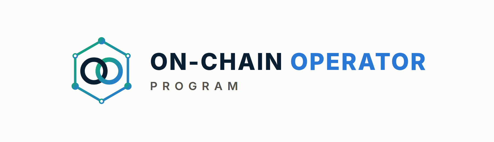

# On-Chain Operator Program — Master File



*Generated 2026-09-24 from `programs/defi-program/`. Don't edit this file directly: edit the source files and run `python3 programs/defi-program/build_master.py`.*

## Contents
1. Build status
2. Offer, decisions & curriculum
3. Whop setup
4. Whop store listing (logo, images, copy)
5. Operations kit (capstones, application, call script, emails, live tier, terms)
6. Worksheets & templates
7. Funnel changes
8. Video scripts (VSLs, welcome, module intros)
9. Course content (all 79 lessons)
10. Skills archive
11. Build prompt (hand this to Grok or Claude Code)

---

# 1. Build status


**Everything in one file:** `ON-CHAIN-OPERATOR-PROGRAM.md`, also as `On-Chain-Operator-Program.docx` (Word) and `On-Chain-Operator-Program.pdf`.
Rebuild: `python3 programs/defi-program/build_master.py`, then `cd programs/defi-program/export && npm install && npm run build`.
**To finish the build with AI:** paste `BUILD-PROMPT.md` into Grok (or Claude Code) and attach the files it lists.

| File | Phase | Status |
|---|---|---|
| `01-offer-and-curriculum.md` | 1–2 Offer + curriculum | Decisions locked; curriculum expanded to 6 stages · 15 modules · 79 lessons |
| `02-sample-lesson-amm-math.md` | Lesson 2.2 | Written |
| `03-defi-strategy-mastery.md` | Lesson 8.3 (strategy library) | Written |
| `04-funnel-changes.md` | 4 Funnel wiring | Draft, not applied to Zapier |
| `05-whop-setup.md` | 3 Whop setup | Decisions locked; waiting on Whop reconnect + product ID |
| `06-whop-store-listing.md` | Store product listing: copy + image upload map | Ready to paste (3 placeholders) |
| `assets/` | 53 images: logo system (8), store icon + banner + 7 gallery (9), 15 module banners, 16 diagrams, 5 charts | Rendered by `export/build_images.js` |
| `Day-1-Setup-Kit.pdf` | Printable beginner setup checklist (generated from Module 0) | Built by `npm run build` |
| `07-program-operations.md` | Capstones & rubrics, certification, application form & scoring, call script, member emails, live tier, community, terms, support, launch plan | Draft (legal review + your decisions) |
| `08-worksheets.md` | 17 worksheet templates used by lessons and capstones | Ready |
| `video/` | 18 videos: main VSL, 30s vertical VSL, welcome, 15 module intros + `SCRIPTS.md` | Rendered by `export/build_video.js` |
| `lessons/module-00-crypto-from-zero.md` | Module 0 (8) + Day-1 Setup Kit | Written |
| `lessons/module-01-foundations-safety.md` | Module 1 (6) | Written |
| `lessons/module-02-trading-on-chain.md` | Module 2 (4 + sample 2.2) | Written |
| `lessons/module-03…module-08` | Modules 3–8 (lesson 8.3 = `03-…`) | Written |
| `lessons/module-09-defi-vs-grid-bots.md` | Module 9 (3) | Written |
| `lessons/module-10-advanced-yield-engineering.md` | Module 10 (6) | Written |
| `lessons/module-11-hedging-risk-engineering.md` | Module 11 (5) | Written |
| `lessons/module-12-own-bank.md` | Module 12 (6) | Written |
| `lessons/module-13-income-engine.md` | Module 13 (5) | Written |
| `lessons/module-14-automation-mastery.md` | Module 14 (4) | Written |


**All 79 lessons are written** (Modules 0–14, plus lesson 8.3 in `03-defi-strategy-mastery.md`).
Phase 3: blocked until Whop is reconnected in Zapier and the product is created in the Whop dashboard (see `05-whop-setup.md`).

---

# 2. Offer, decisions & curriculum


Status: **draft, nothing created on Whop yet.** Items marked **DECIDE** need
your call before phase 3 (Whop setup).

## Decisions so far (2026-09-24)
| Item | Decision |
|---|---|
| Name | **On-Chain Operator Program** |
| Format | **Two tiers:** self-paced course + a higher tier with live sessions |
| Sales path | **Application → call → checkout** |
| Audience | **Everyone at once:** GBB customers, Elite Intel members and cold ad traffic from launch |
| Price | **Course $15,000 one-time** · live tier priced higher (TBD) |
| Refund policy | Open |
| Starter tier / GBB pricing conflict | Open |
| Structure | **15 modules, 79 lessons, 6 stages: zero to operator** (expanded 2026-09-24) |

**What $15,000 changes (recommendations, your call):**
- It becomes the top of the ladder (above Grid Bot Elite at $2,497), so it
  needs a **high-ticket sales path**: cold traffic → application → call →
  checkout, not straight-to-checkout ads. `gbb-new-lead` scoring (capital
  20k+ = 4) becomes the qualifier.
- Buyers at this price expect access to you: the live tier (calls, reviews,
  capstone feedback) carries most of the value. The course alone is hard to
  justify at $15k.
- High-ticket crypto education attracts consumer-protection scrutiny. Keep
  every page and call script free of income/return claims, and put terms,
  refund policy and "educational, not financial advice" at checkout.

Built from: Notion → ATLAS → *DeFi & On-Chain (Complete Module)* (42 chapters,
16 strategy frameworks, 20 on-chain metrics) and the existing Grid Bot Builder
offer stack.

---

## Phase 1 — Offer

### Positioning
Grid Bot Builder automates trading **on exchanges**. The DeFi program teaches
people to operate **on-chain** safely: research a protocol, size a position,
know the exit. Your module already has a strong line to lead with:

> **"If you can't explain the unwind, you don't understand the position yet."**

**Promise (skills, not returns):** *Research any DeFi protocol with a 6-step
risk loop, understand exactly where yield comes from, and never sign a
transaction you can't unwind.*

### Working name — DECIDE
*Superseded: see "Decisions so far" at the top. Kept for the record.*
| Option | Why |
|---|---|
| **DeFi Operator Blueprint** (recommended) | Matches "Grid Bot Building Blueprint" on Whop; "operator" = process, not hype |
| Risk-First DeFi | States the differentiator |
| On-Chain Operator Program | Neutral, broader |

### Who it's for — DECIDE
*Superseded: see "Decisions so far" at the top. Kept for the record.*
| Audience | Fit | How they arrive |
|---|---|---|
| **GBB customers** (recommended primary) | Already trust you, already think in systems/risk | Cross-sell email ~14 days after GBB onboarding |
| Elite Intel Community members | Warm, recurring, already reading intel briefs | In-community offer + LAUNCH-style code |
| Cold ad traffic | Largest pool, needs most education | Separate ad campaign → lead skill with `defi-lead` tag |

Recommendation: launch to GBB customers + Elite Intel members first (warm,
lower CAC, real feedback), open to cold traffic once conversion is proven.

### Format — DECIDE
*Superseded: see "Decisions so far" at the top. Kept for the record.*
- **Core (recommended):** self-paced Whop course (15 modules below) + worksheets
  (the two Notion trackers as templates) + quizzes + capstone.
- **Optional higher tier:** Core + live monthly DeFi Q&A / portfolio review.
  Your Calendly already has `vip-defi-consult` and `defi` links — are those
  for this program? (The GBB skills are told never to use them, so they're
  free for DeFi.)

### Pricing — DECIDE (proposal only)
*Superseded: see "Decisions so far" at the top. Kept for the record.*
Mirror GBB's one-time + 3-pay pattern, priced **below** GBB so it works as
a cross-sell rather than competing with it:

| Plan | Proposal | Reasoning |
|---|---|---|
| One-time | $497 | Half of GBB; education product, not software |
| 3-pay | 3 × $197 ($591) | ~19% payment-plan premium, in line with GBB's 20% (3 × $399 vs $997) |
| GBB customer price | $397 or bundle | Rewards the cross-sell |
| Higher tier (if live calls) | $997 | Only if you'll run the calls |

Refund policy — DECIDE: GBB has 30-day money-back on the software. For a
course, suggest **14 days, if under 30% of lessons completed**.

> Still open from before: `gbb ad performance` mentions a "Grid Bot Starter"
> (A$47–97) and GBB at A$497. Other skills say $997, no Starter. Which is
> current? It affects where DeFi sits in the ladder.

### Ladder after launch


---

## Phase 2 — Curriculum: zero to mastery


**Expanded 2026-09-24:** the program now takes someone who knows nothing all
the way to operating as their own bank. That's **15 modules and 79 lessons in
6 stages**. Modules 1–9 keep their numbers. Module 0 and Modules 10–14 are new.
All 42 ATLAS chapters are still used exactly once; the new modules are
original content.

Every lesson follows one template: **Objective → Explanation → Worked example
→ Checklist → 3 quiz questions**, with at least one diagram or chart. A full
sample lesson is in `02-sample-lesson-amm-math.md`.

| Stage | Modules | You can… |
|---|---|---|
| **0 · Zero** | 0 | Open and secure an account, buy, set up and back up a wallet, make a first transfer and a first practice DeFi transaction |
| **1 · Foundations** | 1–2 | Protect a wallet, read a transaction, swap and LP deliberately |
| **2 · Practitioner** | 3–5 | Borrow, earn yield and map infrastructure risk |
| **3 · Analyst** | 6–7 | Research any protocol and read on-chain data |
| **4 · Strategist** | 8–11 | Run the 25-strategy library, engineer fixed and hedged yield, stress-test a portfolio |
| **5 · Operator** | 12–14 | Run your own on-chain bank: balance sheet, credit line, income engine, automation |

---

## Stage 0 · Zero

### Module 0 — Crypto From Zero *(8 lessons, new)*
Outcome: go from never having owned crypto to a secured exchange account, a backed-up wallet, a first transfer and a first practice DeFi transaction. Ends with the **Day-1 Setup Kit** checklist.


| # | Lesson | Source |
|---|---|---|
| 0.1 | Money, ledgers and why blockchains exist | new |
| 0.2 | Opening and securing an exchange account (KYC, 2FA, allowlists) | new |
| 0.3 | Buying your first crypto without overpaying | new |
| 0.4 | Exchange account vs your own wallet: who holds the keys? | new |
| 0.5 | Setting up your wallet and backing it up (restore test) | new |
| 0.6 | Networks, gas and your first transfer | new |
| 0.7 | Your first DeFi steps (testnet practice first) | new |
| 0.8 | Your security baseline, and the language of DeFi | new |

---

## Stage 1 · Foundations

### Module 1 — Foundations & Safety *(6 lessons)*
Outcome: set up and use a wallet safely; know what can go irreversibly wrong.
| # | Lesson | ATLAS ch. |
|---|---|---|
| 1.1 | What DeFi is — and the risk-first mindset | 1 |
| 1.2 | How a transaction actually happens (gas, nonce, finality) | 2 |
| 1.3 | Wallets, keys, hardware & multisig | 3 |
| 1.4 | Tokens, approvals & allowances | 4 |
| 1.5 | Stablecoins and how they break | 5 |
| 1.6 | Scam defence: phishing, drainers, address poisoning | 36 |

Assets: before-signing checklist (ch. 42) introduced here and reused in every module.

### Module 2 — Trading On-Chain *(5 lessons)*
Outcome: execute a swap deliberately, understanding price impact and MEV.

| # | Lesson | ATLAS ch. |
|---|---|---|
| 2.1 | DEXs, aggregators & routing | 6 |
| 2.2 | AMM mathematics (x·y=k) — *sample lesson* | 7 |
| 2.3 | Providing liquidity | 8 |
| 2.4 | Impermanent loss & true LP P&L | 9 |
| 2.5 | MEV and how to protect your trades | 35 |

Assets: AMM flow diagram, 100 ETH / 300k USDC worked example, LP-vs-hold benchmark.

---

## Stage 2 · Practitioner

### Module 3 — Lending & Leverage *(4 lessons)*
Outcome: borrow against collateral with a buffer and a written defence plan.

| # | Lesson | ATLAS ch. |
|---|---|---|
| 3.1 | How lending markets work (utilisation, rate curves) | 10 |
| 3.2 | LTV, liquidation threshold & health factor | 11 |
| 3.3 | Liquidations and cascades | 12 |
| 3.4 | Borrowing strategies & looping | 13 |

Assets: liquidation feedback-loop diagram, Aave health-factor primary source.

### Module 4 — Yield *(6 lessons)*
Outcome: split any APY into organic vs subsidised, and name the risk being paid for.

| # | Lesson | ATLAS ch. |
|---|---|---|
| 4.1 | Yield farming: base yield vs emissions | 14 |
| 4.2 | Native staking | 15 |
| 4.3 | Liquid staking (LSTs) | 16 |
| 4.4 | Restaking & shared security | 17 |
| 4.5 | Vaults & yield optimisers | 18 |
| 4.6 | Airdrops & points — opportunity cost | 37 |

### Module 5 — Infrastructure Risk *(5 lessons)*
Outcome: map every bridge, oracle, L2 and contract a position depends on.

| # | Lesson | ATLAS ch. |
|---|---|---|
| 5.1 | Bridges and trust assumptions | 19 |
| 5.2 | Layer 2s, sequencers & withdrawal paths | 20 |
| 5.3 | Oracles, TWAPs & manipulation | 21 |
| 5.4 | Smart contracts: state, proxies, admin keys | 22 |
| 5.5 | Smart-contract risk & what audits don't prove | 23 |

---

## Stage 3 · Analyst

### Module 6 — Protocol Research *(4 lessons)*
Outcome: complete a full due-diligence file on a real protocol.

| # | Lesson | ATLAS ch. |
|---|---|---|
| 6.1 | Protocol due diligence | 24 |
| 6.2 | Tokenomics: supply, unlocks, FDV, value capture | 25 |
| 6.3 | Governance & DAOs | 26 |
| 6.4 | The on-chain research workflow | 41 |

Assets: **DeFi Protocol Due Diligence Tracker** (Notion) + `defi-due-diligence` 6-step loop.


### Module 7 — On-Chain Analytics *(8 lessons)*
Outcome: read on-chain data without over-interpreting it.

| # | Lesson | ATLAS ch. |
|---|---|---|
| 7.1 | On-chain data foundations (address ≠ person) | 27 |
| 7.2 | Block explorer mastery | 28 |
| 7.3 | Exchange flows | 29 |
| 7.4 | Whale & entity analysis | 30 |
| 7.5 | Holder & supply metrics (MVRV, SOPR, HODL waves) | 31 |
| 7.6 | Network activity | 32 |
| 7.7 | DEX & liquidity analytics | 33 |
| 7.8 | Derivatives on-chain (perps, funding, OI) | 34 |

Assets: 20-metric directory as a downloadable reference card.

---

## Stage 4 · Strategist

### Module 8 — The DeFi Operating System *(4 lessons)*
Outcome: a written portfolio plan with risk buckets, limits and an emergency plan.

| # | Lesson | ATLAS ch. |
|---|---|---|
| 8.1 | DeFi portfolio construction | 38 |
| 8.2 | The DeFi risk framework | 39 |
| 8.3 | Strategy library (25 strategies in 6 levels, Core → Professional), full content in `03-defi-strategy-mastery.md` | 40 |
| 8.4 | The operating playbook: deploy, monitor, respond, review | 42 |

### Module 9 — DeFi vs Grid Bots *(3 lessons, new content)*
Outcome: choose the right tool for the market — and the natural bridge into GBB.

| # | Lesson | ATLAS ch. |
|---|---|---|
| 9.1 | LP position vs grid bot: same idea (sell high/buy low inside a range), different risks | new |
| 9.2 | When a CEX grid beats on-chain LP, and when it doesn't (fees, custody, IL vs inventory risk, regime) | new |
| 9.3 | Building a combined system: grid bots for range markets, DeFi for yield/collateral | new |

Cross-sell: GBB checkout link for non-customers; Elite Intel invite for everyone.

### Module 10 — Advanced Yield Engineering *(6 lessons, new)*
Outcome: build fixed, hedged and structured yield, and know exactly what each one is short.

| # | Lesson | Source |
|---|---|---|
| 10.1 | Fixed-rate yield: principal and yield tokens (PT/YT) | new |
| 10.2 | Cash-and-carry basis trades | new |
| 10.3 | Delta-neutral funding carry, done properly | new |
| 10.4 | Options income: covered calls, cash-secured puts, options vaults | new |
| 10.5 | Active concentrated-liquidity management | new |
| 10.6 | Restaking and points: pricing speculative yield | new |

### Module 11 — Hedging & Risk Engineering *(5 lessons, new)*
Outcome: hedge the risks you don't want, stress-test the portfolio, and have an incident plan ready.

| # | Lesson | Source |
|---|---|---|
| 11.1 | Hedging price exposure with perps and options | new |
| 11.2 | Depeg, protocol and smart-contract cover | new |
| 11.3 | Liquidation protection: buffers, alerts and automated deleveraging | new |
| 11.4 | Stress-testing a portfolio: −50% days, depegs, rate spikes | new |
| 11.5 | Incident response: what to do in the first 60 minutes | new |

---

## Stage 5 · Operator — operate as your own bank


### Module 12 — Operate as Your Own Bank *(6 lessons, new)*
Outcome: run your crypto like a bank runs its book: a balance sheet, custody policy, a credit line, a liquidity ladder and records.

| # | Lesson | Source |
|---|---|---|
| 12.1 | Your balance sheet: assets, liabilities, equity | new |
| 12.2 | Custody architecture: vault, multisig and spending policies | new |
| 12.3 | The credit line: borrowing against your assets like a bank client | new |
| 12.4 | Treasury and the liquidity ladder | new |
| 12.5 | Being the lender: supplying, curating and pricing credit risk | new |
| 12.6 | Books, records and succession: if you're gone, can your family recover it? | new |

### Module 13 — The Income Engine *(5 lessons, new)*
Outcome: design an income portfolio, measure expected income after expected losses, and set a payout you can sustain.

| # | Lesson | Source |
|---|---|---|
| 13.1 | Income sources ranked by durability | new |
| 13.2 | Risk-adjusted yield: subtracting expected losses | new |
| 13.3 | Building the income portfolio | new |
| 13.4 | The payout policy: how much you can take out | new |
| 13.5 | Scaling, compounding and the annual review | new |

### Module 14 — Automation & Mastery *(4 lessons, new)*
Outcome: monitor and automate safely, run multisig operations, and complete the operator capstone.

| # | Lesson | Source |
|---|---|---|
| 14.1 | Monitoring: dashboards, alerts and on-chain watchers | new |
| 14.2 | Automation: keepers, bots and agents without handing over the keys | new |
| 14.3 | Operating procedures: multisig signing, change control, reviews | new |
| 14.4 | Operator capstone and certification | new |

---

### Capstones
- **Analyst capstone (after Module 7):** a complete due-diligence file on one real protocol.
- **Operator capstone (Module 14):** a full personal "bank": balance sheet, custody
  policy, credit-line policy, income portfolio with risk-adjusted expected income,
  payout policy, stress test and incident plan. Reviewed on the Live tier.

### Totals
15 modules · 79 lessons (42 ATLAS + 37 new) · 239 quiz questions · 25 strategy playbooks · 2 capstones · strategy calculator with 15 commands.

---

## Still open
1. Live-tier price
2. Refund policy
3. Grid Bot Builder customer pricing (if any)
4. Does the "Grid Bot Starter" tier exist?

---

# 3. Whop setup

## Decisions locked (2026-09-24)
| Item | Decision |
|---|---|
| Name | On-Chain Operator Program |
| Tier 1 — Course (self-paced, 15 modules, 79 lessons, worksheets, 2 capstones) | **$15,000 one-time** (no payment plan) |
| Tier 2 — Live (course + live sessions) | **Priced above $15,000 — number TBD** |
| Audience | Everyone at launch (GBB customers, Elite Intel members, cold ads) |
| Sales path | **Application → call → checkout** (no straight-to-checkout ads) |
| Call link | `vip-defi-consult` Calendly (verify the exact URL is live) |

Still open: Tier 2 price · refund policy · GBB-customer price (if any) ·
the Starter tier / GBB price conflict.

## Blockers found
1. **Whop is not connected in Zapier** (0 connected accounts on WhopCLIAPI).
   Reconnect it in Zapier before any Whop step below. The existing `gbb-*`
   skills also need it to run.
2. **Zapier can't create Whop products.** It can create *plans*, checkout
   sessions, leads, promo codes and invoices. The product itself must be
   created in the Whop dashboard.

## Step 1 — You, in the Whop dashboard
1. Create a product named **On-Chain Operator Program**. Keep it **hidden /
   unlisted** until launch. Upload the icon, banner and gallery images and
   paste the copy from `06-whop-store-listing.md`.
2. Add a course experience and create the 9 module sections (titles in
   `01-offer-and-curriculum.md`).
3. Add terms of sale: refund policy (once decided) and "Educational content
   only. Not financial advice. No results are guaranteed."
4. Send me the product ID (starts with `prod_`).

## Step 2 — Me, via Zapier (after you confirm)
| Action | Zapier tool | Values |
|---|---|---|
| Course plan | `whop_create_plan` | product = your `prod_` ID, one-time, $15,000, hidden until launch |
| Live-tier plan | `whop_create_plan` | once the price is set |
| Checkout links per campaign | `whop_create_checkout_session` | metadata `utm_campaign`, `utm_adset`, `utm_creative` so ad reports attribute sales |
| Applications | `whop_create_lead` | one lead per application, product-specific |

Nothing gets created until you've seen the exact values and said yes.

## Step 3 — Upload content
All 79 lessons are written and ready to paste in (`lessons/`, `02-…`,
`03-…`), with module banners, diagrams, the Day-1 Setup Kit PDF, the welcome
video and 15 module intro videos (`video/`). Course layout and drip plan:
`07-program-operations.md` section 1.

## Step 4 — High-ticket sales path


Suggested qualification (adjust as you like): lead score ≥ 6 (capital 20k+ /
major exchange / some experience) **and** completed application.

---

# 4. Whop store listing


Everything needed to add the program to your Whop store as a new product:
logo, images, copy and upload order. **Nothing is published.** You create the
product in the Whop dashboard (Zapier can't create products), paste this in,
and keep it hidden until launch.

> Check Whop's current image size limits in the dashboard when you upload.
> These files are produced at standard sizes (1024×1024 square, 1920×1080
> 16:9) and can be re-exported at any size with `npm run images`.

---

## 1. The logo


The mark is **two interlocked chain rings inside a hexagonal block**, with
nodes on its corners: a chain (on-chain), a block, and a network. The rings
link, like the two halves of the program: DeFi strategy and running your own bank.

| File | Use |
|---|---|
| `assets/brand/logo-icon-1024.png` | **Whop product icon**, social avatars (stacked lockup on navy) |
| `assets/brand/logo-mark-dark-1024.png` | App icon / square badge without text |
| `assets/brand/logo-mark-transparent-dark-1024.png` | Mark over dark backgrounds (transparent PNG) |
| `assets/brand/logo-mark-transparent-light-1024.png` | Mark over light backgrounds (transparent PNG) |
| `assets/brand/logo-horizontal-dark.png` | Headers, email banners on dark |
| `assets/brand/logo-horizontal-light.png` | Documents, invoices, light pages |
| `assets/brand/favicon-256.png` | Favicon / tiny sizes (no corner nodes) |
| `assets/brand/brand-guide.png` | Colours, type and usage rules |

Rules: keep clear space of one ring's width around the mark; never recolour
the rings, stretch the mark or put the light version on a dark background.

---

## 2. Images: upload map

| Whop slot | File | Size |
|---|---|---|
| Product icon / logo | `assets/store/icon-1024.png` (same as `brand/logo-icon-1024.png`) | 1024×1024 |
| Cover / hero banner | `assets/store/banner-1920x1080.png` | 1920×1080 |
| Gallery 1 | `assets/store/gallery-01-path-to-mastery.png` | 1920×1080 |
| Gallery 2 | `assets/store/gallery-02-curriculum.png` | 1920×1080 |
| Gallery 3 | `assets/store/gallery-03-own-bank.png` | 1920×1080 |
| Gallery 4 | `assets/store/gallery-04-strategy-levels.png` | 1920×1080 |
| Gallery 5 | `assets/store/gallery-05-research-loop.png` | 1920×1080 |
| Gallery 6 | `assets/store/gallery-06-grid-vs-lp.png` | 1920×1080 |
| Gallery 7 | `assets/store/gallery-07-whats-included.png` | 1920×1080 |
| **Listing video (VSL)** | `video/vsl-main.mp4` (≈90s, 1920×1080, captioned) | 16:9 |
| Ads / Reels / Shorts | `video/vsl-short-vertical.mp4` (≈25s, 1080×1920) | 9:16 |
| Course module headers | `assets/modules/module-00.png` … `module-14.png` | 1600×500 @2x |
| In-lesson diagrams & charts | `assets/diagrams/*.png`, `assets/charts/*.png` | 1800 wide @2x |


---

## 3. Listing copy

**Product name:** On-Chain Operator Program

**Tagline (short):** From zero to your own on-chain bank.

**Short description (≈150 characters):**
DeFi from first principles to professional strategies. Build a risk-adjusted
income engine and run your capital like a bank. 15 modules · 79 lessons.

**Headline:** From zero to your own on-chain bank.

**Full description:**

> Most people enter DeFi through a number: an APY. Operators start with a
> different question: *what am I being paid to risk, and how do I get out?*
>
> The On-Chain Operator Program takes you from never having owned crypto to
> running your capital the way a bank runs its book: a balance sheet, a custody
> policy, a credit line, a liquidity ladder, and an income engine with a
> payout you can sustain.
>
> Six stages, 15 modules and 79 lessons: wallets and safety, trading and
> liquidity, lending and yield, protocol research and on-chain analytics, 25
> strategy playbooks up to fixed-rate, basis, options and hedged yield, and
> finally operating your own on-chain bank. Every strategy is taught with its
> maths, its kill rules and exactly how it loses money.

**What you'll learn**
- Stage 0: from knowing nothing to set up. Secure accounts, open an exchange, buy your first crypto without overpaying, set up and back up a wallet, make your first transfer on the right network, and practise DeFi on a free test network (with the Day-1 Setup Kit)
- Stage 1: protect a wallet, read any transaction, swap and provide liquidity deliberately
- Stage 2–3: lending, health factors and liquidations; yield, staking and restaking; a 6-step research loop for any protocol; on-chain analytics
- Stage 4: 25 strategy playbooks in 6 levels, including fixed-rate yield (PT/YT), cash-and-carry basis, delta-neutral funding carry, covered calls and cash-secured puts, hedging and stress testing
- Stage 5: operate as your own bank. Balance sheet, multisig custody, a credit line against your assets, a liquidity ladder, lending-desk decisions, books and succession, and an income engine that pays out less than it expects to earn

**What's included**

| | Course | Live |
|---|---|---|
| 15 modules, 79 lessons, zero to operator | ✓ | ✓ |
| 25 strategy playbooks with maths and kill rules | ✓ | ✓ |
| Printable Day-1 Setup Kit for complete beginners | ✓ | ✓ |
| Welcome video + 15 module intro videos | ✓ | ✓ |
| Checklists and quizzes in every lesson | ✓ | ✓ |
| Due-diligence, pre-launch and bank-policy worksheets | ✓ | ✓ |
| Strategy, income and balance-sheet calculators | ✓ | ✓ |
| Analyst and operator capstones | ✓ | ✓ |
| Live group sessions | | ✓ |
| Capstone and portfolio reviews | | ✓ |
| Own-bank policy and income-engine reviews | | ✓ |
| **Price** | **$15,000 one-time** | **`<LIVE_PRICE>`** |

**Who it's for**
- Complete beginners who want to learn DeFi properly, from zero, with a process
- Traders and Grid Bot Builder customers ready to operate on-chain
- Holders of meaningful crypto who want income and liquidity from it without taking risks they don't understand

**Who it's not for**
- Anyone looking for guaranteed returns or signals to copy
- Anyone unwilling to self-custody or follow a written policy

**How to join:** Apply → short call → enrolment link. (Application link:
`<DEFI_APPLICATION_URL>`)

**FAQ**
- *I've never owned crypto. Is this for me?* Yes. Module 0 assumes zero knowledge and walks you through every setup step in order: securing your email, opening and locking down an exchange account, your first purchase, setting up and backing up a wallet, your first transfer, and a first practice DeFi transaction on a free test network. It ends with a printable Day-1 Setup Kit checklist.
- *Do you manage my funds or need my keys?* Never. You keep custody. We will never ask for a seed phrase, private key or API key.
- *Will I make money / earn an income?* The program teaches you to build and run an income portfolio and to measure it honestly: expected income after expected losses, with a payout below that. It doesn't promise or project returns, and every strategy is taught alongside how it loses money.
- *What does "operate as your own bank" mean?* Running your crypto with the disciplines a bank uses: a balance sheet, custody controls, a credit policy, liquidity management and records. It's a method, not a licence or a financial service.
- *How does this relate to Grid Bot Builder?* Module 9 shows how on-chain liquidity and exchange grid bots do similar jobs, and how to run both in one portfolio.
- *Refunds?* `<REFUND_POLICY>`

**Footer disclaimer (put on the listing and at checkout):**
Educational content only. Not financial, tax or legal advice. Digital assets
are volatile and you can lose some or all of your capital. No results or
income are guaranteed.

---

## 4. Store setup checklist
- [ ] Product created in the Whop dashboard as **hidden**, named "On-Chain Operator Program"
- [ ] Logo icon, banner and 7 gallery images uploaded in the order above
- [ ] Copy pasted; `<LIVE_PRICE>`, `<REFUND_POLICY>`, `<DEFI_APPLICATION_URL>` filled
- [ ] Course experience added with 15 modules; module headers uploaded; lessons pasted with their diagrams
- [ ] Plans created via Zapier (course $15,000 one-time; live tier once priced), approved first
- [ ] Checkout tested end to end on a hidden plan
- [ ] Listing reviewed for any income or return claims before going public

---

# 5. Operations kit

Everything around the lessons needed to sell, deliver and run the program.
Items marked **YOU DECIDE** need your call. Legal wording is a starting draft:
**have a lawyer review terms and disclaimers before launch.**

Contents: 1. Whop course layout · 2. Capstones & rubrics · 3. Certification ·
4. Application form & scoring · 5. Sales call script · 6. Member email sequence ·
7. Live tier design · 8. Community rules · 9. Terms, disclaimers & refunds ·
10. Support & FAQ · 11. Launch plan

---

## 1. Whop course layout

| Whop section | Contents | Video |
|---|---|---|
| Start here | Welcome, how the program works, Day-1 Setup Kit (PDF) | `video/welcome.mp4` |
| Module 0–14 | One chapter per module; one lesson per page, with images; module practical at the end | `video/module-NN-intro.mp4` at the top of each module |
| Tools | Strategy calculator (`defi_calc.py`) instructions, worksheet templates (`08-worksheets.md`) | n/a |
| Capstones | Briefs, rubrics, submission form | n/a |
| Live (Live tier only) | Session calendar, recordings, review booking | n/a |

**Drip (recommended):** release a stage at a time as the previous stage's quiz is
passed, not by date. Beginners shouldn't reach leverage before safety.

---

## 2. Capstones & rubrics

### Analyst capstone (after Module 7)
**Brief:** a due-diligence file on one real protocol: the 6-step loop
(Module 6), tokenomics and governance, and an on-chain section (Module 7), ending
in a verdict with size, conditions and exit.

| Criterion | Weight | Pass standard |
|---|---|---|
| Mechanism and cash flow correctly explained | 20% | Fees vs emissions separated with sources |
| Dependency map complete | 20% | Oracles, bridges, admin/timelock, stablecoins, other protocols |
| Evidence quality | 20% | Primary sources + at least two independent data views |
| On-chain analysis without over-interpretation | 15% | Caveats stated for every metric |
| Verdict: size, conditions, exit | 25% | Actionable, with kill rules and an unwind path |

Pass: ≥ 70%. Resubmission allowed.

### Operator capstone (Module 14.4)
**Brief:** the ten-section personal bank (see 14.4). No keys, seeds or account access anywhere.

| Criterion | Weight | Pass standard |
|---|---|---|
| Balance sheet & policies internally consistent | 20% | LTV, HF and runway match the credit and ladder policies |
| Custody & security | 15% | Multisig or equivalent, limits, a tested recovery, succession |
| Income engine honesty | 20% | Loss assumptions stated; payout ≤ 80% of expected income |
| Stress test & fixes | 20% | Five scenarios, each failure fixed |
| Operations | 15% | Alerts mapped to actions; automation scoped; signing procedure |
| Clarity | 10% | A stranger could run it from the document |

Pass: ≥ 70%. Distinction: ≥ 90% plus one quarter of books kept to standard.

---

## 3. Certification
- **On-Chain Analyst:** analyst capstone passed
- **On-Chain Operator:** operator capstone passed
- **On-Chain Operator, with distinction:** as above
Certificates state that they reflect course completion only, not a licence or a professional qualification.

---

## 4. Application form & scoring

**Form (Typeform or Whop form):**
1. Name, email, country
2. Experience: never owned crypto / some / active trader / advanced
3. Capital you plan to operate: < $10k / $10–50k / $50–250k / $250k+
4. Goal: learn safely from zero / earn income / borrow against assets / run a structured portfolio / other
5. Do you already use Grid Bot Builder? (yes/no)
6. Why now? (short text)
7. Acknowledgement (required): *"I understand this is education, not financial advice, and that no returns are promised."*

**Scoring** (plugs into `gbb-new-lead` as `interest = defi`):
| Answer | Points |
|---|---|
| Capital $250k+ / $50–250k / $10–50k / < $10k | 4 / 3 / 1 / 0 |
| Clear goal (not "get rich quick") | 2 |
| GBB customer | 1 |
| Thoughtful "why now" | 1 |

≥ 6 → invite to call · 3–5 → call optional + nurture · < 3 → nurture + Elite Intel Community trial.
**Disqualify** anyone seeking guaranteed returns or asking the program to manage funds.

---

## 5. Sales call script (30 min)

1. **Open (2 min):** "This call is to see if the program fits you. If it doesn't, I'll tell you."
2. **Where are you now? (8 min):** experience, current setup, what's gone wrong before, goal.
3. **Where do you want to be? (5 min):** in a year, what does "working" look like? (Steer from return targets to capabilities: a safe setup, research ability, income policy, credit line.)
4. **The gap (5 min):** reflect back what's missing: process, safety, policy.
5. **The program (5 min):** stages, what they'll build, Course vs Live, capstones. Show the path image.
6. **Fit and objections (4 min):** see below.
7. **Close (1 min):** "Would you like the enrolment link?" If yes, send a per-buyer checkout link (with UTM metadata).

**Objection answers (never make return promises):**
- *"Will I make my money back?"* "I can't promise returns and nobody honestly can. What you'll leave with is a process to research, size and exit positions, and an income policy that doesn't depend on luck."
- *"It's expensive."* "It is. If the cost would strain you, don't do it now; start with the free Day-1 Setup Kit and Elite Intel."
- *"I've lost money in crypto before."* "Most losses come from setup mistakes, leverage and yields nobody explained. Those are the first things we fix."

**Never:** promise returns, pressure with fake deadlines, or ask for keys or account access.

---

## 6. Member email sequence (after purchase)

| Day | Subject | Body (plain text, < 120 words) |
|---|---|---|
| 0 | Welcome, operator | Access link · watch the welcome video · start Module 0 · print the Day-1 Setup Kit · "we'll never ask for your seed phrase" |
| 2 | Your Day-1 Setup Kit | "Tick Part A today. Secure your email before anything else." |
| 7 | Did your restore test pass? | Nudge for Lesson 0.5; link to support |
| 14 | Stage 1 unlocked | What Modules 1–2 build; Live tier: first session date |
| 30 | Your first month | Progress check; invite to book a check-in (Live) |
| 60 | Halfway to analyst | Analyst capstone brief |
| 90 | From analyst to operator | Stage 4–5 preview; operator capstone brief |

---

## 7. Live tier design (**YOU DECIDE: price, cadence**)

| Component | Proposed | Notes |
|---|---|---|
| Group sessions | 2 × 60 min per month | One teaching deep-dive, one Q&A |
| Capstone reviews | Written review + 20-min call, each capstone | Uses the rubrics above |
| Portfolio/policy review | 1 per quarter, 30 min | Reviews policies, never gives personalised investment advice |
| Protocol research clinic | Monthly, recorded | Walks through a due-diligence file live |
| Recordings | All sessions | Stored in the Live section |

Boundaries: education and process review only; no personalised financial
advice, no trade calls, no fund management.

---

## 8. Community rules
1. Education, not signals. No "buy X now" posts.
2. Never ask for or share seed phrases, keys or account access. Anyone who asks is removed.
3. No DMs offering "help", "recovery" or investments. Report them.
4. No referral links or shilling.
5. Show your working: numbers from the calculators, sources linked.
6. Be kind to beginners. Everyone started at Module 0.

---

## 9. Terms, disclaimers & refunds (draft; lawyer review required)

**Disclaimer (listing, checkout, every module):**
*The On-Chain Operator Program is educational content only. It is not
financial, investment, tax or legal advice, and nothing in it is a
recommendation to buy, sell or hold any asset. Digital assets are volatile and
you can lose some or all of your capital. No results or income are promised or
guaranteed. Examples are illustrative. "Operate as your own bank" describes a
personal method, not a licence or financial service. We will never ask for your
seed phrase, private keys or account access.*

**Refund policy (YOU DECIDE):** options:
- (a) 14 days, if under 30% of lessons completed
- (b) 7 days, no questions asked
- (c) no refunds after access (state clearly at checkout)

**Other terms to include:** access duration (lifetime / 12 months), no sharing
of accounts, content copyright, conduct rules (section 8), Live-tier boundaries (section 7).

---

## 10. Support & FAQ
- Support channel: email (response within 2 business days) + community.
- **Top questions:** "I sent crypto on the wrong network" (check whether the address
  exists on that network; contact the receiving service; prevention in 0.6) ·
  "I lost my seed phrase" (if the wallet is still accessible, move funds to a new
  wallet with a new seed now) · "A support person DM'd me" (it's a scam; block) ·
  "Is X protocol safe?" (run the 6-step loop; staff don't give recommendations).

---

## 11. Launch plan
1. Reconnect Whop in Zapier; create the hidden product; upload logo, banner and gallery images; paste the listing.
2. Upload the course: 15 modules, lesson pages with images, intro videos, Day-1 Setup Kit.
3. Create plans via Zapier (course $15,000 one-time; live tier once priced), approved first.
4. Publish the application form; connect scoring to `gbb-new-lead`.
5. Test end to end: application → call → per-buyer checkout → onboarding email → access.
6. Soft launch to the warm list (GBB customers, Elite Intel) and cold ads at the same time (per decision), with the VSLs.
7. Weekly: `gbb-ad-performance` and `gbb-pipeline-check` including DeFi.

---

# 6. Worksheets & templates

Copy these into Notion, a spreadsheet or a document. Numbers come from
`defi_calc.py`. **Never write seed phrases, private keys or passwords in any
worksheet.**

---

## W1 · Records sheet (from Lesson 0.3, keep forever)
| Date | Action (buy/sell/transfer/swap/fee/income) | Asset | Amount | Price (USD) | Fee | Network | Tx link | Notes |
|---|---|---|---|---|---|---|---|---|

## W2 · Position journal (Lesson 8.4)
| Position | Protocol / chain | Contracts | Amount | Entry date/price | Profit engine | Thesis | Kill rules | Approvals | Weekly result |
|---|---|---|---|---|---|---|---|---|---|

## W3 · Due-diligence file (Module 6; mirrors the Notion tracker)
- Protocol · chain · TVL (source/date) · risk rating · verdict
- 1 Mechanism · 2 Cash flow (organic vs subsidised) · 3 Dependencies · 4 Solvency · 5 Evidence (links) · 6 Exit
- Tokenomics: market cap, FDV, 12-month unlocks, value capture
- Governance: voting concentration, timelock
- On-chain: holders, flows, activity, depth, derivatives
- Monitoring triggers

## W4 · Risk register (Lesson 8.2)
| Position | Risk surface | Description | Likelihood 1–5 | Impact 1–5 | Score | Response |
|---|---|---|---|---|---|---|

## W5 · Portfolio plan (Lesson 8.1)
| Bucket | Target % | Current % | Holdings | Caps (protocol / chain / issuer / bridge) |
|---|---|---|---|---|
Rebalance rule: ________

## W6 · Balance sheet (Lesson 12.1)
| Assets | Value | Liabilities | Value |
|---|---|---|---|
| Collateral | | Loans | |
| Yield positions | | Margin | |
| Reserve (T0+T1) | | | |
| **Total assets** | | **Total liabilities** | |
Equity = ____ · LTV = ____ · HF = ____ · Runway (months) = ____

## W7 · Custody policy (Lesson 12.2)
- Vault: type (multisig m-of-n) · key locations (general, not exact) · allowlisted destinations · timelock
- Operating: wallet type · daily limit · protocols allowed
- Hot: float size · refill schedule
- Recovery test log: date · path tested · result

## W8 · Credit policy (Lesson 12.3)
Max LTV __% · HF floor __ · alert levels __ / __ · actions at each level · fixed or variable (why) · repayment source · collateral allowed

## W9 · Liquidity ladder (Lesson 12.4)
| Tier | Access | Holds | Target (months of obligations) | Current | Refill rule |
|---|---|---|---|---|---|
| T0 | Seconds | | | | |
| T1 | Hours | | | | |
| T2 | Scheduled | | | | |
| T3 | Days–weeks | | | | |

## W10 · Lending policy (Lesson 12.5)
| Market/vault | Collateral | Oracle | Liquidation LTV | Curator | Loss prob. (assumed) | LGD | Cap |
|---|---|---|---|---|---|---|---|

## W11 · Income portfolio & payout policy (Module 13)
`defi_calc.py income --pos "name:amount:yield:loss_prob:lgd" ... --payout 0.7`
Blended risk-adjusted yield __% · expected income __/yr · payout ratio __% · monthly payout __ · review rule ________

## W12 · Stress test (Lesson 11.4)
| Scenario | Loss | Liquidations? | Liquidity OK? | Payout OK? | Fix |
|---|---|---|---|---|---|
| Crypto −50% | | | | | |
| Stablecoin −10% | | | | | |
| Borrow rate 20% | | | | | |
| Largest protocol hacked | | | | | |
| Main L2 halted 48h | | | | | |

## W13 · Incident playbook (Lesson 11.5)
Official channels per protocol (bookmarked) · containment steps per incident type · fresh-wallet procedure · who to contact · journal template

## W14 · Alert sheet (Lesson 14.1)
| Alert | Threshold | Tool | Action |
|---|---|---|---|

## W15 · Automation permissions (Lesson 14.2)
| Bot/automation | Permission | Contract | Cap | Expiry | Revoke method |
|---|---|---|---|---|---|

## W16 · Annual review (Lesson 13.5)
Equity start/end · LTV · runway · income expected vs realised by source · losses & near-misses · payout paid vs policy · updated loss assumptions · custody & succession drill done?

## W17 · Letter of instruction (Lesson 12.6), stored apart from any key
What exists (wallet types, multisig setup) · where documents are · who the co-signer/professional is · how the executor should proceed · **no seeds, no keys, no passwords**

---

# 7. Funnel changes (draft, not applied)

Proposed changes to the four live Zapier skills so they handle the DeFi
program alongside Grid Bot Builder. **Nothing has been changed in Zapier.**
Once you approve, the edits go into Zapier (`update_zapier_skill`) and are
mirrored into `.claude/skills/gbb-*`.

Product name: **On-Chain Operator Program**, course $15,000 one-time, sold through application → call → checkout (see `05-whop-setup.md`). This changes the emails below: hot/warm DeFi leads get the **application + call** link, not a direct checkout link. Placeholders still open: `<DEFI_LIVE_PRICE>`, `<DEFI_GBB_PRICE>`,
`<DEFI_CHECKOUT_URL>`, `<DEFI_PLAN_IDS>`, `<DEFI_ACCESS_URL>` (the program's Whop hub link), `<DEFI_APPLICATION_URL>` (Typeform application), `<DEFI_CALL_LINK>` (your `vip-defi-consult` Calendly link; verify the URL).

---

## 1. gbb new lead → handles DeFi interest

**Add fixed values**
- DeFi product: `On-Chain Operator Program`, `$15,000` one-time; checkout `<DEFI_CHECKOUT_URL>`.
- Mailchimp tags: `defi-lead`, `defi-nurture`.
- HubSpot deal name: `DEFI - <First Last>`.

**Add an interest field** to the form / intake: `interest = grid | defi | both`.

**Routing change (after scoring, step 3):**
| interest | Deal(s) created | Tags | Email |
|---|---|---|---|
| grid | `GBB - …` (unchanged) | `gbb-lead` (+ hot/nurture) | unchanged |
| defi | `DEFI - …`, amount `$15,000` | `defi-lead` (+ `defi-nurture` if cold) | DeFi email by tier (below) |
| both | GBB deal only; DeFi mentioned as next step | `gbb-lead`, `defi-lead` | GBB email + one line on DeFi |

Scoring stays the same. Capital and experience predict fit for both products.

**Draft emails (plain text, under 120 words, no profit promises)**

*DeFi — warm/hot*
> Hi {first},
> Thanks for your interest in On-Chain Operator Program. It's a step-by-step program for operating in DeFi safely: how to research a protocol, where yield actually comes from, and how to plan the exit before you enter.
> 15 modules and 79 lessons, from zero to running your own on-chain bank.
> It's application-only. Apply here: <DEFI_APPLICATION_URL>
> Qualified applicants book a call to see if it's the right fit: <DEFI_CALL_LINK>
> Stewart
> *Educational content, not financial advice.*

*DeFi — cold (nurture)*
> Hi {first},
> One rule before you put anything into DeFi: if you can't explain how you'd get out, don't get in.
> Over the next few emails I'll share the checklist we use before signing any transaction.
> If you want daily market intel in the meantime, Elite Intel Community has a 3-day free trial: https://elite-intel-community.whop.site/
> Stewart

---

## 2. gbb customer onboarding → DeFi branch + cross-sell

**When product = `On-Chain Operator Program`:**
1. HubSpot: lifecycle `customer`; deal `DEFI - …` → closedwon, amount = actual plan price.
2. Mailchimp: remove `defi-lead`, add `defi-customer`.
3. Gmail onboarding (draft below).
4. Sheets → Payments (product = DeFi) and ExcludeList.
5. Elite Intel Community invite, same rules as GBB (separate email, paid trial, never granted free).
6. If *not* a GBB customer: tag `gbb-crosssell-candidate` (no email yet; see the sequence below).

*DeFi onboarding email*
> Welcome to On-Chain Operator Program, {first}.
> Your access is live: <DEFI_ACCESS_URL> (log in with this email).
> Start with Module 1 — Foundations & Safety. Do the practical (3-wallet setup) before anything else.
> Two rules for the whole program:
> 1. Never share your seed phrase or private keys. We will never ask.
> 2. Run the before-signing checklist every time.
> Reply to this email if you get stuck.
> Stewart

**When product = Grid Bot Builder** (existing flow, plus one addition):
- Tag `defi-crosssell-candidate`. The cross-sell email goes **14 days after
  onboarding**, not in the welcome sequence, so they're set up and trading first.

*GBB → DeFi cross-sell (day 14)*
> Hi {first},
> By now your grid bots should be running. Here's where most of our builders go next: putting idle stablecoins and reserves to work on-chain, without taking on risks they don't understand.
> On-Chain Operator Program covers this, including a module on how a DeFi liquidity position is basically an on-chain grid bot, and when each one wins.
> It's application-only: <DEFI_APPLICATION_URL>
> Stewart

---

## 3. gbb ad performance → report DeFi

- Add `On-Chain Operator Program` to "products" with its plan IDs.
- Per campaign: DeFi sales (# and $), CAC-to-DeFi.
- New cross-sell metric: **GBB → DeFi attach rate** = GBB buyers who later buy DeFi ÷ GBB buyers ≥ 14 days old.
- Budget rule unchanged (it uses total net Whop revenue).

## 4. gbb pipeline check → DeFi deals

- Include deals starting `DEFI -` with the same stages.
- Revenue by product adds DeFi.
- Stale DeFi leads → offer `defi-nurture` tagging (same confirm rule).

---

## New Zapier skill (proposed): `defi-crosssell-sweep`
Weekly: find `defi-crosssell-candidate` contacts whose GBB onboarding is ≥ 14
days old and who haven't bought DeFi → show the list → on a yes, send the day-14
email and remove the tag. Same guardrails: no Slack/Discord/Skool, confirm
before sending, no profit promises.

---

# 8. Video scripts

Generated by `export/build_video.js` from `export/videos.js` (edit the scripts there, then rebuild).
Narration: Kokoro TTS, voice `af_heart` (offline, Apache-2.0 model). To use your own voice,
record the VO lines below and replace the audio track, or re-run with `VOICE=am_michael` etc.

Compliance: no income or return claims, no fake urgency, keys never requested, disclaimer on screen.

---

## VSL: main (sales page & store listing)

File: `video/vsl-main.mp4` · 1920×1080 · 92.0s · Use: Whop store listing video, sales page hero, application page.

| # | Time | Visual | Voice-over |
|---|---|---|---|
| 1 | 0.0–9.4s | "12% APY" struck out → "What am I being paid to risk?" | Most people enter DeFi through a number. An APY. Operators start with a different question. What am I being paid to risk? |
| 2 | 9.4–15.4s | And how do I get out? | And how do I get out? If you can't explain the exit, you don't understand the position yet. |
| 3 | 15.4–25.5s | Without a process, DeFi is a maze: Wallets, seed phrases and networks · Approvals you can't read · Yields you can't explain · Mistakes that can't be undone | Without a process, DeFi is a maze. Wallets, networks, approvals, and yields nobody can explain. And on-chain, a mistake can't be undone. |
| 4 | 25.5–34.2s | Logo reveal + "From zero to your own on-chain bank." | The On-Chain Operator Program takes you from zero, never having owned crypto, to running your capital like your own on-chain bank. |
| 5 | 34.2–44.6s | The path: `assets/store/gallery-01-path-to-mastery.png` | 6 stages. 15 modules. 79 lessons. You start by setting everything up safely, step by step, with a Day-1 Setup Kit. |
| 6 | 44.6–55.9s | Strategy library: `assets/store/gallery-04-strategy-levels.png` | Then you learn to research any protocol, and work through 25 strategy playbooks. Each one with its maths, its exit rules, and exactly how it loses money. |
| 7 | 55.9–64.5s | Stage five: `assets/store/gallery-03-own-bank.png` | Finally, you build your own bank. A balance sheet. Multisig custody. A credit line against your assets. A liquidity ladder. |
| 8 | 64.5–73.6s | The income engine: `assets/charts/income-waterfall.png` | And an income engine that measures what you expect to earn after expected losses, and pays out less than that. Never from principal. |
| 9 | 73.6–84.2s | What you won't get: Signals to copy · Guaranteed returns · Anyone asking for your keys | What you won't get: signals to copy, guaranteed returns, or anyone asking for your keys. Just a process you can explain, position by position. |
| 10 | 84.2–92.0s | Logo + "Apply to join" button · Application-only · Course and Live tiers | The On-Chain Operator Program is application-only. Apply today, and we'll see if it's the right fit for you. |

---

## VSL: 30-second vertical cut (ads, Reels, Shorts, TikTok)

File: `video/vsl-short-vertical.mp4` · 1080×1920 · 23.3s · Use: Paid social and organic short-form. Upload as 9:16.

| # | Time | Visual | Voice-over |
|---|---|---|---|
| 1 | 0.0–5.9s | "12% APY" struck out → "Paid to risk what?" | 12% APY. The real question is: what are you being paid to risk? |
| 2 | 5.9–12.4s | Logo reveal + "From zero to your own on-chain bank." | The On-Chain Operator Program takes you from zero to running your crypto like your own bank. |
| 3 | 12.4–19.6s | 79 lessons · 25 strategy playbooks · 0 guaranteed returns | 79 lessons. 25 strategy playbooks. And zero promises. Just a process. |
| 4 | 19.6–23.3s | Logo + "Apply to join" button · Application-only | Apply to join the On-Chain Operator Program. |

---

## Welcome video (inside the program, top of Module 0)

File: `video/welcome.mp4` · 1920×1080 · 44.8s · Use: First thing a new member sees after purchase.

| # | Time | Visual | Voice-over |
|---|---|---|---|
| 1 | 0.0–5.3s | Logo reveal + "Welcome, operator." | Welcome to the On-Chain Operator Program. Here's how to get the most from it. |
| 2 | 5.3–15.0s | How it works: `assets/diagrams/path-to-mastery.png` | The program runs in six stages. Do them in order. Each stage unlocks the next, from your first wallet to running your own on-chain bank. |
| 3 | 15.0–25.9s | Every lesson, the same shape: Objective · Explanation · Worked example · Checklist · Three-question quiz | Every lesson has the same shape. An objective, an explanation, a worked example, a checklist, and a short quiz. Do the checklist. That's where the learning sticks. |
| 4 | 25.9–33.4s | Start here: `assets/diagrams/setup-roadmap.png` | Start with Module 0 and the Day-1 Setup Kit. Use a small amount you can afford to lose while you learn. |
| 5 | 33.4–41.3s | One rule, forever: / never share your seed phrase. | And one rule, forever. Never share your seed phrase. Nobody from this program, or anywhere else, will ever ask for it. |
| 6 | 41.3–44.8s | Logo + "Open Module 0" button · Educational content only · Not financial advice | Open Module 0, and let's begin. |

---

## Module 0 intro: Crypto From Zero

File: `video/module-00-intro.mp4` · 1920×1080 · 29.4s · Use: Top of Module 0 in the Whop course.

| # | Time | Visual | Voice-over |
|---|---|---|---|
| 1 | 0.0–3.4s | Module 0: `assets/modules/module-00.png` | Module 0. Crypto From Zero. |
| 2 | 3.4–19.3s | The goal | The goal: go from never having owned crypto to a secured exchange account, a backed-up wallet, a first transfer and a first practice DeFi transaction. Ends with the **Day-1 Setup Kit** checklist. |
| 3 | 19.3–26.2s | 8 lessons: 0.1 Money, ledgers and why blockchains exist · 0.2 Opening and securing an exchange account · 0.3 Buying your first crypto without overpaying · 0.4 Exchange account vs your own wallet: who holds the keys? · 0.5 Setting up your wallet and backing it up · 0.6 Networks, gas and your first transfer · 0.7 Your first DeFi steps · 0.8 Your security baseline, and the language of DeFi | 8 lessons. Each one ends with a checklist and a short quiz. Do the checklist before moving on. |
| 4 | 26.2–29.4s | Logo + "Start lesson 0.1" button · Educational content only · Not financial advice | Start with lesson 0.1. |

---

## Module 1 intro: Foundations & Safety

File: `video/module-01-intro.mp4` · 1920×1080 · 19.2s · Use: Top of Module 1 in the Whop course.

| # | Time | Visual | Voice-over |
|---|---|---|---|
| 1 | 0.0–3.7s | Module 1: `assets/modules/module-01.png` | Module 1. Foundations & Safety. |
| 2 | 3.7–9.4s | The goal | The goal: set up and use a wallet safely; know what can go irreversibly wrong. |
| 3 | 9.4–16.4s | 6 lessons: 1.1 What DeFi is — and the risk-first mindset · 1.2 How a transaction actually happens · 1.3 Wallets, keys, hardware & multisig · 1.4 Tokens, approvals & allowances · 1.5 Stablecoins and how they break · 1.6 Scam defence: phishing, drainers, address poisoning | 6 lessons. Each one ends with a checklist and a short quiz. Do the checklist before moving on. |
| 4 | 16.4–19.2s | Logo + "Start lesson 1.1" button · Educational content only · Not financial advice | Start with lesson 1.1. |

---

## Module 2 intro: Trading On-Chain

File: `video/module-02-intro.mp4` · 1920×1080 · 19.1s · Use: Top of Module 2 in the Whop course.

| # | Time | Visual | Voice-over |
|---|---|---|---|
| 1 | 0.0–3.1s | Module 2: `assets/modules/module-02.png` | Module 2. Trading On-Chain. |
| 2 | 3.1–9.3s | The goal | The goal: execute a swap deliberately, understanding price impact and MEV. |
| 3 | 9.3–16.3s | 5 lessons: 2.1 DEXs, aggregators & routing · 2.2 AMM mathematics · 2.3 Providing liquidity · 2.4 Impermanent loss & true LP P&L · 2.5 MEV and how to protect your trades | 5 lessons. Each one ends with a checklist and a short quiz. Do the checklist before moving on. |
| 4 | 16.3–19.1s | Logo + "Start lesson 2.1" button · Educational content only · Not financial advice | Start with lesson 2.1. |

---

## Module 3 intro: Lending & Leverage

File: `video/module-03-intro.mp4` · 1920×1080 · 18.6s · Use: Top of Module 3 in the Whop course.

| # | Time | Visual | Voice-over |
|---|---|---|---|
| 1 | 0.0–3.5s | Module 3: `assets/modules/module-03.png` | Module 3. Lending & Leverage. |
| 2 | 3.5–8.7s | The goal | The goal: borrow against collateral with a buffer and a written defence plan. |
| 3 | 8.7–15.7s | 4 lessons: 3.1 How lending markets work · 3.2 LTV, liquidation threshold & health factor · 3.3 Liquidations and cascades · 3.4 Borrowing strategies & looping | 4 lessons. Each one ends with a checklist and a short quiz. Do the checklist before moving on. |
| 4 | 15.7–18.6s | Logo + "Start lesson 3.1" button · Educational content only · Not financial advice | Start with lesson 3.1. |

---

## Module 4 intro: Yield

File: `video/module-04-intro.mp4` · 1920×1080 · 20.1s · Use: Top of Module 4 in the Whop course.

| # | Time | Visual | Voice-over |
|---|---|---|---|
| 1 | 0.0–2.8s | Module 4: `assets/modules/module-04.png` | Module 4. Yield. |
| 2 | 2.8–10.2s | The goal | The goal: split any APY into organic vs subsidised, and name the risk being paid for. |
| 3 | 10.2–17.2s | 6 lessons: 4.1 Yield farming: base yield vs emissions · 4.2 Native staking · 4.3 Liquid staking · 4.4 Restaking & shared security · 4.5 Vaults & yield optimisers · 4.6 Airdrops & points — opportunity cost | 6 lessons. Each one ends with a checklist and a short quiz. Do the checklist before moving on. |
| 4 | 17.2–20.1s | Logo + "Start lesson 4.1" button · Educational content only · Not financial advice | Start with lesson 4.1. |

---

## Module 5 intro: Infrastructure Risk

File: `video/module-05-intro.mp4` · 1920×1080 · 19.8s · Use: Top of Module 5 in the Whop course.

| # | Time | Visual | Voice-over |
|---|---|---|---|
| 1 | 0.0–3.4s | Module 5: `assets/modules/module-05.png` | Module 5. Infrastructure Risk. |
| 2 | 3.4–9.8s | The goal | The goal: map every bridge, oracle, L2 and contract a position depends on. |
| 3 | 9.8–16.8s | 5 lessons: 5.1 Bridges and trust assumptions · 5.2 Layer 2s, sequencers & withdrawal paths · 5.3 Oracles, TWAPs & manipulation · 5.4 Smart contracts: state, proxies, admin keys · 5.5 Smart-contract risk & what audits don't prove | 5 lessons. Each one ends with a checklist and a short quiz. Do the checklist before moving on. |
| 4 | 16.8–19.8s | Logo + "Start lesson 5.1" button · Educational content only · Not financial advice | Start with lesson 5.1. |

---

## Module 6 intro: Protocol Research

File: `video/module-06-intro.mp4` · 1920×1080 · 18.2s · Use: Top of Module 6 in the Whop course.

| # | Time | Visual | Voice-over |
|---|---|---|---|
| 1 | 0.0–3.4s | Module 6: `assets/modules/module-06.png` | Module 6. Protocol Research. |
| 2 | 3.4–8.2s | The goal | The goal: complete a full due-diligence file on a real protocol. |
| 3 | 8.2–15.2s | 4 lessons: 6.1 Protocol due diligence · 6.2 Tokenomics: supply, unlocks, FDV, value capture · 6.3 Governance & DAOs · 6.4 The on-chain research workflow | 4 lessons. Each one ends with a checklist and a short quiz. Do the checklist before moving on. |
| 4 | 15.2–18.2s | Logo + "Start lesson 6.1" button · Educational content only · Not financial advice | Start with lesson 6.1. |

---

## Module 7 intro: On-Chain Analytics

File: `video/module-07-intro.mp4` · 1920×1080 · 17.6s · Use: Top of Module 7 in the Whop course.

| # | Time | Visual | Voice-over |
|---|---|---|---|
| 1 | 0.0–3.4s | Module 7: `assets/modules/module-07.png` | Module 7. On-Chain Analytics. |
| 2 | 3.4–7.7s | The goal | The goal: read on-chain data without over-interpreting it. |
| 3 | 7.7–14.6s | 8 lessons: 7.1 On-chain data foundations · 7.2 Block explorer mastery · 7.3 Exchange flows · 7.4 Whale & entity analysis · 7.5 Holder & supply metrics · 7.6 Network activity · 7.7 DEX & liquidity analytics · 7.8 Derivatives on-chain | 8 lessons. Each one ends with a checklist and a short quiz. Do the checklist before moving on. |
| 4 | 14.6–17.6s | Logo + "Start lesson 7.1" button · Educational content only · Not financial advice | Start with lesson 7.1. |

---

## Module 8 intro: The DeFi Operating System

File: `video/module-08-intro.mp4` · 1920×1080 · 20.2s · Use: Top of Module 8 in the Whop course.

| # | Time | Visual | Voice-over |
|---|---|---|---|
| 1 | 0.0–3.9s | Module 8: `assets/modules/module-08.png` | Module 8. The DeFi Operating System. |
| 2 | 3.9–10.3s | The goal | The goal: a written portfolio plan with risk buckets, limits and an emergency plan. |
| 3 | 10.3–17.2s | 4 lessons: 8.1 DeFi portfolio construction · 8.2 The DeFi risk framework · 8.3 Strategy library · 8.4 The operating playbook: deploy, monitor, respond, review | 4 lessons. Each one ends with a checklist and a short quiz. Do the checklist before moving on. |
| 4 | 17.2–20.2s | Logo + "Start lesson 8.1" button · Educational content only · Not financial advice | Start with lesson 8.1. |

---

## Module 9 intro: DeFi vs Grid Bots

File: `video/module-09-intro.mp4` · 1920×1080 · 19.6s · Use: Top of Module 9 in the Whop course.

| # | Time | Visual | Voice-over |
|---|---|---|---|
| 1 | 0.0–3.7s | Module 9: `assets/modules/module-09.png` | Module 9. DeFi vs Grid Bots. |
| 2 | 3.7–9.7s | The goal | The goal: choose the right tool for the market — and the natural bridge into GBB. |
| 3 | 9.7–16.7s | 3 lessons: 9.1 LP position vs grid bot: same idea (sell high/buy low inside a range), different risks · 9.2 When a CEX grid beats on-chain LP, and when it doesn't · 9.3 Building a combined system: grid bots for range markets, DeFi for yield/collateral | 3 lessons. Each one ends with a checklist and a short quiz. Do the checklist before moving on. |
| 4 | 16.7–19.6s | Logo + "Start lesson 9.1" button · Educational content only · Not financial advice | Start with lesson 9.1. |

---

## Module 10 intro: Advanced Yield Engineering

File: `video/module-10-intro.mp4` · 1920×1080 · 20.0s · Use: Top of Module 10 in the Whop course.

| # | Time | Visual | Voice-over |
|---|---|---|---|
| 1 | 0.0–3.7s | Module 10: `assets/modules/module-10.png` | Module 10. Advanced Yield Engineering. |
| 2 | 3.7–10.2s | The goal | The goal: build fixed, hedged and structured yield, and know exactly what each one is short. |
| 3 | 10.2–17.2s | 6 lessons: 10.1 Fixed-rate yield: principal and yield tokens · 10.2 Cash-and-carry basis trades · 10.3 Delta-neutral funding carry, done properly · 10.4 Options income: covered calls, cash-secured puts, options vaults · 10.5 Active concentrated-liquidity management · 10.6 Restaking and points: pricing speculative yield | 6 lessons. Each one ends with a checklist and a short quiz. Do the checklist before moving on. |
| 4 | 17.2–20.0s | Logo + "Start lesson 10.1" button · Educational content only · Not financial advice | Start with lesson 10.1. |

---

## Module 11 intro: Hedging & Risk Engineering

File: `video/module-11-intro.mp4` · 1920×1080 · 21.1s · Use: Top of Module 11 in the Whop course.

| # | Time | Visual | Voice-over |
|---|---|---|---|
| 1 | 0.0–4.1s | Module 11: `assets/modules/module-11.png` | Module 11. Hedging & Risk Engineering. |
| 2 | 4.1–10.8s | The goal | The goal: hedge the risks you don't want, stress-test the portfolio, and have an incident plan ready. |
| 3 | 10.8–17.8s | 5 lessons: 11.1 Hedging price exposure with perps and options · 11.2 Depeg, protocol and smart-contract cover · 11.3 Liquidation protection: buffers, alerts and automated deleveraging · 11.4 Stress-testing a portfolio: −50% days, depegs, rate spikes · 11.5 Incident response: what to do in the first 60 minutes | 5 lessons. Each one ends with a checklist and a short quiz. Do the checklist before moving on. |
| 4 | 17.8–21.1s | Logo + "Start lesson 11.1" button · Educational content only · Not financial advice | Start with lesson 11.1. |

---

## Module 12 intro: Operate as Your Own Bank

File: `video/module-12-intro.mp4` · 1920×1080 · 23.0s · Use: Top of Module 12 in the Whop course.

| # | Time | Visual | Voice-over |
|---|---|---|---|
| 1 | 0.0–3.7s | Module 12: `assets/modules/module-12.png` | Module 12. Operate as Your Own Bank. |
| 2 | 3.7–13.1s | The goal | The goal: run your crypto like a bank runs its book: a balance sheet, custody policy, a credit line, a liquidity ladder and records. |
| 3 | 13.1–20.0s | 6 lessons: 12.1 Your balance sheet: assets, liabilities, equity · 12.2 Custody architecture: vault, multisig and spending policies · 12.3 The credit line: borrowing against your assets like a bank client · 12.4 Treasury and the liquidity ladder · 12.5 Being the lender: supplying, curating and pricing credit risk · 12.6 Books, records and succession: if you're gone, can your family recover it? | 6 lessons. Each one ends with a checklist and a short quiz. Do the checklist before moving on. |
| 4 | 20.0–23.0s | Logo + "Start lesson 12.1" button · Educational content only · Not financial advice | Start with lesson 12.1. |

---

## Module 13 intro: The Income Engine

File: `video/module-13-intro.mp4` · 1920×1080 · 22.9s · Use: Top of Module 13 in the Whop course.

| # | Time | Visual | Voice-over |
|---|---|---|---|
| 1 | 0.0–3.5s | Module 13: `assets/modules/module-13.png` | Module 13. The Income Engine. |
| 2 | 3.5–12.8s | The goal | The goal: design an income portfolio, measure expected income after expected losses, and set a payout you can sustain. |
| 3 | 12.8–19.8s | 5 lessons: 13.1 Income sources ranked by durability · 13.2 Risk-adjusted yield: subtracting expected losses · 13.3 Building the income portfolio · 13.4 The payout policy: how much you can take out · 13.5 Scaling, compounding and the annual review | 5 lessons. Each one ends with a checklist and a short quiz. Do the checklist before moving on. |
| 4 | 19.8–22.9s | Logo + "Start lesson 13.1" button · Educational content only · Not financial advice | Start with lesson 13.1. |

---

## Module 14 intro: Automation & Mastery

File: `video/module-14-intro.mp4` · 1920×1080 · 21.6s · Use: Top of Module 14 in the Whop course.

| # | Time | Visual | Voice-over |
|---|---|---|---|
| 1 | 0.0–3.9s | Module 14: `assets/modules/module-14.png` | Module 14. Automation & Mastery. |
| 2 | 3.9–11.6s | The goal | The goal: monitor and automate safely, run multisig operations, and complete the operator capstone. |
| 3 | 11.6–18.5s | 4 lessons: 14.1 Monitoring: dashboards, alerts and on-chain watchers · 14.2 Automation: keepers, bots and agents without handing over the keys · 14.3 Operating procedures: multisig signing, change control, reviews · 14.4 Operator capstone and certification | 4 lessons. Each one ends with a checklist and a short quiz. Do the checklist before moving on. |
| 4 | 18.5–21.6s | Logo + "Start lesson 14.1" button · Educational content only · Not financial advice | Start with lesson 14.1. |

---

# 9. Course content

Finished lessons in curriculum order. Lesson 8.3 (strategy mastery) appears before Module 9.

---

# Module 0 — Crypto From Zero


*Outcome: go from never having owned crypto to a secured exchange account, a backed-up wallet, a first transfer you made yourself, and a first practice DeFi transaction.*
*Stage 0 · Zero. No prior knowledge needed. Every new word is explained the first time it appears, and again in the glossary at the end.*
*Educational content only. Not financial advice. Examples name well-known products only so you know what to look for. Check what's available and regulated where you live. Fees shown are illustrative; check your provider's fee page.*

**How to use this module:** do it in order, with a small amount of money you
can afford to lose while learning (for example $50–$200). Every lesson ends
with a step you actually do. At the end you'll have finished the
**Day-1 Setup Kit** (last section): the checklist that sets up everything the
rest of the program needs.


---

## Lesson 0.1 — Money, ledgers and why blockchains exist

### Objective
Explain in plain words what a blockchain is, what a cryptocurrency is, and what "DeFi" means.

### Explanation
- **Money is a record of who owns what.** Your bank balance is a line in your bank's private ledger (record book). You trust the bank to keep it correct.
- **A blockchain** is a ledger that thousands of computers keep a copy of and agree on together. New entries are added in batches called **blocks**, each linked to the one before: a chain of blocks. Nobody can quietly change an old entry, because everyone else's copy would disagree.
- **A cryptocurrency** is a unit recorded on a blockchain. **Bitcoin (BTC)** was the first (2009). **Ether (ETH)** is the currency of the **Ethereum** blockchain, which also runs programs.
- **A smart contract** is a program that lives on a blockchain and follows fixed rules, for example "whoever deposits X gets Y back plus interest".
- **Stablecoins** are tokens designed to stay worth $1 (e.g. USDC, USDT). You'll use them a lot, but they can fail (Lesson 1.5).
- **DeFi (decentralised finance)** is financial services (trading, lending, earning interest) run by smart contracts instead of banks.
- **The trade-off:** no bank in the middle means nobody can freeze your money, but also **nobody can reverse your mistakes.** That's why this program starts with safety.

### Worked example
When Alice sends Bob 0.1 ETH, she doesn't send a file. She signs an instruction
("move 0.1 ETH from my address to Bob's"). The network checks she owns it,
adds it to the next block, and every copy of the ledger updates. Bob now owns it.
There is no "undo" button.

### Checklist
- [ ] I can explain a blockchain as "a shared ledger nobody can quietly edit"
- [ ] I know the difference between BTC, ETH and a stablecoin
- [ ] I understand that crypto transactions can't be reversed

### Quiz
<details><summary>1. Why can't someone quietly change an old blockchain entry?</summary>Thousands of computers hold copies and would reject a version that doesn't match.</details>
<details><summary>2. What is a stablecoin designed to do?</summary>Stay worth about $1 (or another currency). It can still fail.</details>
<details><summary>3. What does DeFi replace, and what do you give up?</summary>It replaces banks and brokers with smart contracts. You give up anyone who can reverse mistakes or help recover funds.</details>

---

## Lesson 0.2 — Opening and securing an exchange account

### Objective
Open an account on a reputable exchange and lock it down before putting money in.

### Explanation
An **exchange** is a company that lets you swap your normal money (dollars,
pounds, euros) for crypto. It's your **on-ramp**. Choose one that is:
- **Licensed or registered where you live** (check your country's financial regulator)
- **Large and long-established**, with a good security record
- **Supports your bank's deposit method** and the coins/networks you'll use (ETH, USDC, and low-cost networks such as Arbitrum or Base)

Well-known examples include Coinbase, Kraken, Binance, Bybit and OKX, but
availability differs by country. **Pick one that's legally available to you.**

You'll be asked for **KYC** ("know your customer"): ID and sometimes proof of
address. This is normal and legally required for regulated exchanges.

**Secure it before depositing:**
1. **Unique, long password** stored in a **password manager** (e.g. Bitwarden, 1Password)
2. **Secure your email first.** Whoever controls your email can often reset your exchange account. Give it its own strong password and 2FA.
3. **Two-factor authentication (2FA)** with an **authenticator app** (e.g. Google Authenticator, Authy) or a **hardware security key**. **Avoid SMS codes**: phone numbers can be hijacked ("SIM swap").
4. **Save the 2FA backup codes** offline (on paper, stored safely)
5. Turn on the **anti-phishing code** if offered (a word that appears in every real email from the exchange)
6. Turn on the **withdrawal address allowlist** if offered (withdrawals can only go to addresses you pre-approved)

### Worked example
Maria signs up, completes KYC in 10 minutes, then spends another 10 on
security: password manager, authenticator-app 2FA on both her email and the
exchange, backup codes on paper, and an anti-phishing code "blue-kettle".
Later, an email arrives about a "suspicious login" with no "blue-kettle" in it.
She knows it's fake and deletes it.

### Checklist
- [ ] Exchange chosen: legally available and reputable where I live
- [ ] KYC complete
- [ ] Email secured with its own strong password + 2FA
- [ ] Exchange 2FA via authenticator app or security key (not SMS)
- [ ] Backup codes stored offline
- [ ] Anti-phishing code and withdrawal allowlist switched on (if offered)

### Quiz
<details><summary>1. Why secure your email before the exchange?</summary>Email is often how accounts are reset. Whoever controls it can take over the exchange account.</details>
<details><summary>2. Why avoid SMS 2FA?</summary>Attackers can hijack phone numbers (SIM swap) and receive your codes.</details>
<details><summary>3. What does a withdrawal allowlist do?</summary>Only lets withdrawals go to addresses you approved in advance.</details>

---

## Lesson 0.3 — Buying your first crypto without overpaying

### Objective
Fund your account and make a first purchase at a sensible cost.

### Explanation
- **Deposit** your money, usually by bank transfer (cheapest) or card (fastest, most expensive).
- **Instant buy / convert** buttons are simple but often include a **spread**
  (a price markup) plus a fee.
- The **trading screen** ("advanced" or "spot trading") uses an **order book**:
  - **Market order:** buy now at the best available price
  - **Limit order:** buy only at your chosen price or better. It often has a lower fee ("maker" fee).
- **What to buy first for this program:** a little **ETH** (you need it to pay
  network fees, called "gas") and some **USDC** (a dollar stablecoin for practice).

### Worked example (illustrative fees)
Buying $500 of ETH:
| Route | Typical cost | You pay in fees |
|---|---|---|
| Card + instant buy | ~3.99% | ~$19.95 |
| Bank transfer + limit order | ~0.4% | ~$2.00 |

Same ETH, ~$18 difference. Your exchange's fee page has the real numbers.

### Checklist
- [ ] Deposited by the cheapest method available to me
- [ ] Bought a small amount of ETH (for gas) and USDC (for practice)
- [ ] Tried a limit order on the trading screen
- [ ] Saved a record: date, amount, price, fees (you'll need records for tax)

### Quiz
<details><summary>1. Why keep a little ETH even if you mostly want stablecoins?</summary>You need ETH to pay network fees (gas) on Ethereum and most of its low-cost networks.</details>
<details><summary>2. Market or limit order: which controls the price you pay?</summary>A limit order.</details>
<details><summary>3. Why keep records from day one?</summary>Most countries tax crypto gains. Records of dates, amounts, prices and fees make that straightforward.</details>

---

## Lesson 0.4 — Exchange account vs your own wallet: who holds the keys?

### Objective
Understand custody and decide what stays on the exchange and what moves to your own wallet.

### Explanation
- **On an exchange (custodial):** the exchange holds your crypto and owes it to you. Easy, recoverable with ID, but if the exchange fails, freezes or is hacked, your money is at risk. *"Not your keys, not your coins."*
- **In your own wallet (self-custody):** you hold the **keys**, which are the secret codes that control your crypto. Nobody can freeze it; nobody can recover it for you.
- **A wallet doesn't "store" coins.** The coins are on the blockchain; the wallet holds the keys that let you move them. That's why a backup of the keys (your **seed phrase**) is the wallet.
- **Addresses:** your wallet gives you a public **address** (like `0x7a3F…9c21`) to receive funds. Safe to share, like an account number.
- **Seed phrase / recovery phrase:** 12 or 24 words that recreate your keys. **Never share it, never type it into a website, never photograph it.**

| | Exchange | Your wallet |
|---|---|---|
| Who holds keys | The exchange | You |
| Recover if you forget password | Yes, with ID | Only with your seed phrase |
| Can be frozen | Yes | No |
| Can use DeFi | Limited | Yes |
| Your main risk | The company | Your own mistakes and scams |

### Checklist
- [ ] I can explain custodial vs self-custody
- [ ] I know my seed phrase **is** the wallet
- [ ] I know an address is safe to share and a seed phrase never is

### Quiz
<details><summary>1. What does "not your keys, not your coins" mean?</summary>If someone else holds the keys, you depend on them to give your crypto back.</details>
<details><summary>2. Is your crypto stored inside your wallet app?</summary>No. It's on the blockchain. The wallet holds the keys that control it.</details>
<details><summary>3. Which can you share: your address or your seed phrase?</summary>Your address. Never the seed phrase.</details>

---

## Lesson 0.5 — Setting up your wallet and backing it up

### Objective
Install a wallet safely, back up the seed phrase correctly, and prove the backup works.

### Explanation
Two kinds of wallet:
- **Software wallet** (browser extension or phone app, e.g. MetaMask, Rabby): free, convenient; keys live on your computer/phone.
- **Hardware wallet** (a small device, e.g. Ledger, Trezor): keys stay on the device; every transaction must be approved on its screen. **Recommended once you hold more than you'd be upset to lose.** Buy only from the manufacturer's official website, never second-hand.

**Safe install:**
1. Get the wallet from the **official website** (type the address yourself or use the link from the official site). Fake wallet apps and sponsored search ads are a common scam.
2. Create a **new** wallet. Never use a seed phrase someone else gave you or that came pre-printed in a box.
3. Write the seed phrase **on paper** (or stamp it into metal), in order, spelled exactly.
4. Store it somewhere private and safe from fire and water. For larger amounts, keep a second copy in a separate location.
5. **Never** store it in photos, email, notes apps, cloud drives or password managers.


**Prove the backup works (do this now, with nothing in the wallet):**
remove the wallet (or use a second device), choose "restore/import", enter
your written seed phrase, and check the **same address** appears.

### Worked example
Sam installs Rabby from its official site, writes 12 words on the card in his
hardware wallet box (the card is blank, as it should be), restores on his
laptop, sees the same address `0x4b…e1`, and only then sends money to it.

### Checklist
- [ ] Wallet installed from the official website
- [ ] New seed phrase written on paper (or metal), never digital
- [ ] Restore test done: same address appears
- [ ] Hardware wallet planned for larger amounts (bought from the maker directly)

### Quiz
<details><summary>1. A wallet box contains a card with 24 words already printed. What do you do?</summary>Don't use it. It's a scam. Genuine devices generate your seed phrase themselves.</details>
<details><summary>2. Why test the restore before depositing?</summary>To prove your written backup is correct while nothing is at risk.</details>
<details><summary>3. Is a cloud-drive photo of your seed phrase a safe backup?</summary>No. Anyone who gets into that account can take everything.</details>

---

## Lesson 0.6 — Networks, gas and your first transfer

### Objective
Move crypto from the exchange to your own wallet safely, on the right network, starting with a test amount.

### Explanation
- **Networks (chains):** the same token (e.g. USDC) can exist on several blockchains: **Ethereum** (the main one, higher fees) and cheaper **Layer 2** networks such as **Arbitrum**, **Base** and **Optimism**.
- **The golden rule:** the **network you withdraw on must match a network your wallet (or the receiving service) supports.** Sending on the wrong network can mean lost funds.
- **Gas:** every transaction pays a small network fee in the network's gas token. On Ethereum and its Layer 2s that's **ETH**. Without a little ETH on the network you're using, you can't move anything.
- Your wallet address is usually the **same** on Ethereum and its Layer 2s, but your balances are separate per network. Switch networks in your wallet to see them.


**Step by step:**
1. In your wallet, **copy your address** (use the copy button; never type it).
2. On the exchange, choose **Withdraw** → the coin → **pick the network** (for learning, a low-fee Layer 2 your wallet supports, e.g. Arbitrum or Base).
3. Paste the address. **Check the first 6 and last 6 characters** match your wallet. Better, check it all.
4. Send a **small test** first (e.g. $10 of ETH).
5. Wait for it to arrive; see it in your wallet on that network.
6. Only then send the rest. Add the address to the exchange **allowlist**.

### Worked example (illustrative)
Withdrawing $100 of ETH to Arbitrum: exchange withdrawal fee ~$0.10–$1.
Later, a swap on Arbitrum costs a few cents in gas. The same swap on Ethereum
might cost a few dollars, more when the network is busy. That's why beginners
learn on Layer 2s.

### Checklist
- [ ] Network chosen on purpose, and supported by my wallet
- [ ] Address pasted, first and last 6 characters checked
- [ ] Test amount sent and received before the rest
- [ ] A little ETH held on that network for gas
- [ ] Address added to the exchange withdrawal allowlist

### Quiz
<details><summary>1. What's the golden rule of withdrawals?</summary>The network you send on must be one the receiving wallet or service supports.</details>
<details><summary>2. You have USDC on Arbitrum but zero ETH there. Can you send it?</summary>No. You need a little ETH on Arbitrum to pay gas.</details>
<details><summary>3. Why send a test amount?</summary>To confirm the address and network are right before risking the full amount.</details>

---

## Lesson 0.7 — Your first DeFi steps (practice mode first)

### Objective
Connect your wallet to a DeFi app, understand what you're signing, and practise on a free test network before using real money.

### Explanation
- **Connect wallet:** lets a site *see* your address. It can't move funds by itself.
- **Sign a message:** proves you own the address (e.g. to log in). Read it. Some "messages" are really permissions (Lesson 1.4).
- **Approve:** gives an app permission to move a specific token. Limit the amount.
- **Transaction:** actually does something (swap, deposit) and costs gas.
- **Testnets** are practice blockchains with free, worthless coins. Ethereum's main one is **Sepolia**. You get test ETH from a **faucet** (a free giveaway site). Use testnets to practise without risk.
- **Revoke** permissions you no longer need with a tool such as revoke.cash.

**Practice run:**
1. Add the Sepolia test network in your wallet (most wallets have a "show test networks" setting).
2. Get free test ETH from a Sepolia faucet.
3. Make a test swap on a testnet version of a well-known DEX (or send test ETH to yourself).
4. Look up the transaction on a block explorer (Lesson 1.2).
5. Then, on a Layer 2 with a **tiny** real amount: connect to a well-known app,
   read every prompt, do one small swap, then revoke the approval.

### Worked example
Priya connects to a DEX on Arbitrum. Her wallet shows "Approve USDC: Unlimited".
She edits it to $20, swaps $20 of USDC for ETH, pays ~$0.05 in gas, checks the
transaction on the explorer, then revokes the approval. Total cost: a few cents.
Total lessons learned: five.

### Checklist
- [ ] I know the difference between connect, sign, approve and transact
- [ ] Practised on the Sepolia testnet
- [ ] Made one small real swap on a Layer 2 with a limited approval
- [ ] Found my transaction on a block explorer
- [ ] Revoked the approval afterwards

### Quiz
<details><summary>1. Can "connect wallet" move your funds?</summary>No. It shares your address. Approvals and transactions are what move funds.</details>
<details><summary>2. What is a testnet for?</summary>Practising with worthless coins, so mistakes cost nothing.</details>
<details><summary>3. What should you do with an approval after you're done?</summary>Revoke it, or limit it to the amount needed in the first place.</details>

---

## Lesson 0.8 — Your security baseline, and the language of DeFi

### Objective
Lock in the habits that prevent most losses, and learn the words used in the rest of the program.

### Explanation — the 10 rules
1. **Never share your seed phrase.** No real person or company will ever ask for it.
2. **Bookmark** the sites you use; never reach them from ads, DMs or emails.
3. **Nobody legitimate DMs you first** offering help, investments or "recovery".
4. **Guaranteed returns are a scam.** Always.
5. **Read every wallet prompt** before approving: what, how much, to whom.
6. **Test first** with a small amount on anything new.
7. **Use a hardware wallet** once the amount matters to you.
8. **Keep devices updated**, and use a separate browser profile for crypto.
9. **Keep records** of every buy, sell, transfer and fee.
10. **If something feels urgent, stop.** Scammers create urgency; real opportunities wait.

### Glossary (the words you'll meet next)
| Word | Meaning |
|---|---|
| Address | Your public "account number" on a blockchain |
| Seed phrase | 12–24 words that recreate your wallet's keys. Never share |
| Private key | The secret that signs transactions (your seed phrase generates it) |
| Custody | Who holds the keys: an exchange (custodial) or you (self-custody) |
| Gas | The network fee for a transaction, paid in the network's token |
| Network / chain | A blockchain, e.g. Ethereum, Arbitrum, Base |
| Layer 2 (L2) | A cheaper, faster network built on top of Ethereum |
| Token | A unit of value on a blockchain, e.g. USDC |
| Stablecoin | A token designed to hold a steady value, usually $1 |
| Smart contract | A program on a blockchain that follows fixed rules |
| DEX | Decentralised exchange: swap tokens from your wallet |
| Approval | Permission for an app to move a specific token |
| Block explorer | A website that shows every transaction (e.g. Etherscan) |
| Testnet / faucet | A practice blockchain / a site giving free test coins |
| APY | Annual percentage yield: yearly return including compounding |
| Liquidity | How easily something can be bought or sold without moving the price |
| KYC | ID checks required by regulated exchanges |
| 2FA | Two-factor authentication: a second proof of identity at login |

### Checklist
- [ ] I've read the 10 rules and can repeat them
- [ ] Separate browser profile set up for crypto
- [ ] I know every word in the glossary

### Quiz
<details><summary>1. Someone offers a "guaranteed 2% a day". What is it?</summary>A scam. Guaranteed returns don't exist.</details>
<details><summary>2. What's gas?</summary>The network fee for a transaction, paid in the network's token.</details>
<details><summary>3. A message says your wallet will be "suspended" unless you act in 1 hour. What do you do?</summary>Stop. Urgency is a scam tactic. Wallets can't be suspended; check only through bookmarked official sites.</details>

---

## The Day-1 Setup Kit

Print this, and tick every box in order. When all boxes are ticked, you're
ready for Module 1. Allow **2–3 hours** in total, spread over a few days
(deposits and KYC can take time).

**What you need:** ID for KYC · a bank account · a smartphone for the
authenticator app · a computer with an up-to-date browser · pen and paper (or
a metal backup plate) · optional: a hardware wallet bought from the maker.

### Part A — Accounts (≈ 45 min)
- [ ] Password manager installed; master password written down and stored safely
- [ ] Email secured: unique password + authenticator-app 2FA
- [ ] Authenticator app installed on your phone
- [ ] Exchange chosen (legally available to you, reputable)
- [ ] Exchange account opened and KYC completed
- [ ] Exchange 2FA on (authenticator or security key, not SMS); backup codes stored offline
- [ ] Anti-phishing code and withdrawal allowlist switched on

### Part B — First purchase (≈ 20 min)
- [ ] Deposited a small learning amount by the cheapest method
- [ ] Bought a little ETH (gas) and some USDC (practice)
- [ ] Tried a limit order
- [ ] Started a simple records sheet: date, action, amount, price, fees

### Part C — Your wallet (≈ 30 min)
- [ ] Wallet installed from the official website (separate browser profile)
- [ ] New seed phrase written on paper/metal, in order; never digital
- [ ] Restore test passed: same address appears
- [ ] Wallet address saved in the password manager's notes (address only, **never the seed**)

### Part D — First transfer (≈ 20 min)
- [ ] Network chosen (low-fee L2 supported by your wallet)
- [ ] Test withdrawal (e.g. $10 of ETH) sent and received
- [ ] Remaining learning funds sent; address added to the allowlist
- [ ] Transfer found on a block explorer

### Part E — Practice DeFi (≈ 30 min)
- [ ] Sepolia test network added; free test ETH from a faucet
- [ ] One practice transaction on the testnet
- [ ] One tiny real swap on an L2 with a limited approval
- [ ] Approval revoked afterwards

### Part F — Security baseline (≈ 15 min)
- [ ] The 10 rules read and understood
- [ ] Sites bookmarked; no links from ads or DMs
- [ ] Hardware wallet ordered from the maker (when the amount will matter)
- [ ] Records sheet up to date

**All ticked? You're ready for Module 1 — Foundations & Safety.**

---

# Module 1 — Foundations & Safety


*Outcome: set up and use a wallet safely, and know what can go irreversibly wrong before any capital moves.*
*Source: ATLAS "DeFi & On-Chain" ch. 1–5, 36. Educational content only. Not financial advice.*

The **before-signing checklist** is introduced in this module and used in every module after it:

- [ ] Chain confirmed
- [ ] Contract address verified from an authoritative source
- [ ] Token and amount double-checked
- [ ] Spender / allowance reviewed
- [ ] Slippage set deliberately
- [ ] Gas estimate reviewed
- [ ] Intended outcome stated in one sentence

---

## Lesson 1.1 — What DeFi is, and the risk-first mindset *(ch. 1)*

### Objective
Describe the DeFi stack and explain why every yield is payment for a risk.

### Explanation
DeFi replaces intermediaries (banks, brokers, exchanges) with **smart
contracts**: public programs on a blockchain that hold assets and follow fixed
rules. The stack, bottom to top:

1. **Blockchain**: records every balance and transaction (Ethereum, L2s, other chains).
2. **Smart contracts**: the protocol logic (a lending market, an exchange pool).
3. **Tokens**: the assets the contracts move.
4. **Wallets**: where *you* hold keys and sign actions.
5. **Interfaces**: websites that build transactions for you. They're a convenience, not the protocol itself.
6. **Data layers**: explorers and dashboards you use to verify what happened.

Three properties make DeFi powerful and dangerous:
- **Self-custody**: nobody can freeze your funds, and nobody can recover them either.
- **Composability**: protocols plug into each other. That makes products powerful, and a position can fail because of something it depends on.
- **Transparency**: you can verify everything on-chain. Transparent doesn't mean safe.

**Risk-first rule:** before comparing returns, list what could make you lose
money. A higher yield means you're being paid to carry more risk, whether or
not the website mentions it.

### Worked example
A pool advertises **12% APY on a stablecoin**. Before depositing, ask:
- Where does the 12% come from? Borrowers paying interest, trading fees, or a reward token?
- Which stablecoin, and what backs it? (Lesson 1.5)
- Which contracts hold the money, and who can upgrade them?
- Is there a bridge or oracle involved?
- How do I withdraw, and could withdrawals be blocked?

If you can't answer these, you don't know what the 12% is paying you for.

### Checklist
- [ ] I can name the six layers of the DeFi stack
- [ ] I can explain why self-custody cuts both ways
- [ ] Before any yield, I ask "what am I being paid to risk?"

### Quiz
<details><summary>1. Why can composability increase risk?</summary>A position inherits the failure risk of every protocol, asset, oracle and bridge it depends on.</details>
<details><summary>2. Is a website the same thing as the protocol?</summary>No. The interface only builds transactions. The contracts are the protocol, and interfaces can be faked or compromised.</details>
<details><summary>3. What is the risk-first mindset in one sentence?</summary>Identify what could make you lose money before you compare returns.</details>

---

## Lesson 1.2 — How a transaction actually happens *(ch. 2)*

### Objective
Follow a transaction from signature to finality, and estimate its cost.

### Explanation
**Lifecycle:** create → sign → broadcast → mempool (waiting) → included in a
block → confirmed → final.

- **Gas** is the unit of computation. Cost = `gas used × gas price`. On
  Ethereum the price has a *base fee* (burned) plus a *priority tip*
  (to get included sooner). Gas price is quoted in **gwei** (1 gwei = 0.000000001 ETH).
- **Nonce**: each account's transactions are numbered in order. A stuck
  low-nonce transaction blocks all later ones until it confirms or is
  **replaced** (same nonce, higher fee).
- **Failed transactions still cost gas.** The network did the computation even though the result was reverted.
- **Finality**: the point after which a transaction can't realistically be
  reversed. It differs by chain, and L2s have their own rules (Module 5).
- **Explorers** (e.g. Etherscan) show status, fee, sender, contract called, token transfers and logs.

### Worked example
A swap uses **150,000 gas** at **20 gwei**:
`150,000 × 20 = 3,000,000 gwei = 0.003 ETH`. At $3,000/ETH that's **$9**.
The same swap during congestion at 80 gwei costs **$36**. If you're compounding
$1.50 of rewards, the gas costs more than the rewards. That's why position
size matters on-chain.

### Checklist
- [ ] I check the fee estimate before signing
- [ ] I know how to find my transaction on an explorer
- [ ] I know a stuck transaction can be sped up or cancelled with the same nonce

### Quiz
<details><summary>1. Your transaction reverted. Did you pay?</summary>Yes, for the gas used up to the point of failure.</details>
<details><summary>2. 200,000 gas at 10 gwei with ETH at $2,500 costs?</summary>2,000,000 gwei = 0.002 ETH = $5.</details>
<details><summary>3. Why are your newer transactions all pending?</summary>An earlier nonce is stuck. Replace or speed it up, and the rest follow.</details>

---

## Lesson 1.3 — Wallets, keys, hardware & multisig *(ch. 3)*

### Objective
Set up a wallet structure where one mistake can't lose everything.

### Explanation
- **Private key**: the authority to sign. Whoever has it controls the funds.
- **Seed phrase**: 12–24 words that recreate your keys. **Never type it into
  a website, never photograph it, never share it. No legitimate support team
  will ever ask for it.**
- **Hardware wallet**: keeps keys on a separate device. Signing requires physical confirmation.
- **Multisig**: needs M of N signers (e.g. 2 of 3). Good for large or shared funds.
- **Smart wallets**: contract accounts that can add spending limits, recovery and batching.

**Compartmentalise:** separate wallets by job, so a compromise only reaches one of them.

### Worked example — the 3-wallet setup


| Wallet | Holds | Signs | Device |
|---|---|---|---|
| **Vault** | Long-term holdings | Almost never. No DeFi approvals | Hardware (or multisig) |
| **Operator** | Active DeFi positions | Known, verified protocols only | Hardware |
| **Burner** | Small amounts for new apps, mints, airdrops | Anything experimental | Hot wallet |

Move money *down* the chain (vault → operator → burner) only as needed, and
sweep profits back *up*. If the burner gets drained, you lose only the burner's balance.

### Checklist
- [ ] Seed phrase stored offline, in two separate physical places
- [ ] Vault wallet has never approved a DeFi contract
- [ ] Separate burner wallet for anything new
- [ ] I read every signing prompt on the hardware device screen, not just the website

### Quiz
<details><summary>1. A "support agent" in DMs needs your seed phrase to fix a stuck transaction. What do you do?</summary>Nothing. It's a scam, every time. Block and report.</details>
<details><summary>2. Why keep the vault wallet free of approvals?</summary>Approvals let contracts move your tokens. With none, a compromised protocol can't reach it.</details>
<details><summary>3. What does 2-of-3 multisig protect against?</summary>A single lost or compromised key. Two signers are still needed to move funds.</details>

---

## Lesson 1.4 — Tokens, approvals & allowances *(ch. 4)*

### Objective
Read an approval request and know what you're allowing.

### Explanation
- Most tokens on EVM chains are **ERC-20** (fungible). NFTs (ERC-721/1155)
  can also represent positions (e.g. concentrated LP).
- To let a protocol move your tokens you **approve** a **spender** for an
  **allowance**. The protocol then pulls tokens when you act.
- **Unlimited approvals** are convenient but let that contract move *all*
  of that token, now and in future. If the contract (or the approval) is
  exploited, the tokens can be taken.
- **Signature approvals (Permit / Permit2)** grant allowances with an
  off-chain signature, not a transaction. There's no gas, so they're easy to
  sign without noticing. Drainers abuse exactly this.
- **Wrapped / receipt tokens**: WETH, LP tokens and lending receipts represent a claim on something else.
- **Fake tokens**: anyone can create a token called "USDC". Only the **contract address** identifies it.

### Worked example — reading an approval
Wallet shows: *"Allow 0x3fC9…a1B2 to spend your USDC. Amount: Unlimited."*
1. Is `0x3fC9…a1B2` the protocol's official router? Check the docs or explorer.
2. Do I need unlimited? Edit it to the amount of this deposit.
3. Is this USDC the real contract?
4. After finishing, revoke with a revoke tool (e.g. revoke.cash) if I won't be back.

### Checklist
- [ ] Spender verified against official docs
- [ ] Allowance limited to what's needed
- [ ] Signature requests read as carefully as transactions
- [ ] Approvals reviewed and revoked monthly

### Quiz
<details><summary>1. Why is a gasless "Permit" signature dangerous?</summary>It can grant a token allowance without a transaction, so it's easy to sign without noticing. Drainers use it to take tokens.</details>
<details><summary>2. How do you know a token is the real one?</summary>By its contract address from an authoritative source, never by name or ticker.</details>
<details><summary>3. When should you revoke an approval?</summary>When you no longer use that protocol, or on a regular schedule.</details>

---

## Lesson 1.5 — Stablecoins and how they break *(ch. 5)*

### Objective
Classify a stablecoin by design and name what could break its peg.

### Explanation
| Type | Backing | Main risks |
|---|---|---|
| **Fiat-backed** | Cash/treasuries held by an issuer | Issuer, bank and custodian risk; freezes; redemption limited to approved parties |
| **Crypto-backed** | Over-collateralised on-chain crypto | Collateral crash, liquidations, oracle failure |
| **Synthetic / hedged** | Derivative positions (e.g. spot + short perp) | Funding turns negative, exchange/venue risk, model risk |
| **Algorithmic** | Mostly its own mechanism / sister token | Reflexive death spiral when confidence breaks |

**Peg mechanics:** if a stablecoin trades at $0.98 and can be redeemed for
$1.00, arbitrageurs buy and redeem it, pushing the price back up. The peg is
only as strong as **redemption access and reserve quality**.

History (research these as case studies):
- **May 2022**: TerraUSD (UST), an algorithmic design, lost its peg and collapsed toward zero.
- **March 2023**: USDC briefly traded well below $1 after part of its reserves were exposed to the failed Silicon Valley Bank, then recovered once reserves were confirmed.

### Worked example
A fiat-backed coin trades at **$0.97**. Redemption is **$1.00 minus a 0.1% fee**,
but only for verified institutional minters.
- A minter makes ~2.9% per coin by buying and redeeming, so arbitrage *should* restore the peg.
- You can't redeem, so you rely on minters acting and on the reserves being real.
- If markets doubt the reserves, minters may not step in, and the discount can grow.

### Checklist
- [ ] I know the type and backing of every stablecoin I hold
- [ ] I know who can redeem, and how
- [ ] I don't treat "different stablecoins" as diversified if they share issuers or collateral
- [ ] I have a depeg exit rule (e.g. sell or rotate below $0.99 for longer than X hours)

### Quiz
<details><summary>1. What keeps a fiat-backed stablecoin near $1?</summary>Redemption for $1 of reserves, plus arbitrageurs who can redeem.</details>
<details><summary>2. Why are algorithmic designs fragile?</summary>They rely on confidence and their own token. When demand falls, the mechanism can amplify the fall.</details>
<details><summary>3. Two stablecoins both backed by the same collateral. Diversified?</summary>No. They share the same failure point.</details>

---

## Lesson 1.6 — Scam defence *(ch. 36)*

### Objective
Recognise the common attacks before they cost you anything.

### Explanation
| Attack | How it works | Defence |
|---|---|---|
| **Phishing site** | Look-alike URL / sponsored search ad / fake app | Bookmarks only. Never click links from DMs or ads |
| **Wallet drainer** | You sign an approval, Permit or `setApprovalForAll` for an attacker | Read every prompt. Burner wallet for new sites |
| **Address poisoning** | Attacker sends $0 transfers from an address that looks like one you use, so it appears in your history | Never copy addresses from history. Use a saved address book and check the *full* address |
| **Fake token / airdrop** | Unknown tokens appear in your wallet with a "claim" link | Ignore them. Don't interact or try to sell |
| **Impersonation** | "Support", "admin" or "project team" DMs you | Real teams never DM first and never ask for seeds |
| **Too-good yields** | New protocol, huge APY, anonymous team, no audit | Due diligence (Module 6). Burner wallet and small size, or skip |

### Worked example — address poisoning
You regularly send to `0x7a3F…9c21`. Today your history shows a transfer from
`0x7a3F…9c21`, but the full address is `0x7a3F`**`e0b4…d18`**`9c21`: same
start and end, different middle. If you copy it from history you send your
funds to the attacker. **Always paste from your address book and check the
full address.**

### Checklist
- [ ] Protocol sites bookmarked; never reached through search ads or DMs
- [ ] Address book in use; full address checked before sending
- [ ] Unknown tokens ignored
- [ ] DMs from "support" treated as scams by default
- [ ] New sites only with the burner wallet

### Quiz
<details><summary>1. A new token worth "$5,000" appears in your wallet with a claim site. What do you do?</summary>Ignore it. It's bait, and interacting risks a drainer approval.</details>
<details><summary>2. How does address poisoning trick people?</summary>It puts a look-alike address in your history so you copy it by mistake.</details>
<details><summary>3. What's the single best habit against drainers?</summary>Reading every signature and approval prompt, and using a burner wallet for anything new.</details>

---

### Module 1 practical
1. Set up the 3-wallet structure (vault / operator / burner).
2. Send a small test transaction and trace it on an explorer: status, fee, nonce.
3. Approve a small, limited allowance on a reputable protocol, then revoke it.
4. Write your stablecoin list with type, backing, who can redeem, and your depeg exit rule.

---

# Module 2 — Trading On-Chain


*Outcome: execute a swap or LP position deliberately, understanding price impact, fees, impermanent loss and MEV.*
*Source: ATLAS "DeFi & On-Chain" ch. 6–9, 35. Educational content only. Not financial advice. Figures illustrative.*


---

## Lesson 2.1 — DEXs, aggregators & routing *(ch. 6)*

### Objective
Choose where to swap by comparing the **net amount received**, not the quoted price.

### Explanation
- **AMM DEX**: you trade against a liquidity pool priced by a formula (Lesson 2.2).
- **On-chain order book**: orders matched by price and time, fully or partly on-chain.
- **Aggregator**: searches many pools and venues and may split your order across routes.
- **Price impact**: how much *your* trade moves the price. It grows with size relative to pool depth.
- **Slippage tolerance**: the worst price you'll accept before the transaction reverts.
- **Routing**: multi-hop routes (A → B → C) can give a better price but touch more contracts.

**What you actually get = quoted output − price impact − pool fees − gas.**

### Worked example
Selling **20 ETH**:
| Route | Output | Gas | Net |
|---|---|---|---|
| Single pool direct | 59,100 USDC | $8 | **59,092** |
| Aggregator (split across 3 pools) | 59,420 USDC | $20 | **59,400** |

The aggregator wins by ~$308. Now selling **0.5 ETH**: the aggregator quotes $3
better but costs $12 more in gas, so the direct pool wins. **Big trades
benefit from routing. Small trades mostly lose to gas.**

### Checklist
- [ ] Compare net output after gas, not headline price
- [ ] Price impact shown and acceptable for the size
- [ ] Route uses reputable pools and tokens you've verified
- [ ] Slippage set on purpose (see 2.5)

### Quiz
<details><summary>1. Why can an aggregator give a better price?</summary>It can split an order across pools, so each pool's price moves less.</details>
<details><summary>2. When does the best quote lose?</summary>When the extra gas costs more than the price improvement, which is common for small trades.</details>
<details><summary>3. What drives price impact?</summary>Trade size relative to pool liquidity.</details>

---

## Lesson 2.2 — AMM Mathematics (x · y = k)

*Module 2 · Trading On-Chain · Source: ATLAS ch. 7*
*Template every lesson follows: Objective → Explanation → Worked example → Checklist → Quiz.*

> Educational content only. Not financial advice. Examples are illustrative.

### Objective
By the end of this lesson you can calculate what a swap will actually pay out
in a constant-product pool, and explain why bigger trades get worse prices.

### Explanation
A constant-product AMM holds two tokens in a pool. It doesn't use an order
book. It keeps one rule: **reserves of token A × reserves of token B = k**, and
k must stay constant (ignoring fees) after every trade.

- **Pool price** is the ratio of reserves. 100 ETH and 300,000 USDC means 1 ETH ≈ 3,000 USDC.
- When you add ETH to the pool, the pool must *remove* enough USDC to keep x·y = k.
- The more of the pool you move, the further the price moves against you. That gap is **price impact**.
- **Arbitrageurs** then trade the pool back in line with other markets, and that changes what LPs hold. You'll see why that matters in Lesson 2.4.


### Worked example


Pool: **100 ETH** and **300,000 USDC**, so k = 30,000,000. Spot price = 3,000 USDC/ETH.

You swap in **10 ETH** (fees ignored):
1. x' = 100 + 10 = 110
2. y' = 30,000,000 ÷ 110 ≈ 272,727
3. You receive 300,000 − 272,727 ≈ **27,273 USDC**
4. Effective price ≈ 27,273 ÷ 10 = **2,727 USDC/ETH**, which is **~9.1% worse** than spot.

Now try **1 ETH**: x' = 101 → y' ≈ 297,030 → you receive ≈ 2,970 USDC, which is ~1% worse.
Ten times the size cost about nine times more in price impact. **Size relative to
pool depth is what matters, not the size of the trade in dollars.**

### Checklist before any swap
- [ ] Check the price impact the interface shows; if it isn't shown, work it out
- [ ] Compare with an aggregator quote
- [ ] Set slippage tolerance on purpose (too tight: the swap fails; too loose: you get a bad fill or a sandwich attack, see 2.5)
- [ ] Split large trades or use deeper pools
- [ ] Run the before-signing checklist (chain, contract, token, amount, spender)

### Quiz
<details><summary>1. A pool holds 50 ETH / 150,000 USDC. What is k and the spot price?</summary>
k = 7,500,000; spot = 3,000 USDC/ETH.</details>

<details><summary>2. Why does a 10 ETH swap get a worse average price than a 1 ETH swap in the same pool?</summary>
Each unit you add moves the reserve ratio further, so later units in the same trade are priced worse. Price impact grows with trade size relative to reserves.</details>

<details><summary>3. Who moves the pool price back in line after your trade, and why does that matter to LPs?</summary>
Arbitrageurs do. Their trades rebalance what the LP holds, which is where impermanent loss comes from (Lesson 2.4).</details>

---

## Lesson 2.3 — Providing liquidity *(ch. 8)*

### Objective
Estimate an LP position's fee income from real pool data.

### Explanation
When you LP you deposit both tokens and receive a share of the pool (a token,
or an NFT for concentrated positions). You earn your share of swap fees. In
return, **your token mix changes as traders move the price**: you become
the counterparty to every trade.

**Fee APR estimate:**
`fee APR ≈ (daily volume × fee tier × your pool share × 365) ÷ your deposit`
For a full-range pool your share = deposit ÷ pool TVL, so this simplifies to
`daily volume × fee tier × 365 ÷ TVL`.

Use a **30-day average volume**, not today's. Volume spikes on volatile days,
which are also the days you take the most impermanent loss.

### Worked example
Pool TVL **$10M**, 30-day average daily volume **$2M**, fee tier **0.3%**:
- Daily pool fees = 2,000,000 × 0.003 = **$6,000**
- Your $10,000 = 0.1% share → **$6/day** → ~**21.9% fee APR** (before impermanent loss and gas)

If volume halves, your fee APR halves. If a lot more TVL joins the pool, your share shrinks.

### Checklist
- [ ] Fee APR calculated from 30-day volume
- [ ] I'm OK holding 100% of either token
- [ ] Entry prices recorded for the "vs hold" benchmark
- [ ] Exit rule written (volume drops, trend starts, fees stop covering IL)

### Quiz
<details><summary>1. Pool TVL $5M, daily volume $1M, 0.05% fee. Full-range fee APR?</summary>1,000,000 × 0.0005 × 365 ÷ 5,000,000 = 3.65%.</details>
<details><summary>2. Why use 30-day volume?</summary>Single-day spikes overstate fee income, and they happen on the days you take the most impermanent loss.</details>
<details><summary>3. What happens to your share if TVL doubles?</summary>It halves, and so do your fees, at the same volume.</details>

---

## Lesson 2.4 — Impermanent loss & true LP P&L *(ch. 9)*

### Objective
Calculate an LP position's full P&L and judge it against simply holding.

### Explanation
**Impermanent loss (IL)** is how much the LP position lags *simply holding the
same starting tokens* when their relative price changes:
`IL = 2√r ÷ (1 + r) − 1` (r = new price ÷ entry price). It's "impermanent" only
if price returns. Withdraw after the move and it's permanent.

**Full LP P&L = LP value + fees + incentives − gas**, compared to **hold value**.

### Worked example


Deposit **1 ETH + 3,000 USDC** at ETH = $3,000 (total $6,000). ETH rises to **$4,000**.
- Pool rebalances you to √(3,000 ÷ 4,000) = **0.866 ETH** and √(3,000 × 4,000) = **3,464 USDC**
- LP value = 0.866 × 4,000 + 3,464 = **$6,928**
- Hold value = 4,000 + 3,000 = **$7,000** → IL = −$72 (**−1.03%**)
- Fees earned $150, gas $20 → LP total **$7,058**

| Compared with | Result |
|---|---|
| Starting $6,000 | +$1,058 (mostly from ETH going up, not from LPing) |
| Holding | **+$58**, the actual value added by LPing |

A master judges the LP on the **+$58**, not the +$1,058.

Calculator: `defi_calc.py il --ratio 1.3333` · `defi_calc.py lp-breakeven --ratio 1.5 --days 90 --fee-apr 12`

### Checklist
- [ ] P&L tracked against hold, weekly
- [ ] IL, fees, incentives and gas recorded separately
- [ ] Exit if fees consistently fail to cover IL

### Quiz
<details><summary>1. ETH doubles. IL on a 50/50 pool?</summary>About −5.7% vs holding.</details>
<details><summary>2. Your LP is up 20% since deposit. Did LPing work?</summary>Unknown until you compare with holding. The 20% could be all price.</details>
<details><summary>3. When does IL become permanent?</summary>When you withdraw while the price ratio is different from entry.</details>

---

## Lesson 2.5 — MEV and protecting your trades *(ch. 35)*

### Objective
Set slippage and routing so your trades aren't easy targets.

### Explanation
**MEV** (maximal extractable value) is profit taken by whoever orders
transactions in a block. Some is harmless (arbitrage realigning prices). The
kind that hurts you:
- **Sandwich attack**: a bot sees your pending swap, buys just before you
  (pushing the price up), lets your trade execute at the worse price, then
  sells just after. Your slippage tolerance is its profit ceiling.

**Defences:**
- Tight but realistic slippage (e.g. 0.1–0.5% for liquid majors, more only when you understand why)
- MEV-protected / private transaction routing (many wallets and aggregators offer this)
- Split large trades. Avoid thin pools
- Don't broadcast huge swaps in illiquid pairs

### Worked example
Swapping **$20,000**:
| Slippage tolerance | Max a sandwich can take (before its own costs) |
|---|---|
| 3% | up to ~$600 |
| 0.5% | up to ~$100 |
| Private / protected route | Transaction isn't visible in the public mempool, so it can't be sandwiched from there |

Too tight a tolerance (e.g. 0.05% on a volatile pair) just makes the transaction
fail, and failed transactions still cost gas (Lesson 1.2).

### Checklist
- [ ] Slippage set for this pair and size, never left at a high default
- [ ] Protected routing on for larger swaps
- [ ] Large orders split or routed through deep liquidity

### Quiz
<details><summary>1. What limits how much a sandwich bot can take?</summary>Your slippage tolerance (and the pool's depth).</details>
<details><summary>2. Why not set slippage near zero?</summary>Normal price movement makes the transaction revert, and you still pay gas.</details>
<details><summary>3. Name two MEV defences.</summary>Any two: tight slippage, private/protected routing, splitting trades, using deep pools.</details>

---

### Module 2 practical
1. Quote the same swap on a single DEX and an aggregator. Record the net output after gas for a small and a large size.
2. Pick a real pool and calculate its full-range fee APR from 30-day volume and TVL.
3. Model an LP entry with `defi_calc.py`: IL at ±25% and ±50%, and the fee APR needed to break even over 90 days.
4. Turn on protected routing in your wallet or aggregator and set a default slippage you can justify.

---

# Module 3 — Lending & Leverage


*Outcome: borrow against collateral with a buffer and a written defence plan.*
*Stage 2 · Practitioner. Source: ATLAS "DeFi & On-Chain" ch. 10–13. Educational content only. Not financial advice. Figures are illustrative.*

---

## Lesson 3.1 — How lending markets work *(ch. 10)*

### Objective
Explain where lending yields come from and why rates jump when a market is nearly fully borrowed.

### Explanation
A DeFi **money market** is a pool: lenders **supply** assets, borrowers
**borrow** them against collateral, and a smart contract sets the rates.
- **Utilisation** = borrowed ÷ supplied. It drives the rates.
- **Interest-rate curve:** most markets use a "kinked" curve. Rates rise gently
  up to an **optimal utilisation** (e.g. 80%), then steeply above it, to pull in
  lenders and push out borrowers.
- **Supply APY ≈ borrow APY × utilisation × (1 − reserve factor).** The reserve
  factor is the protocol's cut.
- **Receipt tokens:** when you supply, you get a token representing your
  deposit plus interest.

### Worked example (illustrative curve: 4% at 80% optimal, +60% slope above)
| Utilisation | Borrow APY | Supply APY (10% reserve factor) |
|---|---|---|
| 50% | 2.5% | 1.1% |
| 70% | 3.5% | 2.2% |
| 80% | 4.0% | 2.9% |
| 90% | 34.0% | 27.5% |
| 95% | 49.0% | 41.9% |

Near 100% utilisation, rates spike **and lenders may not be able to withdraw**,
because the money is lent out. A sudden high supply APY is often a warning, not a gift.

### Checklist
- [ ] I check utilisation before supplying
- [ ] I know the market's optimal-utilisation kink
- [ ] I treat a sudden rate spike as a liquidity warning

### Quiz
<details><summary>1. What sets the rates in a money market?</summary>Mainly utilisation, through the protocol's interest-rate curve.</details>
<details><summary>2. Why does the curve kink?</summary>To make borrowing expensive and supplying attractive when liquidity runs low, restoring withdrawal capacity.</details>
<details><summary>3. Utilisation is 99%. Risk for lenders?</summary>Withdrawals may be blocked until borrowers repay or new supply arrives.</details>

---

## Lesson 3.2 — LTV, liquidation threshold & health factor *(ch. 11)*

### Objective
Calculate your LTV, health factor and liquidation price before you borrow.

### Explanation
- **LTV (loan-to-value)** = debt ÷ collateral value.
- **Max LTV:** the most you can borrow against an asset.
- **Liquidation threshold (LT):** the LTV at which your position can be liquidated. It's higher than max LTV.
- **Health factor (HF)** = (collateral value × LT) ÷ debt. **Below 1.0 = liquidatable.**
- **Liquidation price** = debt ÷ (collateral quantity × LT).


### Worked example
10 ETH at $3,000 ($30,000), LT 0.80, borrow $12,000:
- LTV **40%** · HF **2.0** · liquidation at **$1,500** (−50%)
- `defi_calc.py health --qty 10 --price 3000 --lt 0.8 --debt 12000`
- Max debt for HF 2.0 = $12,000; for HF 1.5 = $16,000.

### Checklist
- [ ] HF and liquidation price calculated before borrowing
- [ ] HF ≥ 2 for volatile collateral
- [ ] Alerts set (Module 14.1)

### Quiz
<details><summary>1. Collateral $50,000, LT 0.8, debt $20,000. HF?</summary>2.0.</details>
<details><summary>2. Why keep HF well above 1?</summary>Collateral prices can fall fast; the buffer is your time to react.</details>
<details><summary>3. Max LTV vs liquidation threshold?</summary>Max LTV caps new borrowing; the liquidation threshold is where liquidation becomes possible.</details>

---

## Lesson 3.3 — Liquidations and cascades *(ch. 12)*

### Objective
Know exactly what a liquidation costs you, and how to avoid ever reaching one.

### Explanation
When HF drops below 1, a **liquidator** (usually a bot) repays part of your debt
(up to the **close factor**, often 50%) and takes that value of your
collateral **plus a bonus** (the liquidation penalty, often 5–10%).
Liquidations sell collateral into a falling market, which can push prices
lower and trigger more liquidations: a **cascade**.

### Worked example
Your position from 3.2. ETH falls to **$1,490**, HF just under 1:
- A liquidator repays **$6,000** (50% close factor) and seizes $6,000 × 1.05 = **$6,300** of ETH ≈ **4.228 ETH**.
- The **$300** bonus is a pure loss to you, on top of having sold ETH near the low.

**Defence ladder:** HF 2.0 → alert; HF 1.7 → repay from reserve or add
collateral; HF 1.5 → sell part of the collateral yourself. Never wait for 1.1.

### Checklist
- [ ] Defence ladder written with exact HF levels
- [ ] Reserve set aside to repay (Module 12.4)
- [ ] Oracle for my collateral known (Module 5.3)

### Quiz
<details><summary>1. What does a liquidator receive?</summary>Collateral equal to the debt repaid plus a bonus (penalty).</details>
<details><summary>2. Why is self-deleveraging better than being liquidated?</summary>You avoid the penalty and choose the size and timing.</details>
<details><summary>3. How do cascades form?</summary>Liquidations sell collateral, pushing prices down, which pushes more positions below HF 1.</details>

---

## Lesson 3.4 — Borrowing strategies & looping *(ch. 13)*

### Objective
Use borrowing deliberately, and know when looping adds return and when it just adds risk.

### Explanation
- **Liquidity without selling:** borrow stablecoins against assets you want to keep (Module 12.3 turns this into a credit policy).
- **Looping:** deposit → borrow → re-deposit → repeat, to multiply exposure. After n loops at LTV L: leverage = `(1 − L^(n+1)) ÷ (1 − L)`.
- **Net APY on equity** = collateral yield × leverage − borrow rate × (leverage − 1).
- **Correlated loops** (an LST against its underlying, or stablecoin against stablecoin) are far safer than volatile-against-stable loops.


### Worked example
LTV 0.7, 3 loops, 3.5% collateral yield, 2.5% borrow:
`defi_calc.py loop --ltv 0.7 --loops 3 --collateral-apy 3.5 --borrow-apy 2.5`
→ **2.53×** leverage, **5.03%** net on equity. The return is wiped out if borrow rises to **5.78%**.
Section 3.1 showed borrow rates can jump from 4% to 34% in hours. That's the risk.

### Checklist
- [ ] Repayment source named before borrowing
- [ ] Loops only on correlated pairs, below max leverage
- [ ] Break-even borrow rate known and alerted

### Quiz
<details><summary>1. Max leverage at LTV 0.75?</summary>4×.</details>
<details><summary>2. What single number decides whether a loop is worth it?</summary>The spread between collateral yield and borrow rate.</details>
<details><summary>3. Why prefer correlated loops?</summary>Collateral and debt move together, so price moves barely change HF.</details>

---

### Module 3 practical
1. Pick a real lending market: record utilisation, supply and borrow APY, and the kink.
2. Model a borrow with `defi_calc.py health`; write your defence ladder.
3. Model one loop with `defi_calc.py loop` and write its break-even borrow rate.

---

# Module 4 — Yield


*Outcome: split any APY into organic vs subsidised, and name the risk being paid for.*
*Stage 2 · Practitioner. Source: ATLAS "DeFi & On-Chain" ch. 14–18, 37. Educational content only. Not financial advice. Figures are illustrative.*


---

## Lesson 4.1 — Yield farming: base yield vs emissions *(ch. 14)*

### Objective
Split a farm's APY into what's earned from real activity and what's paid in newly minted tokens.

### Explanation
- **Base yield:** trading fees or borrower interest. Paid by real users.
- **Emissions / incentives:** new tokens the protocol prints to attract deposits. The reward token often falls while emissions continue.
- **Mercenary liquidity:** capital that leaves when incentives end, often taking the base yield with it.

### Worked example
A farm shows **60% APY**: 5% fees + 55% in reward tokens. If the reward token
falls 50% on average while you harvest, the emissions are worth ~27.5%, so the
real return is ~**32.5%**, before impermanent loss and gas. Remove emissions
entirely and you're left with 5%. **Would you take the risk for 5%?** That's the real question.

### Checklist
- [ ] APY split into base vs incentives
- [ ] Reward token valued at a realistic, falling price
- [ ] Harvest-and-sell schedule set

### Quiz
<details><summary>1. What's the test for a farm?</summary>Does the base yield alone justify the risk?</details>
<details><summary>2. Why do emissions APYs fall?</summary>More capital shares the rewards, and the reward token's price often declines.</details>
<details><summary>3. What is mercenary liquidity?</summary>Capital that moves on as soon as incentives end.</details>

---

## Lesson 4.2 — Native staking *(ch. 15)*

### Objective
Understand what staking pays for, and its lock-up and validator risks.

### Explanation
Proof-of-stake networks pay **stakers** to secure the chain. You either run a
validator or **delegate** to one. Rewards come from issuance and fees. Risks:
**slashing** (penalties for validator misbehaviour on some networks),
**unbonding periods** (waiting time to withdraw) and validator downtime.

### Worked example
Staking yields a few percent a year in the staked asset (e.g. ~3%, illustrative).
Your dollar return is still dominated by the asset's price: +3% staking on an
asset that falls 30% is still a large loss. **Stake what you'd hold anyway.**

### Checklist
- [ ] Validator/provider chosen on uptime, fee, concentration and record
- [ ] Unbonding period known
- [ ] Only "hold-anyway" capital staked

### Quiz
<details><summary>1. What do staking rewards pay for?</summary>Securing the network.</details>
<details><summary>2. What is unbonding?</summary>A waiting period before unstaked assets become transferable.</details>
<details><summary>3. Does staking protect against price falls?</summary>No. It adds a small yield; price moves dominate.</details>

---

## Lesson 4.3 — Liquid staking (LSTs) *(ch. 16)*

### Objective
Use liquid staking tokens knowing how they accrue value and how they can depeg.

### Explanation
A **liquid staking token (LST)** represents staked assets plus rewards, and can
be traded or used as collateral. Value accrues by **rebasing** (your balance
grows) or an **exchange rate** that rises (each token is worth more of the
underlying). In stress, an LST can trade at a **discount** to what it redeems for.

### Worked example
An exchange-rate LST goes from 1.000 to 1.030 of the underlying over a year: **3%**.
In a panic it trades at 0.98 on the market. Holders who can wait for redemption
(queue) recover 1.03; holders forced to sell take the 2% discount.
**Never borrow so close to the limit that an LST discount liquidates you.**

### Checklist
- [ ] Accrual method known (rebase vs exchange rate)
- [ ] Redemption path and queue length known
- [ ] Discount alert set if used as collateral

### Quiz
<details><summary>1. Two ways LSTs pass on rewards?</summary>Rebasing balances, or a rising exchange rate.</details>
<details><summary>2. What is an LST discount?</summary>Its market price falling below its redemption value.</details>
<details><summary>3. Who is hurt most by a discount?</summary>Forced sellers and leveraged holders who get liquidated.</details>

---

## Lesson 4.4 — Restaking & shared security *(ch. 17)*

### Objective
Map the extra risk layers restaking adds before accepting its extra yield.

### Explanation
Restaking reuses staked assets to secure additional services, for extra
rewards and often points. Each service adds its own **slashing conditions**,
and **operators** (who run the services) add operational risk. One collateral
base securing many services creates **correlated failure**. Full strategy
treatment: Lesson 10.6.

### Worked example
Stack for one position: ETH → staked → LST → liquid restaking token →
restaking protocol → 4 services. That's **6 layers**, each able to fail. The extra
yield must pay for all of them. Plan with points valued at zero.

### Checklist
- [ ] Every layer of the stack written down
- [ ] Slashing conditions of each service read
- [ ] Sized in the speculative bucket

### Quiz
<details><summary>1. What does restaking add?</summary>Extra rewards in exchange for extra slashing and operator risk.</details>
<details><summary>2. Why is correlated failure a concern?</summary>One collateral base secures many services; a failure can hit them all.</details>
<details><summary>3. How should points be valued when planning?</summary>At zero.</details>

---

## Lesson 4.5 — Vaults & yield optimisers *(ch. 18)*

### Objective
Decide when a vault's fees are worth paying compared with doing it yourself.

### Explanation
A **vault** pools deposits and runs a strategy (often harvesting and
reinvesting rewards). You get **shares**. Costs: **performance fee** (a share of
profits), **management fee** (a share of assets per year), sometimes
**withdrawal fees**. Risks: the vault's code plus **every protocol it uses**.

### Worked example
Gross 10%, 20% performance fee, 0.5% management → **7.5%** net.
DIY instead, compounding weekly at $2 gas:
- $5,000 position: gas = $104/yr = **2.08%** drag → the vault probably wins.
- $500,000 position: gas = **0.02%** drag, while the vault's fees cost 2.5 points → DIY probably wins.

### Checklist
- [ ] Net APY after all vault fees computed
- [ ] Compared with DIY gas drag at my size
- [ ] Every underlying protocol reviewed

### Quiz
<details><summary>1. Gross 12%, 10% performance fee, 1% management. Net?</summary>12 × 0.9 − 1 = 9.8%.</details>
<details><summary>2. Why do vaults suit small positions?</summary>They spread gas costs across all depositors.</details>
<details><summary>3. What risk does a vault add?</summary>Its own code and strategy, on top of every protocol it deposits into.</details>

---

## Lesson 4.6 — Airdrops & points: opportunity cost *(ch. 37)*

### Objective
Price airdrop and points farming as a bet, including its costs.

### Explanation
Protocols reward early users with tokens (**airdrops**), often tracked by
**points** first. Eligibility rules, snapshots and **sybil filters** (removing
people who split into many wallets) decide who gets what. Nothing is promised.
Fake claim sites are one of the most common scams (Lesson 1.6).

### Worked example
`defi_calc.py airdrop --probability 0.3 --value 1500 --costs 200` → EV **$250**.
If the same $10,000 could earn 5% ($500/yr) risk-light elsewhere, the farm must
beat that plus its extra risk, or it's the worse choice.

### Checklist
- [ ] Only actions I'd take anyway, or a capped speculative budget
- [ ] Opportunity cost compared
- [ ] Claims only from verified official links

### Quiz
<details><summary>1. Are points a promise of tokens?</summary>No.</details>
<details><summary>2. What's a sybil filter?</summary>Rules that exclude wallets believed to belong to the same person farming many times.</details>
<details><summary>3. What's the airdrop EV formula?</summary>Probability × value − costs.</details>

---

### Module 4 practical
1. Decompose three real APYs into base vs incentive.
2. Compare one vault's net APY with DIY at your position size.
3. Write the risk stack for one staking or restaking position.

---

# Module 5 — Infrastructure Risk


*Outcome: map every bridge, oracle, L2 and contract a position depends on.*
*Stage 2 · Practitioner. Source: ATLAS "DeFi & On-Chain" ch. 19–23. Educational content only. Not financial advice.*

**Why this module matters:** most of DeFi's largest losses came from the
plumbing (bridges, oracles, admin keys, contract bugs), not from price moves.

---

## Lesson 5.1 — Bridges and trust assumptions *(ch. 19)*

### Objective
Choose bridge routes by their trust model, and size bridge exposure accordingly.

### Explanation
Bridges move value between chains:
- **Canonical bridges:** the chain's official route (e.g. a rollup's native bridge). Usually the strongest security, sometimes slower.
- **Lock-and-mint:** assets locked on chain A, a wrapped copy minted on chain B. The wrapped copy is only as good as the lock.
- **Liquidity networks:** market makers pay you out on the other side. Fast; you rely on their contracts and liquidity.
- **Trust model:** who can approve a transfer: a multisig of a few keys, a validator set, a light client, or fraud/validity proofs? Fewer, weaker signers = more risk.

Bridges hold large pools of value, which makes them prime targets.

### Worked example
Moving $50,000 to a Layer 2: use the canonical route for the bulk (even if
slower), a reputable fast bridge for a small, time-sensitive amount, and send a
test first. Never leave large balances as a **wrapped** asset from a weak bridge.

### Checklist
- [ ] Trust model of every bridge I use written down
- [ ] Canonical route preferred for size
- [ ] Wrapped-asset exposure capped

### Quiz
<details><summary>1. What backs a lock-and-mint wrapped token?</summary>The locked assets on the source chain, and the bridge's security.</details>
<details><summary>2. Why are bridges frequent hack targets?</summary>They concentrate large amounts of value behind complex, cross-chain logic.</details>
<details><summary>3. Fast bridge or canonical for $50k?</summary>Canonical for the bulk; fast only for small, urgent amounts.</details>

---

## Lesson 5.2 — Layer 2s, sequencers & withdrawal paths *(ch. 20)*

### Objective
Understand how your L2 settles, who orders your transactions, and how you'd exit.

### Explanation
- **Rollups** execute transactions off Ethereum and post data or proofs back to it.
- **Optimistic rollups** assume transactions are valid unless challenged. Native withdrawals to Ethereum wait out a **challenge window** (about 7 days on major optimistic rollups).
- **ZK rollups** post validity proofs, so native withdrawals can be faster.
- **Sequencer:** the operator that orders transactions. Often a single operator today; if it goes down, the chain may pause.
- **Escape hatches:** most rollups let you force a withdrawal via Ethereum if the sequencer censors you. Know if yours does.

### Worked example
You hold $20,000 on an optimistic rollup and need it on Ethereum. Native bridge:
safest, ~7 days. Fast bridge: minutes, for a fee, relying on its liquidity.
**Plan your liquidity ladder (Module 12.4) around the slow path.**

### Checklist
- [ ] Rollup type and withdrawal time known for each L2 I use
- [ ] Sequencer setup and escape hatch known
- [ ] Liquidity plan assumes the slow path

### Quiz
<details><summary>1. Why do optimistic rollup withdrawals take ~7 days?</summary>The challenge window lets anyone dispute an invalid state before it's final.</details>
<details><summary>2. What happens if a single sequencer goes down?</summary>The L2 may pause transactions until it recovers.</details>
<details><summary>3. What's an escape hatch?</summary>A way to force a transaction or withdrawal via the base chain if the sequencer censors you.</details>

---

## Lesson 5.3 — Oracles, TWAPs & manipulation *(ch. 21)*

### Objective
Know which price feed secures each position, and how it can fail.

### Explanation
Smart contracts can't see market prices; **oracles** bring them in. Lending
markets liquidate based on the oracle price, not the price you see on screen.
- **Push oracles:** a network updates prices on a schedule or when price moves past a **deviation threshold**.
- **Pull oracles:** prices are fetched and verified when a transaction needs them.
- **TWAP** (time-weighted average price) smooths manipulation, but **lags** fast moves.
- **Failures:** stale prices in outages, manipulation of thin markets, misconfigured feeds.

### Worked example
Your collateral is priced by a 30-minute TWAP. The market drops 10% in 5
minutes. Your screen shows −10%; the oracle shows maybe −2%. You feel liquidated
and aren't yet, **but you also can't rely on the lag**: it catches up.
Conversely, a thinly traded collateral token can be pushed up and borrowed against by an attacker.

### Checklist
- [ ] Oracle type and source known for each collateral
- [ ] Thin-market collateral avoided or capped
- [ ] Buffers sized for oracle catch-up

### Quiz
<details><summary>1. Which price triggers a DeFi liquidation?</summary>The oracle price used by the protocol.</details>
<details><summary>2. What's the trade-off of a TWAP?</summary>Harder to manipulate, but it lags fast moves.</details>
<details><summary>3. Why is thin-market collateral dangerous for lenders?</summary>Its price can be manipulated to borrow more than it's really worth.</details>

---

## Lesson 5.4 — Smart contracts: state, proxies, admin keys *(ch. 22)*

### Objective
Read who controls a contract and whether its code can change after you deposit.

### Explanation
- **State:** what a contract stores (balances, parameters). **Functions** change it; **events** log what happened.
- **Verified source:** the code published on the explorer matches what's deployed. That's good, not proof of safety.
- **Proxy / upgradeable contracts:** the address you use stays the same, but the logic behind it can be swapped. Whoever controls upgrades controls your funds' rules.
- **Admin keys and roles:** owners, guardians, multisigs; can they pause, upgrade or move funds?
- **Timelocks:** a delay between an approved change and it taking effect. Your window to exit.

### Worked example
On a block explorer, the vault you use shows "Proxy", with the upgrade admin a
**3-of-5 multisig** behind a **48-hour timelock**. That means no instant rug by
one key, and 48 hours to exit if a change you don't like is queued.
A 1-of-1 admin with no timelock is a red flag.

### Checklist
- [ ] Proxy or not, and who can upgrade
- [ ] Admin roles and multisig threshold known
- [ ] Timelock length known; alert on queued changes for large positions

### Quiz
<details><summary>1. Does verified source code mean safe?</summary>No. It means the published code matches the deployed code.</details>
<details><summary>2. Why does a timelock matter to users?</summary>It gives time to see and exit before a change takes effect.</details>
<details><summary>3. Red flag in admin setup?</summary>A single key that can upgrade or move funds instantly.</details>

---

## Lesson 5.5 — Smart-contract risk & what audits don't prove *(ch. 23)*

### Objective
Weigh contract risk honestly, and read an audit for what it actually covers.

### Explanation
- **Common failure types:** logic bugs, **reentrancy** (a contract is called back before it updates its state), broken access control, and **economic exploits** (correct code, exploitable incentives or oracles).
- **Audits** review specific code at a specific time. Check the **scope** (which contracts), **date** (before later changes?), **severity of findings** and whether they were **fixed**.
- **Bug bounties** pay hackers to report instead of exploit. A large, active bounty is a good sign.
- **Time and value at risk:** code that has safely held large value for years has survived more real attacks.

### Worked example
Protocol X: two audits, but the latest upgrade (last month) isn't in either
scope; bounty $50k; TVL $400M. The newest code is unaudited and the bounty is
small relative to the value. Size down, or wait.

### Checklist
- [ ] Audit scope matches deployed code; date after last upgrade
- [ ] Critical/high findings resolved
- [ ] Bug bounty size relative to TVL checked

### Quiz
<details><summary>1. What does an audit not prove?</summary>That the code (or later changes, or economic design) is safe.</details>
<details><summary>2. What is reentrancy?</summary>A contract being called back before it finishes updating its state, letting an attacker repeat actions.</details>
<details><summary>3. Why check audit dates?</summary>Code changed after the audit wasn't reviewed.</details>

---

### Module 5 practical
Pick one position you hold or plan. Draw its dependency map: chain, bridge,
oracle, contracts, admin/timelock, audits. Mark each link Low/Medium/High risk.

---

# Module 6 — Protocol Research


*Outcome: complete a full due-diligence file on a real protocol.*
*Stage 3 · Analyst. Source: ATLAS "DeFi & On-Chain" ch. 24–26, 41. Educational content only. Not financial advice.*


---

## Lesson 6.1 — Protocol due diligence *(ch. 24)*

### Objective
Run the 6-step research loop on a protocol and reach a written verdict.

### Explanation
1. **Mechanism:** what the contracts do; users, assets, incentives.
2. **Cash flow:** real fees and interest vs emissions.
3. **Dependencies:** oracles, bridges, admin keys, stablecoins, other protocols.
4. **Solvency:** collateral quality, liquidation design, bad-debt paths.
5. **Evidence:** explorers, audits, governance, independent data.
6. **Exit:** exact unwind, gas, slippage, approvals to revoke.

Log it in the **DeFi Protocol Due Diligence Tracker** (Notion) and tick a box
only when the step is **evidenced**, not assumed.

### Worked example (template verdict)
*"Protocol Y (lending, Arbitrum). Risk: Medium. Fees are real (borrow demand
$2M/yr), but one collateral uses a thin-market oracle and upgrades have a
24h timelock. Verdict: supply stablecoins only, cap at 10% of the DeFi book,
alert on queued upgrades."*

### Checklist
- [ ] All six steps written with sources
- [ ] Risk rating = worst material risk, not an average
- [ ] Verdict states size, conditions and exit

### Quiz
<details><summary>1. Why is the rating the worst risk, not the average?</summary>One failure point is enough to lose the position.</details>
<details><summary>2. Which step prevents getting stuck?</summary>Step 6: Exit.</details>
<details><summary>3. When do you tick a tracker box?</summary>Only when there's evidence for it.</details>

---

## Lesson 6.2 — Tokenomics: supply, unlocks, FDV, value capture *(ch. 25)*

### Objective
Read a token's supply schedule and judge whether protocol success reaches the token.

### Explanation
- **Circulating supply:** tokens tradable now. **Max/total supply:** all that will exist.
- **Market cap** = price × circulating. **FDV** (fully diluted valuation) = price × max supply.
- **Unlocks/vesting:** team and investor tokens released on a schedule; new supply that may be sold.
- **Emissions:** ongoing new tokens (rewards).
- **Value capture:** does protocol revenue actually reach token holders (fee share, buybacks), and how is it enforced?

### Worked example
Price $2, circulating 100M, max 1B: market cap **$200M**, FDV **$2B**.
Next month 50M unlock: circulating supply rises **50%**. Unless demand grows
to match, that's heavy selling pressure. A low market cap with a huge FDV is a warning.

### Checklist
- [ ] Market cap vs FDV compared
- [ ] Next 12 months of unlocks listed
- [ ] Value-capture mechanism identified (or "none")

### Quiz
<details><summary>1. Price $5, circulating 20M, max 100M. FDV?</summary>$500M.</details>
<details><summary>2. Why do unlocks matter?</summary>They add supply that recipients may sell.</details>
<details><summary>3. What is value capture?</summary>An enforceable way protocol success benefits the token.</details>

---

## Lesson 6.3 — Governance & DAOs *(ch. 26)*

### Objective
Read how a protocol is controlled and spot governance risk before it hits your position.

### Explanation
- **Governance tokens** vote on parameters, upgrades and treasury.
- **Proposal lifecycle:** forum discussion → vote → timelock → execution.
- **Delegation** lets holders assign votes to representatives.
- **Risks:** low turnout, concentrated voting power, borrowed votes, rushed proposals, weak timelocks.

### Worked example
A proposal to raise a collateral's LTV passes with 8% turnout, 70% of it from
three wallets. Lenders now carry more bad-debt risk, decided by a few voters.
**Track governance for markets you're in.** It changes your risk without you doing anything.

### Checklist
- [ ] Governance forum/alerts followed for protocols I use
- [ ] Voting concentration checked
- [ ] Timelock length known

### Quiz
<details><summary>1. What's a governance attack?</summary>Using concentrated or borrowed voting power to pass harmful changes.</details>
<details><summary>2. Why follow governance as a user?</summary>Parameter changes alter your risk.</details>
<details><summary>3. Order of the proposal lifecycle?</summary>Discussion → vote → timelock → execution.</details>

---

## Lesson 6.4 — The on-chain research workflow *(ch. 41)*

### Objective
Turn research into a written thesis with invalidation and monitoring.

### Explanation
**Question first** → primary sources (docs, contracts, governance) → economic
reality (fees vs incentives) → cross-check with independent data → **thesis**:
what must be true, what would prove it wrong, what to monitor.

### Worked example (thesis template)
*"Thesis: stablecoin lending on Protocol Z earns ~5% from real borrow demand.
Must be true: utilisation 60–85%, oracle unchanged, no new risky collateral.
Invalidation: utilisation > 95% for 48h, a governance change adding thin
collateral, or an incident. Monitor: weekly utilisation, governance feed."*

### Checklist
- [ ] Research question written first
- [ ] Thesis, invalidation and monitoring written
- [ ] Evidence from at least two independent sources

### Quiz
<details><summary>1. Why start with a question?</summary>To avoid hunting for data that confirms what you already believe.</details>
<details><summary>2. What makes a thesis useful?</summary>A clear invalidation you'll act on.</details>
<details><summary>3. What should monitoring track?</summary>Only the metrics that would change the thesis.</details>

---

### Module 6 practical: analyst capstone part 1
Complete a full due-diligence file on one real protocol using lessons 6.1–6.4
and the Notion tracker. (Submitted with Module 7 as the **analyst capstone**.)

---

# Module 7 — On-Chain Analytics


*Outcome: read on-chain data without over-interpreting it.*
*Stage 3 · Analyst. Source: ATLAS "DeFi & On-Chain" ch. 27–34. Educational content only. Not financial advice.*

**The analyst's rule:** a transfer is observable; the owner's intention usually
isn't. Every metric needs a definition, a methodology, and context.

---

## Lesson 7.1 — On-chain data foundations *(ch. 27)*

### Objective
Avoid the classic misreads of on-chain data.

### Explanation
- **Address ≠ person:** one person can have many addresses; one exchange address serves millions.
- **Transfer ≠ trade:** moving tokens isn't buying or selling.
- **Labels are probabilistic:** providers guess who owns what; they can be wrong.
- **Active addresses** can be inflated by bots or airdrop farming.
- **Data provenance:** know chain coverage, indexing method and delay.

### Worked example
"Whale moves $100M of BTC!" It's an exchange shuffling between its own cold and
hot wallets. No trade happened. Check labels, destination and history before reacting.

### Checklist
- [ ] I check what an address is before interpreting a move
- [ ] I note each metric's source and definition

### Quiz
<details><summary>1. Does an address equal a person?</summary>No.</details>
<details><summary>2. Is a large transfer a sale?</summary>Not necessarily. It may be internal or custodial.</details>
<details><summary>3. Why can active-address counts mislead?</summary>Bots and farming inflate them.</details>

---

## Lesson 7.2 — Block explorer mastery *(ch. 28)*

### Objective
Read any transaction on an explorer without using the app's interface.

### Explanation
For a transaction: **status** (success/fail), **block**, **from/to**, **value**,
**fee**, **method** called, **token transfers** (events), **internal calls**, and
**logs**. For a contract: **read** (state, parameters) and **write** (call
functions directly, carefully) tabs; **proxy** info; **verified source**.

### Worked example
Your swap on an L2: status Success · method `swap` · token transfers: 100 USDC
out, 0.0331 ETH in · fee 0.00002 ETH. The event log confirms the router and
pool. You've verified the trade without trusting the website.

### Checklist
- [ ] I can find status, fee, method and token transfers
- [ ] I can read a contract's parameters on the Read tab
- [ ] I can check and revoke approvals

### Quiz
<details><summary>1. Where do you see tokens that actually moved?</summary>Token transfers (event logs).</details>
<details><summary>2. What does the Read tab show?</summary>A contract's public state and parameters.</details>
<details><summary>3. Why verify on the explorer?</summary>It's the ground truth, independent of any website.</details>

---

## Lesson 7.3 — Exchange flows *(ch. 29)*

### Objective
Interpret exchange inflows and outflows with the right caveats.

### Explanation
**Inflows** to exchanges *may* precede selling (or collateral posting,
internal moves). **Outflows** *may* mean self-custody or DeFi use.
**Netflow** = inflows − outflows. Exchange reserves on-chain aren't proof of
solvency (liabilities aren't visible).

### Worked example
Netflow +20,000 ETH in a day. Before concluding "selling pressure": check if it's
one exchange reshuffling, whether derivatives open interest rose (collateral), and
whether price and volume confirm. One metric is a hypothesis, not a signal.

### Checklist
- [ ] Flows cross-checked with price, volume and derivatives
- [ ] Internal exchange moves ruled out

### Quiz
<details><summary>1. What is netflow?</summary>Inflows minus outflows over a period.</details>
<details><summary>2. Do exchange reserves prove solvency?</summary>No. Liabilities aren't visible on-chain.</details>
<details><summary>3. Is a large inflow always bearish?</summary>No. It can be collateral or an internal move.</details>

---

## Lesson 7.4 — Whale & entity analysis *(ch. 30)*

### Objective
Use large-holder data without copying wallets blindly.

### Explanation
Separate exchanges and contracts from individuals before measuring
concentration. **Accumulation/distribution** is inferred, not known.
**"Smart money" labels** carry survivorship bias. **Copying wallets** ignores
their hedges, size and private information.

### Worked example
A "smart money" wallet buys a token. You don't see its perp short elsewhere; it
may be hedged and farming. Copying the visible leg makes you the unhedged one.

### Checklist
- [ ] Contracts/exchanges excluded from concentration figures
- [ ] Wallet-following treated as a lead to research, not a signal

### Quiz
<details><summary>1. Why is wallet-copying risky?</summary>You can't see the wallet's hedges, size or intent.</details>
<details><summary>2. What is survivorship bias in labels?</summary>Only wallets that did well get labelled "smart".</details>
<details><summary>3. First step in measuring holder concentration?</summary>Remove exchange and contract addresses.</details>

---

## Lesson 7.5 — Holder & supply metrics *(ch. 31)*

### Objective
Read MVRV, SOPR and HODL waves as context, not signals.

### Explanation
- **Realised cap:** values each coin at the price it last moved (a cost-basis estimate).
- **MVRV** = market cap ÷ realised cap. High = holders in large aggregate profit.
- **SOPR** (spent output profit ratio): >1 means coins moved today were, on average, sold at a profit.
- **HODL waves:** supply by coin age.
- Definitions differ by provider; strongest on UTXO chains like Bitcoin.

### Worked example
Market cap $1.2T, realised cap $0.6T → **MVRV 2.0**: the average holder is at
roughly 2× their cost basis. That's context for risk management (e.g. how much to
de-risk), not a precise top signal.

### Checklist
- [ ] Provider methodology read before using a metric
- [ ] Metrics used for context and sizing, not as triggers alone

### Quiz
<details><summary>1. MVRV formula?</summary>Market cap ÷ realised cap.</details>
<details><summary>2. SOPR above 1 means?</summary>Coins moved were, on average, in profit.</details>
<details><summary>3. Why read the provider's methodology?</summary>Definitions vary, and interpretations depend on them.</details>

---

## Lesson 7.6 — Network activity *(ch. 32)*

### Objective
Judge a chain's real usage beyond transaction counts.

### Explanation
Transaction counts depend on architecture and bots. Better: **fees paid**
(real demand for blockspace), **stablecoin activity**, **DEX volume**, **app
revenue**, and retention of users over time.

### Worked example
Chain A: 5M transactions/day, $20k fees. Chain B: 500k transactions/day, $2M
fees. B's users pay 100× more for blockspace, a stronger sign of valuable activity.

### Checklist
- [ ] Fees and app revenue compared, not just transaction counts
- [ ] Bot activity considered

### Quiz
<details><summary>1. Why are fees a better usage signal than transaction counts?</summary>Paying fees shows real demand; counts are easy to inflate.</details>
<details><summary>2. What distorts transaction counts?</summary>Bots, batching and chain design.</details>
<details><summary>3. Name one strong activity metric.</summary>Fees, app revenue, stablecoin activity or user retention.</details>

---

## Lesson 7.7 — DEX & liquidity analytics *(ch. 33)*

### Objective
Measure whether a pool can actually absorb your trade and pay you as an LP.

### Explanation
- **TVL** can double count and moves with token prices.
- **Depth:** the price impact for a given trade size. The number that matters for execution.
- **Volume/TVL:** rough capital turnover; higher means more fees per dollar (Lesson 2.3).
- **Liquidity migration:** incentives move liquidity quickly between pools and chains.

### Worked example
Pool A: $50M TVL, $5M daily volume (0.1 turnover). Pool B: $10M TVL, $8M
volume (0.8 turnover). B pays LPs far more per dollar, but a $1M trade will
move B's price much more than A's.

### Checklist
- [ ] Depth checked at my trade size
- [ ] Volume/TVL used for LP fee estimates

### Quiz
<details><summary>1. Why is depth more useful than TVL for traders?</summary>It measures price impact at a given size.</details>
<details><summary>2. High volume/TVL means?</summary>More fees per dollar of liquidity.</details>
<details><summary>3. What causes liquidity migration?</summary>Incentives moving between pools and chains.</details>

---

## Lesson 7.8 — Derivatives on-chain *(ch. 34)*

### Objective
Read funding, open interest and liquidation data as positioning context.

### Explanation
- **Perpetual futures (perps):** no expiry; kept near spot by **funding** payments.
- **Positive funding:** longs pay shorts (crowded longs). **Negative:** shorts pay longs.
- **Open interest (OI):** total open contracts. Rising OI with rising price means leverage building.
- **Liquidation data:** bursts of forced closes.

### Worked example
Price +8% in a week, OI +40%, funding at its highest in months: leverage is
crowding into longs. That's a fragile setup (a drop could cascade) and, for
Lesson 10.3, a funding-carry opportunity with a squeeze risk.

### Checklist
- [ ] Funding and OI checked before leveraged or carry trades
- [ ] Liquidation clusters noted

### Quiz
<details><summary>1. What does positive funding mean?</summary>Longs are paying shorts.</details>
<details><summary>2. Rising price + rising OI + high funding suggests?</summary>Leveraged longs are crowding in; the setup is fragile.</details>
<details><summary>3. What keeps a perp near spot?</summary>Funding payments.</details>

---

### Module 7 practical: analyst capstone part 2
Add an on-chain section to your Module 6 file: holder concentration, flows,
activity (fees/revenue), liquidity depth and derivatives positioning for the
protocol's token or markets. Submit both parts as the **analyst capstone**
(brief and rubric in `07-program-operations.md`).

---

# Module 8 — The DeFi Operating System


*Outcome: a written portfolio plan with risk buckets, limits and an emergency plan.*
*Stage 4 · Strategist. Source: ATLAS "DeFi & On-Chain" ch. 38–40, 42. Lesson 8.3 (the 25-strategy library) is in `03-defi-strategy-mastery.md`. Educational content only. Not financial advice. Figures are illustrative.*

---

## Lesson 8.1 — DeFi portfolio construction *(ch. 38)*

### Objective
Split capital into risk buckets with caps, so no single failure can sink the portfolio.

### Explanation
- **Buckets:** liquidity reserve · core (simple, durable) · productive (LP, vaults, carry) · speculative (new, points, experiments).
- **Concentration caps:** per protocol, per chain, per stablecoin issuer, per bridge.
- **Genuine diversification:** two front ends on the same protocol, or two stablecoins with the same backing, are one risk, not two.
- **Rebalancing rules:** thresholds that trigger moving money between buckets.

### Worked example — a $100,000 DeFi book (illustrative)
| Bucket | Share | Example holdings | Cap per protocol |
|---|---|---|---|
| Reserve | 15% | Stablecoins split across 2 issuers, instant access | n/a |
| Core | 45% | Blue-chip stable lending (2 protocols), ETH staking | 20% |
| Productive | 30% | Wide concentrated LP, a vault, a PT | 10% |
| Speculative | ≤10% | Points, new protocols | 5% |

Rebalance when any bucket drifts more than 5 points from target, or after any incident.

### Checklist
- [ ] Buckets and targets written
- [ ] Caps per protocol, chain, issuer, bridge written
- [ ] Rebalancing rule written

### Quiz
<details><summary>1. Two stablecoins backed by the same collateral: diversified?</summary>No. They share one failure point.</details>
<details><summary>2. Why keep a reserve bucket?</summary>To defend debt, meet needs and redeploy without forced selling.</details>
<details><summary>3. When should you rebalance?</summary>When buckets drift past the threshold, or after an incident.</details>

---

## Lesson 8.2 — The DeFi risk framework *(ch. 39)*

### Objective
Keep a risk register that scores every position's risks and names the response.

### Explanation
The eight risk surfaces: **smart-contract · economic · oracle · liquidity ·
governance · bridge/chain · counterparty · user-operation.**
Score each for **likelihood (1–5) × impact (1–5)**. Anything ≥ 15 needs a
mitigation or an exit; anything ≥ 20 shouldn't be held.

### Worked example — one register row
| Position | Risk | L | I | Score | Response |
|---|---|---|---|---|---|
| USDC lending, Protocol Y | Oracle on one collateral is thin | 3 | 4 | 12 | Cap 10%, alert on governance changes |
| LST loop | Rate spike above break-even | 3 | 3 | 9 | Alert at 4.5% borrow; unwind rule |
| Bridged stablecoin on new L2 | Bridge exploit | 2 | 5 | 10 | Canonical bridge; cap 5% |
| New farm | Contract bug (unaudited upgrade) | 4 | 5 | **20** | **Don't hold** |

### Checklist
- [ ] Register covers every position and all eight surfaces
- [ ] Scores ≥ 15 have a mitigation or exit
- [ ] Reviewed monthly and after incidents

### Quiz
<details><summary>1. How is a risk scored?</summary>Likelihood × impact, each 1–5.</details>
<details><summary>2. What's a user-operation risk?</summary>Your own mistakes: wrong network, bad signature, lost keys.</details>
<details><summary>3. Score 20. Action?</summary>Don't hold it.</details>

---

## Lesson 8.3 — Strategy library

The full strategy library (25 strategies in 6 levels, each with its profit
engine, maths, execution, kill rules and failure modes) is **Lesson 8.3:
DeFi Strategy Mastery** (`03-defi-strategy-mastery.md`).

---

## Lesson 8.4 — The operating playbook: deploy, monitor, respond, review *(ch. 42)*

### Objective
Run every position through the same four-phase routine.

### Explanation
1. **Deploy:** due diligence done · before-signing checklist · test amount · journal row (protocol, chain, contracts, amount, entry, thesis, kill rules, approvals).
2. **Monitor:** daily HF/pegs/ranges/incidents; weekly P&L vs benchmark, harvest, revoke; monthly register review.
3. **Respond:** pre-written actions for each trigger (see Module 11.5 for incidents).
4. **Review:** net return after all costs vs benchmark; simplify anything you can't explain in one sentence.

### Worked example — a journal row
| Field | Entry |
|---|---|
| Position | USDC supply, Protocol Y, Arbitrum |
| Amount / date | $10,000 · 2026-09-01 |
| Thesis | ~5% from real borrow demand |
| Kill rules | Utilisation > 95% for 48h; oracle or collateral change; any incident |
| Approvals | USDC → Protocol Y pool, limited to $10,000 |
| Weekly | Interest earned, utilisation, governance notes |

### Checklist
- [ ] Journal row for every position
- [ ] Daily / weekly / monthly routine in the calendar
- [ ] Response actions written per trigger

### Quiz
<details><summary>1. The four phases?</summary>Deploy, monitor, respond, review.</details>
<details><summary>2. What goes in a journal row?</summary>Position, amount, date, thesis, kill rules, approvals and ongoing results.</details>
<details><summary>3. What to do with a strategy you can't explain simply?</summary>Simplify it or exit.</details>

---

### Module 8 practical
Write your portfolio plan: buckets and caps (8.1), risk register (8.2), your
chosen strategies from 8.3 with kill rules, and your operating calendar (8.4).

---

# DeFi Strategy Mastery — How Strategies Make (and Lose) Money

*On-Chain Operator Program · Strategy module · Built on ATLAS "DeFi & On-Chain" ch. 7–18, 38–42 and the 16-framework Strategy Library, expanded to 25 strategies.*

> **Read this first.** This is educational material, not financial advice.
> No DeFi strategy guarantees profit. Every return in DeFi is payment for
> taking a risk. This module shows **where each strategy's return comes from,
> the maths to test it before you enter, how to run it, and exactly how it
> loses money**, so you only keep positions whose expected return still makes
> sense after costs and risk. All numbers below are illustrative. Use live
> rates from protocol dashboards and independent data (e.g. DefiLlama) when
> you model a real position.

Calculator for every formula here:
`python3 .claude/skills/defi-strategies/scripts/defi_calc.py <command> --help`

---

## Part 1 — Where profit actually comes from

There are only five sources of return in DeFi. Every strategy is a mix of them.


| # | Source | You are paid for… | Example | Lasts? |
|---|---|---|---|---|
| 1 | **Service fees** | providing liquidity traders need | swap fees to LPs | As long as volume lasts |
| 2 | **Interest** | lending capital borrowers need | stablecoin supply APY | As long as borrow demand lasts |
| 3 | **Security rewards** | staking to secure a network | ETH staking yield | Structural, but changes over time |
| 4 | **Structural carry** | taking the other side of crowded positioning | perp funding, basis | Comes and goes with the market |
| 5 | **Incentives** | bringing capital to a protocol | token emissions, points, airdrops | Temporary, and often dilutive |

Price moves (beta) are not a strategy. If a position only made money because
ETH went up, it was a directional bet with extra steps. Strategies 1–4 can pay
in flat markets. Source 5 is only real once the tokens are sold.

### The one equation that matters

```
Net return = base yield (fees + interest + staking)
           + incentives (valued at the price you can actually sell at)
           − impermanent loss / inventory loss
           − borrow cost
           − gas + swap + bridge costs
           − protocol / vault fees
           − losses from risk events
           ± price change on assets held
```

A position is only worth running if **net return beats the simplest
alternative** (holding the assets, or plain stablecoin lending) **by enough to
pay for the extra risk**. Masters compare against a benchmark. Beginners
compare against zero.

### APR vs APY
APY assumes compounding. `APY = (1 + APR/n)^n − 1`. 10% APR compounded daily ≈
10.52% APY, **but only if compounding is free**. On-chain, each compound costs
gas. Compound only when `pending rewards ≥ ~10–20× the gas cost`, or use a vault
that batches it (and charges a fee for doing so).

---

## Part 2 — Strategy selector by market regime

This uses the same thinking as the Grid Bot module: **pick the market regime
first, then the strategy.**

| Regime | Strategies that tend to work | Avoid / reduce |
|---|---|---|
| **Sideways, low–moderate volatility** | Concentrated LP around the range · stable-stable LP · lending · grid bots (CEX) | Leverage loops with thin buffers |
| **Uptrend** | Hold + liquid staking · delta-neutral funding carry (longs usually pay) · conservative borrow against collateral | Narrow LP ranges (they sell your winners early) |
| **Downtrend** | Stablecoin lending · stable-stable LP · cash management | Leveraged loops · volatile/volatile LP · incentive farms paid in falling tokens |
| **High volatility / event risk** | Wider LP ranges or none · larger health-factor buffers · smaller size | New positions right before major news (FOMC, CPI), new or unaudited protocols |

---

## Part 3 — The strategy playbook


Each strategy card has the same sections:
**Profit engine · Key maths · Execute · Monitor · Exit/kill rules · How it loses · Size cap**.
Size caps are suggested maximums as a share of the DeFi portfolio. Tighten
them to fit your own risk budget.

### LEVEL 1 — CORE (start here)

#### 1. Stablecoin lending
- **Profit engine:** interest paid by borrowers (source 2).
- **Key maths:** `supply APY ≈ borrow APY × utilisation × (1 − reserve factor)`.
  Example: 8% borrow × 80% utilisation × 0.9 = **5.76%**.
- **Execute:** pick a stablecoin with a clear peg mechanism (Module 1.5) → pick a
  lending market that passed due diligence (`defi-due-diligence`) → check
  current utilisation and withdrawal liquidity → supply → record the receipt token.
- **Monitor:** utilisation (above ~90% = withdrawals may be stuck), stablecoin
  peg, governance changes, incidents.
- **Exit/kill:** peg below ~0.99 for a sustained period, utilisation pinned at
  100%, exploit news, or the rate falls below your benchmark.
- **How it loses:** stablecoin depeg, protocol exploit, bad debt, frozen withdrawals.
- **Size cap:** can be the largest bucket, but **split across ≥2 independent
  protocols and ≥2 stablecoin issuers**.

#### 2. Native / liquid staking (LSTs)
- **Profit engine:** network security rewards (source 3), minus the provider's fee.
- **Key maths:** `net yield = staking APR × (1 − provider fee)`. Your real
  return is still dominated by the asset's price, so this only improves on
  holding if you'd hold the asset anyway.
- **Execute:** choose the provider (validator spread, fee, track record,
  redemption path) → stake → confirm how the LST earns (rebasing, or an
  exchange rate that rises).
- **Monitor:** LST/underlying ratio on markets (discount), validator
  incidents/slashing, withdrawal queue length.
- **Exit/kill:** discount widens beyond your threshold, a slashing event,
  or the provider's governance or custody changes.
- **How it loses:** asset price falls (main risk), LST depeg, slashing,
  smart-contract risk.
- **Size cap:** "hold-anyway" capital only.

#### 3. Borrowing against collateral (liquidity without selling)


- **Profit engine:** none by itself. It's a tool. The gain comes from what
  the borrowed funds do, or from not triggering a sale.
- **Key maths:**
  - `Health factor (HF) = Σ(collateral value × liquidation threshold) ÷ debt`
  - `Liquidation price = debt ÷ (collateral qty × liquidation threshold)`
  - Example: 10 ETH at $3,000, LT 0.80, borrow $12,000 → HF = 2.0 → liquidation at **$1,500** (−50%).
- **Execute:** borrow only enough that liquidation is beyond a move you'd
  realistically expect to survive (**HF ≥ 2 for volatile collateral** is a
  sane starting rule) → write the defence plan before borrowing.
- **Monitor:** HF daily, borrow rate, oracle price.
- **Exit/kill:** HF < 1.5 → repay or add collateral. Don't wait for 1.1.
- **How it loses:** liquidation penalty (commonly 5–10%+ of the collateral
  seized), borrow rate spikes, oracle issues.
- **Size cap:** debt ≤ what you could repay from outside the position.

### LEVEL 2 — LIQUIDITY

#### 4. 50/50 AMM liquidity (full range)


- **Profit engine:** swap fees (source 1), sometimes plus incentives.
- **Key maths — impermanent loss (IL) vs just holding**, where `r` = price ratio change:
  `IL = 2√r ÷ (1 + r) − 1`

  | Price change | 1.25× | 1.5× | 2× | 3× | 4× | 5× |
  |---|---|---|---|---|---|---|
  | IL vs holding | −0.6% | −2.0% | −5.7% | −13.4% | −20.0% | −25.5% |

  (Same IL whether price goes up or down by the same ratio. 0.5× = 2×.)
- **Break-even rule:** `fees earned over the holding period ≥ IL`.
  Example: expect up to a 1.5× move within 90 days → IL ≈ 2.0% → you need fee
  APR ≥ **~8.2%** just to match holding.
- **Execute:** pick a pair you're happy to own either side of → check real
  fee APR over 30 days (not the peak day) → deposit → record entry prices.
- **Monitor:** fees accrued vs IL vs "just hold" benchmark, weekly.
- **Exit/kill:** fees stop covering IL, volume dies, or the pair enters a strong trend.
- **How it loses:** strong trends (you end up holding more of the losing asset), low volume, token risk.

#### 5. Concentrated liquidity (the on-chain grid bot)
- **Profit engine:** swap fees on a chosen range. It's economically very close
  to a grid bot: it sells as price rises through the range and buys as it
  falls (Module 9).
- **Key maths:** capital efficiency vs full range (price at the geometric
  middle of the range) ≈ `1 ÷ (1 − (P_low / P_high)^¼)`.
  A ±10% range (P_high/P_low ≈ 1.22) is ~**20×** as capital-efficient, so it
  earns ~20× the fees per dollar *while in range*. IL is also amplified by
  about the same factor, and **out of range earns 0% and leaves you holding
  100% of one asset.**
- **Execute:** set the range from structure and volatility, exactly like a
  grid range (`grid-bot-design`: regime → range → invalidation) → wider in
  high volatility → decide the rebalance rule *before* entry.
- **Monitor:** % of time in range, fees vs IL, gas cost of each rebalance.
- **Exit/kill:** range invalidated (price breaks structure) → don't chase
  every move. Rebalancing too often locks in losses and burns gas.
- **How it loses:** trending markets, over-rebalancing, gas on small positions.
- **Size cap:** active capital only. Needs weekly (or better) attention.

#### 6. Stable-stable LP
- **Profit engine:** swap fees between similarly priced assets. Very low IL *while the pegs hold*.
- **Execute:** only pair stables you'd accept holding 100% of (in a depeg the
  pool fills up with the weaker coin).
- **Kill:** either stable trades below ~0.99, or the pool balance goes heavily one-sided.
- **How it loses:** depeg (you end up holding the broken coin), contract risk.

### LEVEL 3 — YIELD

#### 7. Auto-compounding vaults
- **Profit engine:** the underlying strategy, plus compounding without you paying the gas.
- **Key maths:** `net APY = gross APY − performance fee share − management fee`.
  Compare against doing it yourself: vaults win on small positions (gas) and
  lose on large ones (fees).
- **Due diligence:** vault contract + **every** protocol it deposits into
  (the risks stack). Read withdrawal limits and fees.
- **How it loses:** any protocol in the chain fails, strategy change by the vault operator, withdrawal limits.

#### 8. Incentive farming
- **Profit engine:** token emissions (source 5) on top of a base yield.
- **The rule:** value rewards at the price you can **actually sell at after
  slippage**, and assume the token price falls while emissions continue.
  Harvest and sell on a schedule (e.g. weekly) unless you'd buy the token with cash.
- **Quick test:** remove the incentive APR. If the base yield alone doesn't
  justify the risk, you're being paid in a token that's likely to keep falling.
- **How it loses:** reward token price collapse, mercenary liquidity leaving,
  IL on the underlying LP.

#### 9. Airdrops and points
- **Profit engine:** possible future token distribution.
- **Key maths:** `EV = P(airdrop) × expected value to you − (gas + bridge + opportunity cost + risk)`.
- **Rule:** only farm with actions you'd do anyway, or with capital you've
  capped as speculative. Claim only from verified links (scam defence, Module 1.6).

### LEVEL 4 — ADVANCED (only after Levels 1–3 are routine)

#### 10. Leveraged lending loop


- **Profit engine:** amplifies a *positive spread* between collateral yield and borrow cost.
- **Key maths:**
  - Leverage after n loops at LTV L: `(1 − L^(n+1)) ÷ (1 − L)`, max `1 ÷ (1 − L)` (L = 0.7 → 3.33×)
  - `Net APY on equity = collateral yield × Lev − borrow rate × (Lev − 1)`
  - Example: 3.5% collateral yield, 2.5% borrow, 3× → **5.5%**. If borrow rises
    to 4.5% → **1.5%**. If it rises to 5.25% → **0%**. The spread is everything.
- **Execute:** only loop assets that move closely together (e.g. an LST
  against its underlying, or stable against stable) → stay well below max
  leverage → set HF alerts.
- **Kill:** spread turns negative, HF < your floor, depeg of the collateral.
- **How it loses:** borrow rate spikes (they can happen quickly), liquidation
  cascades, depeg of correlated collateral, unwind costs.

#### 11. LST collateral loop
Strategy 10 using an LST as collateral against its own underlying asset.
Liquidation risk depends mainly on the **LST/underlying ratio and on how the
protocol's oracle prices it**, less on the asset's price. Check which oracle
the market uses before assuming "it can't be liquidated".

#### 12. Delta-neutral funding carry
- **Profit engine:** perpetual funding (source 4). In bullish markets longs
  usually pay shorts. Hold spot long + perp short at equal size, so price
  moves roughly cancel and you collect funding.
- **Key maths:** `funding APR ≈ rate per 8h × 3 × 365`. 0.01%/8h ≈ **10.95% APR on the hedged size**.
  Return on *total capital* is lower because capital sits in both legs:
  $10k spot + $10k margin (1× short) → ~5.5% on $20k; 2× short ($5k margin)
  → ~7.3% on $15k, but the short gets liquidated if price rises ~50%.
- **Execute:** open both legs at the same time, at the same size → keep a
  margin buffer → track funding every period.
- **Kill:** funding negative for a sustained period (you now pay), margin
  buffer thin, venue risk.
- **How it loses:** funding flips negative, short-leg liquidation in a squeeze,
  execution slippage/basis, exchange/venue failure (CEX or perp DEX).

#### 13. LP hedge
Concentrated or 50/50 LP plus a partial perp short to offset its directional
exposure. The hedge ratio changes as price moves (LP inventory changes), so it
needs rebalancing. It narrows the P&L range but adds funding + execution cost.
Only worth doing if fees exceed IL + hedge cost.

### LEVEL 5 — TREASURY & RESEARCH

#### 14. DeFi cash management
Build a ladder for idle stablecoins: instant-access tier (lending), core tier
(split across protocols and issuers), and a cap per protocol. Goal: earn a
reasonable return on cash **without any single failure costing more than
you've decided you can afford to lose**.

#### 15–16. On-chain accumulation screen / protocol growth screen
Research, not yield. Track users, fees/revenue, TVL quality, holder
concentration, exchange flows and unlocks to decide *what* to hold or provide
liquidity for. Never act on one metric (ATLAS ch. 27–34).

---

### LEVEL 6 — PROFESSIONAL (structured, fixed and hedged yield)

These are the strategies professional desks and treasuries use. Each one
swaps a risk you don't want for one you've chosen, so **name what you're
short before you enter.** Full lessons: Module 10 (Advanced Yield
Engineering), Module 11 (Hedging) and Module 12 (Own Bank).

#### 17. Fixed-rate yield with principal tokens (PT)


- **Profit engine:** yield tokenization splits a yield-bearing asset into a
  **principal token (PT)**, which redeems 1:1 for the underlying at maturity,
  and a **yield token (YT)**, which collects all the variable yield until then.
  Buying PT at a discount locks in a fixed return (source 2/3, bought forward).
- **Key maths:** `fixed APY = (1 ÷ PT price)^(365 ÷ days) − 1`.
  PT at 0.96 with 180 days left → **8.63%** fixed if held to maturity.
  `defi_calc.py pt --price 0.96 --days 180`
- **Execute:** pick a PT on an underlying you'd hold anyway → check pool depth
  (for early exit) → buy → hold to maturity → redeem.
- **Kill:** underlying depeg or exploit. You're still exposed to the underlying asset; the rate is fixed, the asset risk isn't.
- **How it loses:** underlying fails; selling before maturity at a worse price; illiquid PT pools.

#### 18. Yield tokens (YT): buying variable yield
- **Profit engine:** YT collects all yield (and often points) on the underlying until maturity, then goes to zero.
- **Key maths:** a YT costs ~`1 − PT price` (0.04 above). It profits only if
  **realised variable yield plus points beats the implied rate (~8.6%)**.
- **Use:** a speculative, time-decaying position. Size it as speculation.
- **How it loses:** yields fall, points turn out worthless; the YT is worth zero at maturity by design.

#### 19. Cash-and-carry basis
- **Profit engine:** dated futures often trade above spot in bull markets.
  Buy spot, short the future at the same size, and the premium (basis) converges to zero at expiry (source 4).
- **Key maths:** `annualised basis = (future ÷ spot − 1) × 365 ÷ days`.
  Spot 3,000, 90-day future 3,060 → 2% → **8.11%** annualised.
  `defi_calc.py basis --spot 3000 --future 3060 --days 90`
- **Execute:** open both legs together → keep enough margin that the short survives a large rally → hold to expiry.
- **How it loses:** short-leg margin call in a squeeze, venue/counterparty failure, closing early at a wider basis.

#### 20. Covered calls and options vaults
- **Profit engine:** sell upside you're willing to give away. The option premium is paid to you (source 4: selling volatility).
- **Key maths:** ETH at 3,000, sell a 7-day 3,300 call for 0.4% →
  **20.9%** annualised *if* repeated at that premium (it won't be exactly).
  Max gain per week = 0.4% + 10% = 10.4%. Break-even price 2,988.
  `defi_calc.py covered-call --spot 3000 --strike 3300 --premium 0.4`
- **Execute:** only on assets you'd hold anyway → strikes above levels you'd happily sell at → roll weekly or monthly.
- **How it loses:** the asset falls (the premium is a small cushion); you miss big rallies; options-vault contract risk.

#### 21. Cash-secured puts: getting paid to wait for a lower entry
- **Profit engine:** sell a put at a price you'd buy at anyway, holding the cash to pay for it.
- **Key maths:** sell a 2,700 put for $12 with $2,700 of stablecoins reserved
  → **0.44%** for the week on the cash. If assigned, your effective entry is **$2,688**.
- **How it loses:** price falls far below the strike (you buy at 2,688 while the market is lower); you miss the move if price rips upward.

#### 22. Fixed-rate borrowing
- **Profit engine:** none by itself. It's insurance on your cost of credit (Module 12.3).
- **Worked comparison:** borrow $50,000 for a year. Fixed at 6% costs **$3,000**.
  Variable at 4% for 9 months, then spiking to 12% for 3 months, costs
  50,000 × (4% × 0.75 + 12% × 0.25) = **$3,000**. Same cost, but fixed let you plan.
  If the spike lasted longer, variable costs more; if rates stayed at 4%, fixed cost $1,000 more.
- **Use:** when the borrowing funds something with a fixed payoff, or when a rate spike would force a bad sale.

#### 23. Being the lender: curated lending vaults
- **Profit engine:** supply stablecoins to a vault whose curator spreads them
  across isolated lending markets (source 2). You're the bank's depositor
  *and* its credit committee.
- **Key maths:** judge risk-adjusted, not headline: 7% headline with an
  assumed 2%/yr chance of a loss event losing half → **6.0%** risk-adjusted.
  `defi_calc.py expected --yield-apy 7 --loss-prob 0.02 --lgd 0.5`
- **Due diligence:** which markets, which collateral, which oracles, what
  liquidation LTVs, the curator's record, and how fast you can withdraw.
- **How it loses:** bad debt in any one market, oracle failure, curator error, withdrawal queues in stress.

#### 24. Hedged restaking / points farming
- **Profit engine:** hold a liquid restaking token (staking yield + points)
  and short the underlying perp to remove price exposure. When funding is
  positive, the short *receives* funding too.
- **Key maths:** `net ≈ staking yield + funding received + points value − costs`.
  **Value the points at zero for planning.** Anything they pay is upside.
- **How it loses:** the restaking token depegs from the asset you hedged with
  (the hedge doesn't cover that), slashing, funding turns negative, short-leg liquidation.

#### 25. The yield-covered credit line
- **Profit engine:** borrow against yield-bearing collateral where the collateral's yield pays the interest.
- **Key maths:** $200,000 of an LST at 3.2% earns **$6,400/yr**. A $40,000
  stablecoin loan at 5% costs **$2,000/yr**, so yield covers interest 3.2×.
  LTV 20%, health factor 4.0 at an 0.8 liquidation threshold.
  `defi_calc.py bank --collateral 200000 --debt 40000 --borrow-apy 5`
- **Use:** access to liquidity without selling, as a bank client would (Module 12.3).
- **How it loses:** the collateral price falls (the LTV rises even if the
  interest is covered), the borrow rate spikes above the yield, the LST depegs.

---

## Part 4 — Execution system (what turns strategies into results)

### Position sizing rules (starting point, tighten as needed)
- Max **20–25%** of DeFi capital in any one protocol. Max **10%** in anything
  unaudited, new (< 6 months) or reliant on a single bridge.
- Max **~30–40%** on any one non-Ethereum chain / L2.
- Keep **10–20%** instantly liquid (not in any position) to defend debt and
  take opportunities.
- Leverage: total debt small enough that a −50% market day doesn't liquidate anything.

### Before every entry (5 gates)
1. **Due diligence** file complete (`defi-due-diligence`: 6-step loop).
2. **Profit engine named.** Which of the 5 sources pays you?
3. **Maths done.** Net return after costs beats the benchmark (use `defi_calc.py`).
4. **Kill rules written down.** Exact numbers: HF floor, peg level, spread, range break.
5. **Before-signing checklist** (chain, contract, token, amount, spender, slippage, gas).

### Journal (one row per position)
Protocol · chain · strategy # · entry date · amount · entry prices · profit
engine · expected net APY · benchmark · kill rules · approvals granted ·
weekly: fees/interest earned, IL, costs, net vs benchmark.

### Review rhythm
- **Daily:** health factors, pegs, LP ranges, incident feeds.
- **Weekly:** net P&L vs benchmark per position, harvest and sell incentive
  tokens, revoke unused approvals.
- **Monthly:** cut the bottom performer when judged against its risk, rebalance buckets,
  simplify anything you can't explain in one sentence.

### Take profits and keep them
- Sweep realised yield to stablecoins or cold storage on a schedule. Rewards
  sitting in a farm are still exposed to the farm's risks.
- Compound only what still passes the 5 gates. Compounding into a
  deteriorating position is how gains are given back.
- Track **net realised gains** after all costs. That's the only number that counts.

---

## Part 5 — Progression path

| Stage | Strategies | Graduate when… |
|---|---|---|
| 1. Foundation | #1 stable lending, #2 staking | You can do the full before-signing checklist without notes |
| 2. Liquidity | #4 50/50 LP, #6 stable LP | You've tracked LP vs hold for 30+ days |
| 3. Active | #5 concentrated LP, #7 vaults, #8 farming | You can say how much of a position's return is fees, IL and incentives |
| 4. Leverage | #3 borrowing, #10–11 loops | You've written and rehearsed a defence plan |
| 5. Carry & hedging | #12 funding carry, #13 LP hedge | You understand perp margin, funding and venue risk |
| 6. Operator | #14 treasury + #15–16 research | Your portfolio has caps, a journal, and a review you actually run |
| 7. Professional | #17–21 fixed, basis and options yield · #22–25 credit and hedged yield | You can state what every position is short, and your stress test survives a −50% day |

---

## Part 6 — Mastery quiz

<details><summary>1. A farm shows 60% APY: 5% fees, 55% token emissions. What's your first question?</summary>
What does the base 5% pay me for the risk, and at what price can I actually sell the reward token? Judge the farm on base yield plus rewards valued at a realistic, falling price.</details>

<details><summary>2. ETH doubles while you're in a 50/50 ETH/USDC pool. How did you do vs holding?</summary>
About 5.7% behind holding, before fees. Fees need to exceed that for LPing to have been worth it.</details>

<details><summary>3. A loop earns 3.5% on collateral and pays 2.5% to borrow at 3×. What borrow rate wipes out the return?</summary>
0 = 3.5×3 − b×2 → b = 5.25%.</details>

<details><summary>4. Funding is +0.01% per 8 hours. What is the APR on the hedged size, and why is your return on capital lower?</summary>
~10.95%. Capital sits in both the spot leg and the perp margin, so the return on total capital is roughly half to three-quarters of that, depending on the short's leverage.</details>

<details><summary>5. Your concentrated LP just went out of range after a breakout. What's the operator move?</summary>
Treat it as a range invalidation, just as with a grid bot: follow the pre-written rule (re-centre with a wider range, or exit). Don't chase every move with narrow rebalances.</details>

---

*Operating rule: if you can't name the profit engine and explain the unwind,
don't enter the position.*

---

# Module 9 — DeFi vs Grid Bots


*Outcome: choose the right tool for the market, and run both as one system.*
*New content linking the On-Chain Operator Program to Grid Bot Builder. Educational only. Not financial advice. All figures illustrative.*

---

## Lesson 9.1 — Same idea, different machine

### Objective
Explain why a concentrated liquidity position and a grid bot are
economically close cousins, and where they differ.

### Explanation
Both strategies do the same basic thing inside a price range:
**sell as price rises, buy as price falls, and profit from price moving back and forth.**

| | Grid bot (e.g. Grid Bot Builder on an exchange) | Concentrated LP (on-chain AMM) |
|---|---|---|
| How it trades | Discrete orders at set levels | Continuous. Every trade in range moves your inventory |
| What it earns | Spread between grid levels, minus exchange fees | Share of the pool's swap fee on every trade in range |
| Who pays whom | You pay trading fees | Traders pay *you* fees |
| At the range low | Holds mostly/all the base asset | Holds 100% of the base asset |
| At the range high | Holds mostly/all quote (USDT/USDC) | Holds 100% of the quote asset |
| Outside the range | Stops trading, holding one side | Stops earning, holding one side |
| Custody | Exchange holds funds (you keep API control) | You hold keys, and the contract holds the position |
| Main extra risk | Exchange / counterparty | Smart contract, oracle, MEV, gas |
| Automation | Built into the tool | Manual, or a third-party manager (extra contract risk) |

### Worked example — same range, same inventory behaviour


Range **$2,700–$3,300**, ETH at **$3,000**.

**Price falls to $2,700:**
- *Grid* (20 arithmetic levels, $30 apart): buys at 2,970, 2,940 … 2,700 → average buy ≈ **$2,835**.
- *Concentrated LP:* converts USDC to ETH continuously on the way down at the
  geometric average `√(2,700 × 3,000)` ≈ **$2,846**.

**Price rises to $3,300:**
- *Grid*: sells at 3,030 … 3,300 → average ≈ **$3,165**.
- *LP:* sells ETH at `√(3,000 × 3,300)` ≈ **$3,146**.

Almost the same inventory path. The real difference is **how money is made on
the way**: grid profit per completed level (after paying fees), versus LP fee
income on all trading volume in range (after impermanent loss).

### Checklist
- [ ] I can explain why both end up 100% in one asset at a range edge
- [ ] I know which one pays fees and which one earns them
- [ ] I treat a range break as an invalidation event in both

### Quiz
<details><summary>1. Price breaks below the range. What do the grid bot and the LP both hold?</summary>All, or nearly all, the base asset, bought on the way down. Both stop earning until price returns or you act.</details>
<details><summary>2. Who pays trading fees in each?</summary>The grid bot pays exchange fees. The LP earns fees from traders.</details>
<details><summary>3. Name one risk the LP has that the grid bot doesn't, and vice versa.</summary>LP: smart-contract/MEV/gas risk. Grid bot: exchange/counterparty risk.</details>

---

## Lesson 9.2 — When each one wins

### Objective
Pick grid bot, LP, both, or neither, for a given market and account.

### Explanation
| Factor | Favours grid bot | Favours on-chain LP |
|---|---|---|
| Position size | Small–medium (no gas per action) | Larger (gas becomes a smaller share of returns) |
| Pair | Major pairs listed on your exchange | Tokens only traded on-chain; pairs with deep pool volume |
| Fee economics | Low maker fees on your exchange | High-volume pools with a good fee tier (e.g. 0.05% / 0.3% / 1%) |
| Management | Want automation (Grid Bot Builder) | Happy to set ranges and rebalance by hand |
| Custody preference | Comfortable with exchange custody | Want self-custody |
| Counterparty view | Trust the exchange more than contracts | Trust audited contracts more than an exchange |
| Leverage wanted | Futures grid (advanced) | Not applicable (LP is unlevered unless you borrow) |

**Neither**, same as in the grid module: strong breakouts, parabolic moves,
major news, thin liquidity. Waiting is a position.

### Worked example — three traders
1. **$3k, trades BTC/ETH, wants automation** → grid bot. Gas would eat a small on-chain LP.
2. **$80k, holds ETH long-term, self-custody, checks weekly** → a wide-range
   ETH/USDC concentrated LP could earn fees on part of the stack. Size it as
   ETH they're willing to sell higher and USDC they're willing to spend lower.
3. **A token that's only liquid on a DEX** → only an LP is possible. Apply
   full due diligence (Module 6) and small size.

### Checklist
- [ ] I've matched the tool to position size, pair, custody and management time
- [ ] I've compared expected fee income to costs (gas or exchange fees)
- [ ] I've checked the regime before choosing either

### Quiz
<details><summary>1. Why does position size matter more on-chain?</summary>Gas is a roughly fixed cost per action, so it's a bigger percentage of a small position.</details>
<details><summary>2. When is an LP the only option?</summary>When the pair trades only on-chain.</details>
<details><summary>3. Market just broke out on huge news. Grid or LP?</summary>Neither, until a new range forms.</details>

---

## Lesson 9.3 — Building a combined system

### Objective
Design a portfolio that uses exchange grid bots and DeFi together without
doubling up on the same risk.

### Explanation
Each tool is good at a different job:
- **Grid bots** → capture oscillation in range-bound major pairs, fully automated.
- **DeFi lending / stable LP** → earn on idle stablecoins and reserves.
- **Staking / LSTs** → earn on assets you'd hold anyway.
- **Concentrated LP** → earn fees on-chain in ranges, for larger, self-custodied sizes.

**The trap: correlation.** An ETH grid bot + an ETH/USDC LP + an LST loop are
*three* bets on ETH staying in a range. If ETH breaks down, they all lose
together. Add up your exposure by **underlying asset and by range**, not by
number of positions.

### Worked example — an illustrative allocation framework
*Percentages are an example structure, not a recommendation. Set your own from your risk budget.*

| Bucket | Share | Tool | Job |
|---|---|---|---|
| Reserve | 15% | Stablecoin lending (split across 2 protocols) | Liquidity to defend positions and redeploy after range breaks |
| Core yield | 25% | Stable-stable LP / stable lending | Base return on cash |
| Hold-anyway assets | 25% | Staking / LSTs | Earn on long-term holdings |
| Range income | 30% | Grid bots on liquid majors (+ optional wide on-chain LP) | Capture oscillation |
| Speculative | ≤5% | Burner-wallet farms, airdrops, new protocols | Capped experiments |

Rules for this system:
1. **One range thesis per asset.** If a grid bot and an LP both run on ETH, their combined size must fit your ETH range-risk cap.
2. **Reserve funds the defence.** Range breaks and health-factor defence draw from reserve, never from other positions.
3. **Sweep profits up.** Realised grid profits and harvested yield go to reserve or vault on a schedule.
4. **Review together.** One weekly review across CEX and on-chain positions, using the same journal.

### Checklist
- [ ] Exposure added up by underlying asset, not by bot/position count
- [ ] Reserve sized and kept out of positions
- [ ] Profit sweep schedule set
- [ ] One journal covering bots and DeFi positions

### Quiz
<details><summary>1. ETH grid bot + ETH/USDC LP + ETH LST loop. How many independent bets?</summary>Essentially one: ETH staying in range or rising. They're correlated.</details>
<details><summary>2. What is the reserve for?</summary>Defending debt positions and redeploying after invalidations, without forced selling.</details>
<details><summary>3. Why sweep profits out of positions?</summary>Profits left in a position stay exposed to its risks. Sweeping locks them in.</details>

---

### Module 9 next step
- **Not a Grid Bot Builder customer yet?** Grid Bot Builder automates the "range
  income" bucket on your exchange: self-serve, delivered instantly. → Checkout link on the program page.
- **Want daily range and market intel?** Elite Intel Community: 3-day free trial → elite-intel-community.whop.site

---

# Module 10 — Advanced Yield Engineering


*Outcome: build fixed, hedged and structured yield, and know exactly what each position is short.*
*Stage 4 · Strategist. Prerequisites: Modules 1–9. Educational content only. Not financial advice. Figures are illustrative; use live rates.*

**The professional's rule for this module:** every structured position swaps
one risk for another. Before entering, write one sentence: *"This position
is short ___."* If you can't fill the blank, you're not ready to enter.

---

## Lesson 10.1 — Fixed-rate yield: principal and yield tokens (PT/YT)

### Objective
Lock a fixed return using principal tokens, and price a yield token against its implied rate.

### Explanation
**Yield tokenization** takes a yield-bearing asset (a staked asset, a lending
receipt, a stablecoin savings token) and splits it into two tokens that
mature on a set date:

- **PT (principal token):** redeems 1:1 for the underlying at maturity. It
  trades at a **discount** before then. Buy the discount, hold to maturity,
  and your return is fixed.
- **YT (yield token):** receives *all* the variable yield (and often points)
  the underlying earns until maturity, then is worth zero.

PT + YT = one unit of the underlying. The PT price implies a fixed rate; the
YT is a bet that realised yield beats it.

`fixed APY = (1 ÷ PT price)^(365 ÷ days) − 1`


### Worked example
A stablecoin savings token has a PT maturing in **180 days**, priced at **0.96**.
- `defi_calc.py pt --price 0.96 --days 180` → **8.63%** fixed APY if held to maturity.
- $100,000 buys ~104,167 PT → redeems for ~104,167 of the underlying at maturity.
- The YT costs ~0.04 per unit. It only profits if the underlying's realised
  yield (plus any points) averages above ~8.6% for the 180 days.

**Near maturity, small discounts are big rates:** PT at 0.985 with 60 days left
→ **9.63%** APY. Check liquidity before chasing these; exiting early means
selling into the pool.

### What this position is short
PT: the underlying's credit/depeg risk, and liquidity if you exit early.
YT: falling yields, and time (it decays to zero).

### Checklist
- [ ] I'd hold the underlying asset anyway
- [ ] Maturity date matches when I'll need the money (Module 12.4 ladder)
- [ ] Pool depth checked for an early exit
- [ ] YT sized as speculation, not income

### Quiz
<details><summary>1. PT at 0.97, 120 days to maturity. Fixed APY?</summary>(1/0.97)^(365/120) − 1 ≈ 9.7%.</details>
<details><summary>2. Does buying PT remove the underlying's risk?</summary>No. It fixes the rate. If the underlying depegs or is exploited, the PT redeems into a damaged asset.</details>
<details><summary>3. What must happen for a YT to profit?</summary>Realised variable yield plus points must beat the implied rate priced into the PT.</details>

---

## Lesson 10.2 — Cash-and-carry basis trades

### Objective
Capture the premium of a dated future over spot without taking a view on price.

### Explanation
In rising markets, dated futures usually trade **above** spot. The gap (basis)
shrinks to zero at expiry because the future settles at spot.
**Buy spot + short the future at the same size** and you lock that gap,
whatever the price does, as long as both legs survive to expiry.

`annualised basis = (future ÷ spot − 1) × 365 ÷ days`

### Worked example
ETH spot **3,000**, 90-day future **3,060**.
- Basis = 2.0% → **8.11%** annualised (`defi_calc.py basis --spot 3000 --future 3060 --days 90`).
- At expiry, if ETH is 2,000: spot leg −1,000, short future +1,060 → +60 per ETH.
- At expiry, if ETH is 4,500: spot leg +1,500, short future −1,440 → +60 per ETH.
- **The catch:** before expiry, a rally to 4,500 means the short leg shows
  −1,440 per ETH. Without enough margin on the futures venue, it's closed out
  and you're left long spot at the top.

### What this position is short
Margin and venue risk: a squeeze on the short leg, or the venue failing.

### Checklist
- [ ] Both legs opened together, same size
- [ ] Futures margin survives at least a +100% move, or a rule to top up
- [ ] Venue risk sized (cap per venue)
- [ ] Plan to hold to expiry; early exit may be at a worse basis

### Quiz
<details><summary>1. Spot 2,000, 180-day future 2,080. Annualised basis?</summary>4% × 365/180 ≈ 8.1%.</details>
<details><summary>2. Why is the return "locked" at expiry?</summary>The future settles at spot, so the gain on one leg offsets the loss on the other, leaving the entry basis.</details>
<details><summary>3. What breaks the trade before expiry?</summary>A margin call or liquidation on the short future during a rally, or venue failure.</details>

---

## Lesson 10.3 — Delta-neutral funding carry, done properly

### Objective
Run a funding-carry position with proper sizing, venue limits and exit rules.

### Explanation
Perpetual futures pay **funding** between longs and shorts to keep the perp
near spot. In bullish markets longs usually pay shorts. Long spot + short
perp at the same size = no net price exposure, while collecting funding.

Professional rules:
1. **Measure funding over time, not today.** Use a 7- and 30-day average.
2. **Exit rule:** close when the 7-day average turns negative (you'd start paying).
3. **Margin buffer:** the short leg's leverage decides how big a rally it survives.
4. **Venue limits:** split across venues; cap each one.

### Worked example
Funding **+0.01% per 8h** ≈ **10.95% APR** on the hedged size.
| Short-leg leverage | Capital per $1 hedged | Return on capital | Short liquidates on a rally of roughly |
|---|---|---|---|
| 1× | $2.00 | ~5.5% | +100% |
| 2× | $1.50 | ~7.3% | +50% |
| 3× | $1.33 | ~8.2% | +33% |

`defi_calc.py carry --rate-8h 0.01 --short-lev 3`

Higher leverage improves return on capital a little and makes the position
much more fragile. Most operators stay at 1–2× and top up margin from reserve.

### What this position is short
Funding turning negative, short squeezes, and venue failure.

### Checklist
- [ ] 7- and 30-day funding averages checked
- [ ] Exit rule written (e.g. 7-day average < 0)
- [ ] Short-leg leverage ≤ 2×, top-up plan from reserve
- [ ] Per-venue cap set

### Quiz
<details><summary>1. Funding is +0.005%/8h. APR on hedged size?</summary>≈ 5.5%.</details>
<details><summary>2. Why not run the short at 5×?</summary>A ~20% rally would liquidate the short and leave you unhedged long.</details>
<details><summary>3. What's the exit signal?</summary>Average funding turning negative, meaning shorts start paying.</details>

---

## Lesson 10.4 — Options income: covered calls, cash-secured puts, options vaults

### Objective
Earn option premium on assets you'd hold or buy anyway, knowing exactly what you give up.

### Explanation
- **Covered call:** you hold the asset and sell someone the right to buy it
  from you at a higher **strike**. You keep the premium, and your upside is capped at the strike.
- **Cash-secured put:** you hold stablecoins and sell someone the right to sell
  you the asset at a lower strike. You keep the premium. If price falls below
  the strike, you buy at the strike.
- **The wheel:** sell puts until assigned → hold the asset → sell calls until
  called away → repeat.
- **Options vaults** automate this on-chain. They add contract risk and you
  don't choose the strikes.

### Worked example
ETH at **3,000**.
- **Covered call:** sell a 7-day **3,300** call for **0.4%** ($12).
  ≈ **20.9%** annualised *if* repeated at that premium, which it won't be exactly.
  Max gain for the week 10.4%. Break-even **2,988**.
  `defi_calc.py covered-call --spot 3000 --strike 3300 --premium 0.4`
- **Cash-secured put:** sell a 7-day **2,700** put for **$12** with $2,700 reserved
  → **0.44%** on the cash for the week. If assigned, effective entry **$2,688**.

### What this position is short
Covered call: upside above the strike, plus the full downside of the asset.
Cash-secured put: a crash through the strike.

### Checklist
- [ ] Only on assets I'd hold (calls) or buy at the strike (puts)
- [ ] Strike chosen from levels, not from the premium
- [ ] Annualised premium treated as "if repeated", never promised
- [ ] Vault due diligence done if automating

### Quiz
<details><summary>1. What do you give up by selling a covered call?</summary>Gains above the strike for that period.</details>
<details><summary>2. Put strike 2,700, premium $15. Effective entry if assigned?</summary>$2,685.</details>
<details><summary>3. Does premium protect you in a crash?</summary>Only by the size of the premium. The asset's downside remains.</details>

---

## Lesson 10.5 — Active concentrated-liquidity management

### Objective
Choose a range width and a rebalance rule that fee income can actually pay for.

### Explanation
Narrower ranges earn more fees per dollar *while in range* and go out of range sooner.

| Range around $3,000 | Capital efficiency vs full range |
|---|---|
| $2,400–$3,600 (±20%) | ~10.4× |
| $2,700–$3,300 (±10%) | ~20.4× |
| $2,850–$3,150 (±5%) | ~40.5× |

`defi_calc.py cl --low 2850 --high 3150`

Every rebalance costs gas and swap fees and **locks in** the impermanent loss
so far. Professionals set a rule before entering:
- **Width from volatility:** at least ~1.5× the typical weekly move.
- **Rebalance trigger:** out of range for 24h+, *and* the range thesis still holds.
- **Invalidation:** a structural break (as with a grid bot) means exit, not re-centre.
- **Budget:** rebalancing costs capped at a share of expected fees (e.g. ≤ 25%).

### Worked example
ETH typically moves ±7% a week. A ±5% range would be out of range most
weeks. The rule points to **±10–12%**: ~20× efficiency, and time in range to earn.

### What this position is short
Trending markets and volatility above what the range was sized for.

### Checklist
- [ ] Width ≥ 1.5× typical weekly move
- [ ] Rebalance trigger and invalidation written
- [ ] Rebalance cost budget set
- [ ] P&L tracked against holding (Lesson 2.4)

### Quiz
<details><summary>1. Why does a ±5% range earn ~2× the fees of ±10% while in range?</summary>The same capital is concentrated in half the price range, so it provides about twice the liquidity there.</details>
<details><summary>2. What does a rebalance lock in?</summary>The impermanent loss accrued so far, plus gas and swap costs.</details>
<details><summary>3. Price breaks structure and exits the range. Re-centre?</summary>No. That's an invalidation. Exit per plan.</details>

---

## Lesson 10.6 — Restaking and points: pricing speculative yield

### Objective
Value restaking and points programmes without letting unknown rewards drive position size.

### Explanation
Restaking reuses staked assets to secure more services, paying extra rewards
and often **points**: an off-chain score that may or may not become a token.
The risk stack grows at each layer: staking → liquid restaking token →
restaking protocol → each service it secures → slashing conditions.

Professional rules:
- **Plan with points at zero.** Base the decision on yield you can measure.
- **Treat points as an airdrop bet:** `EV = P(payout) × value − costs`.
- **Hedge price if you only want the yield:** short the underlying perp (strategy #24), knowing the hedge doesn't cover a depeg of the restaking token.
- **Cap it:** speculative bucket only (≤ 5–10% of DeFi capital).

### Worked example
$20,000 in a liquid restaking token: base staking yield ~3% ($600/yr).
Points: you estimate a 30% chance of a payout worth $1,500, costing $200 in
gas and bridging: `defi_calc.py airdrop --probability 0.3 --value 1500 --costs 200`
→ EV **$250**. Worth doing only if the position still makes sense at $600/yr
and the risk stack is acceptable.

### What this position is short
Slashing, depeg of the restaking token, and the chance that points never become anything.

### Checklist
- [ ] Decision still works with points valued at zero
- [ ] Full risk stack written, layer by layer
- [ ] Sized inside the speculative bucket
- [ ] Hedge (if any) and its gap understood

### Quiz
<details><summary>1. Why value points at zero?</summary>They're not guaranteed to become anything, so a decision that needs them is a speculation.</details>
<details><summary>2. What does a perp hedge on the underlying miss?</summary>The restaking token depegging from the underlying.</details>
<details><summary>3. Name three layers of the restaking risk stack.</summary>Any three: staking/validators, the liquid restaking token, the restaking protocol, each service secured, slashing conditions.</details>

---

### Module 10 practical
1. Price three live PTs with `defi_calc.py pt` and choose the one whose maturity fits your liquidity ladder.
2. Paper-trade a basis position: record entry basis, margin, and the rally it would survive.
3. Write the "this position is short ___" sentence for every strategy in this module.
4. Size a concentrated LP range from a real asset's weekly volatility and write its rebalance rule.

---

# Module 11 — Hedging & Risk Engineering


*Outcome: hedge the risks you don't want, stress-test the portfolio, and have an incident plan ready.*
*Stage 4 · Strategist. Prerequisites: Modules 1–10. Educational content only. Not financial advice. Figures are illustrative.*

---

## Lesson 11.1 — Hedging price exposure with perps and options

### Objective
Reduce price exposure deliberately, and know what each hedge costs.

### Explanation
- **Perp hedge:** short a perpetual future against spot you hold. Cheap to open;
  pays or earns funding; needs margin; the hedge ratio is your choice.
- **Protective put:** buy the right to sell at a strike. Costs a premium, and your loss is capped below the strike.
- **Collar:** buy a put and sell a call to pay for it. Cheaper protection in exchange for capped upside.
- A hedge **costs** something (premium, funding, capped upside). Hedge the risk you can't afford, not every risk.

### Worked example
You hold **10 ETH at $3,000** ($30,000).
- **50% perp hedge** (short 5 ETH): ETH falls 30% → spot −$9,000, short +$4,500 → **−$4,500** (−15%) instead of −30%.
- **Protective put:** buy a 30-day $2,700 put for 2% ($60/ETH). Worst case per ETH = $300 drop to the strike + $60 premium = **$360 (12%)**, however far ETH falls in that month.

### Checklist
- [ ] Hedge target stated (which risk, how much)
- [ ] Cost computed (premium, funding, capped upside)
- [ ] Margin buffer for perp hedges set

### Quiz
<details><summary>1. What does a protective put cap?</summary>Your loss below the strike, for the option's term, at the cost of the premium.</details>
<details><summary>2. What does a collar trade away?</summary>Upside above the call strike, to pay for the put.</details>
<details><summary>3. 20 ETH, 25% perp hedge, ETH −40%. Net loss if ETH was $3,000?</summary>Spot −$24,000, short +$6,000 → −$18,000.</details>

---

## Lesson 11.2 — Depeg, protocol and smart-contract cover

### Objective
Evaluate on-chain cover products as insurance: what they pay, when, and what they don't.

### Explanation
Cover protocols sell protection against defined events (a protocol hack, a
depeg beyond a threshold). Read: **what's covered** (exact wording), **exclusions**,
**claim process** (who decides, how long), **payout asset**, and the cover
provider's **own** solvency and contract risk.

### Worked example
Cover $50,000 in a lending protocol at 2.5%/yr = **$1,250/yr**. If your
risk-adjusted yield there is 4.5%, cover takes more than half of it. Worth it
for a large, concentrated position; often not for a small, diversified one.

### Checklist
- [ ] Cover wording and exclusions read
- [ ] Claim process and payout asset understood
- [ ] Cost compared with the yield it protects

### Quiz
<details><summary>1. Name two things to check in cover terms.</summary>Any two: covered events, exclusions, claim process, payout asset, provider solvency.</details>
<details><summary>2. Cover costs 3%/yr on a 5% yield. Net?</summary>About 2%.</details>
<details><summary>3. Does cover remove all risk?</summary>No. The cover provider has its own claim, solvency and contract risks.</details>

---

## Lesson 11.3 — Liquidation protection: buffers, alerts and automated deleveraging

### Objective
Make liquidation practically impossible with buffers, alerts and pre-computed repayment.

### Explanation
Three layers: **buffer** (HF ≥ 2–2.5 at entry) → **alerts** (HF 2.0 and 1.7,
Module 14.1) → **action** (repay, add collateral, or automated deleveraging tools
that repay debt when HF crosses a trigger; these add their own contract and permission risk).
**Pre-compute** the repayment needed to restore your target HF:
`debt to keep = collateral value × LT ÷ target HF`.

### Worked example
10 ETH falls to $2,400 → collateral $24,000, LT 0.8, debt $12,000 → **HF 1.6**.
To restore HF 2.5: debt must be 24,000 × 0.8 ÷ 2.5 = $7,680 → **repay $4,320** from the reserve.

### Checklist
- [ ] Alerts at HF 2.0 and 1.7
- [ ] Repayment to restore target HF pre-computed
- [ ] Reserve covers that repayment

### Quiz
<details><summary>1. Collateral $40,000, LT 0.8, target HF 2. Max debt?</summary>$16,000.</details>
<details><summary>2. What do automated deleveraging tools add?</summary>Their own contract and permission risk.</details>
<details><summary>3. Why pre-compute the repayment?</summary>So you act immediately, not while calculating under stress.</details>

---

## Lesson 11.4 — Stress-testing a portfolio

### Objective
Run standard shock scenarios on your book and fix what fails before markets test it.

### Explanation
Scenarios every operator runs: **crypto −50% in a day** · **a stablecoin depegs 10%**
· **borrow rates spike to 20%** · **your largest protocol is hacked** · **your main L2 halts for 48h**.
For each: loss, liquidations, liquidity, and whether the payout policy survives.

### Worked example — $200,000 book
Holdings: ETH spot $60k · LST collateral $60k with $12k debt · stable lending $50k
($25k each in two protocols) · ETH/USDC LP $20k · PT stable $10k.

| Scenario | Impact | Passes? |
|---|---|---|
| ETH −50% | Spot −$30k; collateral −$30k (HF 4.0 → 2.0, no liquidation); LP $20k → $14.1k (−$5.9k) → **−$65.9k (−32.9%)** | Survives, but the payout must fall |
| One stablecoin −10% | −$2.5k on $25k | Yes |
| Borrow rate 20% | Interest on $12k rises from ~$600 to $2,400/yr | Yes: covered by reserve |
| One lending protocol hacked (total loss) | −$25k (−12.5%) | Survives; cap was 12.5% |
| L2 halted 48h | Positions frozen; the reserve on another chain covers needs | Yes, *if* the reserve isn't on the same L2 |

### Checklist
- [ ] Five scenarios run on the current book
- [ ] Every "fail" has a fix (smaller cap, bigger buffer, move the reserve)
- [ ] Re-run quarterly and after big changes

### Quiz
<details><summary>1. Why did the collateral position survive −50%?</summary>It started at HF 4.0; halving the price took it to 2.0.</details>
<details><summary>2. What does the L2-halt scenario test?</summary>Whether your liquidity depends on a single chain.</details>
<details><summary>3. What's the output of a stress test?</summary>Fixes: smaller caps, bigger buffers, better-placed reserves.</details>

---

## Lesson 11.5 — Incident response: the first 60 minutes

### Objective
Know exactly what to do when a protocol you use is exploited, a stablecoin depegs, or your wallet is compromised.

### Explanation — the 60-minute playbook
**0–5 min: Verify.** Official channels only (bookmarked X/Discord/status page,
security firms). Don't click links in DMs, and don't sign anything "to protect funds".
**5–20 min: Contain.**
- *Protocol exploit:* withdraw if still possible and safe; revoke approvals to affected contracts.
- *Depeg:* follow your written peg rule (e.g. exit below 0.99 for X hours); don't panic-sell far below it on a thin book.
- *Wallet compromise:* move remaining assets to a **fresh** wallet (new seed, clean device); revoke approvals; assume the old seed is burned.

**20–60 min: Stabilise.** Check HFs across all positions (prices may be
moving), top up from the reserve, and journal every action with timestamps.
**After: Review.** What was the signal, what worked, and what changes in the caps and the register?

### Worked example
A lending protocol you use announces a paused market after an exploit. You
verify on its bookmarked status page, see withdrawals still work on unaffected
markets, withdraw your USDC, revoke the pool approval, check your other HFs,
and journal it. Total time: 25 minutes. Loss: none. Because the steps were written in advance.

### Checklist
- [ ] Incident playbook printed/saved offline
- [ ] Official channels bookmarked for every protocol I use
- [ ] A clean "fresh wallet" procedure written

### Quiz
<details><summary>1. First thing to do in an incident?</summary>Verify through official, bookmarked channels.</details>
<details><summary>2. Someone offers a link to "rescue your funds". What do you do?</summary>Ignore it. It's a common scam during incidents.</details>
<details><summary>3. Wallet compromised: can you keep using the seed?</summary>No. Move to a fresh wallet with a new seed; the old one is burned.</details>

---

### Module 11 practical
1. Price one hedge (perp and put) for your largest price exposure.
2. Run the five stress scenarios on your book and write the fixes.
3. Write and save your incident playbook, with bookmarks.

---

# Module 12 — Operate as Your Own Bank


*Outcome: run your crypto the way a bank runs its book: a balance sheet, a custody policy, a credit line, a liquidity ladder, a lending desk and records someone else could follow.*
*Stage 5 · Operator. Prerequisites: Modules 1–11. Educational content only. Not financial, tax or legal advice. Figures are illustrative.*

A bank does four things: it **keeps assets safe**, **lends**, **borrows**,
and **manages liquidity** so it can always meet what it owes. DeFi lets you
do all four yourself, with no one to call when something goes wrong. This
module turns that into written policy.


---

## Lesson 12.1 — Your balance sheet

### Objective
Build a personal on-chain balance sheet and read the three numbers that matter: equity, LTV and liquidity runway.

### Explanation
- **Assets:** everything you own, at market value: collateral, yield positions, reserves.
- **Liabilities:** everything you owe: loans, margin, any payables.
- **Equity** = assets − liabilities. This is what's actually yours.
- **LTV** = debt ÷ collateral. Your bank's leverage.
- **Liquidity runway** = liquid reserve ÷ monthly obligations (spending + interest).

Banks fail from **liquidity** (can't pay today) more often than from
**solvency** (owe more than they own). Track both.

### Worked example
$300,000 collateral, $60,000 debt at 5%, $40,000 stablecoin reserve, $5,000/month spending:

`defi_calc.py bank --collateral 300000 --debt 60000 --borrow-apy 5 --reserve 40000 --monthly-spend 5000`
- Equity **$280,000** · LTV **20%** · health factor **4.0**
- Obligations $5,250/month ($250 of it interest) → reserve covers **7.6 months**
- Policy checks: LTV ≤ 30% ✓ · HF ≥ 2 ✓ · reserve ≥ 6 months ✓

### Checklist
- [ ] Balance sheet updated weekly
- [ ] Equity, LTV and runway tracked over time
- [ ] Policy limits written (max LTV, min HF, min runway)

### Quiz
<details><summary>1. Assets $500k, debt $100k. Equity?</summary>$400k.</details>
<details><summary>2. Reserve $30k, obligations $6k/month. Runway?</summary>5 months, below a 6-month policy.</details>
<details><summary>3. Why track liquidity separately from equity?</summary>You can be solvent and still be forced to sell at the worst time if you can't meet obligations today.</details>

---

## Lesson 12.2 — Custody architecture: vault, multisig and spending policies

### Objective
Design custody so that no single lost device, stolen key or mistaken signature can drain the bank.

### Explanation
Scale Module 1's three wallets into a bank-grade setup:

| Tier | Holds | Control | Rules |
|---|---|---|---|
| **Vault** | Most of your equity | **Multisig**, e.g. 2-of-3 hardware keys in separate locations | No DeFi approvals. Moves only to the Operating tier, to allowlisted addresses |
| **Operating** | Active positions | Hardware wallet or a smart account with limits | Verified protocols only. Spending limit per day |
| **Hot** | Small float | Hot wallet | Anything new or experimental. Refilled on schedule |

Smart-account features to use where available:
- **Spending limits** per day/week
- **Allowlists** (it can only send to addresses you pre-approved)
- **Timelocks** on large moves (a delay you can cancel if it wasn't you)
- **Recovery** paths agreed and tested in advance


### Worked example
Vault: 2-of-3 multisig, with key A at home, key B in a safe-deposit box and
key C with a trusted person or a professional co-signer. Losing any one key
is survivable; stealing any one key is useless. **Test it:** move $10 through
every path once a quarter.

### Checklist
- [ ] Vault is multisig; keys in separate physical locations
- [ ] Operating tier has a daily limit
- [ ] Allowlist on vault outflows
- [ ] Quarterly recovery test done and logged

### Quiz
<details><summary>1. Why 2-of-3 rather than 1-of-1?</summary>One key can be lost or stolen without losing the funds or giving an attacker control.</details>
<details><summary>2. What does a timelock buy you?</summary>Time to notice and cancel an unauthorised large move.</details>
<details><summary>3. Why test recovery with a small amount?</summary>A recovery plan you've never run is an assumption. Testing proves every key and path works.</details>

---

## Lesson 12.3 — The credit line: borrowing like a bank client

### Objective
Use your assets as collateral for liquidity without selling, under a written credit policy.

### Explanation
Wealthy clients rarely sell appreciating assets to raise cash; they borrow
against them. DeFi money markets offer the same: deposit collateral, borrow
stablecoins, repay when it suits you, with no credit check. **The collateral
is liquidated if you breach the threshold**, and nobody calls first.

**A credit policy (write yours):**
- Max LTV **25–30%** on volatile collateral (liquidation is often near 80%+)
- Health factor floor **2.5**; act at **2.0**
- Prefer collateral whose **yield covers the interest** (strategy #25)
- Consider **fixed-rate** borrowing when a rate spike would force a sale (strategy #22)
- **Repayment source** named before borrowing (income, reserve, maturing PT)
- Tax treatment of borrowing varies by country: **check with a tax professional**

### Worked example
$200,000 of liquid-staked ETH earning 3.2% ($6,400/yr). Borrow **$40,000** stablecoins at 5% ($2,000/yr).
- Yield covers interest **3.2×**. LTV 20%. HF **4.0** at a 0.8 threshold.
- ETH would have to fall **~75%** before liquidation (HF falls in proportion to price).
- Defence plan: at HF 2.0, repay from reserve; at HF 1.7, sell part of the collateral deliberately rather than let a liquidator do it at a penalty.

### Checklist
- [ ] Credit policy written: max LTV, HF floor, action levels
- [ ] Repayment source named
- [ ] Alerts set at the action levels (Module 14.1)
- [ ] Fixed vs variable decision made on purpose

### Quiz
<details><summary>1. Why borrow against assets instead of selling them?</summary>You keep the asset and its upside (and in some jurisdictions avoid a taxable sale), at the cost of interest and liquidation risk.</details>
<details><summary>2. HF is 4.0. Roughly how far can collateral fall before liquidation?</summary>About 75%, since HF scales with collateral price (HF 1.0 at a quarter of the current price).</details>
<details><summary>3. What should happen at your action level?</summary>Repay or add collateral per the written plan. Sell deliberately before a liquidator does it at a penalty.</details>

---

## Lesson 12.4 — Treasury and the liquidity ladder

### Objective
Structure reserves so money is available when it's needed, earning a return at every tier.

### Explanation
Banks match the timing of assets to the timing of what they owe. Your ladder:

| Tier | Access | Holds | Size (example: $5,000/month spend) |
|---|---|---|---|
| **T0 Instant** | Seconds | Stablecoins in the operating wallet | 1 month: $5,000 |
| **T1 Same day** | Hours | Blue-chip stablecoin lending, split across 2 protocols | 5 months: $25,000 |
| **T2 Term** | Scheduled | PTs maturing on dates you'll need the money (Lesson 10.1) | Next 6–12 months of planned spending |
| **T3 Growth** | Days–weeks | Strategy positions, LPs, staking | The rest, within caps |


Refill downward on a schedule: T1 tops up T0 monthly; maturing PTs top up T1.
Never fund a T0 need by selling a T3 position in a bad market. That's what the
ladder exists to prevent.

### Worked example
T0 $5,000 + T1 $25,000 = **6 months** instantly available. T2 holds three PTs
maturing in 3, 6 and 9 months, each sized for 3 months of spending. A −50%
market day touches none of it.

### Checklist
- [ ] T0 + T1 ≥ 6 months of obligations
- [ ] T2 maturities matched to planned spending
- [ ] Monthly refill schedule set
- [ ] T3 never used for day-to-day needs

### Quiz
<details><summary>1. Why hold T0 in plain stablecoins earning little?</summary>Instant, certain access. It's the tier that pays today's bills without selling anything.</details>
<details><summary>2. What's T2 for?</summary>Known future spending, with maturities matched to when the money is needed and a fixed return locked in.</details>
<details><summary>3. What does the ladder prevent?</summary>Forced selling of growth positions at bad prices to meet short-term needs.</details>

---

## Lesson 12.5 — Being the lender: supplying, curating and pricing credit risk

### Objective
Act as the lending side of the bank: choose markets, price the risk, and know when to pull liquidity.

### Explanation
When you supply to a money market, you're the bank's depositor, and
effectively its credit desk. Your return:
`supply APY ≈ borrow APY × utilisation × (1 − reserve factor)`.

Modern designs split lending into **isolated markets** (one collateral, one
loan asset, one oracle, one liquidation LTV). **Curated vaults** spread
deposits across several of these; the curator decides the allocation.

What a lender must check:
- **Collateral quality and liquidation LTV:** the higher the LTV, the thinner the buffer before bad debt
- **Oracle:** what prices the collateral, and can it be manipulated? (Module 5.3)
- **Utilisation:** near 100% means you may not be able to withdraw
- **Curator:** track record, how allocations are changed, timelocks
- **Risk-adjusted return**, not headline

### Worked example
Vault A: 7% headline, exposure to newer collateral; you assume a 2%/yr chance of a loss event losing half the deposit → **6.0%** risk-adjusted.
Vault B: 4.5% headline, blue-chip collateral; 0.5%/yr, total loss assumed → **4.0%**.
`defi_calc.py expected --yield-apy 7 --loss-prob 0.02 --lgd 0.5`

A pays more after the haircut, *if* your loss estimates are honest. Split
between them, and cap A lower because its tail is fatter and less known.

### Checklist
- [ ] Every market's collateral, oracle and LTV listed
- [ ] Loss probability and loss-given-default written down (your assumptions)
- [ ] Utilisation alert (e.g. > 90%)
- [ ] Per-vault and per-curator caps

### Quiz
<details><summary>1. Borrow APY 10%, utilisation 70%, reserve factor 10%. Supply APY?</summary>6.3%.</details>
<details><summary>2. Why is utilisation at 100% a lender's problem?</summary>All liquidity is lent out, so withdrawals wait until borrowers repay or new deposits arrive.</details>
<details><summary>3. What's a curated vault's extra risk?</summary>The curator's allocation decisions and permissions, on top of each market's risk.</details>

---

## Lesson 12.6 — Books, records and succession

### Objective
Keep books a stranger could follow, and make sure your family could recover everything if you couldn't.

### Explanation
**Books** (update weekly from your journal, Module 8):
- Every position: protocol, chain, contract, amount, entry date and price, cost basis
- Every loan: collateral, debt, rate, HF, action levels
- Every approval granted, and when it was revoked
- Income received, by source and date
- Keep exportable records for tax. Rules differ by country, so **use a crypto-aware tax professional.**

**Succession:** self-custody means that if you're gone and nobody can sign,
the money is gone too.
- A **letter of instruction** that explains the setup (wallets, multisig, where
  the documents are, who to contact), **stored separately from any seed or key**
- Multisig with a trusted co-signer or professional service, so recovery doesn't depend on one person
- Legal documents (will, powers of attorney) that reference the digital assets: **use a lawyer**
- **Annual drill:** walk a trusted person through the letter without revealing secrets

### Worked example
A 2-of-3 vault: you hold two keys (home + safe-deposit box); a professional
co-signer holds the third under an agreed recovery process. Your letter of
instruction, stored with your will, explains how your executor works with
the co-signer. No single document contains enough to steal the funds.

### Checklist
- [ ] Books current within a week
- [ ] Tax records exportable; professional engaged
- [ ] Letter of instruction written and stored apart from keys
- [ ] Annual succession drill done

### Quiz
<details><summary>1. Why keep the letter of instruction apart from seeds and keys?</summary>So finding the letter isn't enough to steal the funds.</details>
<details><summary>2. What's the risk of single-key self-custody for your family?</summary>If you can't sign and no one else can, the assets are unrecoverable.</details>
<details><summary>3. What goes in the books for each loan?</summary>Collateral, debt, rate, health factor and your action levels.</details>

---

### Module 12 practical: your bank's founding documents
1. Balance sheet with equity, LTV and runway (`defi_calc.py bank`).
2. Custody policy: tiers, multisig setup, limits, allowlists, recovery test log.
3. Credit policy: max LTV, HF floor, action levels, repayment source.
4. Liquidity ladder: T0–T3 sizes and refill schedule.
5. Lending policy: markets, caps, risk assumptions.
6. Books template and letter of instruction (stored separately).

---

# Module 13 — The Income Engine


*Outcome: design an income portfolio, measure expected income after expected losses, and set a payout you can sustain.*
*Stage 5 · Operator. Prerequisites: Modules 1–12. Educational content only. Not financial or tax advice. No income is guaranteed. Loss probabilities are your own assumptions; figures are illustrative.*

**The operator's income rule:** plan on **expected** income (yield minus
expected losses), pay out **less** than that, and never pay out of principal.

---

## Lesson 13.1 — Income sources ranked by durability

### Objective
Rank income sources by how long and how reliably they're likely to pay, not by their headline rate.

### Explanation
| Source | Typical driver | Durability | Variability |
|---|---|---|---|
| Blue-chip stablecoin lending | Borrower demand | High | Medium: moves with demand |
| Staking / LSTs | Network security rewards | High | Low–medium |
| Fixed-rate PTs to maturity | Locked at purchase | Fixed for the term | None until maturity |
| Curated lending vaults | Borrower demand in isolated markets | Medium | Medium |
| LP fees (major pairs) | Trading volume | Medium | High |
| Funding / basis carry | Market positioning | Low–medium | High: can turn negative |
| Options premium | Volatility | Medium | High |
| Incentives / points | Protocol budgets | Low | Very high |

A durable income engine is built mostly from the top of this table. The
bottom rows are **boosters** you size small and expect to switch off.

### Checklist
- [ ] Every income position tagged with its source and durability
- [ ] Core income from high-durability sources

### Quiz
<details><summary>1. Why is funding carry low durability?</summary>It depends on market positioning and can turn negative for long periods.</details>
<details><summary>2. Which source gives a known rate for a set term?</summary>Fixed-rate PTs held to maturity.</details>
<details><summary>3. How should incentive income be treated?</summary>As a temporary booster, sold on a schedule and not relied on.</details>

---

## Lesson 13.2 — Risk-adjusted yield: subtracting expected losses

### Objective
Convert every headline yield into an expected yield after the losses it statistically carries.

### Explanation
`risk-adjusted yield = headline − (annual loss probability × loss given default) − costs`

You don't know the true loss probability, so **write down an assumption and
be conservative.** Newer protocols, more dependencies and higher leverage
deserve higher numbers. The point isn't precision; it's making you compare
positions on the same footing.

### Worked example
| Position | Headline | Assumed loss prob. | LGD | Risk-adjusted |
|---|---|---|---|---|
| New protocol vault | 9.0% | 3%/yr | 100% | **6.0%** |
| Blue-chip lending | 4.5% | 0.5%/yr | 100% | **4.0%** |

`defi_calc.py expected --yield-apy 9 --loss-prob 0.03`

The 9% vault still wins on expectation, but by 2 points, not 4.5. Its bad
outcome is also far worse, so size it smaller (Lesson 13.3).

### Checklist
- [ ] Loss probability and LGD written for every position
- [ ] Decisions made on risk-adjusted, not headline

### Quiz
<details><summary>1. 12% headline, 5%/yr loss probability, 60% LGD. Risk-adjusted?</summary>12 − 3 = 9%.</details>
<details><summary>2. Why assume conservatively?</summary>Losses cluster in stress, when many positions fail together; optimistic assumptions overstate income.</details>
<details><summary>3. Two positions, same risk-adjusted yield. Which gets more capital?</summary>The one with the smaller and better-understood worst case.</details>

---

## Lesson 13.3 — Building the income portfolio

### Objective
Assemble an income portfolio and calculate its blended risk-adjusted yield and expected income.

### Explanation
Build in layers: **core** (high-durability, 60–80%), **term** (fixed PTs matched
to the liquidity ladder), **boosters** (carry, options, LP; small). Apply
Module 8's caps: per protocol, per chain, per stablecoin issuer.

### Worked example — $500,000 income portfolio
`defi_calc.py income --pos "Stable lending A:100000:5:0.005:1" --pos "Stable lending B:100000:4.5:0.005:1" --pos "LST staking:150000:3.2:0.01:0.5" --pos "PT fixed stable:100000:8:0.02:0.5" --pos "Funding carry:50000:9:0.05:0.3"`

| Position | Amount | Yield | Expected loss | Net | Income/yr |
|---|---|---|---|---|---|
| Stable lending A | 100,000 | 5.0% | 0.5% | 4.5% | 4,500 |
| Stable lending B | 100,000 | 4.5% | 0.5% | 4.0% | 4,000 |
| LST staking | 150,000 | 3.2% | 0.5% | 2.7% | 4,050 |
| PT fixed stable | 100,000 | 8.0% | 1.0% | 7.0% | 7,000 |
| Funding carry | 50,000 | 9.0% | 1.5% | 7.5% | 3,750 |
| **Total** | **500,000** | | | **4.66%** | **23,300** |


Note: the LST line is priced in ETH, so its dollar value, and therefore the
dollar income, moves with ETH. The rest is stablecoin-denominated.

### Checklist
- [ ] Core ≥ 60% from high-durability sources
- [ ] Caps respected per protocol, chain and issuer
- [ ] Blended risk-adjusted yield calculated

### Quiz
<details><summary>1. Which line contributes the most expected income, and why?</summary>PT fixed stable ($7,000): a high locked rate on a sizeable allocation, even after the haircut.</details>
<details><summary>2. Why is the carry line only $50,000?</summary>It's a low-durability booster with a higher assumed loss rate.</details>
<details><summary>3. What makes the LST income variable in dollars?</summary>It's denominated in ETH, so the dollar value moves with the ETH price.</details>

---

## Lesson 13.4 — The payout policy: how much you can take out

### Objective
Set a payout you can sustain through bad years, and the rules that change it.

### Explanation
- **Pay out a share of *expected* income, not headline** (e.g. 70%).
- **Retain the rest** as a loss buffer; it absorbs the losses you assumed in 13.2.
- **Pay from the T0/T1 ladder** (Module 12.4), refilled by income, so payouts never depend on selling anything that day.
- **Never pay from principal.** If income falls short, the payout falls.
- **Review quarterly:** if realised income is below expected for two quarters, cut the payout to 70% of the new realised level.

### Worked example
Expected income **$23,300/yr** × 70% = **$16,310/yr** paid out (**$1,359/month**).
**$6,990/yr** retained. If a position fails as assumed, the buffer absorbs it
and the payout continues.

### Checklist
- [ ] Payout ratio written (≤ 70–80% of expected income)
- [ ] Paid from the ladder, not from positions
- [ ] Quarterly review rule written
- [ ] "Never from principal" rule written

### Quiz
<details><summary>1. Expected income $40,000. Payout at 70%?</summary>$28,000/yr (~$2,333/month).</details>
<details><summary>2. What's the retained 30% for?</summary>Absorbing expected losses and bad years without cutting into principal.</details>
<details><summary>3. Realised income lags expected for two quarters. What happens?</summary>Cut the payout to the policy share of the new realised level.</details>

---

## Lesson 13.5 — Scaling, compounding and the annual review

### Objective
Grow the engine safely and review it like a bank's annual report.

### Explanation
**Compounding:** reinvesting the retained share grows principal, and income
with it. At a 4.66% risk-adjusted yield with 30% retained, principal grows
~**1.4%/yr** from retention alone. The payout grows at about the same rate:
$16,310 → ~$17,480 after five years (before any new capital).

**Scaling rules as the book grows:**
- Caps are **percentages**, so position sizes rise, and so does market impact.
  Check pool depth and exit liquidity at the new size.
- Add independent protocols and issuers before adding size to existing ones.
- More size means more value at stake in custody: revisit Module 12.2.

**Annual review (one page):**
1. Balance sheet: start vs end equity, LTV, runway
2. Income: expected vs realised, by source
3. Losses and near-misses: what happened, what changed
4. Payout: paid vs policy
5. Risk assumptions: update loss probabilities from the year's incidents
6. Custody and succession drill: done?

### Checklist
- [ ] Retained income reinvested per policy
- [ ] Exit liquidity checked at current size
- [ ] Annual review completed and filed with the books

### Quiz
<details><summary>1. Yield 5%, 40% retained. Growth from retention alone?</summary>~2% a year.</details>
<details><summary>2. Why check exit liquidity as the book grows?</summary>A position that was easy to exit at $50k may move the market at $500k.</details>
<details><summary>3. What should the annual review update?</summary>Loss-probability assumptions, from the year's incidents and near-misses.</details>

---

### Module 13 practical
1. Tag every position by source and durability (13.1).
2. Write loss assumptions and compute risk-adjusted yields (13.2).
3. Build your income portfolio with `defi_calc.py income` (13.3).
4. Write your payout policy (13.4) and first annual-review template (13.5).

---

# Module 14 — Automation & Mastery


*Outcome: monitor and automate safely, run multisig operations, and complete the operator capstone.*
*Stage 5 · Operator. Prerequisites: Modules 0–13. Educational content only. Not financial advice.*

**The automation rule:** automate *watching* freely; automate *acting* only with
limited permissions you can revoke, and never by handing over your keys.

---

## Lesson 14.1 — Monitoring: dashboards, alerts and on-chain watchers

### Objective
Set up monitoring so you hear about problems before they cost money.

### Explanation
Watch four things:
1. **Positions:** health factors, LP ranges, pegs, utilisation of markets you lend to.
2. **Protocols:** governance proposals, queued upgrades (timelocks), incidents.
3. **Wallets:** any outgoing transaction or new approval from your vault/operating wallets.
4. **Market:** funding, large depegs, liquidations.

Tools: portfolio dashboards, protocol-native alerts, wallet-activity watchers,
block-explorer address alerts, and official status/X accounts. Alerts should reach your **phone**.

### Worked example — alert sheet
| Alert | Threshold | Action (from your policies) |
|---|---|---|
| HF, credit line | < 2.0 / < 1.7 | Repay per 11.3 |
| Stablecoin peg | < 0.99 for 2h | Peg rule |
| Market utilisation | > 95% for 24h | Withdraw per kill rule |
| Vault wallet outflow | Any | Verify immediately (11.5) |
| Queued upgrade | Any, on protocols > 10% of book | Review within timelock |

### Checklist
- [ ] Alerts for all four categories, delivered to phone
- [ ] Every alert maps to a written action

### Quiz
<details><summary>1. Why alert on any vault-wallet outflow?</summary>The vault should almost never move; any movement could be a compromise.</details>
<details><summary>2. Why watch queued upgrades?</summary>The timelock is your window to exit before the change takes effect.</details>
<details><summary>3. An alert with no action attached is…?</summary>Noise. Every alert needs a written response.</details>

---

## Lesson 14.2 — Automation: keepers, bots and agents without handing over the keys

### Objective
Automate routine actions with the least permission possible.

### Explanation
- **Keeper / automation networks** execute pre-defined actions when conditions
  are met (e.g. repay when HF < 1.8, rebalance an LP range).
- **Smart-account permissions / session keys:** grant a bot the right to do
  *one thing* (e.g. repay debt on one protocol, up to $X per day), revocable at any time.
- **AI agents and bots:** treat them like any other contract permission. They get
  scoped rights, never your seed phrase or unlimited approvals.
- **Test on a testnet or with tiny amounts first; log every automated action.**

### Worked example
Automated repay: a session key allowed only to call `repay` on your lending
position, from your operating wallet, capped at $5,000/day, expiring in 30 days.
Worst case if the bot is compromised: it repays your debt, which is annoying, not catastrophic.

### Checklist
- [ ] Each automation has a scoped, capped, expiring permission
- [ ] No automation holds seed phrases or unlimited approvals
- [ ] Tested small; actions logged; revoke procedure known

### Quiz
<details><summary>1. What's a session key?</summary>A limited, revocable permission for a specific action.</details>
<details><summary>2. Should an AI agent ever get your seed phrase?</summary>No. Give it scoped, revocable permissions only.</details>
<details><summary>3. Worst case of a well-scoped repay bot?</summary>It repays debt within its cap. No funds leave your control.</details>

---

## Lesson 14.3 — Operating procedures: multisig signing, change control, reviews

### Objective
Run your bank with procedures that prevent single-point mistakes.

### Explanation
- **Multisig signing procedure:** every signer independently verifies the
  transaction (destination, amount, calldata) on their **own device screen**, not a shared screenshot.
- **Change control:** new protocol, new chain, new strategy, or a cap change is
  written up (thesis, risk register row, size) and waits 24h before execution.
- **Separation:** the person proposing a vault transaction isn't the only one approving it.
- **Review calendar:** weekly books · monthly register · quarterly stress test and recovery drill · annual review (Module 13.5).

### Worked example
A 2-of-3 vault moves $40,000 to the operating wallet. Signer 1 proposes; Signer 2
checks the destination against the allowlist and the amount against the ladder
refill schedule on their hardware wallet screen, then signs. Logged in the books with both names.

### Checklist
- [ ] Signing procedure written for every signer
- [ ] Change-control template and 24h rule
- [ ] Review calendar set

### Quiz
<details><summary>1. Why verify on your own device screen?</summary>Screens and screenshots can be faked; the hardware display shows what you're actually signing.</details>
<details><summary>2. What is change control for?</summary>Forcing new risks through thesis, register and a cooling-off period.</details>
<details><summary>3. How often is the stress test re-run?</summary>Quarterly, and after big changes.</details>

---

## Lesson 14.4 — Operator capstone and certification

### Objective
Assemble your complete on-chain bank and have it assessed.

### Explanation — the operator capstone
Submit one document (template in `07-program-operations.md`) containing:
1. **Balance sheet** with equity, LTV and runway (12.1)
2. **Custody policy** and recovery-test log (12.2)
3. **Credit policy** with action levels (12.3)
4. **Liquidity ladder** T0–T3 (12.4)
5. **Lending policy** with risk assumptions (12.5)
6. **Books template** and letter of instruction location (12.6; never the seed)
7. **Income portfolio** with risk-adjusted expected income (13.3)
8. **Payout policy** (13.4)
9. **Stress test**, five scenarios, with fixes (11.4)
10. **Incident playbook** (11.5), **alert sheet** (14.1) and **automation permissions** (14.2)

**Certification levels** (assessed against the rubric in `07-program-operations.md`):
- **Analyst:** passed the analyst capstone (Modules 6–7)
- **Operator:** passed the operator capstone
- **Operator with distinction:** operator capstone scored ≥ 90%, plus one quarter of books kept to standard

### Checklist
- [ ] All ten sections complete
- [ ] Calculators used for every number
- [ ] Submitted (Live tier: booked for review)

### Quiz
<details><summary>1. What must never appear in the capstone?</summary>Seed phrases, private keys or anything that grants access.</details>
<details><summary>2. Which lesson's output shows income is sustainable?</summary>13.4: the payout policy, based on risk-adjusted expected income.</details>
<details><summary>3. What's needed for "with distinction"?</summary>≥ 90% on the operator capstone plus a quarter of books kept to standard.</details>

---

### Module 14 practical
Build your alert sheet, scope one automation, write your signing procedure, then complete the operator capstone.

---

# 10. Skills archive

Claude skills for building and running the Grid Bot Builder business and the
new DeFi program on Whop. Everything lives in `.claude/skills/`, so Claude Code
loads these skills automatically in any session opened on this repo.

## Start here

Ask Claude: *"Use whop-defi-program to plan the DeFi program."* That skill
walks through offer → curriculum → Whop setup → funnel → guardrails → launch,
and calls the others as needed.

## On-Chain Operator Program
Everything for the DeFi program is in one file: [`ON-CHAIN-OPERATOR-PROGRAM.md`](programs/defi-program/ON-CHAIN-OPERATOR-PROGRAM.md), also as [Word](programs/defi-program/On-Chain-Operator-Program.docx) and [PDF](programs/defi-program/On-Chain-Operator-Program.pdf).
All 79 lessons are written; VSLs and module intro videos are in [`programs/defi-program/video/`](programs/defi-program/video/).
To finish and launch it, paste [`programs/defi-program/BUILD-PROMPT.md`](programs/defi-program/BUILD-PROMPT.md) into Grok 4.6 (medium) with the files it lists, or run it in Claude Code.

## Skills

### Your business skills (custom)
| Skill | What it does | Source |
|---|---|---|
| `whop-defi-program` | Master playbook: turn the 42-chapter DeFi module into a Whop product and wire it into the GBB funnel | New, built from Notion + Zapier |
| `defi-strategies` | 25 DeFi strategies in 6 levels (up to fixed-rate, basis, options, credit lines and hedged yield), plus `defi_calc.py` with 15 calculators including income portfolios and a personal balance sheet | Notion strategy library, expanded |
| `defi-due-diligence` | 6-step protocol risk loop, before-signing checklist, logs to Notion tracker | Notion: DeFi & On-Chain module |
| `grid-bot-design` | Regime/range/spacing/fees/risk method + `grid_calc.py` calculator, logs to Notion checklist | Notion: Grid Bot Builder module |
| `gbb-new-lead` | Score, tag and email new leads | Zapier (archive copy) |
| `gbb-customer-onboarding` | Post-purchase onboarding + Elite Intel upsell | Zapier (archive copy) |
| `gbb-ad-performance` | Weekly CAC / ROAS / budget report | Zapier (archive copy) |
| `gbb-pipeline-check` | Funnel stages, rates, stale leads | Zapier (archive copy) |

### Building blocks (from [anthropics/skills](https://github.com/anthropics/skills), Apache 2.0)
| Skill | Use it for |
|---|---|
| `mcp-builder` | Building an MCP server, e.g. to expose Grid Bot / DeFi tools to members' AI agents |
| `web-artifacts-builder` | Interactive tools, e.g. a DeFi Command Centre or grid simulator for the Whop app |
| `frontend-design` | Sales pages and course UI that don't look generic |
| `webapp-testing` | Playwright testing for anything you build |
| `skill-creator` | Writing, testing and improving new skills in this archive |

## Notes
- **Zapier is the source of truth** for the four `gbb-*` skills. This repo is
  public, so internal IDs (Mailchimp list, Whop business ID, plan IDs, owner
  email) are `<PLACEHOLDERS>`. To keep real values locally, put them in
  `config.local.md`, which git ignores.
- **Pricing conflict to resolve:** `gbb-ad-performance` still describes a
  "Grid Bot Starter" (A$47–97) and GBB at A$497. The newer skills say $997 and
  that there's no Starter tier.
- Provenance and licences: see `SOURCES.md`.

---

# 11. Build Prompt: On-Chain Operator Program (for Grok 4.6 · medium)

## How to run it
1. Open a new Grok conversation (Grok 4.6, medium reasoning).
2. **Attach these files** from the GitHub repo `kyleashton88-cyber/claude`,
   branch `claude/grid-bot-builder-skills-bmrez2`, folder `programs/defi-program/`:
   - `ON-CHAIN-OPERATOR-PROGRAM.md` (the master file: everything in one document), or the PDF if Grok can't take large markdown
   - `07-program-operations.md` and `06-whop-store-listing.md` (also inside the master, but easier to edit on their own)
   - `assets/brand/brand-guide.png`, `assets/store/banner-1920x1080.png` (so Grok can see the brand)
   - `video/SCRIPTS.md` (VSL and video scripts)
3. Paste everything below the line as your first message.
4. When Grok returns edited files, put them back in the repo folder and rebuild:
   `python3 programs/defi-program/build_master.py && cd programs/defi-program/export && npm install && npm run build`
   (or ask Claude Code to do it).

Grok doesn't load the Claude skills in `.claude/skills/` and may not reach your
Notion, Zapier or Whop. Anything that needs those accounts comes back to you
as exact values and step-by-step clicks.

---

You're finishing and launching my **On-Chain Operator Program**: a high-ticket
DeFi education program on Whop that takes someone who knows nothing about crypto
to complete mastery: a safe setup, 25 professional strategies, a risk-adjusted
income engine, and operating as their own on-chain bank. It sits in my Whop
store alongside Grid Bot Builder ($997) and Elite Intel Community ($67/mo).

The attached master file contains everything built so far: decisions,
curriculum (6 stages, 15 modules, **all 79 lessons written**), Whop setup,
store listing, operations kit, 17 worksheets, funnel changes, video scripts
and the brand system. Read it fully before doing anything.

## Locked decisions (don't change them)
- Name: **On-Chain Operator Program**. Tagline: **From zero to your own on-chain bank.**
- Course tier **$15,000 one-time**. Live tier priced higher (not yet set).
- Launch to everyone; cold traffic goes **application → call → checkout**.
- 6 stages · 15 modules (0–14) · 79 lessons · 25 strategy playbooks · 2 capstones.
- Every lesson: Objective → Explanation → Worked example → Checklist → 3-question quiz, with at least one image.

## Brand (lead with the logo)
- Logo: two interlocked chain rings inside a hexagonal block with corner nodes. Colours: ink `#0B1F33`, navy `#12355B`, brand `#1F4E79`, teal `#2ee6a6` (on dark only), blue `#2a78d6`, orange `#eb6834`. Type: Inter; formulas in JetBrains Mono.
- Dark navy gradient with a faint node-network motif for marketing; `#FCFCFB` light surface for documents.
- Never recolour or stretch the logo. Every marketing asset carries the logo and the footer: "Educational content only · Not financial advice · No results are guaranteed".

## Non-negotiable rules
1. **No promised, projected or guaranteed returns or income** anywhere: lessons, ads, emails, sales page, call script, videos. Show how every strategy loses money next to how it earns. No fake scarcity or countdowns.
2. "Operate as your own bank" is a **method**, never presented as a licence or financial service.
3. Never ask for or accept seed phrases, private keys, exchange API keys or account access.
4. Beginner standard: define every term on first use; give do-it-now steps with a small test amount first; name products only as examples and tell learners to check availability and regulation where they live.
5. Every number must be computed, not typed. Show the calculation. If you can run code, check it; otherwise show the arithmetic.
6. Tax and legal points always say to consult a professional. Terms and disclaimers need a lawyer's review before launch: say so.
7. No Discord, Skool or Slack. Use only the Calendly links named in the master file.
8. The repo is public: never put internal IDs, plan IDs, list IDs or private emails in files. Use `<PLACEHOLDERS>`.
9. Ask me before anything outward-facing: publishing, emailing, changing prices or changing any live system.

## Work to do, in order
1. **Ask me the open decisions first** (one message, multiple choice where possible): live-tier price and exact inclusions · refund policy (options in the operations kit §9) · Grid Bot Builder customer pricing (if any) · whether a "Grid Bot Starter" tier exists · access duration (lifetime or 12 months).
2. **Quality pass on all 79 lessons.** Check facts are current (products, networks, mechanisms), recompute every worked example, make sure every term is defined, and that each lesson follows the template. Return a change list, then the corrected lesson files in full.
3. **Sales page:** a complete, responsive HTML page in the brand: hero with logo and the main VSL embed (`video/vsl-main.mp4`), the path (6 stages), curriculum, own-bank section, strategy library, what's included (Course vs Live), who it's for/not for, FAQ, application CTA, disclaimer footer. Single file, no external dependencies except Google Fonts (Inter).
4. **Application form:** build-ready spec (every question, field type, required flag, scoring) from operations kit §4, in Typeform- or Whop-form-ready format.
5. **Whop store setup:** exact values and click-by-click steps for me to create the hidden product, upload the logo/banner/7 gallery images in order (`06-whop-store-listing.md`), paste the copy, set up the course (15 chapters, lesson pages, videos, drip rules from §1), and create the plans once priced.
6. **Funnel:** rewrite my four Zapier skills (`gbb new lead`, `gbb customer onboarding`, `gbb ad performance`, `gbb pipeline check`) as full text, applying `04-funnel-changes.md` with the application-first path, for me to paste into Zapier.
7. **Marketing pack (compliant):** 20 ad hooks, 5 ad scripts (15–30s) matching the VSL's style, a 5-email launch sequence, and 10 organic post ideas, all with no return claims.
8. **Video:** using `video/SCRIPTS.md`, write alternate VSL cuts (a 60s version and a 15s version) and shot-by-shot notes so the same renderer or a video tool can produce them. If you have video/voice generation available, produce them in the brand and say which tool you used.
9. **Final checklist** of everything left for me to do, in order.

## Output format
- Deliver each item as complete files (markdown or HTML) with the file name as a heading, ready to drop into `programs/defi-program/`.
- Keep my existing file names; new files get the next number (`09-sales-page.html`, `10-application-form.md`, `11-marketing-pack.md`, …).
- After each item, list what changed and anything you couldn't verify.

## Done when
Decisions answered · lessons quality-checked · sales page, application form,
Whop setup steps, funnel skill text, marketing pack and extra video cuts
delivered · final checklist written.
