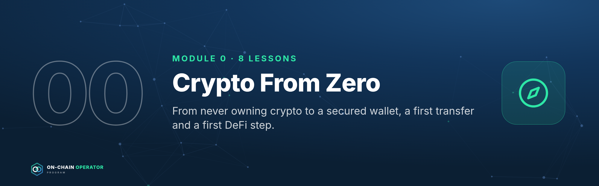
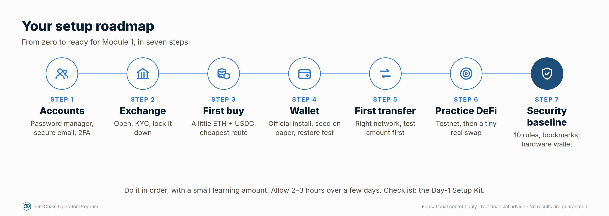
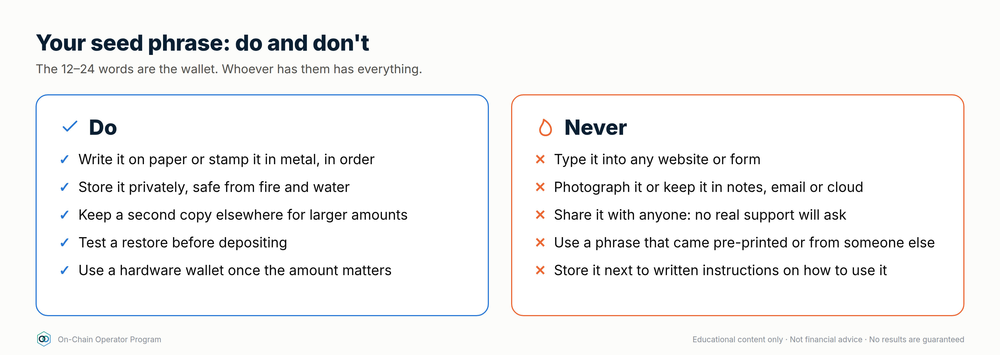
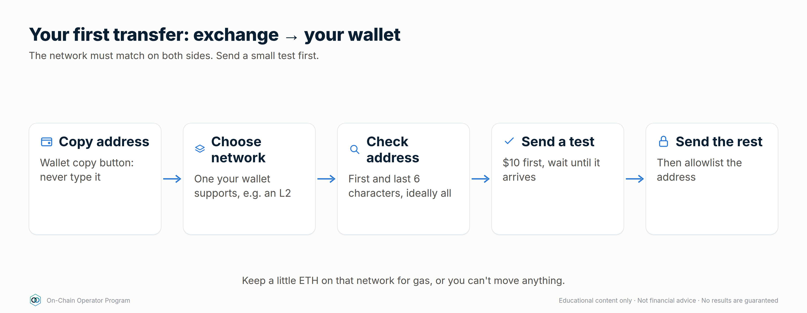

# Module 0 — Crypto From Zero

*Outcome: go from never having owned crypto to a secured exchange account, a backed-up wallet, a first transfer you made yourself, and a first practice DeFi transaction.*
*Stage 0 · Zero. No prior knowledge needed. Every new word is explained the first time it appears, and again in the glossary at the end.*
*Educational content only. Not financial advice. Examples name well-known products only so you know what to look for. Check what's available and regulated where you live. Fees shown are illustrative; check your provider's fee page.*

**How to use this module:** do it in order, with a small amount of money you
can afford to lose while learning (for example $50–$200). Every lesson ends
with a step you actually do. At the end you'll have finished the
**Day-1 Setup Kit** (last section): the checklist that sets up everything the
rest of the program needs.

---

## Lesson 0.1 — Money, ledgers and why blockchains exist

### Objective
Explain in plain words what a blockchain is, what a cryptocurrency is, and what "DeFi" means.

### Explanation
- **Money is a record of who owns what.** Your bank balance is a line in your bank's private ledger (record book). You trust the bank to keep it correct.
- **A blockchain** is a ledger that thousands of computers keep a copy of and agree on together. New entries are added in batches called **blocks**, each linked to the one before: a chain of blocks. Nobody can quietly change an old entry, because everyone else's copy would disagree.
- **A cryptocurrency** is a unit recorded on a blockchain. **Bitcoin (BTC)** was the first (2009). **Ether (ETH)** is the currency of the **Ethereum** blockchain, which also runs programs.
- **A smart contract** is a program that lives on a blockchain and follows fixed rules, for example "whoever deposits X gets Y back plus interest".
- **Stablecoins** are tokens designed to stay worth $1 (e.g. USDC, USDT). You'll use them a lot, but they can fail (Lesson 1.5).
- **DeFi (decentralised finance)** is financial services (trading, lending, earning interest) run by smart contracts instead of banks.
- **The trade-off:** no bank in the middle means nobody can freeze your money, but also **nobody can reverse your mistakes.** That's why this program starts with safety.

### Worked example
When Alice sends Bob 0.1 ETH, she doesn't send a file. She signs an instruction
("move 0.1 ETH from my address to Bob's"). The network checks she owns it,
adds it to the next block, and every copy of the ledger updates. Bob now owns it.
There is no "undo" button.

### Checklist
- [ ] I can explain a blockchain as "a shared ledger nobody can quietly edit"
- [ ] I know the difference between BTC, ETH and a stablecoin
- [ ] I understand that crypto transactions can't be reversed

### Quiz

1. Why can't someone quietly change an old blockchain entry?
Thousands of computers hold copies and would reject a version that doesn't match.

2. What is a stablecoin designed to do?
Stay worth about $1 (or another currency). It can still fail.

3. What does DeFi replace, and what do you give up?
It replaces banks and brokers with smart contracts. You give up anyone who can reverse mistakes or help recover funds.

---

## Lesson 0.2 — Opening and securing an exchange account

### Objective
Open an account on a reputable exchange and lock it down before putting money in.

### Explanation
An **exchange** is a company that lets you swap your normal money (dollars,
pounds, euros) for crypto. It's your **on-ramp**. Choose one that is:
- **Licensed or registered where you live** (check your country's financial regulator)
- **Large and long-established**, with a good security record
- **Supports your bank's deposit method** and the coins/networks you'll use (ETH, USDC, and low-cost networks such as Arbitrum or Base)

Well-known examples include Coinbase, Kraken, Binance, Bybit and OKX, but
availability differs by country. **Pick one that's legally available to you.**

You'll be asked for **KYC** ("know your customer"): ID and sometimes proof of
address. This is normal and legally required for regulated exchanges.

**Secure it before depositing:**
1. **Unique, long password** stored in a **password manager** (e.g. Bitwarden, 1Password)
2. **Secure your email first.** Whoever controls your email can often reset your exchange account. Give it its own strong password and 2FA.
3. **Two-factor authentication (2FA)** with an **authenticator app** (e.g. Google Authenticator, Authy) or a **hardware security key**. **Avoid SMS codes**: phone numbers can be hijacked ("SIM swap").
4. **Save the 2FA backup codes** offline (on paper, stored safely)
5. Turn on the **anti-phishing code** if offered (a word that appears in every real email from the exchange)
6. Turn on the **withdrawal address allowlist** if offered (withdrawals can only go to addresses you pre-approved)

### Worked example
Maria signs up, completes KYC in 10 minutes, then spends another 10 on
security: password manager, authenticator-app 2FA on both her email and the
exchange, backup codes on paper, and an anti-phishing code "blue-kettle".
Later, an email arrives about a "suspicious login" with no "blue-kettle" in it.
She knows it's fake and deletes it.

### Checklist
- [ ] Exchange chosen: legally available and reputable where I live
- [ ] KYC complete
- [ ] Email secured with its own strong password + 2FA
- [ ] Exchange 2FA via authenticator app or security key (not SMS)
- [ ] Backup codes stored offline
- [ ] Anti-phishing code and withdrawal allowlist switched on (if offered)

### Quiz

1. Why secure your email before the exchange?
Email is often how accounts are reset. Whoever controls it can take over the exchange account.

2. Why avoid SMS 2FA?
Attackers can hijack phone numbers (SIM swap) and receive your codes.

3. What does a withdrawal allowlist do?
Only lets withdrawals go to addresses you approved in advance.

---

## Lesson 0.3 — Buying your first crypto without overpaying

### Objective
Fund your account and make a first purchase at a sensible cost.

### Explanation
- **Deposit** your money, usually by bank transfer (cheapest) or card (fastest, most expensive).
- **Instant buy / convert** buttons are simple but often include a **spread**
  (a price markup) plus a fee.
- The **trading screen** ("advanced" or "spot trading") uses an **order book**:
  - **Market order:** buy now at the best available price
  - **Limit order:** buy only at your chosen price or better. It often has a lower fee ("maker" fee).
- **What to buy first for this program:** a little **ETH** (you need it to pay
  network fees, called "gas") and some **USDC** (a dollar stablecoin for practice).

### Worked example (illustrative fees)
Buying $500 of ETH:
| Route | Typical cost | You pay in fees |
|---|---|---|
| Card + instant buy | ~3.99% | ~$19.95 |
| Bank transfer + limit order | ~0.4% | ~$2.00 |

Same ETH, ~$18 difference. Your exchange's fee page has the real numbers.

### Checklist
- [ ] Deposited by the cheapest method available to me
- [ ] Bought a small amount of ETH (for gas) and USDC (for practice)
- [ ] Tried a limit order on the trading screen
- [ ] Saved a record: date, amount, price, fees (you'll need records for tax)

### Quiz

1. Why keep a little ETH even if you mostly want stablecoins?
You need ETH to pay network fees (gas) on Ethereum and most of its low-cost networks.

2. Market or limit order: which controls the price you pay?
A limit order.

3. Why keep records from day one?
Most countries tax crypto gains. Records of dates, amounts, prices and fees make that straightforward.

---

## Lesson 0.4 — Exchange account vs your own wallet: who holds the keys?

### Objective
Understand custody and decide what stays on the exchange and what moves to your own wallet.

### Explanation
- **On an exchange (custodial):** the exchange holds your crypto and owes it to you. Easy, recoverable with ID, but if the exchange fails, freezes or is hacked, your money is at risk. *"Not your keys, not your coins."*
- **In your own wallet (self-custody):** you hold the **keys**, which are the secret codes that control your crypto. Nobody can freeze it; nobody can recover it for you.
- **A wallet doesn't "store" coins.** The coins are on the blockchain; the wallet holds the keys that let you move them. That's why a backup of the keys (your **seed phrase**) is the wallet.
- **Addresses:** your wallet gives you a public **address** (like `0x7a3F…9c21`) to receive funds. Safe to share, like an account number.
- **Seed phrase / recovery phrase:** 12 or 24 words that recreate your keys. **Never share it, never type it into a website, never photograph it.**

| | Exchange | Your wallet |
|---|---|---|
| Who holds keys | The exchange | You |
| Recover if you forget password | Yes, with ID | Only with your seed phrase |
| Can be frozen | Yes | No |
| Can use DeFi | Limited | Yes |
| Your main risk | The company | Your own mistakes and scams |

### Checklist
- [ ] I can explain custodial vs self-custody
- [ ] I know my seed phrase **is** the wallet
- [ ] I know an address is safe to share and a seed phrase never is

### Quiz

1. What does "not your keys, not your coins" mean?
If someone else holds the keys, you depend on them to give your crypto back.

2. Is your crypto stored inside your wallet app?
No. It's on the blockchain. The wallet holds the keys that control it.

3. Which can you share: your address or your seed phrase?
Your address. Never the seed phrase.

---

## Lesson 0.5 — Setting up your wallet and backing it up

### Objective
Install a wallet safely, back up the seed phrase correctly, and prove the backup works.

### Explanation
Two kinds of wallet:
- **Software wallet** (browser extension or phone app, e.g. MetaMask, Rabby): free, convenient; keys live on your computer/phone.
- **Hardware wallet** (a small device, e.g. Ledger, Trezor): keys stay on the device; every transaction must be approved on its screen. **Recommended once you hold more than you'd be upset to lose.** Buy only from the manufacturer's official website, never second-hand.

**Safe install:**
1. Get the wallet from the **official website** (type the address yourself or use the link from the official site). Fake wallet apps and sponsored search ads are a common scam.
2. Create a **new** wallet. Never use a seed phrase someone else gave you or that came pre-printed in a box.
3. Write the seed phrase **on paper** (or stamp it into metal), in order, spelled exactly.
4. Store it somewhere private and safe from fire and water. For larger amounts, keep a second copy in a separate location.
5. **Never** store it in photos, email, notes apps, cloud drives or password managers.

**Prove the backup works (do this now, with nothing in the wallet):**
remove the wallet (or use a second device), choose "restore/import", enter
your written seed phrase, and check the **same address** appears.

### Worked example
Sam installs Rabby from its official site, writes 12 words on the card in his
hardware wallet box (the card is blank, as it should be), restores on his
laptop, sees the same address `0x4b…e1`, and only then sends money to it.

### Checklist
- [ ] Wallet installed from the official website
- [ ] New seed phrase written on paper (or metal), never digital
- [ ] Restore test done: same address appears
- [ ] Hardware wallet planned for larger amounts (bought from the maker directly)

### Quiz

1. A wallet box contains a card with 24 words already printed. What do you do?
Don't use it. It's a scam. Genuine devices generate your seed phrase themselves.

2. Why test the restore before depositing?
To prove your written backup is correct while nothing is at risk.

3. Is a cloud-drive photo of your seed phrase a safe backup?
No. Anyone who gets into that account can take everything.

---

## Lesson 0.6 — Networks, gas and your first transfer

### Objective
Move crypto from the exchange to your own wallet safely, on the right network, starting with a test amount.

### Explanation
- **Networks (chains):** the same token (e.g. USDC) can exist on several blockchains: **Ethereum** (the main one, higher fees) and cheaper **Layer 2** networks such as **Arbitrum**, **Base** and **Optimism**.
- **The golden rule:** the **network you withdraw on must match a network your wallet (or the receiving service) supports.** Sending on the wrong network can mean lost funds.
- **Gas:** every transaction pays a small network fee in the network's gas token. On Ethereum and its Layer 2s that's **ETH**. Without a little ETH on the network you're using, you can't move anything.
- Your wallet address is usually the **same** on Ethereum and its Layer 2s, but your balances are separate per network. Switch networks in your wallet to see them.

**Step by step:**
1. In your wallet, **copy your address** (use the copy button; never type it).
2. On the exchange, choose **Withdraw** → the coin → **pick the network** (for learning, a low-fee Layer 2 your wallet supports, e.g. Arbitrum or Base).
3. Paste the address. **Check the first 6 and last 6 characters** match your wallet. Better, check it all.
4. Send a **small test** first (e.g. $10 of ETH).
5. Wait for it to arrive; see it in your wallet on that network.
6. Only then send the rest. Add the address to the exchange **allowlist**.

### Worked example (illustrative)
Withdrawing $100 of ETH to Arbitrum: exchange withdrawal fee ~$0.10–$1.
Later, a swap on Arbitrum costs a few cents in gas. The same swap on Ethereum
might cost a few dollars, more when the network is busy. That's why beginners
learn on Layer 2s.

### Checklist
- [ ] Network chosen on purpose, and supported by my wallet
- [ ] Address pasted, first and last 6 characters checked
- [ ] Test amount sent and received before the rest
- [ ] A little ETH held on that network for gas
- [ ] Address added to the exchange withdrawal allowlist

### Quiz

1. What's the golden rule of withdrawals?
The network you send on must be one the receiving wallet or service supports.

2. You have USDC on Arbitrum but zero ETH there. Can you send it?
No. You need a little ETH on Arbitrum to pay gas.

3. Why send a test amount?
To confirm the address and network are right before risking the full amount.

---

## Lesson 0.7 — Your first DeFi steps (practice mode first)

### Objective
Connect your wallet to a DeFi app, understand what you're signing, and practise on a free test network before using real money.

### Explanation
- **Connect wallet:** lets a site *see* your address. It can't move funds by itself.
- **Sign a message:** proves you own the address (e.g. to log in). Read it. Some "messages" are really permissions (Lesson 1.4).
- **Approve:** gives an app permission to move a specific token. Limit the amount.
- **Transaction:** actually does something (swap, deposit) and costs gas.
- **Testnets** are practice blockchains with free, worthless coins. Ethereum's main one is **Sepolia**. You get test ETH from a **faucet** (a free giveaway site). Use testnets to practise without risk.
- **Revoke** permissions you no longer need with a tool such as revoke.cash.

**Practice run:**
1. Add the Sepolia test network in your wallet (most wallets have a "show test networks" setting).
2. Get free test ETH from a Sepolia faucet.
3. Make a test swap on a testnet version of a well-known DEX (or send test ETH to yourself).
4. Look up the transaction on a block explorer (Lesson 1.2).
5. Then, on a Layer 2 with a **tiny** real amount: connect to a well-known app,
   read every prompt, do one small swap, then revoke the approval.

### Worked example
Priya connects to a DEX on Arbitrum. Her wallet shows "Approve USDC: Unlimited".
She edits it to $20, swaps $20 of USDC for ETH, pays ~$0.05 in gas, checks the
transaction on the explorer, then revokes the approval. Total cost: a few cents.
Total lessons learned: five.

### Checklist
- [ ] I know the difference between connect, sign, approve and transact
- [ ] Practised on the Sepolia testnet
- [ ] Made one small real swap on a Layer 2 with a limited approval
- [ ] Found my transaction on a block explorer
- [ ] Revoked the approval afterwards

### Quiz

1. Can "connect wallet" move your funds?
No. It shares your address. Approvals and transactions are what move funds.

2. What is a testnet for?
Practising with worthless coins, so mistakes cost nothing.

3. What should you do with an approval after you're done?
Revoke it, or limit it to the amount needed in the first place.

---

## Lesson 0.8 — Your security baseline, and the language of DeFi

### Objective
Lock in the habits that prevent most losses, and learn the words used in the rest of the program.

### Explanation — the 10 rules
1. **Never share your seed phrase.** No real person or company will ever ask for it.
2. **Bookmark** the sites you use; never reach them from ads, DMs or emails.
3. **Nobody legitimate DMs you first** offering help, investments or "recovery".
4. **Guaranteed returns are a scam.** Always.
5. **Read every wallet prompt** before approving: what, how much, to whom.
6. **Test first** with a small amount on anything new.
7. **Use a hardware wallet** once the amount matters to you.
8. **Keep devices updated**, and use a separate browser profile for crypto.
9. **Keep records** of every buy, sell, transfer and fee.
10. **If something feels urgent, stop.** Scammers create urgency; real opportunities wait.

### Glossary (the words you'll meet next)
| Word | Meaning |
|---|---|
| Address | Your public "account number" on a blockchain |
| Seed phrase | 12–24 words that recreate your wallet's keys. Never share |
| Private key | The secret that signs transactions (your seed phrase generates it) |
| Custody | Who holds the keys: an exchange (custodial) or you (self-custody) |
| Gas | The network fee for a transaction, paid in the network's token |
| Network / chain | A blockchain, e.g. Ethereum, Arbitrum, Base |
| Layer 2 (L2) | A cheaper, faster network built on top of Ethereum |
| Token | A unit of value on a blockchain, e.g. USDC |
| Stablecoin | A token designed to hold a steady value, usually $1 |
| Smart contract | A program on a blockchain that follows fixed rules |
| DEX | Decentralised exchange: swap tokens from your wallet |
| Approval | Permission for an app to move a specific token |
| Block explorer | A website that shows every transaction (e.g. Etherscan) |
| Testnet / faucet | A practice blockchain / a site giving free test coins |
| APY | Annual percentage yield: yearly return including compounding |
| Liquidity | How easily something can be bought or sold without moving the price |
| KYC | ID checks required by regulated exchanges |
| 2FA | Two-factor authentication: a second proof of identity at login |

### Checklist
- [ ] I've read the 10 rules and can repeat them
- [ ] Separate browser profile set up for crypto
- [ ] I know every word in the glossary

### Quiz

1. Someone offers a "guaranteed 2% a day". What is it?
A scam. Guaranteed returns don't exist.

2. What's gas?
The network fee for a transaction, paid in the network's token.

3. A message says your wallet will be "suspended" unless you act in 1 hour. What do you do?
Stop. Urgency is a scam tactic. Wallets can't be suspended; check only through bookmarked official sites.

---

## The Day-1 Setup Kit

Print this, and tick every box in order. When all boxes are ticked, you're
ready for Module 1. Allow **2–3 hours** in total, spread over a few days
(deposits and KYC can take time).

**What you need:** ID for KYC · a bank account · a smartphone for the
authenticator app · a computer with an up-to-date browser · pen and paper (or
a metal backup plate) · optional: a hardware wallet bought from the maker.

### Part A — Accounts (≈ 45 min)
- [ ] Password manager installed; master password written down and stored safely
- [ ] Email secured: unique password + authenticator-app 2FA
- [ ] Authenticator app installed on your phone
- [ ] Exchange chosen (legally available to you, reputable)
- [ ] Exchange account opened and KYC completed
- [ ] Exchange 2FA on (authenticator or security key, not SMS); backup codes stored offline
- [ ] Anti-phishing code and withdrawal allowlist switched on

### Part B — First purchase (≈ 20 min)
- [ ] Deposited a small learning amount by the cheapest method
- [ ] Bought a little ETH (gas) and some USDC (practice)
- [ ] Tried a limit order
- [ ] Started a simple records sheet: date, action, amount, price, fees

### Part C — Your wallet (≈ 30 min)
- [ ] Wallet installed from the official website (separate browser profile)
- [ ] New seed phrase written on paper/metal, in order; never digital
- [ ] Restore test passed: same address appears
- [ ] Wallet address saved in the password manager's notes (address only, **never the seed**)

### Part D — First transfer (≈ 20 min)
- [ ] Network chosen (low-fee L2 supported by your wallet)
- [ ] Test withdrawal (e.g. $10 of ETH) sent and received
- [ ] Remaining learning funds sent; address added to the allowlist
- [ ] Transfer found on a block explorer

### Part E — Practice DeFi (≈ 30 min)
- [ ] Sepolia test network added; free test ETH from a faucet
- [ ] One practice transaction on the testnet
- [ ] One tiny real swap on an L2 with a limited approval
- [ ] Approval revoked afterwards

### Part F — Security baseline (≈ 15 min)
- [ ] The 10 rules read and understood
- [ ] Sites bookmarked; no links from ads or DMs
- [ ] Hardware wallet ordered from the maker (when the amount will matter)
- [ ] Records sheet up to date

**All ticked? You're ready for Module 1 — Foundations & Safety.**
