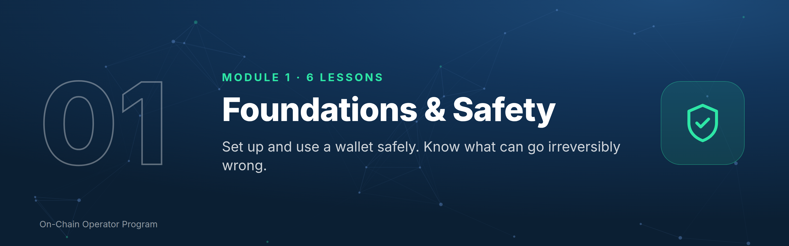
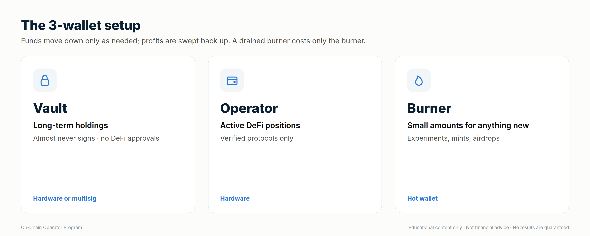

# Module 1 — Foundations & Safety

*Outcome: set up and use a wallet safely, and know what can go irreversibly wrong before any capital moves.*
*Source: ATLAS "DeFi & On-Chain" ch. 1–5, 36. Educational content only. Not financial advice.*

The **before-signing checklist** is introduced in this module and used in every module after it:

- [ ] Chain confirmed
- [ ] Contract address verified from an authoritative source
- [ ] Token and amount double-checked
- [ ] Spender / allowance reviewed
- [ ] Slippage set deliberately
- [ ] Gas estimate reviewed
- [ ] Intended outcome stated in one sentence

---

## Lesson 1.1 — What DeFi is, and the risk-first mindset *(ch. 1)*

### Objective
Describe the DeFi stack and explain why every yield is payment for a risk.

### Explanation
DeFi replaces intermediaries (banks, brokers, exchanges) with **smart
contracts**: public programs on a blockchain that hold assets and follow fixed
rules. The stack, bottom to top:

1. **Blockchain**: records every balance and transaction (Ethereum, L2s, other chains).
2. **Smart contracts**: the protocol logic (a lending market, an exchange pool).
3. **Tokens**: the assets the contracts move.
4. **Wallets**: where *you* hold keys and sign actions.
5. **Interfaces**: websites that build transactions for you. They're a convenience, not the protocol itself.
6. **Data layers**: explorers and dashboards you use to verify what happened.

Three properties make DeFi powerful and dangerous:
- **Self-custody**: nobody can freeze your funds, and nobody can recover them either.
- **Composability**: protocols plug into each other. That makes products powerful, and a position can fail because of something it depends on.
- **Transparency**: you can verify everything on-chain. Transparent doesn't mean safe.

**Risk-first rule:** before comparing returns, list what could make you lose
money. A higher yield means you're being paid to carry more risk, whether or
not the website mentions it.

### Worked example
A pool advertises **12% APY on a stablecoin**. Before depositing, ask:
- Where does the 12% come from? Borrowers paying interest, trading fees, or a reward token?
- Which stablecoin, and what backs it? (Lesson 1.5)
- Which contracts hold the money, and who can upgrade them?
- Is there a bridge or oracle involved?
- How do I withdraw, and could withdrawals be blocked?

If you can't answer these, you don't know what the 12% is paying you for.

### Checklist
- [ ] I can name the six layers of the DeFi stack
- [ ] I can explain why self-custody cuts both ways
- [ ] Before any yield, I ask "what am I being paid to risk?"

### Quiz

1. Why can composability increase risk?
A position inherits the failure risk of every protocol, asset, oracle and bridge it depends on.

2. Is a website the same thing as the protocol?
No. The interface only builds transactions. The contracts are the protocol, and interfaces can be faked or compromised.

3. What is the risk-first mindset in one sentence?
Identify what could make you lose money before you compare returns.

---

## Lesson 1.2 — How a transaction actually happens *(ch. 2)*

### Objective
Follow a transaction from signature to finality, and estimate its cost.

### Explanation
**Lifecycle:** create → sign → broadcast → mempool (waiting) → included in a
block → confirmed → final.

- **Gas** is the unit of computation. Cost = `gas used × gas price`. On
  Ethereum the price has a *base fee* (burned) plus a *priority tip*
  (to get included sooner). Gas price is quoted in **gwei** (1 gwei = 0.000000001 ETH).
- **Nonce**: each account's transactions are numbered in order. A stuck
  low-nonce transaction blocks all later ones until it confirms or is
  **replaced** (same nonce, higher fee).
- **Failed transactions still cost gas.** The network did the computation even though the result was reverted.
- **Finality**: the point after which a transaction can't realistically be
  reversed. It differs by chain, and L2s have their own rules (Module 5).
- **Explorers** (e.g. Etherscan) show status, fee, sender, contract called, token transfers and logs.

### Worked example
A swap uses **150,000 gas** at **20 gwei**:
`150,000 × 20 = 3,000,000 gwei = 0.003 ETH`. At $3,000/ETH that's **$9**.
The same swap during congestion at 80 gwei costs **$36**. If you're compounding
$1.50 of rewards, the gas costs more than the rewards. That's why position
size matters on-chain.

### Checklist
- [ ] I check the fee estimate before signing
- [ ] I know how to find my transaction on an explorer
- [ ] I know a stuck transaction can be sped up or cancelled with the same nonce

### Quiz

1. Your transaction reverted. Did you pay?
Yes, for the gas used up to the point of failure.

2. 200,000 gas at 10 gwei with ETH at $2,500 costs?
2,000,000 gwei = 0.002 ETH = $5.

3. Why are your newer transactions all pending?
An earlier nonce is stuck. Replace or speed it up, and the rest follow.

---

## Lesson 1.3 — Wallets, keys, hardware & multisig *(ch. 3)*

### Objective
Set up a wallet structure where one mistake can't lose everything.

### Explanation
- **Private key**: the authority to sign. Whoever has it controls the funds.
- **Seed phrase**: 12–24 words that recreate your keys. **Never type it into
  a website, never photograph it, never share it. No legitimate support team
  will ever ask for it.**
- **Hardware wallet**: keeps keys on a separate device. Signing requires physical confirmation.
- **Multisig**: needs M of N signers (e.g. 2 of 3). Good for large or shared funds.
- **Smart wallets**: contract accounts that can add spending limits, recovery and batching.

**Compartmentalise:** separate wallets by job, so a compromise only reaches one of them.

### Worked example — the 3-wallet setup

| Wallet | Holds | Signs | Device |
|---|---|---|---|
| **Vault** | Long-term holdings | Almost never. No DeFi approvals | Hardware (or multisig) |
| **Operator** | Active DeFi positions | Known, verified protocols only | Hardware |
| **Burner** | Small amounts for new apps, mints, airdrops | Anything experimental | Hot wallet |

Move money *down* the chain (vault → operator → burner) only as needed, and
sweep profits back *up*. If the burner gets drained, you lose only the burner's balance.

### Checklist
- [ ] Seed phrase stored offline, in two separate physical places
- [ ] Vault wallet has never approved a DeFi contract
- [ ] Separate burner wallet for anything new
- [ ] I read every signing prompt on the hardware device screen, not just the website

### Quiz

1. A "support agent" in DMs needs your seed phrase to fix a stuck transaction. What do you do?
Nothing. It's a scam, every time. Block and report.

2. Why keep the vault wallet free of approvals?
Approvals let contracts move your tokens. With none, a compromised protocol can't reach it.

3. What does 2-of-3 multisig protect against?
A single lost or compromised key. Two signers are still needed to move funds.

---

## Lesson 1.4 — Tokens, approvals & allowances *(ch. 4)*

### Objective
Read an approval request and know what you're allowing.

### Explanation
- Most tokens on EVM chains are **ERC-20** (fungible). NFTs (ERC-721/1155)
  can also represent positions (e.g. concentrated LP).
- To let a protocol move your tokens you **approve** a **spender** for an
  **allowance**. The protocol then pulls tokens when you act.
- **Unlimited approvals** are convenient but let that contract move *all*
  of that token, now and in future. If the contract (or the approval) is
  exploited, the tokens can be taken.
- **Signature approvals (Permit / Permit2)** grant allowances with an
  off-chain signature, not a transaction. There's no gas, so they're easy to
  sign without noticing. Drainers abuse exactly this.
- **Wrapped / receipt tokens**: WETH, LP tokens and lending receipts represent a claim on something else.
- **Fake tokens**: anyone can create a token called "USDC". Only the **contract address** identifies it.

### Worked example — reading an approval
Wallet shows: *"Allow 0x3fC9…a1B2 to spend your USDC. Amount: Unlimited."*
1. Is `0x3fC9…a1B2` the protocol's official router? Check the docs or explorer.
2. Do I need unlimited? Edit it to the amount of this deposit.
3. Is this USDC the real contract?
4. After finishing, revoke with a revoke tool (e.g. revoke.cash) if I won't be back.

### Checklist
- [ ] Spender verified against official docs
- [ ] Allowance limited to what's needed
- [ ] Signature requests read as carefully as transactions
- [ ] Approvals reviewed and revoked monthly

### Quiz

1. Why is a gasless "Permit" signature dangerous?
It can grant a token allowance without a transaction, so it's easy to sign without noticing. Drainers use it to take tokens.

2. How do you know a token is the real one?
By its contract address from an authoritative source, never by name or ticker.

3. When should you revoke an approval?
When you no longer use that protocol, or on a regular schedule.

---

## Lesson 1.5 — Stablecoins and how they break *(ch. 5)*

### Objective
Classify a stablecoin by design and name what could break its peg.

### Explanation
| Type | Backing | Main risks |
|---|---|---|
| **Fiat-backed** | Cash/treasuries held by an issuer | Issuer, bank and custodian risk; freezes; redemption limited to approved parties |
| **Crypto-backed** | Over-collateralised on-chain crypto | Collateral crash, liquidations, oracle failure |
| **Synthetic / hedged** | Derivative positions (e.g. spot + short perp) | Funding turns negative, exchange/venue risk, model risk |
| **Algorithmic** | Mostly its own mechanism / sister token | Reflexive death spiral when confidence breaks |

**Peg mechanics:** if a stablecoin trades at $0.98 and can be redeemed for
$1.00, arbitrageurs buy and redeem it, pushing the price back up. The peg is
only as strong as **redemption access and reserve quality**.

History (research these as case studies):
- **May 2022**: TerraUSD (UST), an algorithmic design, lost its peg and collapsed toward zero.
- **March 2023**: USDC briefly traded well below $1 after part of its reserves were exposed to the failed Silicon Valley Bank, then recovered once reserves were confirmed.

### Worked example
A fiat-backed coin trades at **$0.97**. Redemption is **$1.00 minus a 0.1% fee**,
but only for verified institutional minters.
- A minter makes ~2.9% per coin by buying and redeeming, so arbitrage *should* restore the peg.
- You can't redeem, so you rely on minters acting and on the reserves being real.
- If markets doubt the reserves, minters may not step in, and the discount can grow.

### Checklist
- [ ] I know the type and backing of every stablecoin I hold
- [ ] I know who can redeem, and how
- [ ] I don't treat "different stablecoins" as diversified if they share issuers or collateral
- [ ] I have a depeg exit rule (e.g. sell or rotate below $0.99 for longer than X hours)

### Quiz

1. What keeps a fiat-backed stablecoin near $1?
Redemption for $1 of reserves, plus arbitrageurs who can redeem.

2. Why are algorithmic designs fragile?
They rely on confidence and their own token. When demand falls, the mechanism can amplify the fall.

3. Two stablecoins both backed by the same collateral. Diversified?
No. They share the same failure point.

---

## Lesson 1.6 — Scam defence *(ch. 36)*

### Objective
Recognise the common attacks before they cost you anything.

### Explanation
| Attack | How it works | Defence |
|---|---|---|
| **Phishing site** | Look-alike URL / sponsored search ad / fake app | Bookmarks only. Never click links from DMs or ads |
| **Wallet drainer** | You sign an approval, Permit or `setApprovalForAll` for an attacker | Read every prompt. Burner wallet for new sites |
| **Address poisoning** | Attacker sends $0 transfers from an address that looks like one you use, so it appears in your history | Never copy addresses from history. Use a saved address book and check the *full* address |
| **Fake token / airdrop** | Unknown tokens appear in your wallet with a "claim" link | Ignore them. Don't interact or try to sell |
| **Impersonation** | "Support", "admin" or "project team" DMs you | Real teams never DM first and never ask for seeds |
| **Too-good yields** | New protocol, huge APY, anonymous team, no audit | Due diligence (Module 6). Burner wallet and small size, or skip |

### Worked example — address poisoning
You regularly send to `0x7a3F…9c21`. Today your history shows a transfer from
`0x7a3F…9c21`, but the full address is `0x7a3F`**`e0b4…d18`**`9c21`: same
start and end, different middle. If you copy it from history you send your
funds to the attacker. **Always paste from your address book and check the
full address.**

### Checklist
- [ ] Protocol sites bookmarked; never reached through search ads or DMs
- [ ] Address book in use; full address checked before sending
- [ ] Unknown tokens ignored
- [ ] DMs from "support" treated as scams by default
- [ ] New sites only with the burner wallet

### Quiz

1. A new token worth "$5,000" appears in your wallet with a claim site. What do you do?
Ignore it. It's bait, and interacting risks a drainer approval.

2. How does address poisoning trick people?
It puts a look-alike address in your history so you copy it by mistake.

3. What's the single best habit against drainers?
Reading every signature and approval prompt, and using a burner wallet for anything new.

---

### Module 1 practical
1. Set up the 3-wallet structure (vault / operator / burner).
2. Send a small test transaction and trace it on an explorer: status, fee, nonce.
3. Approve a small, limited allowance on a reputable protocol, then revoke it.
4. Write your stablecoin list with type, backing, who can redeem, and your depeg exit rule.
