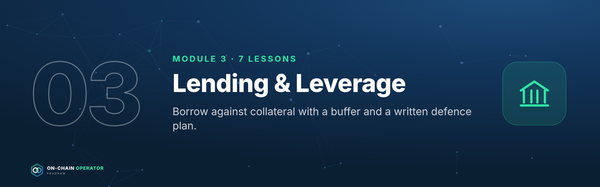

# Module 3 — Lending & Leverage

*Outcome: borrow against collateral with a buffer and a written defence plan.*
*Stage 2 · Practitioner. Source: ATLAS "DeFi & On-Chain" ch. 10–13. Educational content only. Not financial advice. Figures are illustrative.*

---

## Lesson 3.1 — How lending markets work *(ch. 10)*

### Objective
Explain where lending yields come from and why rates jump when a market is nearly fully borrowed.

### Explanation
A DeFi **money market** is a pool: lenders **supply** assets, borrowers
**borrow** them against collateral, and a smart contract sets the rates.
- **Utilisation** = borrowed ÷ supplied. It drives the rates.
- **Interest-rate curve:** most markets use a "kinked" curve. Rates rise gently
  up to an **optimal utilisation** (e.g. 80%), then steeply above it, to pull in
  lenders and push out borrowers.
- **Supply APY ≈ borrow APY × utilisation × (1 − reserve factor).** The reserve
  factor is the protocol's cut.
- **Receipt tokens:** when you supply, you get a token representing your
  deposit plus interest.

### Worked example (illustrative curve: 4% at 80% optimal, +60% slope above)
| Utilisation | Borrow APY | Supply APY (10% reserve factor) |
|---|---|---|
| 50% | 2.5% | 1.1% |
| 70% | 3.5% | 2.2% |
| 80% | 4.0% | 2.9% |
| 90% | 34.0% | 27.5% |
| 95% | 49.0% | 41.9% |

Near 100% utilisation, rates spike **and lenders may not be able to withdraw**,
because the money is lent out. A sudden high supply APY is often a warning, not a gift.

### Checklist
- [ ] I check utilisation before supplying
- [ ] I know the market's optimal-utilisation kink
- [ ] I treat a sudden rate spike as a liquidity warning

### Quiz

1. What sets the rates in a money market?
Mainly utilisation, through the protocol's interest-rate curve.

2. Why does the curve kink?
To make borrowing expensive and supplying attractive when liquidity runs low, restoring withdrawal capacity.

3. Utilisation is 99%. Risk for lenders?
Withdrawals may be blocked until borrowers repay or new supply arrives.

---

## Lesson 3.2 — LTV, liquidation threshold & health factor *(ch. 11)*

### Objective
Calculate your LTV, health factor and liquidation price before you borrow.

### Explanation
- **LTV (loan-to-value)** = debt ÷ collateral value.
- **Max LTV:** the most you can borrow against an asset.
- **Liquidation threshold (LT):** the LTV at which your position can be liquidated. It's higher than max LTV.
- **Health factor (HF)** = (collateral value × LT) ÷ debt. **Below 1.0 = liquidatable.**
- **Liquidation price** = debt ÷ (collateral quantity × LT).

### Worked example
10 ETH at $3,000 ($30,000), LT 0.80, borrow $12,000:
- LTV **40%** · HF **2.0** · liquidation at **$1,500** (−50%)
- `defi_calc.py health --qty 10 --price 3000 --lt 0.8 --debt 12000`
- Max debt for HF 2.0 = $12,000; for HF 1.5 = $16,000.

### Checklist
- [ ] HF and liquidation price calculated before borrowing
- [ ] HF ≥ 2 for volatile collateral
- [ ] Alerts set (Module 14.1)

### Quiz

1. Collateral $50,000, LT 0.8, debt $20,000. HF?
2.0.

2. Why keep HF well above 1?
Collateral prices can fall fast; the buffer is your time to react.

3. Max LTV vs liquidation threshold?
Max LTV caps new borrowing; the liquidation threshold is where liquidation becomes possible.

---

## Lesson 3.3 — Liquidations and cascades *(ch. 12)*

### Objective
Know exactly what a liquidation costs you, and how to avoid ever reaching one.

### Explanation
When HF drops below 1, a **liquidator** (usually a bot) repays part of your debt
(up to the **close factor**, often 50%) and takes that value of your
collateral **plus a bonus** (the liquidation penalty, often 5–10%).
Liquidations sell collateral into a falling market, which can push prices
lower and trigger more liquidations: a **cascade**.

### Worked example
Your position from 3.2. ETH falls to **$1,490**, HF just under 1:
- A liquidator repays **$6,000** (50% close factor) and seizes $6,000 × 1.05 = **$6,300** of ETH ≈ **4.228 ETH**.
- The **$300** bonus is a pure loss to you, on top of having sold ETH near the low.

**Defence ladder:** HF 2.0 → alert; HF 1.7 → repay from reserve or add
collateral; HF 1.5 → sell part of the collateral yourself. Never wait for 1.1.

### Checklist
- [ ] Defence ladder written with exact HF levels
- [ ] Reserve set aside to repay (Module 12.4)
- [ ] Oracle for my collateral known (Module 5.3)

### Quiz

1. What does a liquidator receive?
Collateral equal to the debt repaid plus a bonus (penalty).

2. Why is self-deleveraging better than being liquidated?
You avoid the penalty and choose the size and timing.

3. How do cascades form?
Liquidations sell collateral, pushing prices down, which pushes more positions below HF 1.

---

## Lesson 3.4 — Borrowing strategies & looping *(ch. 13)*

### Objective
Use borrowing deliberately, and know when looping adds return and when it just adds risk.

### Explanation
- **Liquidity without selling:** borrow stablecoins against assets you want to keep (Module 12.3 turns this into a credit policy).
- **Looping:** deposit → borrow → re-deposit → repeat, to multiply exposure. After n loops at LTV L: leverage = `(1 − L^(n+1)) ÷ (1 − L)`.
- **Net APY on equity** = collateral yield × leverage − borrow rate × (leverage − 1).
- **Correlated loops** (an LST against its underlying, or stablecoin against stablecoin) are far safer than volatile-against-stable loops.

### Worked example
LTV 0.7, 3 loops, 3.5% collateral yield, 2.5% borrow:
`defi_calc.py loop --ltv 0.7 --loops 3 --collateral-apy 3.5 --borrow-apy 2.5`
→ **2.53×** leverage, **5.03%** net on equity. The return is wiped out if borrow rises to **5.78%**.
Section 3.1 showed borrow rates can jump from 4% to 34% in hours. That's the risk.

### Checklist
- [ ] Repayment source named before borrowing
- [ ] Loops only on correlated pairs, below max leverage
- [ ] Break-even borrow rate known and alerted

### Quiz

1. Max leverage at LTV 0.75?
4×.

2. What single number decides whether a loop is worth it?
The spread between collateral yield and borrow rate.

3. Why prefer correlated loops?
Collateral and debt move together, so price moves barely change HF.

---

### Module 3 practical
1. Pick a real lending market: record utilisation, supply and borrow APY, and the kink.
2. Model a borrow with `defi_calc.py health`; write your defence ladder.
3. Model one loop with `defi_calc.py loop` and write its break-even borrow rate.
