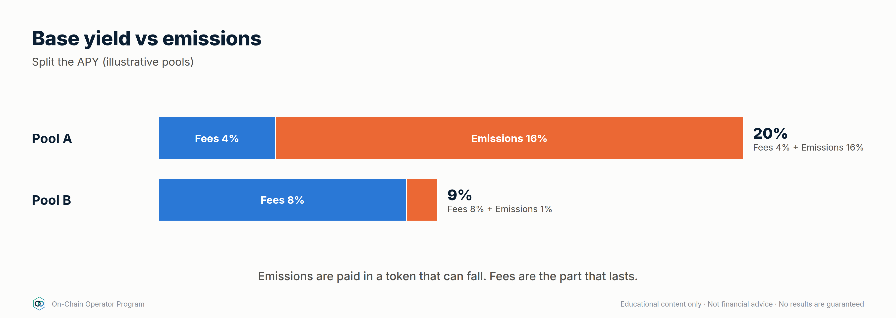
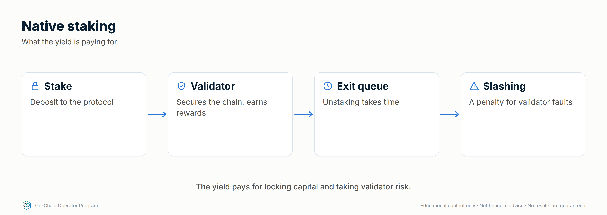
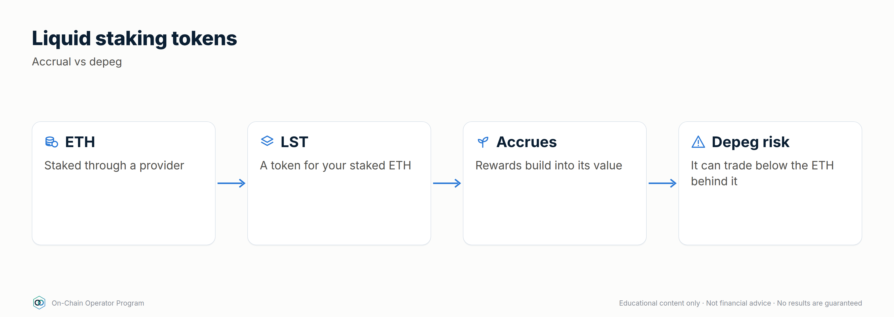
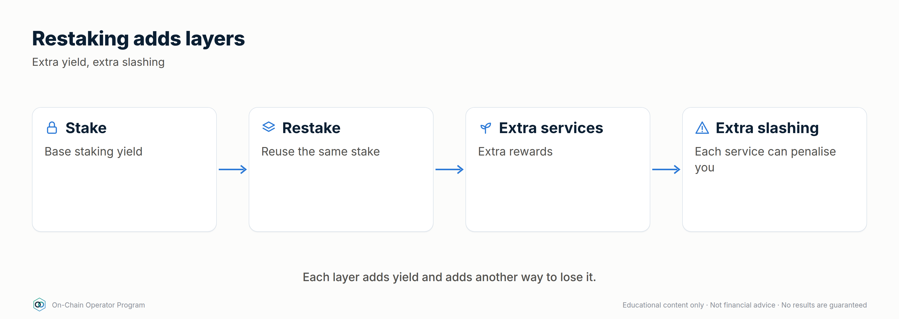
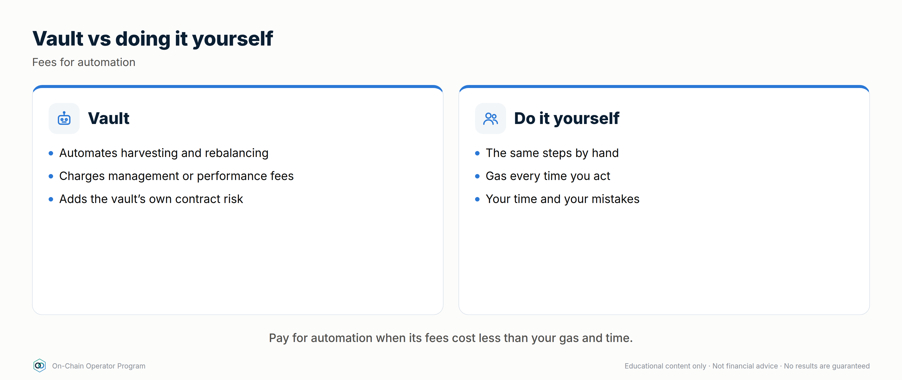
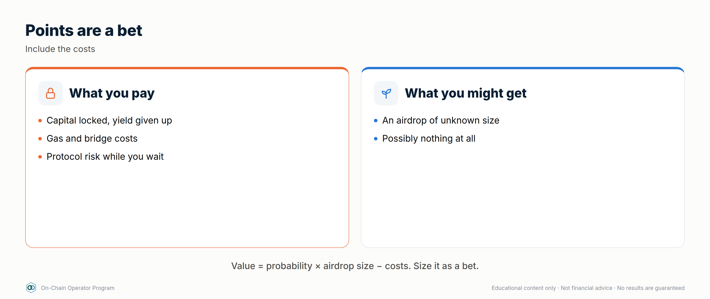
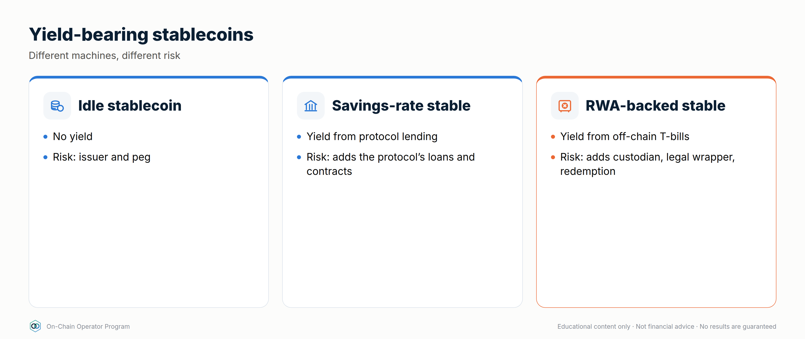
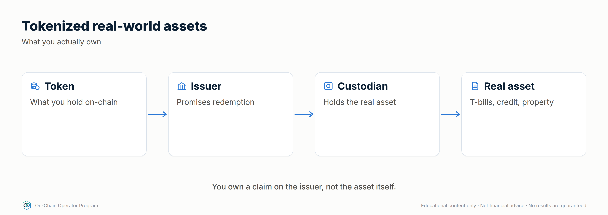

# Module 4 — Yield

*Outcome: split any APY into organic vs subsidised, and name the risk being paid for.*
*Stage 2 · Practitioner. Source: ATLAS "DeFi & On-Chain" ch. 14–18, 37. Educational content only. Not financial advice. Figures are illustrative.*

---

## Lesson 4.0 — Mastery Starter

*New to this topic? Start here. It takes about 10 minutes and gets you from zero to ready for this module.*

### The 60-second version
Every yield is payment for a risk. Staking pays you to secure a network, lending pays for borrower demand, farms often pay in newly printed tokens. This module teaches you to see what each yield really pays for.

### Words you'll need
| Term | Meaning |
|---|---|
| APY | yearly return including compounding |
| Emissions | new reward tokens printed by a protocol |
| Staking | locking tokens to help secure a network |
| LST | a token representing staked assets |
| RWA | a token representing a real-world asset |

### Before you start
- [ ] Modules 0–3

### Your first safe step
Take any advertised APY and split it into base yield vs incentives using the protocol's own dashboard.

### The mastery ladder
| Level | You can… |
|---|---|
| **Beginner** | Tells base yield from emissions |
| **Practitioner** | Compares vaults vs DIY and prices points/airdrops as bets |
| **Master** | Builds yield from durable sources: lending, staking, savings rates, tokenized treasuries |

### You've mastered this module when…
…you can name the source and the risk behind any yield in one sentence.

---

## Lesson 4.1 — Yield farming: base yield vs emissions *(ch. 14)*

### Objective
Split a farm's APY into what's earned from real activity and what's paid in newly minted tokens.

### Explanation
- **Base yield:** trading fees or borrower interest. Paid by real users.
- **Emissions / incentives:** new tokens the protocol prints to attract deposits. The reward token often falls while emissions continue.
- **Mercenary liquidity:** capital that leaves when incentives end, often taking the base yield with it.

### Worked example
A farm shows **60% APY**: 5% fees + 55% in reward tokens. If the reward token
falls 50% on average while you harvest, the emissions are worth ~27.5%, so the
real return is ~**32.5%**, before impermanent loss and gas. Remove emissions
entirely and you're left with 5%. **Would you take the risk for 5%?** That's the real question.

### Checklist
- [ ] APY split into base vs incentives
- [ ] Reward token valued at a realistic, falling price
- [ ] Harvest-and-sell schedule set

### Quiz

1. What's the test for a farm?
Does the base yield alone justify the risk?

2. Why do emissions APYs fall?
More capital shares the rewards, and the reward token's price often declines.

3. What is mercenary liquidity?
Capital that moves on as soon as incentives end.

---

## Lesson 4.2 — Native staking *(ch. 15)*

### Objective
Understand what staking pays for, and its lock-up and validator risks.

### Explanation
Proof-of-stake networks pay **stakers** to secure the chain. You either run a
validator or **delegate** to one. Rewards come from issuance and fees. Risks:
**slashing** (penalties for validator misbehaviour on some networks),
**unbonding periods** (waiting time to withdraw) and validator downtime.

### Worked example
Staking yields a few percent a year in the staked asset (e.g. ~3%, illustrative).
Your dollar return is still dominated by the asset's price: +3% staking on an
asset that falls 30% is still a large loss. **Stake what you'd hold anyway.**

### Checklist
- [ ] Validator/provider chosen on uptime, fee, concentration and record
- [ ] Unbonding period known
- [ ] Only "hold-anyway" capital staked

### Quiz

1. What do staking rewards pay for?
Securing the network.

2. What is unbonding?
A waiting period before unstaked assets become transferable.

3. Does staking protect against price falls?
No. It adds a small yield; price moves dominate.

---

## Lesson 4.3 — Liquid staking (LSTs) *(ch. 16)*

### Objective
Use liquid staking tokens knowing how they accrue value and how they can depeg.

### Explanation
A **liquid staking token (LST)** represents staked assets plus rewards, and can
be traded or used as collateral. Value accrues by **rebasing** (your balance
grows) or an **exchange rate** that rises (each token is worth more of the
underlying). In stress, an LST can trade at a **discount** to what it redeems for.

### Worked example
An exchange-rate LST goes from 1.000 to 1.030 of the underlying over a year: **3%**.
In a panic it trades at 0.98 on the market. Holders who can wait for redemption
(queue) recover 1.03; holders forced to sell take the 2% discount.
**Never borrow so close to the limit that an LST discount liquidates you.**

### Checklist
- [ ] Accrual method known (rebase vs exchange rate)
- [ ] Redemption path and queue length known
- [ ] Discount alert set if used as collateral

### Quiz

1. Two ways LSTs pass on rewards?
Rebasing balances, or a rising exchange rate.

2. What is an LST discount?
Its market price falling below its redemption value.

3. Who is hurt most by a discount?
Forced sellers and leveraged holders who get liquidated.

---

## Lesson 4.4 — Restaking & shared security *(ch. 17)*

### Objective
Map the extra risk layers restaking adds before accepting its extra yield.

### Explanation
Restaking reuses staked assets to secure additional services, for extra
rewards and often points. Each service adds its own **slashing conditions**,
and **operators** (who run the services) add operational risk. One collateral
base securing many services creates **correlated failure**. Full strategy
treatment: Lesson 10.6.

### Worked example
Stack for one position: ETH → staked → LST → liquid restaking token →
restaking protocol → 4 services. That's **6 layers**, each able to fail. The extra
yield must pay for all of them. Plan with points valued at zero.

### Checklist
- [ ] Every layer of the stack written down
- [ ] Slashing conditions of each service read
- [ ] Sized in the speculative bucket

### Quiz

1. What does restaking add?
Extra rewards in exchange for extra slashing and operator risk.

2. Why is correlated failure a concern?
One collateral base secures many services; a failure can hit them all.

3. How should points be valued when planning?
At zero.

---

## Lesson 4.5 — Vaults & yield optimisers *(ch. 18)*

### Objective
Decide when a vault's fees are worth paying compared with doing it yourself.

### Explanation
A **vault** pools deposits and runs a strategy (often harvesting and
reinvesting rewards). You get **shares**. Costs: **performance fee** (a share of
profits), **management fee** (a share of assets per year), sometimes
**withdrawal fees**. Risks: the vault's code plus **every protocol it uses**.

### Worked example
Gross 10%, 20% performance fee, 0.5% management → **7.5%** net.
DIY instead, compounding weekly at $2 gas:
- $5,000 position: gas = $104/yr = **2.08%** drag → the vault probably wins.
- $500,000 position: gas = **0.02%** drag, while the vault's fees cost 2.5 points → DIY probably wins.

### Checklist
- [ ] Net APY after all vault fees computed
- [ ] Compared with DIY gas drag at my size
- [ ] Every underlying protocol reviewed

### Quiz

1. Gross 12%, 10% performance fee, 1% management. Net?
12 × 0.9 − 1 = 9.8%.

2. Why do vaults suit small positions?
They spread gas costs across all depositors.

3. What risk does a vault add?
Its own code and strategy, on top of every protocol it deposits into.

---

## Lesson 4.6 — Airdrops & points: opportunity cost *(ch. 37)*

### Objective
Price airdrop and points farming as a bet, including its costs.

### Explanation
Protocols reward early users with tokens (**airdrops**), often tracked by
**points** first. Eligibility rules, snapshots and **sybil filters** (removing
people who split into many wallets) decide who gets what. Nothing is promised.
Fake claim sites are one of the most common scams (Lesson 1.6).

### Worked example
`defi_calc.py airdrop --probability 0.3 --value 1500 --costs 200` → EV **$250**.
If the same $10,000 could earn 5% ($500/yr) risk-light elsewhere, the farm must
beat that plus its extra risk, or it's the worse choice.

### Checklist
- [ ] Only actions I'd take anyway, or a capped speculative budget
- [ ] Opportunity cost compared
- [ ] Claims only from verified official links

### Quiz

1. Are points a promise of tokens?
No.

2. What's a sybil filter?
Rules that exclude wallets believed to belong to the same person farming many times.

3. What's the airdrop EV formula?
Probability × value − costs.

---

## Lesson 4.7 — Stablecoin savings rates and yield-bearing stablecoins *(new)*

### Objective
Tell apart the different ways a stablecoin can pay yield, and the risk behind each.

### Explanation
Yield on "dollars" on-chain comes from one of four places:
1. **Lending:** you lend stablecoins to borrowers (Module 3). Risk: the protocol, collateral and oracles.
2. **Savings rates:** some stablecoin protocols pay a set rate to holders who deposit into a savings contract, funded by their own revenue. Risk: the stablecoin's design and governance setting the rate.
3. **Treasury-backed:** the issuer holds short-term government debt and passes on part of the interest (Lesson 4.8). Risk: the issuer, custodian and redemption terms.
4. **Synthetic / basis-backed:** yield comes from a hedged derivatives position (spot long + perp short) earning funding. Risk: funding turns negative, exchange failure, and the design itself (Lesson 10.3).

Same "4–10% on dollars", four completely different risks.

### Worked example
$10,000 in a yield-bearing stablecoin paying 4.5% earns ~**$450/yr** *if* the rate
holds. Before buying, answer: where does the 4.5% come from (1–4 above)? What
happens to it in a bear market when funding goes negative? Can you redeem for
$1, and who can?

### Checklist
- [ ] Yield source identified (lending, savings rate, treasuries or basis)
- [ ] Redemption path and who can redeem known
- [ ] Split across different yield sources, not just different tickers

### Quiz

1. Name the four sources of stablecoin yield.
Lending, protocol savings rates, treasury backing, and synthetic basis/funding positions.

2. Why can a basis-backed stablecoin's yield fall to zero?
Funding can turn negative in bear markets.

3. Two yield-bearing stablecoins both backed by basis trades: diversified?
Not really. They share the same yield source and failure mode.

---

## Lesson 4.8 — Tokenized treasuries and real-world assets (RWAs) *(new)*

### Objective
Use tokenized real-world assets knowing what you actually own and who you're trusting.

### Explanation
- **RWAs** are tokens that represent off-chain assets: short-term government bills (the most common), money-market funds, credit, commodities, property.
- Tokenized treasury products typically pay close to the short-term government rate **minus a management fee**.
- **What you're trusting:** the **issuer** (legal structure), the **custodian** holding the real assets, the **redemption** process, and the token's **transfer rules**.
- **Access limits:** many RWA tokens are only for verified (KYC'd) or accredited/qualified investors, and not available in every country. Check eligibility where you live; don't try to get around restrictions.
- **Composability:** some RWA tokens can be used as collateral in DeFi; others are restricted to allowlisted wallets.

### Worked example (illustrative)
If short-term government bills yield 4.0% and the product charges 0.15%, you'd
earn about **3.85%** before any on-chain costs. In the own-bank ladder (Module 12.4),
this can suit the T1/T2 tiers, but only if redemption times match when you'll need the money.

### Checklist
- [ ] I'm eligible in my country (and it's legal to hold)
- [ ] Issuer, custodian and redemption terms read
- [ ] Transfer restrictions and minimums known
- [ ] Sized within caps, like any other issuer risk

### Quiz

1. What does a tokenized treasury product's yield track?
Short-term government rates, minus the product's fees.

2. Name two parties you trust with an RWA token.
Any two: the issuer, the custodian, the redemption agent, the token's administrators.

3. Why check transfer restrictions?
Some RWA tokens only move between allowlisted wallets, which limits exit and DeFi use.

---

### Module 4 practical
1. Decompose three real APYs into base vs incentive.
2. Compare one vault's net APY with DIY at your position size.
3. Write the risk stack for one staking or restaking position.
