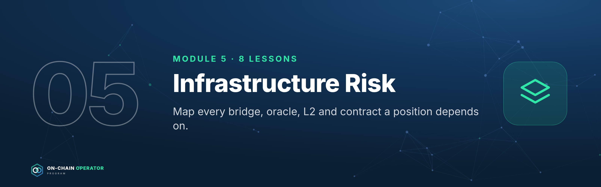

# Module 5 — Infrastructure Risk



*Outcome: map every bridge, oracle, L2 and contract a position depends on.*
*Stage 2 · Practitioner. Source: ATLAS "DeFi & On-Chain" ch. 19–23. Educational content only. Not financial advice.*

**Why this module matters:** most of DeFi's largest losses came from the
plumbing (bridges, oracles, admin keys, contract bugs), not from price moves.

---

## Lesson 5.0 — Mastery Starter

*New to this topic? Start here. It takes about 10 minutes and gets you from zero to ready for this module.*

### The 60-second version
Your position is only as safe as the weakest thing it depends on: the bridge that moved your tokens, the oracle that prices your collateral, the admin key that can upgrade the contract. Most big DeFi losses came from this plumbing.

### Words you'll need
| Term | Meaning |
|---|---|
| Bridge | moves tokens between chains |
| Layer 2 | a cheaper network built on Ethereum |
| Oracle | feeds prices into contracts |
| Proxy | a contract whose logic can be upgraded |
| Timelock | a delay before changes take effect |

### Before you start
- [ ] Modules 0–4

### Your first safe step
On a block explorer, open a protocol you use: is it a proxy? Who can upgrade it? Is there a timelock?

### The mastery ladder
| Level | You can… |
|---|---|
| **Beginner** | Knows which chain, bridge and oracle each position uses |
| **Practitioner** | Draws a full dependency map and reads audits properly |
| **Master** | Operates across EVM and non-EVM chains with capped bridge and wrapper exposure |

### You've mastered this module when…
…you can draw the complete dependency map of any position and rate each link.

---

## Lesson 5.1 — Bridges and trust assumptions *(ch. 19)*

### Objective
Choose bridge routes by their trust model, and size bridge exposure accordingly.

### Explanation
Bridges move value between chains:
- **Canonical bridges:** the chain's official route (e.g. a rollup's native bridge). Usually the strongest security, sometimes slower.
- **Lock-and-mint:** assets locked on chain A, a wrapped copy minted on chain B. The wrapped copy is only as good as the lock.
- **Liquidity networks:** market makers pay you out on the other side. Fast; you rely on their contracts and liquidity.
- **Trust model:** who can approve a transfer: a multisig of a few keys, a validator set, a light client, or fraud/validity proofs? Fewer, weaker signers = more risk.

Bridges hold large pools of value, which makes them prime targets.

### Worked example
Moving $50,000 to a Layer 2: use the canonical route for the bulk (even if
slower), a reputable fast bridge for a small, time-sensitive amount, and send a
test first. Never leave large balances as a **wrapped** asset from a weak bridge.

### Checklist
- [ ] Trust model of every bridge I use written down
- [ ] Canonical route preferred for size
- [ ] Wrapped-asset exposure capped

### Quiz
<details><summary>1. What backs a lock-and-mint wrapped token?</summary>The locked assets on the source chain, and the bridge's security.</details>
<details><summary>2. Why are bridges frequent hack targets?</summary>They concentrate large amounts of value behind complex, cross-chain logic.</details>
<details><summary>3. Fast bridge or canonical for $50k?</summary>Canonical for the bulk; fast only for small, urgent amounts.</details>

---

## Lesson 5.2 — Layer 2s, sequencers & withdrawal paths *(ch. 20)*

### Objective
Understand how your L2 settles, who orders your transactions, and how you'd exit.

### Explanation
- **Rollups** execute transactions off Ethereum and post data or proofs back to it.
- **Optimistic rollups** assume transactions are valid unless challenged. Native withdrawals to Ethereum wait out a **challenge window** (about 7 days on major optimistic rollups).
- **ZK rollups** post validity proofs, so native withdrawals can be faster.
- **Sequencer:** the operator that orders transactions. Often a single operator today; if it goes down, the chain may pause.
- **Escape hatches:** most rollups let you force a withdrawal via Ethereum if the sequencer censors you. Know if yours does.

### Worked example
You hold $20,000 on an optimistic rollup and need it on Ethereum. Native bridge:
safest, ~7 days. Fast bridge: minutes, for a fee, relying on its liquidity.
**Plan your liquidity ladder (Module 12.4) around the slow path.**

### Checklist
- [ ] Rollup type and withdrawal time known for each L2 I use
- [ ] Sequencer setup and escape hatch known
- [ ] Liquidity plan assumes the slow path

### Quiz
<details><summary>1. Why do optimistic rollup withdrawals take ~7 days?</summary>The challenge window lets anyone dispute an invalid state before it's final.</details>
<details><summary>2. What happens if a single sequencer goes down?</summary>The L2 may pause transactions until it recovers.</details>
<details><summary>3. What's an escape hatch?</summary>A way to force a transaction or withdrawal via the base chain if the sequencer censors you.</details>

---

## Lesson 5.3 — Oracles, TWAPs & manipulation *(ch. 21)*

### Objective
Know which price feed secures each position, and how it can fail.

### Explanation
Smart contracts can't see market prices; **oracles** bring them in. Lending
markets liquidate based on the oracle price, not the price you see on screen.
- **Push oracles:** a network updates prices on a schedule or when price moves past a **deviation threshold**.
- **Pull oracles:** prices are fetched and verified when a transaction needs them.
- **TWAP** (time-weighted average price) smooths manipulation, but **lags** fast moves.
- **Failures:** stale prices in outages, manipulation of thin markets, misconfigured feeds.

### Worked example
Your collateral is priced by a 30-minute TWAP. The market drops 10% in 5
minutes. Your screen shows −10%; the oracle shows maybe −2%. You feel liquidated
and aren't yet, **but you also can't rely on the lag**: it catches up.
Conversely, a thinly traded collateral token can be pushed up and borrowed against by an attacker.

### Checklist
- [ ] Oracle type and source known for each collateral
- [ ] Thin-market collateral avoided or capped
- [ ] Buffers sized for oracle catch-up

### Quiz
<details><summary>1. Which price triggers a DeFi liquidation?</summary>The oracle price used by the protocol.</details>
<details><summary>2. What's the trade-off of a TWAP?</summary>Harder to manipulate, but it lags fast moves.</details>
<details><summary>3. Why is thin-market collateral dangerous for lenders?</summary>Its price can be manipulated to borrow more than it's really worth.</details>

---

## Lesson 5.4 — Smart contracts: state, proxies, admin keys *(ch. 22)*

### Objective
Read who controls a contract and whether its code can change after you deposit.

### Explanation
- **State:** what a contract stores (balances, parameters). **Functions** change it; **events** log what happened.
- **Verified source:** the code published on the explorer matches what's deployed. That's good, not proof of safety.
- **Proxy / upgradeable contracts:** the address you use stays the same, but the logic behind it can be swapped. Whoever controls upgrades controls your funds' rules.
- **Admin keys and roles:** owners, guardians, multisigs; can they pause, upgrade or move funds?
- **Timelocks:** a delay between an approved change and it taking effect. Your window to exit.

### Worked example
On a block explorer, the vault you use shows "Proxy", with the upgrade admin a
**3-of-5 multisig** behind a **48-hour timelock**. That means no instant rug by
one key, and 48 hours to exit if a change you don't like is queued.
A 1-of-1 admin with no timelock is a red flag.

### Checklist
- [ ] Proxy or not, and who can upgrade
- [ ] Admin roles and multisig threshold known
- [ ] Timelock length known; alert on queued changes for large positions

### Quiz
<details><summary>1. Does verified source code mean safe?</summary>No. It means the published code matches the deployed code.</details>
<details><summary>2. Why does a timelock matter to users?</summary>It gives time to see and exit before a change takes effect.</details>
<details><summary>3. Red flag in admin setup?</summary>A single key that can upgrade or move funds instantly.</details>

---

## Lesson 5.5 — Smart-contract risk & what audits don't prove *(ch. 23)*

### Objective
Weigh contract risk honestly, and read an audit for what it actually covers.

### Explanation
- **Common failure types:** logic bugs, **reentrancy** (a contract is called back before it updates its state), broken access control, and **economic exploits** (correct code, exploitable incentives or oracles).
- **Audits** review specific code at a specific time. Check the **scope** (which contracts), **date** (before later changes?), **severity of findings** and whether they were **fixed**.
- **Bug bounties** pay hackers to report instead of exploit. A large, active bounty is a good sign.
- **Time and value at risk:** code that has safely held large value for years has survived more real attacks.

### Worked example
Protocol X: two audits, but the latest upgrade (last month) isn't in either
scope; bounty $50k; TVL $400M. The newest code is unaudited and the bounty is
small relative to the value. Size down, or wait.

### Checklist
- [ ] Audit scope matches deployed code; date after last upgrade
- [ ] Critical/high findings resolved
- [ ] Bug bounty size relative to TVL checked

### Quiz
<details><summary>1. What does an audit not prove?</summary>That the code (or later changes, or economic design) is safe.</details>
<details><summary>2. What is reentrancy?</summary>A contract being called back before it finishes updating its state, letting an attacker repeat actions.</details>
<details><summary>3. Why check audit dates?</summary>Code changed after the audit wasn't reviewed.</details>

---

## Lesson 5.6 — Beyond Ethereum: Solana, Bitcoin and other ecosystems *(new)*

### Objective
Operate safely on non-EVM chains and understand how Bitcoin is used in DeFi.

### Explanation
- **Solana:** a separate, high-throughput chain with its own wallets (e.g. Phantom, Solflare), its own address format, very low fees (paid in SOL), and priority fees when busy. Tokens follow its own standard (SPL). Your Ethereum address **doesn't** work there. Sending between ecosystems needs a bridge or an exchange.
- **Bitcoin in DeFi:** BTC itself doesn't run DeFi apps, so it's usually used as a **wrapped** token on other chains (backed by a custodian, a group of signers, or a protocol), or on Bitcoin layer 2s and sidechains. **Each wrapper has its own trust model.** Your "BTC" is only as good as whoever holds the real BTC.
- **Other ecosystems** (e.g. Cosmos chains connected by IBC, Move-based chains) each have their own wallets, fees and bridges. Apply Module 5's dependency map to each.
- **Same rules everywhere:** official wallet from the official site, test transaction first, correct network, gas token on hand.

### Worked example
You hold 1 BTC and want to lend it on Ethereum. Options: a custodial wrapper (trust
one company), a decentralised wrapper (trust a signer set or protocol), or not
wrapping at all. Write each option's trust model and cap wrapped BTC as bridge risk (5.1).

### Checklist
- [ ] Separate, official wallet for each non-EVM chain I use
- [ ] Gas token held on each chain
- [ ] Wrapped-BTC trust model known and capped

### Quiz
<details><summary>1. Does your Ethereum address work on Solana?</summary>No. It's a different ecosystem with its own address format and wallets.</details>
<details><summary>2. What determines a wrapped BTC token's safety?</summary>Who holds the real BTC and how it can be redeemed: its trust model.</details>
<details><summary>3. What's Solana's gas token?</summary>SOL.</details>

---

## Lesson 5.7 — Operating across chains: gas, routes and chain abstraction *(new)*

### Objective
Move value between chains cheaply and safely, without getting stranded without gas.

### Explanation
- **Gas stranding:** tokens on a chain where you have no gas token can't move. Keep a small gas float on every chain you use.
- **Route choice:** canonical bridge (safest, sometimes slow), fast bridge/liquidity network, exchange deposit-withdraw (often simplest for large amounts, but custodial for a moment), or intent-based cross-chain swaps (solvers deliver on the other chain).
- **Chain abstraction:** wallets and apps increasingly hide chains ("pay gas in USDC", "one balance across chains") using smart accounts, paymasters and solvers. It's convenient, and every layer that hides complexity is also a dependency.
- **Always:** check the destination network, send a test first, and record the route in your journal.

### Worked example
Moving $30,000 USDC from Arbitrum to Base: compare a canonical route via Ethereum
(two transactions, slower, higher gas), a reputable fast bridge ($5–$15 fee, minutes),
and an exchange (withdraw on Base; check the exchange supports USDC on both networks).
Send $50 first by the chosen route, keep ~$5 of ETH on Base for gas, then send the rest.

### Checklist
- [ ] Gas float on every chain I use
- [ ] Route chosen by trust model and size, not just speed
- [ ] Test amount first; route recorded

### Quiz
<details><summary>1. What is gas stranding?</summary>Having tokens on a chain with no gas token to move them.</details>
<details><summary>2. Risk of chain abstraction?</summary>Each hidden layer (smart accounts, paymasters, solvers) is an extra dependency.</details>
<details><summary>3. First step on any new route?</summary>Send a small test amount.</details>

---

## Lesson 5.8 — Reading smart-contract code: enough to verify claims *(expert)*

### Objective
Read verified contract code well enough to check the claims a protocol makes about itself.

### Explanation
You don't need to be a developer to spot the things that matter. In verified Solidity code on an explorer, look for:
- **Access control:** `onlyOwner`, `onlyRole(...)`, `onlyGovernance`. Who can call what? Search for functions guarded by them.
- **Dangerous powers:** `mint`, `pause`, `upgradeTo`, `setOracle`, `setFee`, `withdraw`/`sweep`/`rescue` functions that move user funds.
- **Upgradeability:** proxy patterns (`delegatecall`, `implementation`, `upgradeTo`), and who the admin is (5.4).
- **External calls and state order:** calling another contract before updating balances is the classic reentrancy pattern (5.5).
- **Parameters with no limits:** a fee that can be set to 100%, or an oracle address that can be swapped instantly.
- **Events:** what's logged tells you what you can monitor.

### Worked example
A token claims "fixed supply". In its code you find:
```
function mint(address to, uint256 amount) external onlyOwner { _mint(to, amount); }
```
The owner can mint unlimited tokens: the claim is false unless ownership is renounced
or held by a timelocked governance contract. Check the `owner()` value on the Read tab.

### Checklist
- [ ] Searched the code for owner/role-guarded functions
- [ ] Listed every function that can mint, pause, upgrade, change fees/oracles or move funds
- [ ] Checked who holds those roles (Read tab) and behind what timelock

### Quiz
<details><summary>1. What does `onlyOwner` on a mint function mean?</summary>The owner can mint new tokens whenever they like.</details>
<details><summary>2. Why check parameter limits?</summary>An unlimited setter (fee, oracle) can be changed to harm users instantly.</details>
<details><summary>3. What code pattern suggests reentrancy risk?</summary>An external call made before the contract updates its own state.</details>

---

### Module 5 practical
Pick one position you hold or plan. Draw its dependency map: chain, bridge,
oracle, contracts, admin/timelock, audits. Mark each link Low/Medium/High risk.
