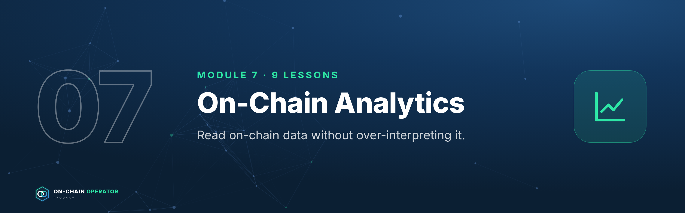

# Module 7 — On-Chain Analytics

*Outcome: read on-chain data without over-interpreting it.*
*Stage 3 · Analyst. Source: ATLAS "DeFi & On-Chain" ch. 27–34. Educational content only. Not financial advice.*

**The analyst's rule:** a transfer is observable; the owner's intention usually
isn't. Every metric needs a definition, a methodology, and context.

---

## Lesson 7.0 — Mastery Starter

*New to this topic? Start here. It takes about 10 minutes and gets you from zero to ready for this module.*

### The 60-second version
Everything on a public blockchain can be seen, but not everything can be understood. On-chain analytics means reading that data carefully: who moved what, where liquidity sits, how positioned the market is, without jumping to conclusions.

### Words you'll need
| Term | Meaning |
|---|---|
| Explorer | a site showing every transaction |
| Netflow | exchange inflows minus outflows |
| MVRV | market value ÷ realised value |
| Open interest | total open futures contracts |
| Depth | how much a trade moves price |

### Before you start
- [ ] Modules 0–6

### Your first safe step
Find your own last transaction on an explorer and identify: status, fee, method and token transfers.

### The mastery ladder
| Level | You can… |
|---|---|
| **Beginner** | Reads transactions and addresses on explorers |
| **Practitioner** | Uses flows, holder, activity and liquidity metrics with caveats |
| **Master** | Combines on-chain, derivatives and liquidity data into a research view without over-interpreting |

### You've mastered this module when…
…every metric in your research has a definition, a source and a caveat.

---

## Lesson 7.1 — On-chain data foundations *(ch. 27)*

### Objective
Avoid the classic misreads of on-chain data.

### Explanation
- **Address ≠ person:** one person can have many addresses; one exchange address serves millions.
- **Transfer ≠ trade:** moving tokens isn't buying or selling.
- **Labels are probabilistic:** providers guess who owns what; they can be wrong.
- **Active addresses** can be inflated by bots or airdrop farming.
- **Data provenance:** know chain coverage, indexing method and delay.

### Worked example
"Whale moves $100M of BTC!" It's an exchange shuffling between its own cold and
hot wallets. No trade happened. Check labels, destination and history before reacting.

### Checklist
- [ ] I check what an address is before interpreting a move
- [ ] I note each metric's source and definition

### Quiz

1. Does an address equal a person?
No.

2. Is a large transfer a sale?
Not necessarily. It may be internal or custodial.

3. Why can active-address counts mislead?
Bots and farming inflate them.

---

## Lesson 7.2 — Block explorer mastery *(ch. 28)*

### Objective
Read any transaction on an explorer without using the app's interface.

### Explanation
For a transaction: **status** (success/fail), **block**, **from/to**, **value**,
**fee**, **method** called, **token transfers** (events), **internal calls**, and
**logs**. For a contract: **read** (state, parameters) and **write** (call
functions directly, carefully) tabs; **proxy** info; **verified source**.

### Worked example
Your swap on an L2: status Success · method `swap` · token transfers: 100 USDC
out, 0.0331 ETH in · fee 0.00002 ETH. The event log confirms the router and
pool. You've verified the trade without trusting the website.

### Checklist
- [ ] I can find status, fee, method and token transfers
- [ ] I can read a contract's parameters on the Read tab
- [ ] I can check and revoke approvals

### Quiz

1. Where do you see tokens that actually moved?
Token transfers (event logs).

2. What does the Read tab show?
A contract's public state and parameters.

3. Why verify on the explorer?
It's the ground truth, independent of any website.

---

## Lesson 7.3 — Exchange flows *(ch. 29)*

### Objective
Interpret exchange inflows and outflows with the right caveats.

### Explanation
**Inflows** to exchanges *may* precede selling (or collateral posting,
internal moves). **Outflows** *may* mean self-custody or DeFi use.
**Netflow** = inflows − outflows. Exchange reserves on-chain aren't proof of
solvency (liabilities aren't visible).

### Worked example
Netflow +20,000 ETH in a day. Before concluding "selling pressure": check if it's
one exchange reshuffling, whether derivatives open interest rose (collateral), and
whether price and volume confirm. One metric is a hypothesis, not a signal.

### Checklist
- [ ] Flows cross-checked with price, volume and derivatives
- [ ] Internal exchange moves ruled out

### Quiz

1. What is netflow?
Inflows minus outflows over a period.

2. Do exchange reserves prove solvency?
No. Liabilities aren't visible on-chain.

3. Is a large inflow always bearish?
No. It can be collateral or an internal move.

---

## Lesson 7.4 — Whale & entity analysis *(ch. 30)*

### Objective
Use large-holder data without copying wallets blindly.

### Explanation
Separate exchanges and contracts from individuals before measuring
concentration. **Accumulation/distribution** is inferred, not known.
**"Smart money" labels** carry survivorship bias. **Copying wallets** ignores
their hedges, size and private information.

### Worked example
A "smart money" wallet buys a token. You don't see its perp short elsewhere; it
may be hedged and farming. Copying the visible leg makes you the unhedged one.

### Checklist
- [ ] Contracts/exchanges excluded from concentration figures
- [ ] Wallet-following treated as a lead to research, not a signal

### Quiz

1. Why is wallet-copying risky?
You can't see the wallet's hedges, size or intent.

2. What is survivorship bias in labels?
Only wallets that did well get labelled "smart".

3. First step in measuring holder concentration?
Remove exchange and contract addresses.

---

## Lesson 7.5 — Holder & supply metrics *(ch. 31)*

### Objective
Read MVRV, SOPR and HODL waves as context, not signals.

### Explanation
- **Realised cap:** values each coin at the price it last moved (a cost-basis estimate).
- **MVRV** = market cap ÷ realised cap. High = holders in large aggregate profit.
- **SOPR** (spent output profit ratio): >1 means coins moved today were, on average, sold at a profit.
- **HODL waves:** supply by coin age.
- Definitions differ by provider; strongest on UTXO chains like Bitcoin.

### Worked example
Market cap $1.2T, realised cap $0.6T → **MVRV 2.0**: the average holder is at
roughly 2× their cost basis. That's context for risk management (e.g. how much to
de-risk), not a precise top signal.

### Checklist
- [ ] Provider methodology read before using a metric
- [ ] Metrics used for context and sizing, not as triggers alone

### Quiz

1. MVRV formula?
Market cap ÷ realised cap.

2. SOPR above 1 means?
Coins moved were, on average, in profit.

3. Why read the provider's methodology?
Definitions vary, and interpretations depend on them.

---

## Lesson 7.6 — Network activity *(ch. 32)*

### Objective
Judge a chain's real usage beyond transaction counts.

### Explanation
Transaction counts depend on architecture and bots. Better: **fees paid**
(real demand for blockspace), **stablecoin activity**, **DEX volume**, **app
revenue**, and retention of users over time.

### Worked example
Chain A: 5M transactions/day, $20k fees. Chain B: 500k transactions/day, $2M
fees. B's users pay 100× more for blockspace, a stronger sign of valuable activity.

### Checklist
- [ ] Fees and app revenue compared, not just transaction counts
- [ ] Bot activity considered

### Quiz

1. Why are fees a better usage signal than transaction counts?
Paying fees shows real demand; counts are easy to inflate.

2. What distorts transaction counts?
Bots, batching and chain design.

3. Name one strong activity metric.
Fees, app revenue, stablecoin activity or user retention.

---

## Lesson 7.7 — DEX & liquidity analytics *(ch. 33)*

### Objective
Measure whether a pool can actually absorb your trade and pay you as an LP.

### Explanation
- **TVL** can double count and moves with token prices.
- **Depth:** the price impact for a given trade size. The number that matters for execution.
- **Volume/TVL:** rough capital turnover; higher means more fees per dollar (Lesson 2.3).
- **Liquidity migration:** incentives move liquidity quickly between pools and chains.

### Worked example
Pool A: $50M TVL, $5M daily volume (0.1 turnover). Pool B: $10M TVL, $8M
volume (0.8 turnover). B pays LPs far more per dollar, but a $1M trade will
move B's price much more than A's.

### Checklist
- [ ] Depth checked at my trade size
- [ ] Volume/TVL used for LP fee estimates

### Quiz

1. Why is depth more useful than TVL for traders?
It measures price impact at a given size.

2. High volume/TVL means?
More fees per dollar of liquidity.

3. What causes liquidity migration?
Incentives moving between pools and chains.

---

## Lesson 7.8 — Derivatives on-chain *(ch. 34)*

### Objective
Read funding, open interest and liquidation data as positioning context.

### Explanation
- **Perpetual futures (perps):** no expiry; kept near spot by **funding** payments.
- **Positive funding:** longs pay shorts (crowded longs). **Negative:** shorts pay longs.
- **Open interest (OI):** total open contracts. Rising OI with rising price means leverage building.
- **Liquidation data:** bursts of forced closes.

### Worked example
Price +8% in a week, OI +40%, funding at its highest in months: leverage is
crowding into longs. That's a fragile setup (a drop could cascade) and, for
Lesson 10.3, a funding-carry opportunity with a squeeze risk.

### Checklist
- [ ] Funding and OI checked before leveraged or carry trades
- [ ] Liquidation clusters noted

### Quiz

1. What does positive funding mean?
Longs are paying shorts.

2. Rising price + rising OI + high funding suggests?
Leveraged longs are crowding in; the setup is fragile.

3. What keeps a perp near spot?
Funding payments.

---

### Module 7 practical: analyst capstone part 2
Add an on-chain section to your Module 6 file: holder concentration, flows,
activity (fees/revenue), liquidity depth and derivatives positioning for the
protocol's token or markets. Submit both parts as the **analyst capstone**
(brief and rubric in `07-program-operations.md`).
