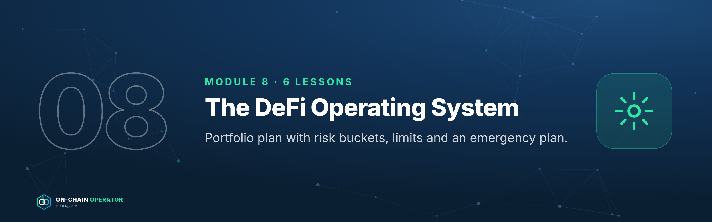

# Module 8 — The DeFi Operating System

*Outcome: a written portfolio plan with risk buckets, limits and an emergency plan.*
*Stage 4 · Strategist. Source: ATLAS "DeFi & On-Chain" ch. 38–40, 42. Lesson 8.3 (the 25-strategy library) is in `03-defi-strategy-mastery.md`. Educational content only. Not financial advice. Figures are illustrative.*

---

## Lesson 8.0 — Mastery Starter

*New to this topic? Start here. It takes about 10 minutes and gets you from zero to ready for this module.*

### The 60-second version
Individual positions don't make a portfolio. This module turns strategies into a system: buckets and caps, a risk register, a strategy library, a routine, honest performance measurement, and rules for your own behaviour.

### Words you'll need
| Term | Meaning |
|---|---|
| Bucket | a portion of capital with a job and a cap |
| Risk register | a scored list of risks and responses |
| Kill rule | a pre-written exit trigger |
| Benchmark | the simple alternative you must beat |
| TWR | return that ignores deposit timing |

### Before you start
- [ ] Modules 0–7

### Your first safe step
Write your current holdings into four buckets (reserve, core, productive, speculative) with a percentage for each.

### The mastery ladder
| Level | You can… |
|---|---|
| **Beginner** | Has buckets, caps and a journal |
| **Practitioner** | Keeps a scored risk register, uses the strategy library, measures TWR vs a benchmark |
| **Master** | Runs a disciplined routine with written rules for behaviour, reviewed monthly |

### You've mastered this module when…
…you have a written portfolio plan and a quarter of honest, benchmarked results.

---

## Lesson 8.1 — DeFi portfolio construction *(ch. 38)*

### Objective
Split capital into risk buckets with caps, so no single failure can sink the portfolio.

### Explanation
- **Buckets:** liquidity reserve · core (simple, durable) · productive (LP, vaults, carry) · speculative (new, points, experiments).
- **Concentration caps:** per protocol, per chain, per stablecoin issuer, per bridge.
- **Genuine diversification:** two front ends on the same protocol, or two stablecoins with the same backing, are one risk, not two.
- **Rebalancing rules:** thresholds that trigger moving money between buckets.

### Worked example — a $100,000 DeFi book (illustrative)
| Bucket | Share | Example holdings | Cap per protocol |
|---|---|---|---|
| Reserve | 15% | Stablecoins split across 2 issuers, instant access | n/a |
| Core | 45% | Blue-chip stable lending (2 protocols), ETH staking | 20% |
| Productive | 30% | Wide concentrated LP, a vault, a PT | 10% |
| Speculative | ≤10% | Points, new protocols | 5% |

Rebalance when any bucket drifts more than 5 points from target, or after any incident.

### Checklist
- [ ] Buckets and targets written
- [ ] Caps per protocol, chain, issuer, bridge written
- [ ] Rebalancing rule written

### Quiz

1. Two stablecoins backed by the same collateral: diversified?
No. They share one failure point.

2. Why keep a reserve bucket?
To defend debt, meet needs and redeploy without forced selling.

3. When should you rebalance?
When buckets drift past the threshold, or after an incident.

---

## Lesson 8.2 — The DeFi risk framework *(ch. 39)*

### Objective
Keep a risk register that scores every position's risks and names the response.

### Explanation
The eight risk surfaces: **smart-contract · economic · oracle · liquidity ·
governance · bridge/chain · counterparty · user-operation.**
Score each for **likelihood (1–5) × impact (1–5)**. Anything ≥ 15 needs a
mitigation or an exit; anything ≥ 20 shouldn't be held.

### Worked example — one register row
| Position | Risk | L | I | Score | Response |
|---|---|---|---|---|---|
| USDC lending, Protocol Y | Oracle on one collateral is thin | 3 | 4 | 12 | Cap 10%, alert on governance changes |
| LST loop | Rate spike above break-even | 3 | 3 | 9 | Alert at 4.5% borrow; unwind rule |
| Bridged stablecoin on new L2 | Bridge exploit | 2 | 5 | 10 | Canonical bridge; cap 5% |
| New farm | Contract bug (unaudited upgrade) | 4 | 5 | **20** | **Don't hold** |

### Checklist
- [ ] Register covers every position and all eight surfaces
- [ ] Scores ≥ 15 have a mitigation or exit
- [ ] Reviewed monthly and after incidents

### Quiz

1. How is a risk scored?
Likelihood × impact, each 1–5.

2. What's a user-operation risk?
Your own mistakes: wrong network, bad signature, lost keys.

3. Score 20. Action?
Don't hold it.

---

## Lesson 8.3 — Strategy library

The full strategy library (25 strategies in 6 levels, each with its profit
engine, maths, execution, kill rules and failure modes) is **Lesson 8.3:
DeFi Strategy Mastery** (`03-defi-strategy-mastery.md`).

---

## Lesson 8.4 — The operating playbook: deploy, monitor, respond, review *(ch. 42)*

### Objective
Run every position through the same four-phase routine.

### Explanation
1. **Deploy:** due diligence done · before-signing checklist · test amount · journal row (protocol, chain, contracts, amount, entry, thesis, kill rules, approvals).
2. **Monitor:** daily HF/pegs/ranges/incidents; weekly P&L vs benchmark, harvest, revoke; monthly register review.
3. **Respond:** pre-written actions for each trigger (see Module 11.5 for incidents).
4. **Review:** net return after all costs vs benchmark; simplify anything you can't explain in one sentence.

### Worked example — a journal row
| Field | Entry |
|---|---|
| Position | USDC supply, Protocol Y, Arbitrum |
| Amount / date | $10,000 · 2026-09-01 |
| Thesis | ~5% from real borrow demand |
| Kill rules | Utilisation > 95% for 48h; oracle or collateral change; any incident |
| Approvals | USDC → Protocol Y pool, limited to $10,000 |
| Weekly | Interest earned, utilisation, governance notes |

### Checklist
- [ ] Journal row for every position
- [ ] Daily / weekly / monthly routine in the calendar
- [ ] Response actions written per trigger

### Quiz

1. The four phases?
Deploy, monitor, respond, review.

2. What goes in a journal row?
Position, amount, date, thesis, kill rules, approvals and ongoing results.

3. What to do with a strategy you can't explain simply?
Simplify it or exit.

---

## Lesson 8.5 — Measuring performance honestly *(new)*

### Objective
Measure your results so deposits, withdrawals and lucky markets don't fool you.

### Explanation
- **Time-weighted return (TWR):** chains the return of each period, ignoring when you added or removed money. It measures your *decisions*.
- **Money-weighted / simple gain:** what your total capital actually did, including the timing of deposits.
- **Benchmark:** compare against what you'd have got doing something simple: holding the same assets, or plain stablecoin lending. Beating zero isn't the test.
- **Attribution:** split the result into sources: price moves, fees, interest, incentives, costs, losses. Only the parts you control show skill.

### Worked example
Start $100,000 → +10% in Q1 ($110,000) → deposit $50,000 ($160,000) → −5% in Q2 → $152,000.
`defi_calc.py twr --period 10 --period -5 --start 100000 --end 152000 --net-deposits 50000`
- TWR: 1.10 × 0.95 − 1 = **4.50%** (your decisions)
- Simple gain on $150,000 put in: **1.33%** (hurt by the deposit landing before a down quarter)
Then compare 4.50% with holding ETH over the same period, and with stablecoin lending.

### Checklist
- [ ] TWR calculated quarterly
- [ ] Benchmark chosen and compared
- [ ] Results attributed by source

### Quiz

1. What does TWR remove?
The effect of when deposits and withdrawals happened.

2. Why use a benchmark?
To see whether the strategy beat doing something simple, not just beat zero.

3. Two quarters, +8% then +2%. TWR?
1.08 × 1.02 − 1 = 10.16%.

---

## Lesson 8.6 — Psychology and discipline *(new)*

### Objective
Recognise the behaviours that turn good strategies into losses, and build rules that stop them.

### Explanation
| Bias | What it looks like | Rule that stops it |
|---|---|---|
| **FOMO** | Jumping into a farm because everyone's posting about it | 24-hour change-control wait (14.3) |
| **Loss aversion** | Holding a broken position hoping to "get back to even" | Kill rules written at entry, then followed |
| **Sunk cost** | "I've spent so much gas, I can't exit now" | Judge only the future: would you enter today? |
| **Overconfidence** | Raising size after a winning streak | Caps are percentages; size changes only at review |
| **Revenge trading** | Adding leverage to win back a loss | No new leverage within 7 days of a loss event |
| **Anchoring** | Refusing to sell below a past price | Decisions based on current data and the thesis |

**The operator's defence** is structure: written theses, kill rules, caps, a
journal, cooling-off periods and scheduled reviews. Willpower in the moment is unreliable.

### Worked example
After a 20% loss on a farm, Jordan wants to put 3× leverage on the next idea "to
make it back". The rulebook says: no new leverage within 7 days of a loss event,
and size only changes at the monthly review. Jordan journals the urge, waits,
and at review decides the idea doesn't meet the thesis standard at all.

### Checklist
- [ ] Personal rulebook written (cooling-off, loss rules, sizing rules)
- [ ] Emotions noted in the journal next to decisions
- [ ] Monthly review includes "which rule did I break?"

### Quiz

1. What's the sunk-cost question?
Would I enter this position today, knowing what I know now?

2. Why rely on structure rather than willpower?
Decisions under stress are unreliable; pre-written rules decide for you.

3. Rule against revenge trading?
For example, no new leverage within 7 days of a loss event.

---

### Module 8 practical
Write your portfolio plan: buckets and caps (8.1), risk register (8.2), your
chosen strategies from 8.3 with kill rules, and your operating calendar (8.4).
