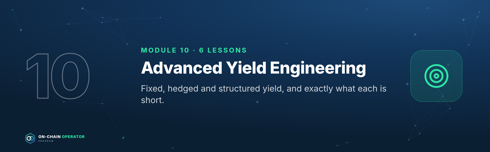
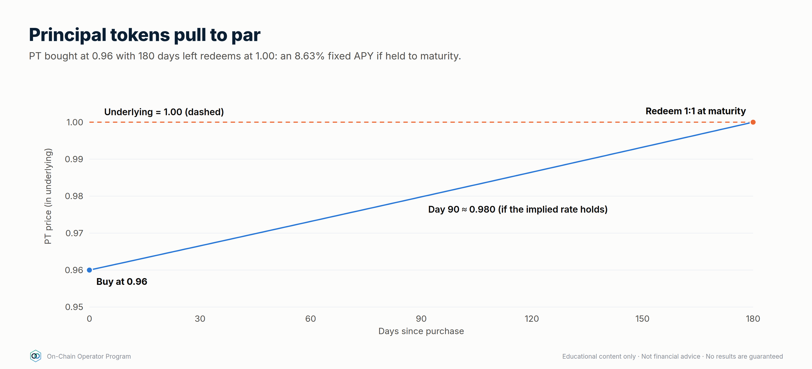
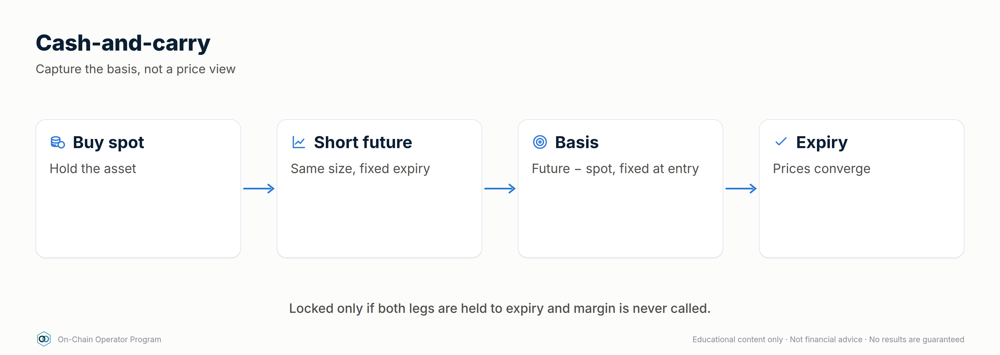
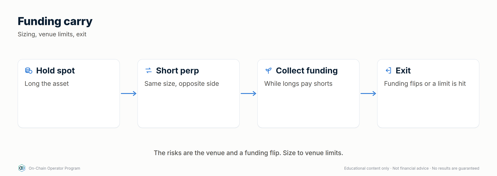
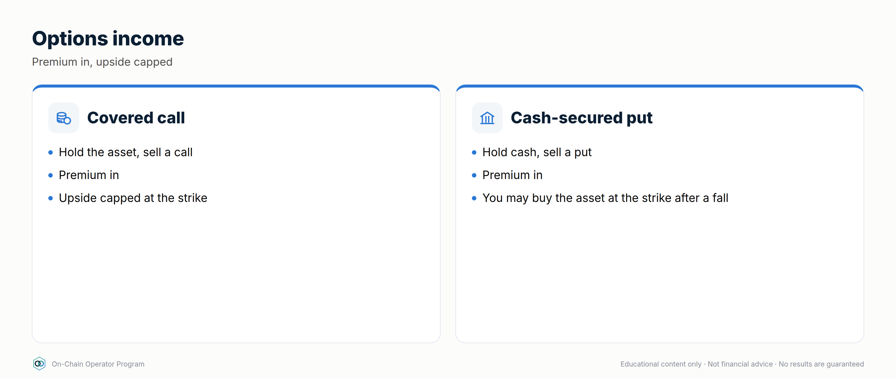
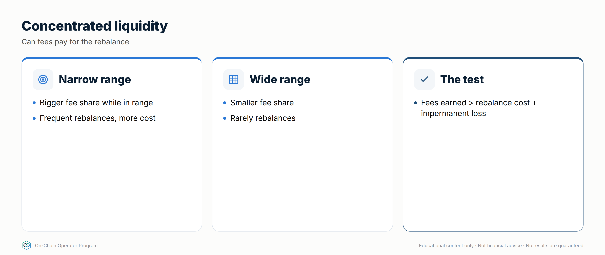
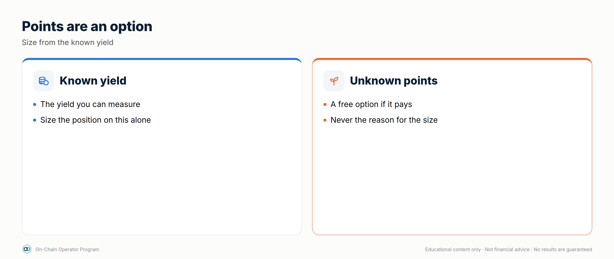
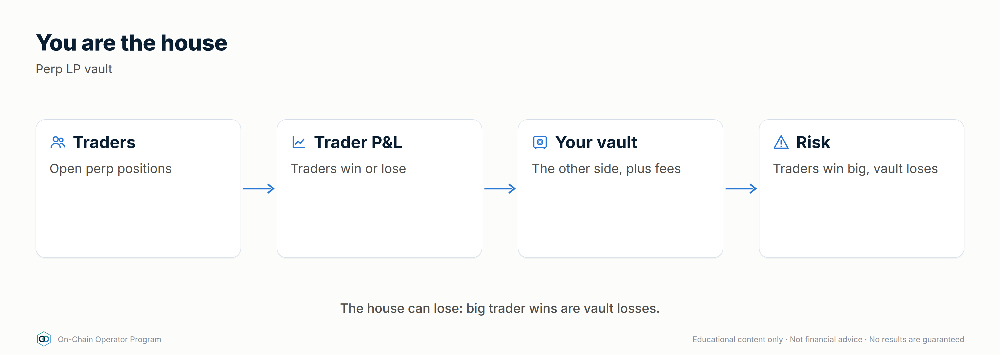
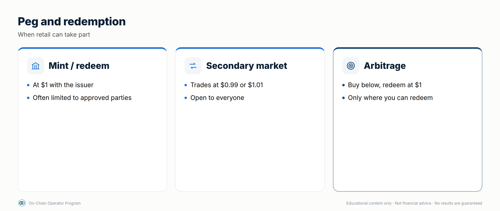

# Module 10 — Advanced Yield Engineering

*Outcome: build fixed, hedged and structured yield, and know exactly what each position is short.*
*Stage 4 · Strategist. Prerequisites: Modules 1–9. Educational content only. Not financial advice. Figures are illustrative; use live rates.*

**The professional's rule for this module:** every structured position swaps
one risk for another. Before entering, write one sentence: *"This position
is short ___."* If you can't fill the blank, you're not ready to enter.

---

## Lesson 10.0 — Mastery Starter

*New to this topic? Start here. It takes about 10 minutes and gets you from zero to ready for this module.*

### The 60-second version
Professionals don't just take the yield on offer: they engineer it. Fixed rates, hedged carry, option income and managed ranges each swap one risk for another. This module teaches you to build them and say exactly what each one is short.

### Words you'll need
| Term | Meaning |
|---|---|
| PT / YT | principal and yield tokens splitting a yield-bearing asset |
| Basis | a future's premium over spot |
| Funding | payments between perp longs and shorts |
| Covered call | selling upside for a premium |
| Delta-neutral | price moves roughly cancel out |

### Before you start
- [ ] Modules 0–9, including perps (3.5) and LP maths (Module 2)

### Your first safe step
Price one live PT with `defi_calc.py pt` and write: "This position is short ___."

### The mastery ladder
| Level | You can… |
|---|---|
| **Beginner** | Understands each structure and its payoff |
| **Practitioner** | Sizes and runs one structured position with written exits |
| **Master** | Combines fixed, carry, options and LP yield inside caps, naming every short exposure |

### You've mastered this module when…
…you can complete "this position is short ___" for every structured position you hold.

---

## Lesson 10.1 — Fixed-rate yield: principal and yield tokens (PT/YT)

### Objective
Lock a fixed return using principal tokens, and price a yield token against its implied rate.

### Explanation
**Yield tokenization** takes a yield-bearing asset (a staked asset, a lending
receipt, a stablecoin savings token) and splits it into two tokens that
mature on a set date:

- **PT (principal token):** redeems 1:1 for the underlying at maturity. It
  trades at a **discount** before then. Buy the discount, hold to maturity,
  and your return is fixed.
- **YT (yield token):** receives *all* the variable yield (and often points)
  the underlying earns until maturity, then is worth zero.

PT + YT = one unit of the underlying. The PT price implies a fixed rate; the
YT is a bet that realised yield beats it.

`fixed APY = (1 ÷ PT price)^(365 ÷ days) − 1`

### Worked example
A stablecoin savings token has a PT maturing in **180 days**, priced at **0.96**.
- `defi_calc.py pt --price 0.96 --days 180` → **8.63%** fixed APY if held to maturity.
- $100,000 buys ~104,167 PT → redeems for ~104,167 of the underlying at maturity.
- The YT costs ~0.04 per unit. It only profits if the underlying's realised
  yield (plus any points) averages above ~8.6% for the 180 days.

**Near maturity, small discounts are big rates:** PT at 0.985 with 60 days left
→ **9.63%** APY. Check liquidity before chasing these; exiting early means
selling into the pool.

### What this position is short
PT: the underlying's credit/depeg risk, and liquidity if you exit early.
YT: falling yields, and time (it decays to zero).

### Checklist
- [ ] I'd hold the underlying asset anyway
- [ ] Maturity date matches when I'll need the money (Module 12.4 ladder)
- [ ] Pool depth checked for an early exit
- [ ] YT sized as speculation, not income

### Quiz

1. PT at 0.97, 120 days to maturity. Fixed APY?
(1/0.97)^(365/120) − 1 ≈ 9.7%.

2. Does buying PT remove the underlying's risk?
No. It fixes the rate. If the underlying depegs or is exploited, the PT redeems into a damaged asset.

3. What must happen for a YT to profit?
Realised variable yield plus points must beat the implied rate priced into the PT.

---

## Lesson 10.2 — Cash-and-carry basis trades

### Objective
Capture the premium of a dated future over spot without taking a view on price.

### Explanation
In rising markets, dated futures usually trade **above** spot. The gap (basis)
shrinks to zero at expiry because the future settles at spot.
**Buy spot + short the future at the same size** and you lock that gap,
whatever the price does, as long as both legs survive to expiry.

`annualised basis = (future ÷ spot − 1) × 365 ÷ days`

### Worked example
ETH spot **3,000**, 90-day future **3,060**.
- Basis = 2.0% → **8.11%** annualised (`defi_calc.py basis --spot 3000 --future 3060 --days 90`).
- At expiry, if ETH is 2,000: spot leg −1,000, short future +1,060 → +60 per ETH.
- At expiry, if ETH is 4,500: spot leg +1,500, short future −1,440 → +60 per ETH.
- **The catch:** before expiry, a rally to 4,500 means the short leg shows
  −1,440 per ETH. Without enough margin on the futures venue, it's closed out
  and you're left long spot at the top.

### What this position is short
Margin and venue risk: a squeeze on the short leg, or the venue failing.

### Checklist
- [ ] Both legs opened together, same size
- [ ] Futures margin survives at least a +100% move, or a rule to top up
- [ ] Venue risk sized (cap per venue)
- [ ] Plan to hold to expiry; early exit may be at a worse basis

### Quiz

1. Spot 2,000, 180-day future 2,080. Annualised basis?
4% × 365/180 ≈ 8.1%.

2. Why is the return "locked" at expiry?
The future settles at spot, so the gain on one leg offsets the loss on the other, leaving the entry basis.

3. What breaks the trade before expiry?
A margin call or liquidation on the short future during a rally, or venue failure.

---

## Lesson 10.3 — Delta-neutral funding carry, done properly

### Objective
Run a funding-carry position with proper sizing, venue limits and exit rules.

### Explanation
Perpetual futures pay **funding** between longs and shorts to keep the perp
near spot. In bullish markets longs usually pay shorts. Long spot + short
perp at the same size = no net price exposure, while collecting funding.

Professional rules:
1. **Measure funding over time, not today.** Use a 7- and 30-day average.
2. **Exit rule:** close when the 7-day average turns negative (you'd start paying).
3. **Margin buffer:** the short leg's leverage decides how big a rally it survives.
4. **Venue limits:** split across venues; cap each one.

### Worked example
Funding **+0.01% per 8h** ≈ **10.95% APR** on the hedged size.
| Short-leg leverage | Capital per $1 hedged | Return on capital | Short liquidates on a rally of roughly |
|---|---|---|---|
| 1× | $2.00 | ~5.5% | +100% |
| 2× | $1.50 | ~7.3% | +50% |
| 3× | $1.33 | ~8.2% | +33% |

`defi_calc.py carry --rate-8h 0.01 --short-lev 3`

Higher leverage improves return on capital a little and makes the position
much more fragile. Most operators stay at 1–2× and top up margin from reserve.

### What this position is short
Funding turning negative, short squeezes, and venue failure.

### Checklist
- [ ] 7- and 30-day funding averages checked
- [ ] Exit rule written (e.g. 7-day average < 0)
- [ ] Short-leg leverage ≤ 2×, top-up plan from reserve
- [ ] Per-venue cap set

### Quiz

1. Funding is +0.005%/8h. APR on hedged size?
≈ 5.5%.

2. Why not run the short at 5×?
A ~20% rally would liquidate the short and leave you unhedged long.

3. What's the exit signal?
Average funding turning negative, meaning shorts start paying.

---

## Lesson 10.4 — Options income: covered calls, cash-secured puts, options vaults

### Objective
Earn option premium on assets you'd hold or buy anyway, knowing exactly what you give up.

### Explanation
- **Covered call:** you hold the asset and sell someone the right to buy it
  from you at a higher **strike**. You keep the premium, and your upside is capped at the strike.
- **Cash-secured put:** you hold stablecoins and sell someone the right to sell
  you the asset at a lower strike. You keep the premium. If price falls below
  the strike, you buy at the strike.
- **The wheel:** sell puts until assigned → hold the asset → sell calls until
  called away → repeat.
- **Options vaults** automate this on-chain. They add contract risk and you
  don't choose the strikes.

### Worked example
ETH at **3,000**.
- **Covered call:** sell a 7-day **3,300** call for **0.4%** ($12).
  ≈ **20.9%** annualised *if* repeated at that premium, which it won't be exactly.
  Max gain for the week 10.4%. Break-even **2,988**.
  `defi_calc.py covered-call --spot 3000 --strike 3300 --premium 0.4`
- **Cash-secured put:** sell a 7-day **2,700** put for **$12** with $2,700 reserved
  → **0.44%** on the cash for the week. If assigned, effective entry **$2,688**.

### What this position is short
Covered call: upside above the strike, plus the full downside of the asset.
Cash-secured put: a crash through the strike.

### Checklist
- [ ] Only on assets I'd hold (calls) or buy at the strike (puts)
- [ ] Strike chosen from levels, not from the premium
- [ ] Annualised premium treated as "if repeated", never promised
- [ ] Vault due diligence done if automating

### Quiz

1. What do you give up by selling a covered call?
Gains above the strike for that period.

2. Put strike 2,700, premium $15. Effective entry if assigned?
$2,685.

3. Does premium protect you in a crash?
Only by the size of the premium. The asset's downside remains.

---

## Lesson 10.5 — Active concentrated-liquidity management

### Objective
Choose a range width and a rebalance rule that fee income can actually pay for.

### Explanation
Narrower ranges earn more fees per dollar *while in range* and go out of range sooner.

| Range around $3,000 | Capital efficiency vs full range |
|---|---|
| $2,400–$3,600 (±20%) | ~10.4× |
| $2,700–$3,300 (±10%) | ~20.4× |
| $2,850–$3,150 (±5%) | ~40.5× |

`defi_calc.py cl --low 2850 --high 3150`

Every rebalance costs gas and swap fees and **locks in** the impermanent loss
so far. Professionals set a rule before entering:
- **Width from volatility:** at least ~1.5× the typical weekly move.
- **Rebalance trigger:** out of range for 24h+, *and* the range thesis still holds.
- **Invalidation:** a structural break (as with a grid bot) means exit, not re-centre.
- **Budget:** rebalancing costs capped at a share of expected fees (e.g. ≤ 25%).

### Worked example
ETH typically moves ±7% a week. A ±5% range would be out of range most
weeks. The rule points to **±10–12%**: ~20× efficiency, and time in range to earn.

### What this position is short
Trending markets and volatility above what the range was sized for.

### Checklist
- [ ] Width ≥ 1.5× typical weekly move
- [ ] Rebalance trigger and invalidation written
- [ ] Rebalance cost budget set
- [ ] P&L tracked against holding (Lesson 2.4)

### Quiz

1. Why does a ±5% range earn ~2× the fees of ±10% while in range?
The same capital is concentrated in half the price range, so it provides about twice the liquidity there.

2. What does a rebalance lock in?
The impermanent loss accrued so far, plus gas and swap costs.

3. Price breaks structure and exits the range. Re-centre?
No. That's an invalidation. Exit per plan.

---

## Lesson 10.6 — Restaking and points: pricing speculative yield

### Objective
Value restaking and points programmes without letting unknown rewards drive position size.

### Explanation
Restaking reuses staked assets to secure more services, paying extra rewards
and often **points**: an off-chain score that may or may not become a token.
The risk stack grows at each layer: staking → liquid restaking token →
restaking protocol → each service it secures → slashing conditions.

Professional rules:
- **Plan with points at zero.** Base the decision on yield you can measure.
- **Treat points as an airdrop bet:** `EV = P(payout) × value − costs`.
- **Hedge price if you only want the yield:** short the underlying perp (strategy #24), knowing the hedge doesn't cover a depeg of the restaking token.
- **Cap it:** speculative bucket only (≤ 5–10% of DeFi capital).

### Worked example
$20,000 in a liquid restaking token: base staking yield ~3% ($600/yr).
Points: you estimate a 30% chance of a payout worth $1,500, costing $200 in
gas and bridging: `defi_calc.py airdrop --probability 0.3 --value 1500 --costs 200`
→ EV **$250**. Worth doing only if the position still makes sense at $600/yr
and the risk stack is acceptable.

### What this position is short
Slashing, depeg of the restaking token, and the chance that points never become anything.

### Checklist
- [ ] Decision still works with points valued at zero
- [ ] Full risk stack written, layer by layer
- [ ] Sized inside the speculative bucket
- [ ] Hedge (if any) and its gap understood

### Quiz

1. Why value points at zero?
They're not guaranteed to become anything, so a decision that needs them is a speculation.

2. What does a perp hedge on the underlying miss?
The restaking token depegging from the underlying.

3. Name three layers of the restaking risk stack.
Any three: staking/validators, the liquid restaking token, the restaking protocol, each service secured, slashing conditions.

---

## Lesson 10.7 — Being the house: perp-exchange liquidity vaults *(expert)*

### Objective
Understand what you're really taking on when you provide liquidity to a perpetuals exchange.

### Explanation
Many on-chain perp exchanges let you deposit into a **liquidity vault** that acts as the
**counterparty** to traders (the "house"). The vault earns trading fees, borrowing/funding fees
and part of liquidations, and **loses when traders win**.
- **Returns:** fees + traders' losses − traders' profits.
- **Risks:** a run of profitable traders (or a few very large ones), open interest concentrated on one side, oracle manipulation or latency, the market-making strategy of the vault (some vaults actively trade), and exchange contract risk.
- **Check:** the vault's historical P&L split (fees vs trader P&L), its open-interest caps, how it prices assets (oracle), and withdrawal rules (cooldowns, fees).

### Worked example
A vault shows 25% APR: 18% from fees, 7% from traders' net losses over the last 6 months.
In a strong one-directional trend, traders who are long win, so the vault's "trader P&L"
component can swing to −20% or worse, wiping out the fees. Size it as an **active trading
exposure**, not as fixed income, and check whether withdrawals are delayed in stress.

### What this position is short
Trader skill and trending markets; oracle quality; the exchange's own risk controls.

### Checklist
- [ ] Vault returns split into fees vs trader P&L, with history
- [ ] Open-interest caps and oracle design reviewed
- [ ] Withdrawal cooldowns and stress behaviour known

### Quiz

1. When does a perp liquidity vault lose money?
When traders are net profitable, e.g. in strong trends.

2. Why isn't it fixed income?
Part of the return is traders' losses, which can reverse sharply.

3. Name two things to check before depositing.
Any two: fee vs trader-P&L history, OI caps, oracle design, withdrawal rules, contract risk.

---

## Lesson 10.8 — DeFi rates: term structure, fixed vs floating *(expert)*

### Objective
Read DeFi's interest-rate curve and position for fixed or floating rates deliberately.

### Explanation
- **Floating rates:** lending and borrowing APYs that change with utilisation (Module 3).
- **Fixed rates:** PTs (10.1), fixed-rate lending markets and fixed-rate borrowing (#22).
- **Term structure:** PT implied yields across maturities form a **yield curve** (e.g. 3-month vs 12-month). Upward sloping: the market expects rates to stay high or rise. Inverted: it expects them to fall.
- **Positioning:** buying PT = receiving a fixed rate (you win if floating rates fall). Buying YT = receiving the floating rate (you win if floating rates rise). Fixed-rate borrowing = paying a fixed rate (you win if floating borrow rates rise).
- **Basis between venues:** the same asset's rates can differ across protocols and chains; the gap reflects risk, liquidity and friction as much as opportunity.

### Worked example
Stablecoin PT implied yields: 3-month **7%**, 12-month **9%**. You need the money in
12 months and think rates will fall: buy the 12-month PT and lock 9%. If you think rates
will rise instead, stay floating (supply to lending) or buy YT with a small, capped amount.

### Checklist
- [ ] I can state whether each position is fixed or floating
- [ ] I compare implied rates across maturities before locking
- [ ] Maturities match my liquidity ladder (12.4)

### Quiz

1. You buy a PT. Are you receiving fixed or floating?
Fixed.

2. An inverted curve suggests?
The market expects rates to fall.

3. You think borrow rates will spike. How do you protect a loan?
Switch to fixed-rate borrowing.

---

## Lesson 10.9 — Peg and redemption arbitrage *(expert)*

### Objective
Understand the arbitrages that keep stablecoins and LSTs near their value, and when a retail operator can take part.

### Explanation
- **Stablecoin peg arbitrage:** if a stablecoin trades at 0.995 on a DEX and a **PSM** or issuer redeems it at 1.00 (minus a fee), buy-and-redeem closes the gap. It's competitive, needs fast execution, and is often limited to whoever can redeem.
- **LST discount arbitrage:** if an LST trades below its redemption value, buy it and **queue a redemption**. Your return is the discount over the waiting time, with the risk that the discount reflects a real problem (slashing, a bug) or that the queue lengthens.
- **Who wins:** professional searchers take most instant arbitrage (14.6). What's left to patient operators is the **slow** kind: buying discounts and waiting, sized small.

### Worked example
An LST trades at a **2% discount**; the redemption queue is about 20 days.
Return ≈ 2% over 20 days ≈ **36.5% annualised (simple)**, but only this once, only if
redemption works as expected, and only if the discount wasn't pricing a real problem.
Research why the discount exists first (Module 6); cap it in the speculative bucket.

### What this position is short
The reason the discount exists: an actual problem with the asset, or redemption delays.

### Checklist
- [ ] Redemption path and eligibility confirmed
- [ ] Reason for the discount researched
- [ ] Queue length and worst case written

### Quiz

1. What closes a stablecoin's discount?
Arbitrageurs buying below peg and redeeming at 1.00 (e.g. via a PSM or issuer).

2. 1% discount, 10-day redemption. Simple annualised return?
About 36.5%.

3. Why might a discount be a warning, not an opportunity?
It may reflect a real problem (slashing, exploit, insolvency).

---

### Module 10 practical
1. Price three live PTs with `defi_calc.py pt` and choose the one whose maturity fits your liquidity ladder.
2. Paper-trade a basis position: record entry basis, margin, and the rally it would survive.
3. Write the "this position is short ___" sentence for every strategy in this module.
4. Size a concentrated LP range from a real asset's weekly volatility and write its rebalance rule.
