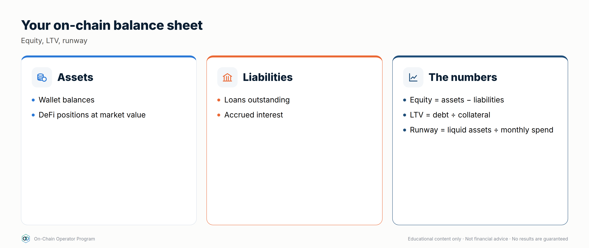
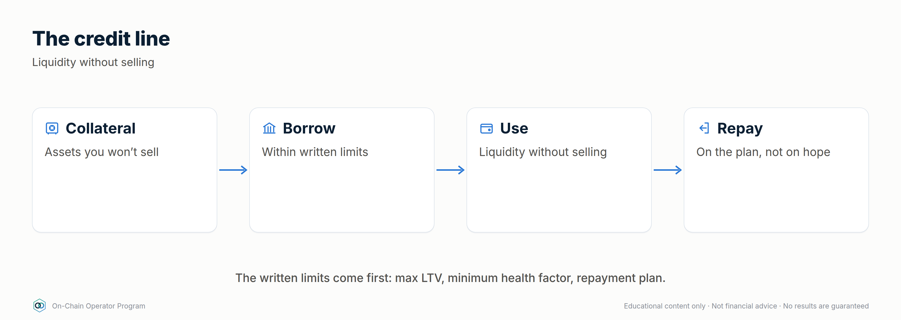
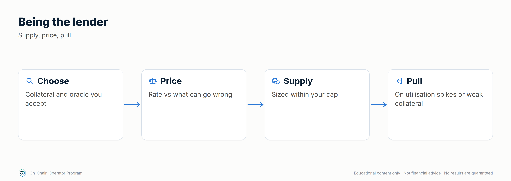
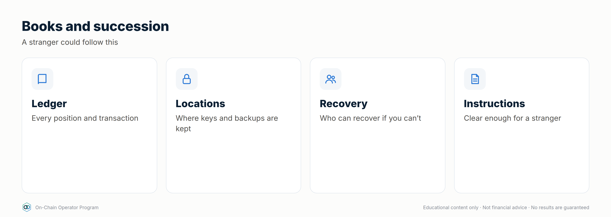
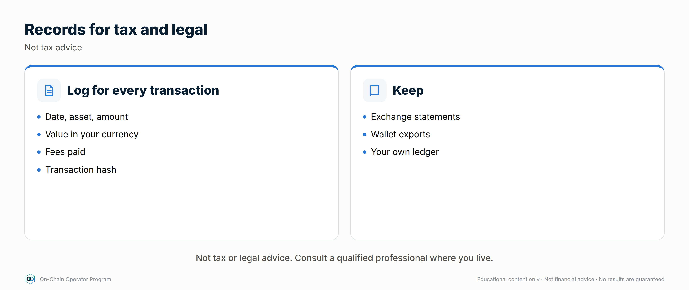

# Module 12 — Operate as Your Own Bank

*Outcome: run your crypto the way a bank runs its book: a balance sheet, a custody policy, a credit line, a liquidity ladder, a lending desk and records someone else could follow.*
*Stage 5 · Operator. Prerequisites: Modules 1–11. Educational content only. Not financial, tax or legal advice. Figures are illustrative.*

A bank does four things: it **keeps assets safe**, **lends**, **borrows**,
and **manages liquidity** so it can always meet what it owes. DeFi lets you
do all four yourself, with no one to call when something goes wrong. This
module turns that into written policy.

---

## Lesson 12.0 — Mastery Starter

*New to this topic? Start here. It takes about 10 minutes and gets you from zero to ready for this module.*

### The 60-second version
A bank keeps assets safe, lends, borrows and always has cash for what it owes. With DeFi you can run those four jobs yourself, with written policies, because there's nobody to call when something goes wrong.

### Words you'll need
| Term | Meaning |
|---|---|
| Balance sheet | assets, liabilities and equity |
| Liquidity ladder | reserves tiered by how fast you can access them |
| Credit line | borrowing against assets under a policy |
| Runway | months your reserve can cover |
| Succession | how others recover your assets if you can't |

### Before you start
- [ ] Modules 0–11

### Your first safe step
Fill in the balance sheet worksheet (W6) with rough numbers: equity, LTV and runway.

### The mastery ladder
| Level | You can… |
|---|---|
| **Beginner** | Has a balance sheet and a basic custody split |
| **Practitioner** | Runs written custody, credit, ladder and lending policies |
| **Master** | Operates a complete bank with books, tax-ready records, succession and quarterly reviews |

### You've mastered this module when…
…a stranger could run your bank from your written policies, with no keys in any document.

---

## Lesson 12.1 — Your balance sheet

### Objective
Build a personal on-chain balance sheet and read the three numbers that matter: equity, LTV and liquidity runway.

### Explanation
- **Assets:** everything you own, at market value: collateral, yield positions, reserves.
- **Liabilities:** everything you owe: loans, margin, any payables.
- **Equity** = assets − liabilities. This is what's actually yours.
- **LTV** = debt ÷ collateral. Your bank's leverage.
- **Liquidity runway** = liquid reserve ÷ monthly obligations (spending + interest).

Banks fail from **liquidity** (can't pay today) more often than from
**solvency** (owe more than they own). Track both.

### Worked example
$300,000 collateral, $60,000 debt at 5%, $40,000 stablecoin reserve, $5,000/month spending:

`defi_calc.py bank --collateral 300000 --debt 60000 --borrow-apy 5 --reserve 40000 --monthly-spend 5000`
- Equity **$280,000** · LTV **20%** · health factor **4.0**
- Obligations $5,250/month ($250 of it interest) → reserve covers **7.6 months**
- Policy checks: LTV ≤ 30% ✓ · HF ≥ 2 ✓ · reserve ≥ 6 months ✓

### Checklist
- [ ] Balance sheet updated weekly
- [ ] Equity, LTV and runway tracked over time
- [ ] Policy limits written (max LTV, min HF, min runway)

### Quiz

1. Assets $500k, debt $100k. Equity?
$400k.

2. Reserve $30k, obligations $6k/month. Runway?
5 months, below a 6-month policy.

3. Why track liquidity separately from equity?
You can be solvent and still be forced to sell at the worst time if you can't meet obligations today.

---

## Lesson 12.2 — Custody architecture: vault, multisig and spending policies

### Objective
Design custody so that no single lost device, stolen key or mistaken signature can drain the bank.

### Explanation
Scale Module 1's three wallets into a bank-grade setup:

| Tier | Holds | Control | Rules |
|---|---|---|---|
| **Vault** | Most of your equity | **Multisig**, e.g. 2-of-3 hardware keys in separate locations | No DeFi approvals. Moves only to the Operating tier, to allowlisted addresses |
| **Operating** | Active positions | Hardware wallet or a smart account with limits | Verified protocols only. Spending limit per day |
| **Hot** | Small float | Hot wallet | Anything new or experimental. Refilled on schedule |

Smart-account features to use where available:
- **Spending limits** per day/week
- **Allowlists** (it can only send to addresses you pre-approved)
- **Timelocks** on large moves (a delay you can cancel if it wasn't you)
- **Recovery** paths agreed and tested in advance

### Worked example
Vault: 2-of-3 multisig, with key A at home, key B in a safe-deposit box and
key C with a trusted person or a professional co-signer. Losing any one key
is survivable; stealing any one key is useless. **Test it:** move $10 through
every path once a quarter.

### Checklist
- [ ] Vault is multisig; keys in separate physical locations
- [ ] Operating tier has a daily limit
- [ ] Allowlist on vault outflows
- [ ] Quarterly recovery test done and logged

### Quiz

1. Why 2-of-3 rather than 1-of-1?
One key can be lost or stolen without losing the funds or giving an attacker control.

2. What does a timelock buy you?
Time to notice and cancel an unauthorised large move.

3. Why test recovery with a small amount?
A recovery plan you've never run is an assumption. Testing proves every key and path works.

---

## Lesson 12.3 — The credit line: borrowing like a bank client

### Objective
Use your assets as collateral for liquidity without selling, under a written credit policy.

### Explanation
Wealthy clients rarely sell appreciating assets to raise cash; they borrow
against them. DeFi money markets offer the same: deposit collateral, borrow
stablecoins, repay when it suits you, with no credit check. **The collateral
is liquidated if you breach the threshold**, and nobody calls first.

**A credit policy (write yours):**
- Max LTV **25–30%** on volatile collateral (liquidation is often near 80%+)
- Health factor floor **2.5**; act at **2.0**
- Prefer collateral whose **yield covers the interest** (strategy #25)
- Consider **fixed-rate** borrowing when a rate spike would force a sale (strategy #22)
- **Repayment source** named before borrowing (income, reserve, maturing PT)
- Tax treatment of borrowing varies by country: **check with a tax professional**

### Worked example
$200,000 of liquid-staked ETH earning 3.2% ($6,400/yr). Borrow **$40,000** stablecoins at 5% ($2,000/yr).
- Yield covers interest **3.2×**. LTV 20%. HF **4.0** at a 0.8 threshold.
- ETH would have to fall **~75%** before liquidation (HF falls in proportion to price).
- Defence plan: at HF 2.0, repay from reserve; at HF 1.7, sell part of the collateral deliberately rather than let a liquidator do it at a penalty.

### Checklist
- [ ] Credit policy written: max LTV, HF floor, action levels
- [ ] Repayment source named
- [ ] Alerts set at the action levels (Module 14.1)
- [ ] Fixed vs variable decision made on purpose

### Quiz

1. Why borrow against assets instead of selling them?
You keep the asset and its upside (and in some jurisdictions avoid a taxable sale), at the cost of interest and liquidation risk.

2. HF is 4.0. Roughly how far can collateral fall before liquidation?
About 75%, since HF scales with collateral price (HF 1.0 at a quarter of the current price).

3. What should happen at your action level?
Repay or add collateral per the written plan. Sell deliberately before a liquidator does it at a penalty.

---

## Lesson 12.4 — Treasury and the liquidity ladder

### Objective
Structure reserves so money is available when it's needed, earning a return at every tier.

### Explanation
Banks match the timing of assets to the timing of what they owe. Your ladder:

| Tier | Access | Holds | Size (example: $5,000/month spend) |
|---|---|---|---|
| **T0 Instant** | Seconds | Stablecoins in the operating wallet | 1 month: $5,000 |
| **T1 Same day** | Hours | Blue-chip stablecoin lending, split across 2 protocols | 5 months: $25,000 |
| **T2 Term** | Scheduled | PTs maturing on dates you'll need the money (Lesson 10.1) | Next 6–12 months of planned spending |
| **T3 Growth** | Days–weeks | Strategy positions, LPs, staking | The rest, within caps |

Refill downward on a schedule: T1 tops up T0 monthly; maturing PTs top up T1.
Never fund a T0 need by selling a T3 position in a bad market. That's what the
ladder exists to prevent.

### Worked example
T0 $5,000 + T1 $25,000 = **6 months** instantly available. T2 holds three PTs
maturing in 3, 6 and 9 months, each sized for 3 months of spending. A −50%
market day touches none of it.

### Checklist
- [ ] T0 + T1 ≥ 6 months of obligations
- [ ] T2 maturities matched to planned spending
- [ ] Monthly refill schedule set
- [ ] T3 never used for day-to-day needs

### Quiz

1. Why hold T0 in plain stablecoins earning little?
Instant, certain access. It's the tier that pays today's bills without selling anything.

2. What's T2 for?
Known future spending, with maturities matched to when the money is needed and a fixed return locked in.

3. What does the ladder prevent?
Forced selling of growth positions at bad prices to meet short-term needs.

---

## Lesson 12.5 — Being the lender: supplying, curating and pricing credit risk

### Objective
Act as the lending side of the bank: choose markets, price the risk, and know when to pull liquidity.

### Explanation
When you supply to a money market, you're the bank's depositor, and
effectively its credit desk. Your return:
`supply APY ≈ borrow APY × utilisation × (1 − reserve factor)`.

Modern designs split lending into **isolated markets** (one collateral, one
loan asset, one oracle, one liquidation LTV). **Curated vaults** spread
deposits across several of these; the curator decides the allocation.

What a lender must check:
- **Collateral quality and liquidation LTV:** the higher the LTV, the thinner the buffer before bad debt
- **Oracle:** what prices the collateral, and can it be manipulated? (Module 5.3)
- **Utilisation:** near 100% means you may not be able to withdraw
- **Curator:** track record, how allocations are changed, timelocks
- **Risk-adjusted return**, not headline

### Worked example
Vault A: 7% headline, exposure to newer collateral; you assume a 2%/yr chance of a loss event losing half the deposit → **6.0%** risk-adjusted.
Vault B: 4.5% headline, blue-chip collateral; 0.5%/yr, total loss assumed → **4.0%**.
`defi_calc.py expected --yield-apy 7 --loss-prob 0.02 --lgd 0.5`

A pays more after the haircut, *if* your loss estimates are honest. Split
between them, and cap A lower because its tail is fatter and less known.

### Checklist
- [ ] Every market's collateral, oracle and LTV listed
- [ ] Loss probability and loss-given-default written down (your assumptions)
- [ ] Utilisation alert (e.g. > 90%)
- [ ] Per-vault and per-curator caps

### Quiz

1. Borrow APY 10%, utilisation 70%, reserve factor 10%. Supply APY?
6.3%.

2. Why is utilisation at 100% a lender's problem?
All liquidity is lent out, so withdrawals wait until borrowers repay or new deposits arrive.

3. What's a curated vault's extra risk?
The curator's allocation decisions and permissions, on top of each market's risk.

---

## Lesson 12.6 — Books, records and succession

### Objective
Keep books a stranger could follow, and make sure your family could recover everything if you couldn't.

### Explanation
**Books** (update weekly from your journal, Module 8):
- Every position: protocol, chain, contract, amount, entry date and price, cost basis
- Every loan: collateral, debt, rate, HF, action levels
- Every approval granted, and when it was revoked
- Income received, by source and date
- Keep exportable records for tax. Rules differ by country, so **use a crypto-aware tax professional.**

**Succession:** self-custody means that if you're gone and nobody can sign,
the money is gone too.
- A **letter of instruction** that explains the setup (wallets, multisig, where
  the documents are, who to contact), **stored separately from any seed or key**
- Multisig with a trusted co-signer or professional service, so recovery doesn't depend on one person
- Legal documents (will, powers of attorney) that reference the digital assets: **use a lawyer**
- **Annual drill:** walk a trusted person through the letter without revealing secrets

### Worked example
A 2-of-3 vault: you hold two keys (home + safe-deposit box); a professional
co-signer holds the third under an agreed recovery process. Your letter of
instruction, stored with your will, explains how your executor works with
the co-signer. No single document contains enough to steal the funds.

### Checklist
- [ ] Books current within a week
- [ ] Tax records exportable; professional engaged
- [ ] Letter of instruction written and stored apart from keys
- [ ] Annual succession drill done

### Quiz

1. Why keep the letter of instruction apart from seeds and keys?
So finding the letter isn't enough to steal the funds.

2. What's the risk of single-key self-custody for your family?
If you can't sign and no one else can, the assets are unrecoverable.

3. What goes in the books for each loan?
Collateral, debt, rate, health factor and your action levels.

---

## Lesson 12.7 — Tax, regulation and compliance awareness *(new)*

### Objective
Know which on-chain actions may have tax or legal consequences, keep the records to handle them, and know when to get professional help.

### Explanation
**This lesson is awareness, not advice. Rules differ by country and change. Use a crypto-aware tax professional and, for legal questions, a lawyer.**
- **Events that may be taxable** in many countries: selling crypto for cash, swapping one token for another, spending crypto, and receiving income (interest, staking rewards, LP fees, airdrops). Some treat borrowing, wrapping, LP deposits or bridging differently. Ask.
- **Cost basis:** what you paid, including fees. Methods (e.g. FIFO, specific identification) depend on local rules.
- **Records:** every buy, sell, swap, transfer, fee and income event, with dates, amounts and prices (W1 records sheet). On-chain data can be exported, but self-transfers must be labelled or they may look like disposals.
- **Regulation:** use services legally available where you live; don't use tools to get around geo-restrictions; never interact with sanctioned addresses or services; exchanges must run KYC/AML checks, and some DeFi front ends block certain regions.
- **Reporting:** some countries require reporting of foreign accounts or digital assets. Ask your professional.

### Worked example
In one year: bought ETH, swapped half to USDC, lent USDC for interest, received an
airdrop, bridged to an L2 and moved funds between your own wallets. For your tax
professional, you'd prepare: the records sheet, labelled self-transfers (not
disposals), interest and airdrop income with dates and values, and exchange
statements. **They** tell you what's taxable where you live.

### Checklist
- [ ] Records sheet complete, with self-transfers labelled
- [ ] Crypto-aware tax professional engaged
- [ ] Only legally available services used; no geo-restriction workarounds
- [ ] Sanctions awareness: never interact with sanctioned addresses or services

### Quiz

1. Name three events that are often taxable.
Any three: selling for cash, swapping tokens, spending crypto, receiving interest, staking rewards, LP fees or airdrops.

2. Why label self-transfers?
So moves between your own wallets aren't mistaken for disposals.

3. Who decides what's taxable for you?
Your local rules, applied by a qualified tax professional.

---

## Lesson 12.8 — Institutional-grade custody: MPC, custodians and policy engines *(expert)*

### Objective
Know the custody options institutions use, and when they make sense for a large personal or family book.

### Explanation
- **Multisig** (12.2): several keys, rules enforced **on-chain**, transparent and verifiable.
- **MPC (multi-party computation):** one key is split into shares held by different devices or parties; signatures are created together without ever assembling the key. The rules are enforced **off-chain** by the provider's software. It works on any chain, but you depend on the vendor and can't verify the policy on-chain.
- **Qualified custodians:** regulated firms that hold assets for clients. Strong legal protections in some jurisdictions; you give up self-custody and on-chain flexibility.
- **Policy engines:** approval workflows (who can approve what, above which amount), allowlists, time windows and velocity limits, available in both institutional MPC platforms and smart-account setups.
- **Hybrid:** many large holders use a custodian or MPC for long-term reserves and multisig/smart accounts for active DeFi.

### Worked example
A $5M family book: cold reserves ($3M) with a qualified custodian (legal title,
insurance terms read); active DeFi ($1.5M) in a 2-of-3 multisig with a policy of
two approvers above $50,000 and an allowlist; hot float ($20,000) in a limited smart
account. The succession plan (12.6) covers all three.

### Checklist
- [ ] Custody option chosen per tier, with reasons
- [ ] Vendor/custodian terms, insurance and recovery read
- [ ] Policy engine rules written: approvers, thresholds, allowlists

### Quiz

1. MPC vs multisig: where are the rules enforced?
MPC: off-chain by the provider's software. Multisig: on-chain by the contract.

2. What do you give up with a qualified custodian?
Self-custody and on-chain flexibility.

3. What is a policy engine?
Rules for approvals, thresholds, allowlists and limits on transactions.

---

### Module 12 practical: your bank's founding documents
1. Balance sheet with equity, LTV and runway (`defi_calc.py bank`).
2. Custody policy: tiers, multisig setup, limits, allowlists, recovery test log.
3. Credit policy: max LTV, HF floor, action levels, repayment source.
4. Liquidity ladder: T0–T3 sizes and refill schedule.
5. Lending policy: markets, caps, risk assumptions.
6. Books template and letter of instruction (stored separately).
