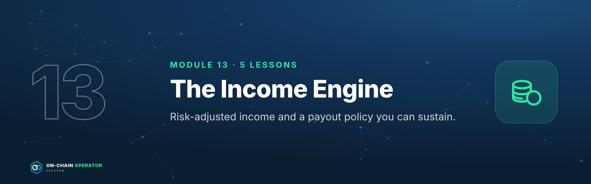
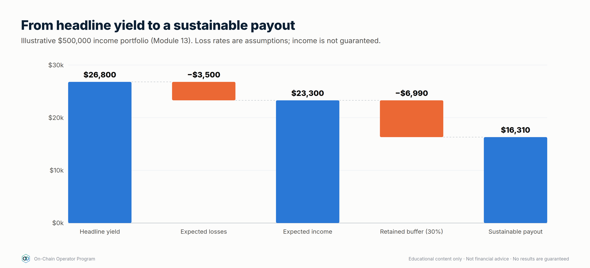

# Module 13 — The Income Engine

*Outcome: design an income portfolio, measure expected income after expected losses, and set a payout you can sustain.*
*Stage 5 · Operator. Prerequisites: Modules 1–12. Educational content only. Not financial or tax advice. No income is guaranteed. Loss probabilities are your own assumptions; figures are illustrative.*

**The operator's income rule:** plan on **expected** income (yield minus
expected losses), pay out **less** than that, and never pay out of principal.

---

## Lesson 13.1 — Income sources ranked by durability

### Objective
Rank income sources by how long and how reliably they're likely to pay, not by their headline rate.

### Explanation
| Source | Typical driver | Durability | Variability |
|---|---|---|---|
| Blue-chip stablecoin lending | Borrower demand | High | Medium: moves with demand |
| Staking / LSTs | Network security rewards | High | Low–medium |
| Fixed-rate PTs to maturity | Locked at purchase | Fixed for the term | None until maturity |
| Curated lending vaults | Borrower demand in isolated markets | Medium | Medium |
| LP fees (major pairs) | Trading volume | Medium | High |
| Funding / basis carry | Market positioning | Low–medium | High: can turn negative |
| Options premium | Volatility | Medium | High |
| Incentives / points | Protocol budgets | Low | Very high |

A durable income engine is built mostly from the top of this table. The
bottom rows are **boosters** you size small and expect to switch off.

### Checklist
- [ ] Every income position tagged with its source and durability
- [ ] Core income from high-durability sources

### Quiz

1. Why is funding carry low durability?
It depends on market positioning and can turn negative for long periods.

2. Which source gives a known rate for a set term?
Fixed-rate PTs held to maturity.

3. How should incentive income be treated?
As a temporary booster, sold on a schedule and not relied on.

---

## Lesson 13.2 — Risk-adjusted yield: subtracting expected losses

### Objective
Convert every headline yield into an expected yield after the losses it statistically carries.

### Explanation
`risk-adjusted yield = headline − (annual loss probability × loss given default) − costs`

You don't know the true loss probability, so **write down an assumption and
be conservative.** Newer protocols, more dependencies and higher leverage
deserve higher numbers. The point isn't precision; it's making you compare
positions on the same footing.

### Worked example
| Position | Headline | Assumed loss prob. | LGD | Risk-adjusted |
|---|---|---|---|---|
| New protocol vault | 9.0% | 3%/yr | 100% | **6.0%** |
| Blue-chip lending | 4.5% | 0.5%/yr | 100% | **4.0%** |

`defi_calc.py expected --yield-apy 9 --loss-prob 0.03`

The 9% vault still wins on expectation, but by 2 points, not 4.5. Its bad
outcome is also far worse, so size it smaller (Lesson 13.3).

### Checklist
- [ ] Loss probability and LGD written for every position
- [ ] Decisions made on risk-adjusted, not headline

### Quiz

1. 12% headline, 5%/yr loss probability, 60% LGD. Risk-adjusted?
12 − 3 = 9%.

2. Why assume conservatively?
Losses cluster in stress, when many positions fail together; optimistic assumptions overstate income.

3. Two positions, same risk-adjusted yield. Which gets more capital?
The one with the smaller and better-understood worst case.

---

## Lesson 13.3 — Building the income portfolio

### Objective
Assemble an income portfolio and calculate its blended risk-adjusted yield and expected income.

### Explanation
Build in layers: **core** (high-durability, 60–80%), **term** (fixed PTs matched
to the liquidity ladder), **boosters** (carry, options, LP; small). Apply
Module 8's caps: per protocol, per chain, per stablecoin issuer.

### Worked example — $500,000 income portfolio
`defi_calc.py income --pos "Stable lending A:100000:5:0.005:1" --pos "Stable lending B:100000:4.5:0.005:1" --pos "LST staking:150000:3.2:0.01:0.5" --pos "PT fixed stable:100000:8:0.02:0.5" --pos "Funding carry:50000:9:0.05:0.3"`

| Position | Amount | Yield | Expected loss | Net | Income/yr |
|---|---|---|---|---|---|
| Stable lending A | 100,000 | 5.0% | 0.5% | 4.5% | 4,500 |
| Stable lending B | 100,000 | 4.5% | 0.5% | 4.0% | 4,000 |
| LST staking | 150,000 | 3.2% | 0.5% | 2.7% | 4,050 |
| PT fixed stable | 100,000 | 8.0% | 1.0% | 7.0% | 7,000 |
| Funding carry | 50,000 | 9.0% | 1.5% | 7.5% | 3,750 |
| **Total** | **500,000** | | | **4.66%** | **23,300** |

Note: the LST line is priced in ETH, so its dollar value, and therefore the
dollar income, moves with ETH. The rest is stablecoin-denominated.

### Checklist
- [ ] Core ≥ 60% from high-durability sources
- [ ] Caps respected per protocol, chain and issuer
- [ ] Blended risk-adjusted yield calculated

### Quiz

1. Which line contributes the most expected income, and why?
PT fixed stable ($7,000): a high locked rate on a sizeable allocation, even after the haircut.

2. Why is the carry line only $50,000?
It's a low-durability booster with a higher assumed loss rate.

3. What makes the LST income variable in dollars?
It's denominated in ETH, so the dollar value moves with the ETH price.

---

## Lesson 13.4 — The payout policy: how much you can take out

### Objective
Set a payout you can sustain through bad years, and the rules that change it.

### Explanation
- **Pay out a share of *expected* income, not headline** (e.g. 70%).
- **Retain the rest** as a loss buffer; it absorbs the losses you assumed in 13.2.
- **Pay from the T0/T1 ladder** (Module 12.4), refilled by income, so payouts never depend on selling anything that day.
- **Never pay from principal.** If income falls short, the payout falls.
- **Review quarterly:** if realised income is below expected for two quarters, cut the payout to 70% of the new realised level.

### Worked example
Expected income **$23,300/yr** × 70% = **$16,310/yr** paid out (**$1,359/month**).
**$6,990/yr** retained. If a position fails as assumed, the buffer absorbs it
and the payout continues.

### Checklist
- [ ] Payout ratio written (≤ 70–80% of expected income)
- [ ] Paid from the ladder, not from positions
- [ ] Quarterly review rule written
- [ ] "Never from principal" rule written

### Quiz

1. Expected income $40,000. Payout at 70%?
$28,000/yr (~$2,333/month).

2. What's the retained 30% for?
Absorbing expected losses and bad years without cutting into principal.

3. Realised income lags expected for two quarters. What happens?
Cut the payout to the policy share of the new realised level.

---

## Lesson 13.5 — Scaling, compounding and the annual review

### Objective
Grow the engine safely and review it like a bank's annual report.

### Explanation
**Compounding:** reinvesting the retained share grows principal, and income
with it. At a 4.66% risk-adjusted yield with 30% retained, principal grows
~**1.4%/yr** from retention alone. The payout grows at about the same rate:
$16,310 → ~$17,480 after five years (before any new capital).

**Scaling rules as the book grows:**
- Caps are **percentages**, so position sizes rise, and so does market impact.
  Check pool depth and exit liquidity at the new size.
- Add independent protocols and issuers before adding size to existing ones.
- More size means more value at stake in custody: revisit Module 12.2.

**Annual review (one page):**
1. Balance sheet: start vs end equity, LTV, runway
2. Income: expected vs realised, by source
3. Losses and near-misses: what happened, what changed
4. Payout: paid vs policy
5. Risk assumptions: update loss probabilities from the year's incidents
6. Custody and succession drill: done?

### Checklist
- [ ] Retained income reinvested per policy
- [ ] Exit liquidity checked at current size
- [ ] Annual review completed and filed with the books

### Quiz

1. Yield 5%, 40% retained. Growth from retention alone?
~2% a year.

2. Why check exit liquidity as the book grows?
A position that was easy to exit at $50k may move the market at $500k.

3. What should the annual review update?
Loss-probability assumptions, from the year's incidents and near-misses.

---

### Module 13 practical
1. Tag every position by source and durability (13.1).
2. Write loss assumptions and compute risk-adjusted yields (13.2).
3. Build your income portfolio with `defi_calc.py income` (13.3).
4. Write your payout policy (13.4) and first annual-review template (13.5).
