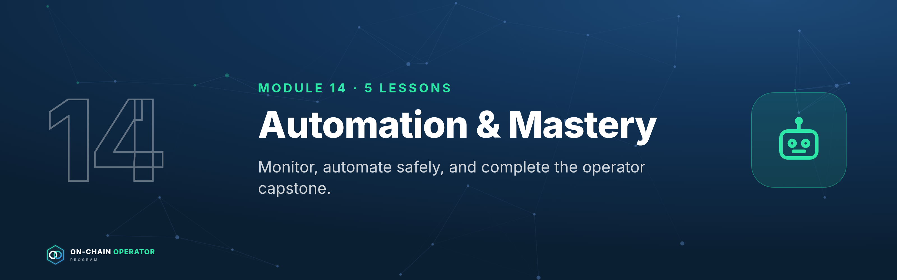

# Module 14 — Automation & Mastery

*Outcome: monitor and automate safely, run multisig operations, and complete the operator capstone.*
*Stage 5 · Operator. Prerequisites: Modules 0–13. Educational content only. Not financial advice.*

**The automation rule:** automate *watching* freely; automate *acting* only with
limited permissions you can revoke, and never by handing over your keys.

---

## Lesson 14.1 — Monitoring: dashboards, alerts and on-chain watchers

### Objective
Set up monitoring so you hear about problems before they cost money.

### Explanation
Watch four things:
1. **Positions:** health factors, LP ranges, pegs, utilisation of markets you lend to.
2. **Protocols:** governance proposals, queued upgrades (timelocks), incidents.
3. **Wallets:** any outgoing transaction or new approval from your vault/operating wallets.
4. **Market:** funding, large depegs, liquidations.

Tools: portfolio dashboards, protocol-native alerts, wallet-activity watchers,
block-explorer address alerts, and official status/X accounts. Alerts should reach your **phone**.

### Worked example — alert sheet
| Alert | Threshold | Action (from your policies) |
|---|---|---|
| HF, credit line | < 2.0 / < 1.7 | Repay per 11.3 |
| Stablecoin peg | < 0.99 for 2h | Peg rule |
| Market utilisation | > 95% for 24h | Withdraw per kill rule |
| Vault wallet outflow | Any | Verify immediately (11.5) |
| Queued upgrade | Any, on protocols > 10% of book | Review within timelock |

### Checklist
- [ ] Alerts for all four categories, delivered to phone
- [ ] Every alert maps to a written action

### Quiz

1. Why alert on any vault-wallet outflow?
The vault should almost never move; any movement could be a compromise.

2. Why watch queued upgrades?
The timelock is your window to exit before the change takes effect.

3. An alert with no action attached is…?
Noise. Every alert needs a written response.

---

## Lesson 14.2 — Automation: keepers, bots and agents without handing over the keys

### Objective
Automate routine actions with the least permission possible.

### Explanation
- **Keeper / automation networks** execute pre-defined actions when conditions
  are met (e.g. repay when HF < 1.8, rebalance an LP range).
- **Smart-account permissions / session keys:** grant a bot the right to do
  *one thing* (e.g. repay debt on one protocol, up to $X per day), revocable at any time.
- **AI agents and bots:** treat them like any other contract permission. They get
  scoped rights, never your seed phrase or unlimited approvals.
- **Test on a testnet or with tiny amounts first; log every automated action.**

### Worked example
Automated repay: a session key allowed only to call `repay` on your lending
position, from your operating wallet, capped at $5,000/day, expiring in 30 days.
Worst case if the bot is compromised: it repays your debt, which is annoying, not catastrophic.

### Checklist
- [ ] Each automation has a scoped, capped, expiring permission
- [ ] No automation holds seed phrases or unlimited approvals
- [ ] Tested small; actions logged; revoke procedure known

### Quiz

1. What's a session key?
A limited, revocable permission for a specific action.

2. Should an AI agent ever get your seed phrase?
No. Give it scoped, revocable permissions only.

3. Worst case of a well-scoped repay bot?
It repays debt within its cap. No funds leave your control.

---

## Lesson 14.3 — Operating procedures: multisig signing, change control, reviews

### Objective
Run your bank with procedures that prevent single-point mistakes.

### Explanation
- **Multisig signing procedure:** every signer independently verifies the
  transaction (destination, amount, calldata) on their **own device screen**, not a shared screenshot.
- **Change control:** new protocol, new chain, new strategy, or a cap change is
  written up (thesis, risk register row, size) and waits 24h before execution.
- **Separation:** the person proposing a vault transaction isn't the only one approving it.
- **Review calendar:** weekly books · monthly register · quarterly stress test and recovery drill · annual review (Module 13.5).

### Worked example
A 2-of-3 vault moves $40,000 to the operating wallet. Signer 1 proposes; Signer 2
checks the destination against the allowlist and the amount against the ladder
refill schedule on their hardware wallet screen, then signs. Logged in the books with both names.

### Checklist
- [ ] Signing procedure written for every signer
- [ ] Change-control template and 24h rule
- [ ] Review calendar set

### Quiz

1. Why verify on your own device screen?
Screens and screenshots can be faked; the hardware display shows what you're actually signing.

2. What is change control for?
Forcing new risks through thesis, register and a cooling-off period.

3. How often is the stress test re-run?
Quarterly, and after big changes.

---

## Lesson 14.4 — Operator capstone and certification

### Objective
Assemble your complete on-chain bank and have it assessed.

### Explanation — the operator capstone
Submit one document (template in `07-program-operations.md`) containing:
1. **Balance sheet** with equity, LTV and runway (12.1)
2. **Custody policy** and recovery-test log (12.2)
3. **Credit policy** with action levels (12.3)
4. **Liquidity ladder** T0–T3 (12.4)
5. **Lending policy** with risk assumptions (12.5)
6. **Books template** and letter of instruction location (12.6; never the seed)
7. **Income portfolio** with risk-adjusted expected income (13.3)
8. **Payout policy** (13.4)
9. **Stress test**, five scenarios, with fixes (11.4)
10. **Incident playbook** (11.5), **alert sheet** (14.1) and **automation permissions** (14.2)

**Certification levels** (assessed against the rubric in `07-program-operations.md`):
- **Analyst:** passed the analyst capstone (Modules 6–7)
- **Operator:** passed the operator capstone
- **Operator with distinction:** operator capstone scored ≥ 90%, plus one quarter of books kept to standard

### Checklist
- [ ] All ten sections complete
- [ ] Calculators used for every number
- [ ] Submitted (Live tier: booked for review)

### Quiz

1. What must never appear in the capstone?
Seed phrases, private keys or anything that grants access.

2. Which lesson's output shows income is sustainable?
13.4: the payout policy, based on risk-adjusted expected income.

3. What's needed for "with distinction"?
≥ 90% on the operator capstone plus a quarter of books kept to standard.

---

### Module 14 practical
Build your alert sheet, scope one automation, write your signing procedure, then complete the operator capstone.
