# On-Chain Operator Program — Stage 1 · Foundations

*Section file generated by `build_master.py` from `lessons/` (edit the lessons, not this file). Modules 1, 2. Every module opens with its Mastery Starter (N.0). Educational content only. Not financial advice.*

---

# Module 1 — Foundations & Safety

*Outcome: set up and use a wallet safely, and know what can go irreversibly wrong before any capital moves.*
*Source: ATLAS "DeFi & On-Chain" ch. 1–5, 36. Educational content only. Not financial advice.*

The **before-signing checklist** is introduced in this module and used in every module after it:

- [ ] Chain confirmed
- [ ] Contract address verified from an authoritative source
- [ ] Token and amount double-checked
- [ ] Spender / allowance reviewed
- [ ] Slippage set deliberately
- [ ] Gas estimate reviewed
- [ ] Intended outcome stated in one sentence

---

## Lesson 1.0 — Mastery Starter

*New to this topic? Start here. It takes about 10 minutes and gets you from zero to ready for this module.*

### The 60-second version
Most crypto losses aren't market losses; they're mistakes and scams: a seed phrase typed into a fake site, an approval signed without reading, the wrong network. This module builds the habits that prevent them.

### Words you'll need
| Term | Meaning |
|---|---|
| Private key | the secret that signs transactions |
| Approval | permission for an app to move a token |
| Multisig | a wallet that needs several keys to act |
| Phishing | a fake site or message built to steal |
| Simulation | a preview of what a transaction will change |

### Before you start
- [ ] Module 0 done (secured exchange, restore-tested wallet)
- [ ] A small amount in a wallet on a low-fee network

### Your first safe step
Open your wallet's approvals (or a revoke tool), list every approval you've granted, and revoke any you don't use.

### The mastery ladder
| Level | You can… |
|---|---|
| **Beginner** | Uses a separate burner wallet and reads every prompt |
| **Practitioner** | Runs the before-signing checklist without notes; limited approvals; hardware wallet |
| **Master** | Multisig vault, simulation on every signature, private addresses, tested recovery |

### You've mastered this module when…
…you can take a new app from first visit to a limited, simulated, verified transaction, and revoke it after.

---

## Lesson 1.1 — What DeFi is, and the risk-first mindset *(ch. 1)*

### Objective
Describe the DeFi stack and explain why every yield is payment for a risk.

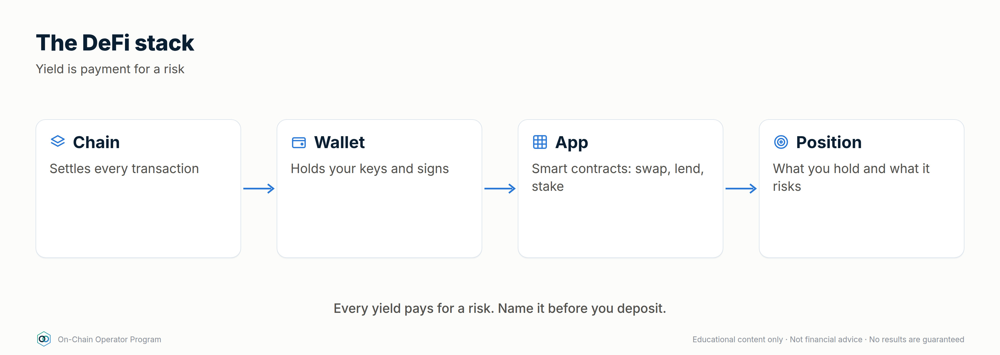

### Explanation
DeFi replaces intermediaries (banks, brokers, exchanges) with **smart
contracts**: public programs on a blockchain that hold assets and follow fixed
rules. The stack, bottom to top:

1. **Blockchain**: records every balance and transaction (Ethereum, L2s, other chains).
2. **Smart contracts**: the protocol logic (a lending market, an exchange pool).
3. **Tokens**: the assets the contracts move.
4. **Wallets**: where *you* hold keys and sign actions.
5. **Interfaces**: websites that build transactions for you. They're a convenience, not the protocol itself.
6. **Data layers**: explorers and dashboards you use to verify what happened.

Three properties make DeFi powerful and dangerous:
- **Self-custody**: nobody can freeze your funds, and nobody can recover them either.
- **Composability**: protocols plug into each other. That makes products powerful, and a position can fail because of something it depends on.
- **Transparency**: you can verify everything on-chain. Transparent doesn't mean safe.

**Risk-first rule:** before comparing returns, list what could make you lose
money. A higher yield means you're being paid to carry more risk, whether or
not the website mentions it.

### Worked example
A pool advertises **12% APY on a stablecoin**. Before depositing, ask:
- Where does the 12% come from? Borrowers paying interest, trading fees, or a reward token?
- Which stablecoin, and what backs it? (Lesson 1.5)
- Which contracts hold the money, and who can upgrade them?
- Is there a bridge or oracle involved?
- How do I withdraw, and could withdrawals be blocked?

If you can't answer these, you don't know what the 12% is paying you for.

### Checklist
- [ ] I can name the six layers of the DeFi stack
- [ ] I can explain why self-custody cuts both ways
- [ ] Before any yield, I ask "what am I being paid to risk?"

### Quiz

1. Why can composability increase risk?
A position inherits the failure risk of every protocol, asset, oracle and bridge it depends on.

2. Is a website the same thing as the protocol?
No. The interface only builds transactions. The contracts are the protocol, and interfaces can be faked or compromised.

3. What is the risk-first mindset in one sentence?
Identify what could make you lose money before you compare returns.

---

## Lesson 1.2 — How a transaction actually happens *(ch. 2)*

### Objective
Follow a transaction from signature to finality, and estimate its cost.

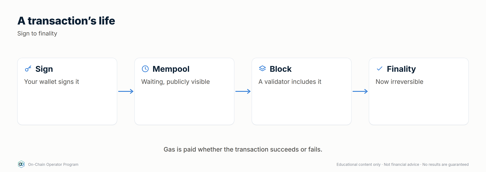

### Explanation
**Lifecycle:** create → sign → broadcast → mempool (waiting) → included in a
block → confirmed → final.

- **Gas** is the unit of computation. Cost = `gas used × gas price`. On
  Ethereum the price has a *base fee* (burned) plus a *priority tip*
  (to get included sooner). Gas price is quoted in **gwei** (1 gwei = 0.000000001 ETH).
- **Nonce**: each account's transactions are numbered in order. A stuck
  low-nonce transaction blocks all later ones until it confirms or is
  **replaced** (same nonce, higher fee).
- **Failed transactions still cost gas.** The network did the computation even though the result was reverted.
- **Finality**: the point after which a transaction can't realistically be
  reversed. It differs by chain, and L2s have their own rules (Module 5).
- **Explorers** (e.g. Etherscan) show status, fee, sender, contract called, token transfers and logs.

### Worked example
A swap uses **150,000 gas** at **20 gwei**:
`150,000 × 20 = 3,000,000 gwei = 0.003 ETH`. At $3,000/ETH that's **$9**.
The same swap during congestion at 80 gwei costs **$36**. If you're compounding
$1.50 of rewards, the gas costs more than the rewards. That's why position
size matters on-chain.

### Checklist
- [ ] I check the fee estimate before signing
- [ ] I know how to find my transaction on an explorer
- [ ] I know a stuck transaction can be sped up or cancelled with the same nonce

### Quiz

1. Your transaction reverted. Did you pay?
Yes, for the gas used up to the point of failure.

2. 200,000 gas at 10 gwei with ETH at $2,500 costs?
2,000,000 gwei = 0.002 ETH = $5.

3. Why are your newer transactions all pending?
An earlier nonce is stuck. Replace or speed it up, and the rest follow.

---

## Lesson 1.3 — Wallets, keys, hardware & multisig *(ch. 3)*

### Objective
Set up a wallet structure where one mistake can't lose everything.

### Explanation
- **Private key**: the authority to sign. Whoever has it controls the funds.
- **Seed phrase**: 12–24 words that recreate your keys. **Never type it into
  a website, never photograph it, never share it. No legitimate support team
  will ever ask for it.**
- **Hardware wallet**: keeps keys on a separate device. Signing requires physical confirmation.
- **Multisig**: needs M of N signers (e.g. 2 of 3). Good for large or shared funds.
- **Smart wallets**: contract accounts that can add spending limits, recovery and batching.

**Compartmentalise:** separate wallets by job, so a compromise only reaches one of them.

### Worked example — the 3-wallet setup

| Wallet | Holds | Signs | Device |
|---|---|---|---|
| **Vault** | Long-term holdings | Almost never. No DeFi approvals | Hardware (or multisig) |
| **Operator** | Active DeFi positions | Known, verified protocols only | Hardware |
| **Burner** | Small amounts for new apps, mints, airdrops | Anything experimental | Hot wallet |

Move money *down* the chain (vault → operator → burner) only as needed, and
sweep profits back *up*. If the burner gets drained, you lose only the burner's balance.

### Checklist
- [ ] Seed phrase stored offline, in two separate physical places
- [ ] Vault wallet has never approved a DeFi contract
- [ ] Separate burner wallet for anything new
- [ ] I read every signing prompt on the hardware device screen, not just the website

### Quiz

1. A "support agent" in DMs needs your seed phrase to fix a stuck transaction. What do you do?
Nothing. It's a scam, every time. Block and report.

2. Why keep the vault wallet free of approvals?
Approvals let contracts move your tokens. With none, a compromised protocol can't reach it.

3. What does 2-of-3 multisig protect against?
A single lost or compromised key. Two signers are still needed to move funds.

---

## Lesson 1.4 — Tokens, approvals & allowances *(ch. 4)*

### Objective
Read an approval request and know what you're allowing.

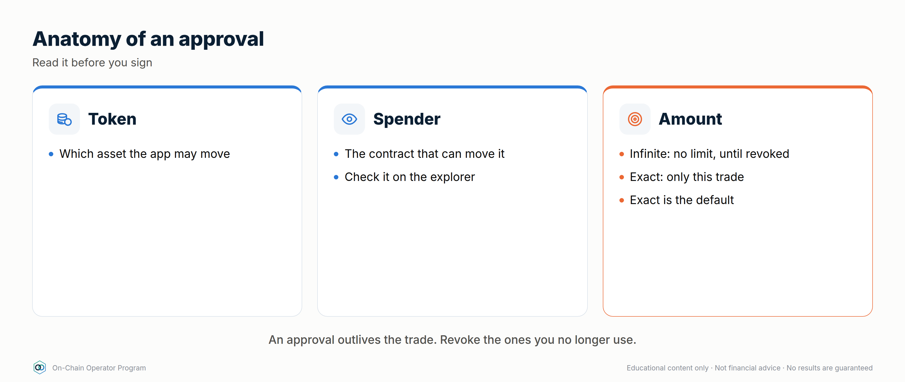

### Explanation
- Most tokens on EVM chains are **ERC-20** (fungible). NFTs (ERC-721/1155)
  can also represent positions (e.g. concentrated LP).
- To let a protocol move your tokens you **approve** a **spender** for an
  **allowance**. The protocol then pulls tokens when you act.
- **Unlimited approvals** are convenient but let that contract move *all*
  of that token, now and in future. If the contract (or the approval) is
  exploited, the tokens can be taken.
- **Signature approvals (Permit / Permit2)** grant allowances with an
  off-chain signature, not a transaction. There's no gas, so they're easy to
  sign without noticing. Drainers abuse exactly this.
- **Wrapped / receipt tokens**: WETH, LP tokens and lending receipts represent a claim on something else.
- **Fake tokens**: anyone can create a token called "USDC". Only the **contract address** identifies it.

### Worked example — reading an approval
Wallet shows: *"Allow 0x3fC9…a1B2 to spend your USDC. Amount: Unlimited."*
1. Is `0x3fC9…a1B2` the protocol's official router? Check the docs or explorer.
2. Do I need unlimited? Edit it to the amount of this deposit.
3. Is this USDC the real contract?
4. After finishing, revoke with a revoke tool (e.g. revoke.cash) if I won't be back.

### Checklist
- [ ] Spender verified against official docs
- [ ] Allowance limited to what's needed
- [ ] Signature requests read as carefully as transactions
- [ ] Approvals reviewed and revoked monthly

### Quiz

1. Why is a gasless "Permit" signature dangerous?
It can grant a token allowance without a transaction, so it's easy to sign without noticing. Drainers use it to take tokens.

2. How do you know a token is the real one?
By its contract address from an authoritative source, never by name or ticker.

3. When should you revoke an approval?
When you no longer use that protocol, or on a regular schedule.

---

## Lesson 1.5 — Stablecoins and how they break *(ch. 5)*

### Objective
Classify a stablecoin by design and name what could break its peg.

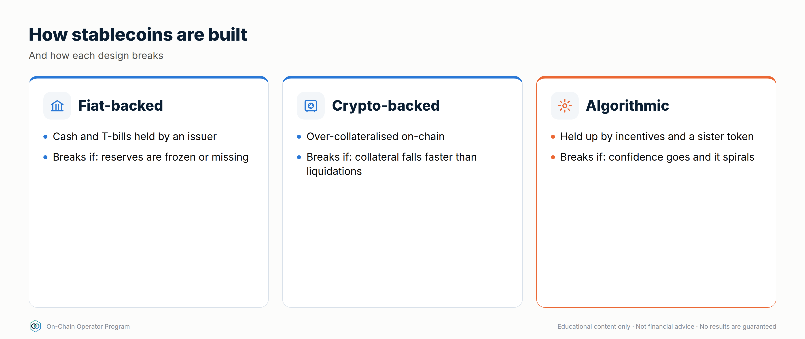

### Explanation
| Type | Backing | Main risks |
|---|---|---|
| **Fiat-backed** | Cash/treasuries held by an issuer | Issuer, bank and custodian risk; freezes; redemption limited to approved parties |
| **Crypto-backed** | Over-collateralised on-chain crypto | Collateral crash, liquidations, oracle failure |
| **Synthetic / hedged** | Derivative positions (e.g. spot + short perp) | Funding turns negative, exchange/venue risk, model risk |
| **Algorithmic** | Mostly its own mechanism / sister token | Reflexive death spiral when confidence breaks |

**Peg mechanics:** if a stablecoin trades at $0.98 and can be redeemed for
$1.00, arbitrageurs buy and redeem it, pushing the price back up. The peg is
only as strong as **redemption access and reserve quality**.

History (research these as case studies):
- **May 2022**: TerraUSD (UST), an algorithmic design, lost its peg and collapsed toward zero.
- **March 2023**: USDC briefly traded well below $1 after part of its reserves were exposed to the failed Silicon Valley Bank, then recovered once reserves were confirmed.

### Worked example
A fiat-backed coin trades at **$0.97**. Redemption is **$1.00 minus a 0.1% fee**,
but only for verified institutional minters.
- A minter makes ~2.9% per coin by buying and redeeming, so arbitrage *should* restore the peg.
- You can't redeem, so you rely on minters acting and on the reserves being real.
- If markets doubt the reserves, minters may not step in, and the discount can grow.

### Checklist
- [ ] I know the type and backing of every stablecoin I hold
- [ ] I know who can redeem, and how
- [ ] I don't treat "different stablecoins" as diversified if they share issuers or collateral
- [ ] I have a depeg exit rule (e.g. sell or rotate below $0.99 for longer than X hours)

### Quiz

1. What keeps a fiat-backed stablecoin near $1?
Redemption for $1 of reserves, plus arbitrageurs who can redeem.

2. Why are algorithmic designs fragile?
They rely on confidence and their own token. When demand falls, the mechanism can amplify the fall.

3. Two stablecoins both backed by the same collateral. Diversified?
No. They share the same failure point.

---

## Lesson 1.6 — Scam defence *(ch. 36)*

### Objective
Recognise the common attacks before they cost you anything.

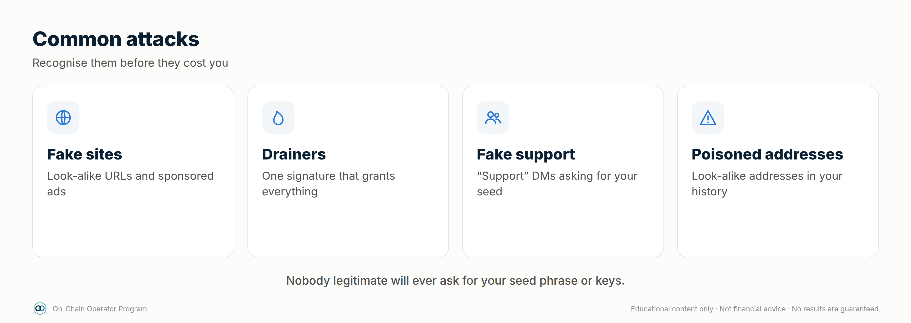

### Explanation
| Attack | How it works | Defence |
|---|---|---|
| **Phishing site** | Look-alike URL / sponsored search ad / fake app | Bookmarks only. Never click links from DMs or ads |
| **Wallet drainer** | You sign an approval, Permit or `setApprovalForAll` for an attacker | Read every prompt. Burner wallet for new sites |
| **Address poisoning** | Attacker sends $0 transfers from an address that looks like one you use, so it appears in your history | Never copy addresses from history. Use a saved address book and check the *full* address |
| **Fake token / airdrop** | Unknown tokens appear in your wallet with a "claim" link | Ignore them. Don't interact or try to sell |
| **Impersonation** | "Support", "admin" or "project team" DMs you | Real teams never DM first and never ask for seeds |
| **Too-good yields** | New protocol, huge APY, anonymous team, no audit | Due diligence (Module 6). Burner wallet and small size, or skip |

### Worked example — address poisoning
You regularly send to `0x7a3F…9c21`. Today your history shows a transfer from
`0x7a3F…9c21`, but the full address is `0x7a3F`**`e0b4…d18`**`9c21`: same
start and end, different middle. If you copy it from history you send your
funds to the attacker. **Always paste from your address book and check the
full address.**

### Checklist
- [ ] Protocol sites bookmarked; never reached through search ads or DMs
- [ ] Address book in use; full address checked before sending
- [ ] Unknown tokens ignored
- [ ] DMs from "support" treated as scams by default
- [ ] New sites only with the burner wallet

### Quiz

1. A new token worth "$5,000" appears in your wallet with a claim site. What do you do?
Ignore it. It's bait, and interacting risks a drainer approval.

2. How does address poisoning trick people?
It puts a look-alike address in your history so you copy it by mistake.

3. What's the single best habit against drainers?
Reading every signature and approval prompt, and using a burner wallet for anything new.

---

## Lesson 1.7 — Reading signatures and simulating transactions *(new)*

### Objective
Know exactly what a signature or transaction will do before you approve it.

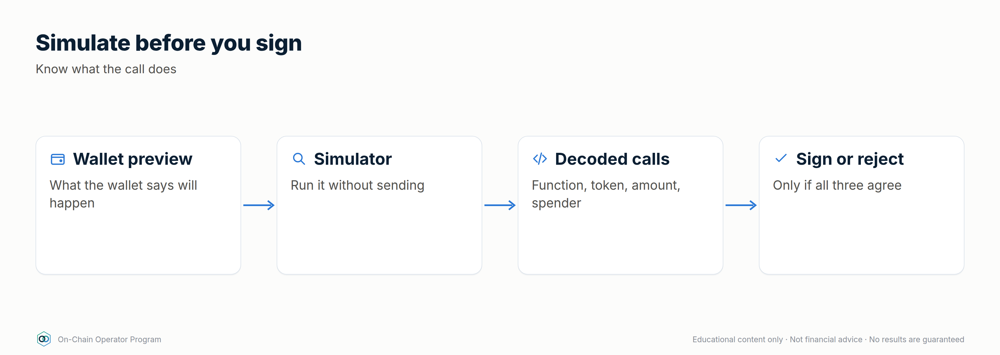

### Explanation
- **Transaction simulation:** good wallets (and tools like transaction simulators) show the **expected balance changes** before you sign: "−100 USDC, +0.033 ETH". If the preview shows assets leaving that you didn't intend, stop.
- **Typed-data signatures (EIP-712):** structured messages (orders, Permits) that your wallet shows as fields. Read the **spender**, **token**, **amount** and **deadline**. A "Permit" or "Permit2" signature can hand over token access without any gas.
- **Blind signing:** when a hardware wallet can't decode a transaction, it shows only a hash. Keep blind signing **off** by default; turn it on only for a specific, verified action, then off again.
- **Account delegation (EIP-7702):** since Ethereum's 2025 Pectra upgrade, a normal wallet can sign an authorisation that delegates its behaviour to a smart contract. A malicious delegation can hand control of the whole account to an attacker. Only sign delegations from wallets and apps you trust, for a stated purpose.
- **Rule:** if you can't say in one sentence what a prompt does, don't sign it.

### Worked example
A site asks you to "verify your wallet". The wallet shows a typed-data message:
`Permit2 · token: USDC · spender: 0x9f…c3 · amount: 115792089… (unlimited) · deadline: 2030`.
That isn't verification: it's unlimited USDC access for an unknown spender. Reject it, close the tab, and check your approvals.

### Checklist
- [ ] My wallet shows simulated balance changes before signing
- [ ] I read spender, token, amount and deadline on every typed-data prompt
- [ ] Blind signing is off on my hardware wallet
- [ ] I never sign account-delegation requests from unknown sites

### Quiz

1. What does transaction simulation show?
The expected balance changes before you sign.

2. Why is a Permit signature risky if you don't read it?
It can grant token access without a transaction or gas, so it's easy to approve by accident.

3. When should blind signing be on?
Only briefly, for a specific verified action, then switched off.

---

## Lesson 1.8 — Privacy and physical security *(new)*

### Objective
Keep your holdings private and your household safe as your on-chain wealth grows.

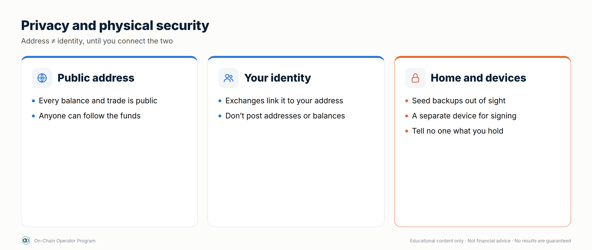

### Explanation
- **Blockchains are public.** Anyone who links an address to you can see its balance and history, forever.
- **Link less:** don't post addresses, screenshots or wins publicly; use separate addresses for public activity (e.g. donations, NFTs) and for savings; be aware that exchange withdrawals link your identity (KYC) to the receiving address.
- **Name services** (e.g. an ENS name) are convenient but make an address easy to find and associate with you.
- **Physical risk ("wrench attacks"):** criminals target people known to hold crypto. Low profile is the first defence. Multisig with keys in separate locations means no single person can be forced to move everything.
- **Home and devices:** hardware wallets and backups out of sight; encrypted devices; don't discuss holdings with people who don't need to know.

### Worked example
Alex posts a screenshot of a big win, with the address visible. Anyone can now see
Alex's balance and follow every future move, and scammers and thieves now have a target.
Better: no screenshots, a vault address that has never been shared, and a
2-of-3 multisig so no single key holder can be coerced into draining it.

### Checklist
- [ ] Savings addresses have never been posted or linked publicly
- [ ] No holdings screenshots or wins on social media
- [ ] Vault keys held so no single person can move everything
- [ ] Backups stored discreetly, away from where people would look

### Quiz

1. What does linking an address to your identity reveal?
Its full balance and history, now and in the future.

2. How does multisig help against physical threats?
No single person can be forced to move everything; other keys are elsewhere.

3. What links your identity to a wallet address?
For example, KYC exchange withdrawals, name services, or posting the address publicly.

---

## Lesson 1.9 — Smart accounts and account abstraction *(expert)*

### Objective
Understand how smart accounts change wallet security, and use their features without adding new risks.

### Explanation
- A normal wallet (an **EOA**, externally owned account) is controlled by one private key. A **smart account** is a contract wallet whose rules you choose.
- **ERC-4337 (account abstraction):** smart accounts without changing Ethereum itself. Transactions become "user operations" handled by **bundlers**; **paymasters** can pay gas for you (e.g. in USDC).
- **Features:** multisig and **social recovery** (trusted "guardians" can restore access), **spending limits**, **session keys** (Lesson 14.2), **batching** (approve + swap in one step), **passkeys** (log in with your device's biometrics instead of a seed phrase).
- **EIP-7702 (2025):** lets an ordinary wallet temporarily or permanently delegate to smart-account code: powerful, and a phishing target (Lesson 1.7).
- **New risks:** the account's contract code, module/plugin permissions, guardian collusion, and differences between chains (the same address may not exist on every chain).

### Worked example
Your operating wallet becomes a smart account with: a passkey on your phone plus a
hardware key (2-of-2 for large moves); a $2,000/day limit for small moves with just the
passkey; 3 guardians (2-of-3) who can recover access after a 48-hour delay you can cancel.
Lose your phone: recover via guardians. Phone stolen: the thief is capped at $2,000/day
and you have 48 hours to cancel a recovery you didn't start.

### Checklist
- [ ] I know which of my wallets are EOAs and which are smart accounts
- [ ] Guardians chosen so no two could plausibly collude; recovery has a cancel delay
- [ ] Module/plugin permissions reviewed like approvals
- [ ] Smart account deployed (or deployable) on every chain I send to

### Quiz

1. What does a paymaster do?
Pays gas on your behalf, e.g. letting you pay fees in USDC.

2. What is social recovery?
Trusted guardians can restore access to your account, usually after a delay.

3. Why check the smart account exists on the destination chain?
Smart-account addresses may not be deployed on every chain; funds sent there may be hard to access.

---

### Module 1 practical
1. Set up the 3-wallet structure (vault / operator / burner).
2. Send a small test transaction and trace it on an explorer: status, fee, nonce.
3. Approve a small, limited allowance on a reputable protocol, then revoke it.
4. Write your stablecoin list with type, backing, who can redeem, and your depeg exit rule.

---

# Module 2 — Trading On-Chain

*Outcome: execute a swap or LP position deliberately, understanding price impact, fees, impermanent loss and MEV.*
*Source: ATLAS "DeFi & On-Chain" ch. 6–9, 35. Educational content only. Not financial advice. Figures illustrative.*

---

## Lesson 2.0 — Mastery Starter

*New to this topic? Start here. It takes about 10 minutes and gets you from zero to ready for this module.*

### The 60-second version
A swap on a DEX trades against a pool of tokens priced by a formula. Providing liquidity to that pool earns fees but changes what you hold. This module teaches you to trade and provide liquidity knowing the real cost.

### Words you'll need
| Term | Meaning |
|---|---|
| DEX | a decentralised exchange you use from your wallet |
| Liquidity pool | a pot of two tokens traders swap against |
| Price impact | how much your trade moves the price |
| Slippage | the worst price you'll accept |
| Impermanent loss | how far an LP lags simply holding |

### Before you start
- [ ] Modules 0–1
- [ ] A little ETH for gas and some USDC on a low-fee network

### Your first safe step
Quote a $20 swap on one DEX and on an aggregator; compare what you'd actually receive after gas. Don't execute yet.

### The mastery ladder
| Level | You can… |
|---|---|
| **Beginner** | Makes small swaps with deliberate slippage and protected routing |
| **Practitioner** | Calculates fee APR and IL, and tracks LP vs holding |
| **Master** | Uses limit/TWAP/intent orders and runs LPs with written rules |

### You've mastered this module when…
…you can predict a swap's cost and an LP position's result against holding, before you enter.

---

## Lesson 2.1 — DEXs, aggregators & routing *(ch. 6)*

### Objective
Choose where to swap by comparing the **net amount received**, not the quoted price.

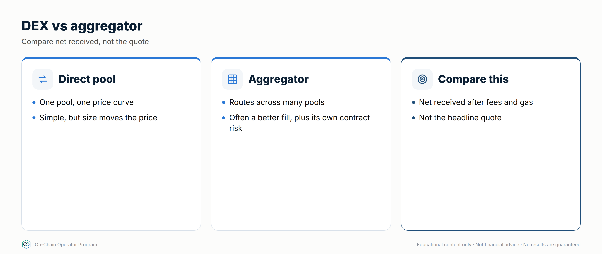

### Explanation
- **AMM DEX**: you trade against a liquidity pool priced by a formula (Lesson 2.2).
- **On-chain order book**: orders matched by price and time, fully or partly on-chain.
- **Aggregator**: searches many pools and venues and may split your order across routes.
- **Price impact**: how much *your* trade moves the price. It grows with size relative to pool depth.
- **Slippage tolerance**: the worst price you'll accept before the transaction reverts.
- **Routing**: multi-hop routes (A → B → C) can give a better price but touch more contracts.

**What you actually get = quoted output − price impact − pool fees − gas.**

### Worked example
Selling **20 ETH**:
| Route | Output | Gas | Net |
|---|---|---|---|
| Single pool direct | 59,100 USDC | $8 | **59,092** |
| Aggregator (split across 3 pools) | 59,420 USDC | $20 | **59,400** |

The aggregator wins by ~$308. Now selling **0.5 ETH**: the aggregator quotes $3
better but costs $12 more in gas, so the direct pool wins. **Big trades
benefit from routing. Small trades mostly lose to gas.**

### Checklist
- [ ] Compare net output after gas, not headline price
- [ ] Price impact shown and acceptable for the size
- [ ] Route uses reputable pools and tokens you've verified
- [ ] Slippage set on purpose (see 2.5)

### Quiz

1. Why can an aggregator give a better price?
It can split an order across pools, so each pool's price moves less.

2. When does the best quote lose?
When the extra gas costs more than the price improvement, which is common for small trades.

3. What drives price impact?
Trade size relative to pool liquidity.

---

## Lesson 2.2 — AMM Mathematics (x · y = k)

*Module 2 · Trading On-Chain · Source: ATLAS ch. 7*
*Template every lesson follows: Objective → Explanation → Worked example → Checklist → Quiz.*

> Educational content only. Not financial advice. Examples are illustrative.

### Objective
By the end of this lesson you can calculate what a swap will actually pay out
in a constant-product pool, and explain why bigger trades get worse prices.

### Explanation
A constant-product AMM holds two tokens in a pool. It doesn't use an order
book. It keeps one rule: **reserves of token A × reserves of token B = k**, and
k must stay constant (ignoring fees) after every trade.

- **Pool price** is the ratio of reserves. 100 ETH and 300,000 USDC means 1 ETH ≈ 3,000 USDC.
- When you add ETH to the pool, the pool must *remove* enough USDC to keep x·y = k.
- The more of the pool you move, the further the price moves against you. That gap is **price impact**.
- **Arbitrageurs** then trade the pool back in line with other markets, and that changes what LPs hold. You'll see why that matters in Lesson 2.4.

### Worked example

Pool: **100 ETH** and **300,000 USDC**, so k = 30,000,000. Spot price = 3,000 USDC/ETH.

You swap in **10 ETH** (fees ignored):
1. x' = 100 + 10 = 110
2. y' = 30,000,000 ÷ 110 ≈ 272,727
3. You receive 300,000 − 272,727 ≈ **27,273 USDC**
4. Effective price ≈ 27,273 ÷ 10 = **2,727 USDC/ETH**, which is **~9.1% worse** than spot.

Now try **1 ETH**: x' = 101 → y' ≈ 297,030 → you receive ≈ 2,970 USDC, which is ~1% worse.
Ten times the size cost about nine times more in price impact. **Size relative to
pool depth is what matters, not the size of the trade in dollars.**

### Checklist before any swap
- [ ] Check the price impact the interface shows; if it isn't shown, work it out
- [ ] Compare with an aggregator quote
- [ ] Set slippage tolerance on purpose (too tight: the swap fails; too loose: you get a bad fill or a sandwich attack, see 2.5)
- [ ] Split large trades or use deeper pools
- [ ] Run the before-signing checklist (chain, contract, token, amount, spender)

### Quiz

1. A pool holds 50 ETH / 150,000 USDC. What is k and the spot price?

k = 7,500,000; spot = 3,000 USDC/ETH.

2. Why does a 10 ETH swap get a worse average price than a 1 ETH swap in the same pool?

Each unit you add moves the reserve ratio further, so later units in the same trade are priced worse. Price impact grows with trade size relative to reserves.

3. Who moves the pool price back in line after your trade, and why does that matter to LPs?

Arbitrageurs do. Their trades rebalance what the LP holds, which is where impermanent loss comes from (Lesson 2.4).

---

## Lesson 2.3 — Providing liquidity *(ch. 8)*

### Objective
Estimate an LP position's fee income from real pool data.

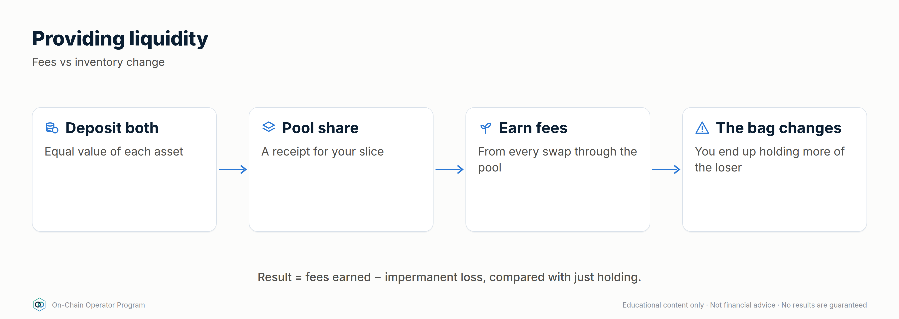

### Explanation
When you LP you deposit both tokens and receive a share of the pool (a token,
or an NFT for concentrated positions). You earn your share of swap fees. In
return, **your token mix changes as traders move the price**: you become
the counterparty to every trade.

**Fee APR estimate:**
`fee APR ≈ (daily volume × fee tier × your pool share × 365) ÷ your deposit`
For a full-range pool your share = deposit ÷ pool TVL, so this simplifies to
`daily volume × fee tier × 365 ÷ TVL`.

Use a **30-day average volume**, not today's. Volume spikes on volatile days,
which are also the days you take the most impermanent loss.

### Worked example
Pool TVL **$10M**, 30-day average daily volume **$2M**, fee tier **0.3%**:
- Daily pool fees = 2,000,000 × 0.003 = **$6,000**
- Your $10,000 = 0.1% share → **$6/day** → ~**21.9% fee APR** (before impermanent loss and gas)

If volume halves, your fee APR halves. If a lot more TVL joins the pool, your share shrinks.

### Checklist
- [ ] Fee APR calculated from 30-day volume
- [ ] I'm OK holding 100% of either token
- [ ] Entry prices recorded for the "vs hold" benchmark
- [ ] Exit rule written (volume drops, trend starts, fees stop covering IL)

### Quiz

1. Pool TVL $5M, daily volume $1M, 0.05% fee. Full-range fee APR?
1,000,000 × 0.0005 × 365 ÷ 5,000,000 = 3.65%.

2. Why use 30-day volume?
Single-day spikes overstate fee income, and they happen on the days you take the most impermanent loss.

3. What happens to your share if TVL doubles?
It halves, and so do your fees, at the same volume.

---

## Lesson 2.4 — Impermanent loss & true LP P&L *(ch. 9)*

### Objective
Calculate an LP position's full P&L and judge it against simply holding.

### Explanation
**Impermanent loss (IL)** is how much the LP position lags *simply holding the
same starting tokens* when their relative price changes:
`IL = 2√r ÷ (1 + r) − 1` (r = new price ÷ entry price). It's "impermanent" only
if price returns. Withdraw after the move and it's permanent.

**Full LP P&L = LP value + fees + incentives − gas**, compared to **hold value**.

### Worked example

Deposit **1 ETH + 3,000 USDC** at ETH = $3,000 (total $6,000). ETH rises to **$4,000**.
- Pool rebalances you to √(3,000 ÷ 4,000) = **0.866 ETH** and √(3,000 × 4,000) = **3,464 USDC**
- LP value = 0.866 × 4,000 + 3,464 = **$6,928**
- Hold value = 4,000 + 3,000 = **$7,000** → IL = −$72 (**−1.03%**)
- Fees earned $150, gas $20 → LP total **$7,058**

| Compared with | Result |
|---|---|
| Starting $6,000 | +$1,058 (mostly from ETH going up, not from LPing) |
| Holding | **+$58**, the actual value added by LPing |

A master judges the LP on the **+$58**, not the +$1,058.

Calculator: `defi_calc.py il --ratio 1.3333` · `defi_calc.py lp-breakeven --ratio 1.5 --days 90 --fee-apr 12`

### Checklist
- [ ] P&L tracked against hold, weekly
- [ ] IL, fees, incentives and gas recorded separately
- [ ] Exit if fees consistently fail to cover IL

### Quiz

1. ETH doubles. IL on a 50/50 pool?
About −5.7% vs holding.

2. Your LP is up 20% since deposit. Did LPing work?
Unknown until you compare with holding. The 20% could be all price.

3. When does IL become permanent?
When you withdraw while the price ratio is different from entry.

---

## Lesson 2.5 — MEV and protecting your trades *(ch. 35)*

### Objective
Set slippage and routing so your trades aren't easy targets.

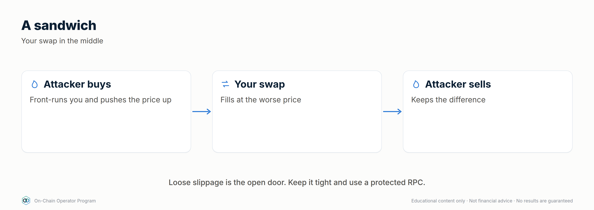

### Explanation
**MEV** (maximal extractable value) is profit taken by whoever orders
transactions in a block. Some is harmless (arbitrage realigning prices). The
kind that hurts you:
- **Sandwich attack**: a bot sees your pending swap, buys just before you
  (pushing the price up), lets your trade execute at the worse price, then
  sells just after. Your slippage tolerance is its profit ceiling.

**Defences:**
- Tight but realistic slippage (e.g. 0.1–0.5% for liquid majors, more only when you understand why)
- MEV-protected / private transaction routing (many wallets and aggregators offer this)
- Split large trades. Avoid thin pools
- Don't broadcast huge swaps in illiquid pairs

### Worked example
Swapping **$20,000**:
| Slippage tolerance | Max a sandwich can take (before its own costs) |
|---|---|
| 3% | up to ~$600 |
| 0.5% | up to ~$100 |
| Private / protected route | Transaction isn't visible in the public mempool, so it can't be sandwiched from there |

Too tight a tolerance (e.g. 0.05% on a volatile pair) just makes the transaction
fail, and failed transactions still cost gas (Lesson 1.2).

### Checklist
- [ ] Slippage set for this pair and size, never left at a high default
- [ ] Protected routing on for larger swaps
- [ ] Large orders split or routed through deep liquidity

### Quiz

1. What limits how much a sandwich bot can take?
Your slippage tolerance (and the pool's depth).

2. Why not set slippage near zero?
Normal price movement makes the transaction revert, and you still pay gas.

3. Name two MEV defences.
Any two: tight slippage, private/protected routing, splitting trades, using deep pools.

---

## Lesson 2.6 — Advanced execution: limit, TWAP and intent-based orders *(new)*

### Objective
Use order types that give you better prices and protection than a plain swap.

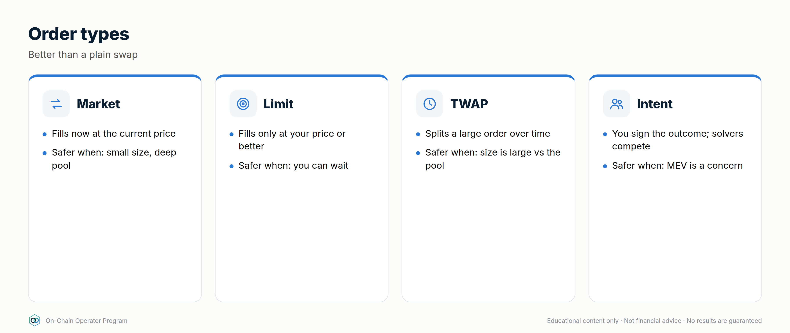

### Explanation
- **On-chain limit orders:** you sign an order off-chain ("sell 1 ETH at 3,300 or better"); it fills only if the price is reached. Usually gasless until filled.
- **TWAP orders:** split a large trade into equal slices over time to reduce price impact.
- **Intent-based / RFQ trading:** you state what you want ("100,000 USDC → ETH, at least X"); competing **solvers** or market makers fill it, often with MEV protection and no failed-transaction gas.
- **Trade-offs:** limit orders may never fill; TWAP takes time and the price can move away; intents rely on the protocol's solver design.

### Worked example
Buying $50,000 of ETH in a pool where a single $50,000 trade has ~1.5% price impact
(~$750). A TWAP of 10 × $5,000 over an hour has far less impact per slice, as long
as the price doesn't trend against you during the hour. An intent-based order may
beat both by sourcing liquidity from several venues at once. Compare the quotes.

### Checklist
- [ ] I compare a plain swap, a TWAP and an intent quote for large trades
- [ ] Limit orders have an expiry I've chosen
- [ ] I know which order types include MEV protection

### Quiz

1. Why split a large trade into a TWAP?
Smaller slices cause less price impact each.

2. What's the risk of a limit order?
It may never fill.

3. Who fills an intent-based order?
Competing solvers or market makers.

---

## Lesson 2.7 — Advanced AMM design and LVR *(expert)*

### Objective
Know the major AMM designs and measure an LP's real cost with loss-versus-rebalancing (LVR).

### Explanation
- **Constant product (x·y=k):** works for any pair; spreads liquidity across all prices.
- **StableSwap:** for assets that should trade near 1:1 (stablecoins, LST/ETH). Blends constant-sum (flat, low slippage near the peg) with constant-product (safety away from it), tuned by an **amplification** parameter.
- **Weighted pools:** more than two tokens or uneven weights (e.g. 80/20), with invariant ∏ xᵢ^wᵢ = k. An 80/20 pool has less impermanent loss on the 80% token.
- **Concentrated liquidity:** positions in price ranges ("ticks"); the pool tracks √price internally.
- **Hooks and dynamic fees:** newer designs (e.g. Uniswap v4, 2025) let pools run custom code at swap time: dynamic fees, limit orders, oracles. Each hook is extra contract risk.
- **LVR (loss-versus-rebalancing):** pool prices only update when arbitrageurs trade against LPs after prices move elsewhere. LVR measures what LPs lose to that arbitrage, versus a portfolio that rebalances at market prices. For a full-range constant-product pool, **LVR ≈ σ²/8 of pool value per year** (σ = annual volatility). **Fees must beat LVR**, not just impermanent loss.

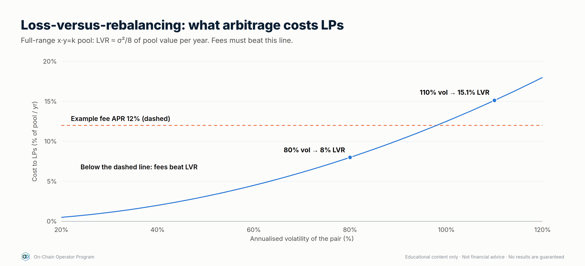

### Worked example
An ETH/USDC full-range pool with ETH volatility **80%/yr**:
`defi_calc.py lvr --vol 80 --fee-apr 12` → LVR ≈ **8.0%/yr**. With 12% fee APR, LPs keep
≈ **+4%/yr** before gas. If volatility rises to 110%, LVR ≈ 15%/yr, and the same fees now lose money.
Higher-volatility pairs need much higher fee tiers.

### Checklist
- [ ] I choose pool type by pair: StableSwap for pegged pairs, weighted/CL otherwise
- [ ] I compare fee APR with LVR, not just IL
- [ ] Hook contracts reviewed like any other contract

### Quiz

1. Why do stable pairs use StableSwap curves?
They give very low slippage near the peg, where these pairs trade.

2. What does LVR measure?
What LPs lose to arbitrageurs because pool prices lag the market.

3. Volatility 60%/yr: approximate LVR for a full-range pool?
0.6²/8 = 4.5% of pool value per year.

---

## Lesson 2.8 — The MEV supply chain *(expert)*

### Objective
Understand who sees, orders and profits from your transactions, and how to get some of that value back.

### Explanation
The path of an Ethereum transaction today:
1. **You / your wallet** send it, either to the **public mempool** or to a **private RPC** (e.g. an MEV-protection endpoint).
2. **Searchers** scan for opportunities (arbitrage, liquidations, backruns, sandwiches) and submit **bundles**.
3. **Builders** assemble the most profitable blocks from transactions and bundles.
4. **Relays** pass blocks to **proposers** (validators), who pick the highest-paying block (**proposer-builder separation**, via MEV-Boost).
- **Order-flow auctions / MEV rebates:** some private RPCs and wallets let searchers bid to backrun your transaction and **refund you part** of the value.
- **Intent systems** (Lesson 2.6) move competition to solvers, often with built-in protection.
- L2s usually have a **single sequencer** ordering transactions, which changes MEV dynamics (e.g. first-come-first-served or priority-fee ordering).

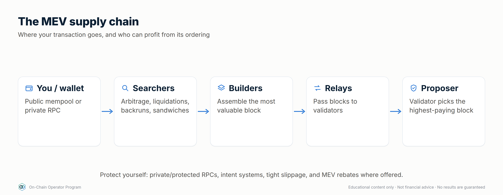

### Worked example
A $100,000 swap sent publicly with 1% slippage could leak up to ~$1,000 to a sandwich.
Sent through a protected RPC with rebates: no sandwich, and if the trade creates a
backrun opportunity (e.g. arbitrage between pools), you may receive a share of it back.
Same trade, very different outcome, decided by where you send it.

### Checklist
- [ ] Large trades go through a protected RPC, an intent system or an aggregator with MEV protection
- [ ] I know whether my wallet's RPC offers rebates
- [ ] I understand my L2's sequencer ordering rules

### Quiz

1. What do builders do?
Assemble blocks from transactions and searcher bundles to maximise value.

2. What is an MEV rebate?
A refund of part of the value searchers extract from backrunning your transaction.

3. Who orders transactions on most L2s today?
A sequencer, often a single operator.

---

### Module 2 practical
1. Quote the same swap on a single DEX and an aggregator. Record the net output after gas for a small and a large size.
2. Pick a real pool and calculate its full-range fee APR from 30-day volume and TVL.
3. Model an LP entry with `defi_calc.py`: IL at ±25% and ±50%, and the fee APR needed to break even over 90 days.
4. Turn on protected routing in your wallet or aggregator and set a default slippage you can justify.
