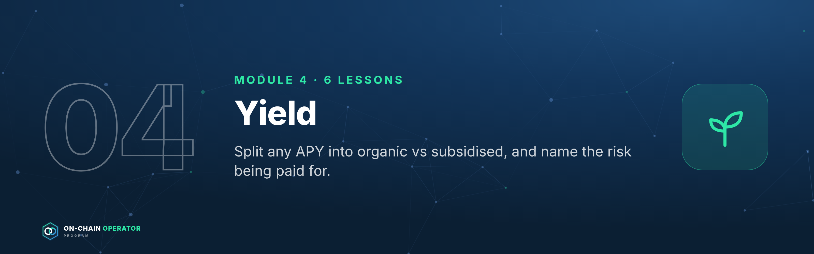

# On-Chain Operator Program — Stage 2 · Practitioner

*Section file generated by `build_master.py` from `lessons/` (edit the lessons, not this file). Modules 3, 4, 5. Every module opens with its Mastery Starter (N.0). Educational content only. Not financial advice.*

---

# Module 3 — Lending & Leverage


*Outcome: borrow against collateral with a buffer and a written defence plan.*
*Stage 2 · Practitioner. Source: ATLAS "DeFi & On-Chain" ch. 10–13. Educational content only. Not financial advice. Figures are illustrative.*

---

## Lesson 3.0 — Mastery Starter

*New to this topic? Start here. It takes about 10 minutes and gets you from zero to ready for this module.*

### The 60-second version
Lending markets let you earn interest by lending, or borrow against what you own without selling it. Borrowing comes with one hard rule: if your collateral falls too far, it's sold automatically, at a penalty.

### Words you'll need
| Term | Meaning |
|---|---|
| Collateral | what you lock up to borrow |
| LTV | debt ÷ collateral value |
| Health factor | your safety margin; below 1 means liquidation |
| Liquidation | forced sale of collateral to repay debt |
| Utilisation | how much of a pool is borrowed |

### Before you start
- [ ] Modules 0–2
- [ ] Comfort using a DEX on a low-fee network

### Your first safe step
Supply $20 of USDC to a blue-chip lending market, read its utilisation, then withdraw it. No borrowing yet.

### The mastery ladder
| Level | You can… |
|---|---|
| **Beginner** | Supplies stablecoins and reads utilisation and rates |
| **Practitioner** | Borrows with HF ≥ 2 and a written defence ladder |
| **Master** | Runs correlated loops and perps with computed liquidation prices and break-even rates |

### You've mastered this module when…
…you can open, monitor and unwind a borrow without ever approaching liquidation.

---

## Lesson 3.1 — How lending markets work *(ch. 10)*

### Objective
Explain where lending yields come from and why rates jump when a market is nearly fully borrowed.

### Explanation
A DeFi **money market** is a pool: lenders **supply** assets, borrowers
**borrow** them against collateral, and a smart contract sets the rates.
- **Utilisation** = borrowed ÷ supplied. It drives the rates.
- **Interest-rate curve:** most markets use a "kinked" curve. Rates rise gently
  up to an **optimal utilisation** (e.g. 80%), then steeply above it, to pull in
  lenders and push out borrowers.
- **Supply APY ≈ borrow APY × utilisation × (1 − reserve factor).** The reserve
  factor is the protocol's cut.
- **Receipt tokens:** when you supply, you get a token representing your
  deposit plus interest.

### Worked example (illustrative curve: 4% at 80% optimal, +60% slope above)
| Utilisation | Borrow APY | Supply APY (10% reserve factor) |
|---|---|---|
| 50% | 2.5% | 1.1% |
| 70% | 3.5% | 2.2% |
| 80% | 4.0% | 2.9% |
| 90% | 34.0% | 27.5% |
| 95% | 49.0% | 41.9% |

Near 100% utilisation, rates spike **and lenders may not be able to withdraw**,
because the money is lent out. A sudden high supply APY is often a warning, not a gift.

### Checklist
- [ ] I check utilisation before supplying
- [ ] I know the market's optimal-utilisation kink
- [ ] I treat a sudden rate spike as a liquidity warning

### Quiz
<details><summary>1. What sets the rates in a money market?</summary>Mainly utilisation, through the protocol's interest-rate curve.</details>
<details><summary>2. Why does the curve kink?</summary>To make borrowing expensive and supplying attractive when liquidity runs low, restoring withdrawal capacity.</details>
<details><summary>3. Utilisation is 99%. Risk for lenders?</summary>Withdrawals may be blocked until borrowers repay or new supply arrives.</details>

---

## Lesson 3.2 — LTV, liquidation threshold & health factor *(ch. 11)*

### Objective
Calculate your LTV, health factor and liquidation price before you borrow.

### Explanation
- **LTV (loan-to-value)** = debt ÷ collateral value.
- **Max LTV:** the most you can borrow against an asset.
- **Liquidation threshold (LT):** the LTV at which your position can be liquidated. It's higher than max LTV.
- **Health factor (HF)** = (collateral value × LT) ÷ debt. **Below 1.0 = liquidatable.**
- **Liquidation price** = debt ÷ (collateral quantity × LT).


### Worked example
10 ETH at $3,000 ($30,000), LT 0.80, borrow $12,000:
- LTV **40%** · HF **2.0** · liquidation at **$1,500** (−50%)
- `defi_calc.py health --qty 10 --price 3000 --lt 0.8 --debt 12000`
- Max debt for HF 2.0 = $12,000; for HF 1.5 = $16,000.

### Checklist
- [ ] HF and liquidation price calculated before borrowing
- [ ] HF ≥ 2 for volatile collateral
- [ ] Alerts set (Module 14.1)

### Quiz
<details><summary>1. Collateral $50,000, LT 0.8, debt $20,000. HF?</summary>2.0.</details>
<details><summary>2. Why keep HF well above 1?</summary>Collateral prices can fall fast; the buffer is your time to react.</details>
<details><summary>3. Max LTV vs liquidation threshold?</summary>Max LTV caps new borrowing; the liquidation threshold is where liquidation becomes possible.</details>

---

## Lesson 3.3 — Liquidations and cascades *(ch. 12)*

### Objective
Know exactly what a liquidation costs you, and how to avoid ever reaching one.

### Explanation
When HF drops below 1, a **liquidator** (usually a bot) repays part of your debt
(up to the **close factor**, often 50%) and takes that value of your
collateral **plus a bonus** (the liquidation penalty, often 5–10%).
Liquidations sell collateral into a falling market, which can push prices
lower and trigger more liquidations: a **cascade**.

### Worked example
Your position from 3.2. ETH falls to **$1,490**, HF just under 1:
- A liquidator repays **$6,000** (50% close factor) and seizes $6,000 × 1.05 = **$6,300** of ETH ≈ **4.228 ETH**.
- The **$300** bonus is a pure loss to you, on top of having sold ETH near the low.

**Defence ladder:** HF 2.0 → alert; HF 1.7 → repay from reserve or add
collateral; HF 1.5 → sell part of the collateral yourself. Never wait for 1.1.

### Checklist
- [ ] Defence ladder written with exact HF levels
- [ ] Reserve set aside to repay (Module 12.4)
- [ ] Oracle for my collateral known (Module 5.3)

### Quiz
<details><summary>1. What does a liquidator receive?</summary>Collateral equal to the debt repaid plus a bonus (penalty).</details>
<details><summary>2. Why is self-deleveraging better than being liquidated?</summary>You avoid the penalty and choose the size and timing.</details>
<details><summary>3. How do cascades form?</summary>Liquidations sell collateral, pushing prices down, which pushes more positions below HF 1.</details>

---

## Lesson 3.4 — Borrowing strategies & looping *(ch. 13)*

### Objective
Use borrowing deliberately, and know when looping adds return and when it just adds risk.

### Explanation
- **Liquidity without selling:** borrow stablecoins against assets you want to keep (Module 12.3 turns this into a credit policy).
- **Looping:** deposit → borrow → re-deposit → repeat, to multiply exposure. After n loops at LTV L: leverage = `(1 − L^(n+1)) ÷ (1 − L)`.
- **Net APY on equity** = collateral yield × leverage − borrow rate × (leverage − 1).
- **Correlated loops** (an LST against its underlying, or stablecoin against stablecoin) are far safer than volatile-against-stable loops.


### Worked example
LTV 0.7, 3 loops, 3.5% collateral yield, 2.5% borrow:
`defi_calc.py loop --ltv 0.7 --loops 3 --collateral-apy 3.5 --borrow-apy 2.5`
→ **2.53×** leverage, **5.03%** net on equity. The return is wiped out if borrow rises to **5.78%**.
Section 3.1 showed borrow rates can jump from 4% to 34% in hours. That's the risk.

### Checklist
- [ ] Repayment source named before borrowing
- [ ] Loops only on correlated pairs, below max leverage
- [ ] Break-even borrow rate known and alerted

### Quiz
<details><summary>1. Max leverage at LTV 0.75?</summary>4×.</details>
<details><summary>2. What single number decides whether a loop is worth it?</summary>The spread between collateral yield and borrow rate.</details>
<details><summary>3. Why prefer correlated loops?</summary>Collateral and debt move together, so price moves barely change HF.</details>

---

## Lesson 3.5 — Perpetual futures and margin on-chain *(new)*

### Objective
Understand perp positions well enough to use them for hedging (Module 11) and carry (10.3), and to see why high leverage fails.

### Explanation
- A **perpetual future (perp)** tracks an asset's price with no expiry. You post **margin** and choose **leverage**.
- **Isolated margin:** only the margin in that position is at risk. **Cross margin:** your whole account backs every position (one bad trade can drain the rest).
- **Mark price** (used for liquidation) vs **index price** (spot reference). **Funding** is paid between longs and shorts, usually every hour or 8 hours.
- **Liquidation** happens when your margin falls to the **maintenance margin**. Roughly, a long is liquidated after a fall of `1 ÷ leverage − maintenance margin`.

### Worked example
Long ETH from $3,000 at **5×**, 0.5% maintenance margin:
`defi_calc.py perp --entry 3000 --leverage 5 --mmr 0.5` → liquidation ≈ **$2,415 (−19.5%)**.
The same short at **20×** is liquidated at ≈ **$3,135 (+4.5%)**, a move ETH can make in an hour.
Leverage doesn't just magnify gains: it shrinks how wrong you're allowed to be.

### Checklist
- [ ] Isolated margin by default
- [ ] Liquidation price computed before opening
- [ ] Leverage ≤ 2–3× for anything but a hedge I fully understand
- [ ] Funding cost checked for how long I'll hold

### Quiz
<details><summary>1. Isolated vs cross margin?</summary>Isolated risks only that position's margin; cross puts the whole account behind every position.</details>
<details><summary>2. Roughly how far can a 10× long fall before liquidation (0.5% maintenance)?</summary>About 9.5%.</details>
<details><summary>3. Which price triggers liquidation?</summary>The mark price.</details>

---

## Lesson 3.6 — Lending design deep dive: e-mode, caps, auctions, soft liquidation, bad debt *(expert)*

### Objective
Read a lending protocol's risk parameters like a risk manager.

### Explanation
- **Efficiency mode (e-mode):** higher LTVs for **correlated** assets (e.g. an LST against ETH, or stablecoin against stablecoin). Great for correlated loops; dangerous if the correlation breaks (a depeg).
- **Isolation mode / isolated markets:** newer or riskier collateral can only back limited borrowing, so its failure can't infect the whole pool.
- **Supply and borrow caps:** limits on how much of an asset can be deposited or borrowed, protecting against manipulation and illiquid collateral.
- **Liquidation mechanisms:** a **fixed bonus** (liquidators get e.g. 5% extra) vs **Dutch auctions** (the price falls until someone buys, a better price discovery in calm markets but vulnerable if keepers fail) vs **soft liquidation** (collateral is converted gradually across price bands as the price falls, and can convert back if the price recovers; losses come from the conversions rather than one penalty).
- **Bad debt:** when collateral is worth less than the debt it backs. Who pays: a reserve or insurance fund, a staking "safety module", or **lenders pro rata** (socialised).
- **Risk curators / risk managers** set these parameters; governance approves them.


### Worked example
An LST loop in e-mode at 90% LTV looks safe because LST and ETH move together.
If the LST trades at a 6% discount on the oracle during a panic, the "correlated"
position can be liquidated even though ETH's price didn't move. Check what
oracle prices the LST (market price vs exchange rate) before trusting e-mode.

### Checklist
- [ ] For each market: LTV, liquidation threshold, bonus/mechanism, caps, oracle
- [ ] I know who absorbs bad debt in each protocol I lend to
- [ ] E-mode positions have a depeg scenario in my stress test

### Quiz
<details><summary>1. What is e-mode for?</summary>Higher LTVs on correlated assets.</details>
<details><summary>2. How does soft liquidation differ from a fixed-bonus liquidation?</summary>Collateral is converted gradually across price bands (and can convert back) instead of being seized in one go with a penalty.</details>
<details><summary>3. Who can end up paying for bad debt?</summary>Protocol reserves, a safety module, or lenders pro rata.</details>

---

## Lesson 3.7 — CDP stablecoins: minting your own dollars *(expert)*

### Objective
Mint stablecoins against your own collateral (as your own bank would), and manage the position safely.

### Explanation
- A **CDP** (collateralised debt position) lets you lock collateral and **mint** a stablecoin against it. You owe the stablecoin back, plus a **stability fee** (interest).
- **Minimum collateral ratio** (e.g. 150%): below it, the position is liquidated.
- The stablecoin holds its peg through over-collateralisation, liquidations, interest rates and often a **peg stability module (PSM)** that swaps it 1:1 (minus a small fee) with other stablecoins.
- Compared with borrowing from a lending pool: you create new money rather than borrow someone's deposit; rates are set by governance, not utilisation.
- **Uses:** liquidity without selling (Module 12.3), funding a liquidity ladder, or a yield-covered credit line (strategy #25).

### Worked example
10 ETH at $3,000 ($30,000) with a 150% minimum ratio: you could mint up to $20,000.
Mint **$10,000** instead:
`defi_calc.py cdp --qty 10 --price 3000 --mint 10000 --fee 6`
→ ratio **300%**, liquidation at **$1,500 (−50%)**, stability fee **$600/yr**.
Operators treat the maximum as a cliff, not a target.

### Checklist
- [ ] Collateral ratio target (e.g. ≥ 250%) and action levels written
- [ ] Stability fee vs alternatives (lending-pool borrow rates) compared
- [ ] Peg mechanism (PSM, rates) understood, and my exit if the stablecoin depegs

### Quiz
<details><summary>1. What do you owe on a CDP?</summary>The minted stablecoin plus the accrued stability fee.</details>
<details><summary>2. Collateral $40,000, 150% minimum ratio. Maximum mint?</summary>About $26,667.</details>
<details><summary>3. What does a PSM do?</summary>Swaps the stablecoin 1:1 (minus a fee) with other stablecoins, supporting the peg.</details>

---

### Module 3 practical
1. Pick a real lending market: record utilisation, supply and borrow APY, and the kink.
2. Model a borrow with `defi_calc.py health`; write your defence ladder.
3. Model one loop with `defi_calc.py loop` and write its break-even borrow rate.

---

# Module 4 — Yield



*Outcome: split any APY into organic vs subsidised, and name the risk being paid for.*
*Stage 2 · Practitioner. Source: ATLAS "DeFi & On-Chain" ch. 14–18, 37. Educational content only. Not financial advice. Figures are illustrative.*


---

## Lesson 4.0 — Mastery Starter

*New to this topic? Start here. It takes about 10 minutes and gets you from zero to ready for this module.*

### The 60-second version
Every yield is payment for a risk. Staking pays you to secure a network, lending pays for borrower demand, farms often pay in newly printed tokens. This module teaches you to see what each yield really pays for.

### Words you'll need
| Term | Meaning |
|---|---|
| APY | yearly return including compounding |
| Emissions | new reward tokens printed by a protocol |
| Staking | locking tokens to help secure a network |
| LST | a token representing staked assets |
| RWA | a token representing a real-world asset |

### Before you start
- [ ] Modules 0–3

### Your first safe step
Take any advertised APY and split it into base yield vs incentives using the protocol's own dashboard.

### The mastery ladder
| Level | You can… |
|---|---|
| **Beginner** | Tells base yield from emissions |
| **Practitioner** | Compares vaults vs DIY and prices points/airdrops as bets |
| **Master** | Builds yield from durable sources: lending, staking, savings rates, tokenized treasuries |

### You've mastered this module when…
…you can name the source and the risk behind any yield in one sentence.

---

## Lesson 4.1 — Yield farming: base yield vs emissions *(ch. 14)*

### Objective
Split a farm's APY into what's earned from real activity and what's paid in newly minted tokens.

### Explanation
- **Base yield:** trading fees or borrower interest. Paid by real users.
- **Emissions / incentives:** new tokens the protocol prints to attract deposits. The reward token often falls while emissions continue.
- **Mercenary liquidity:** capital that leaves when incentives end, often taking the base yield with it.

### Worked example
A farm shows **60% APY**: 5% fees + 55% in reward tokens. If the reward token
falls 50% on average while you harvest, the emissions are worth ~27.5%, so the
real return is ~**32.5%**, before impermanent loss and gas. Remove emissions
entirely and you're left with 5%. **Would you take the risk for 5%?** That's the real question.

### Checklist
- [ ] APY split into base vs incentives
- [ ] Reward token valued at a realistic, falling price
- [ ] Harvest-and-sell schedule set

### Quiz
<details><summary>1. What's the test for a farm?</summary>Does the base yield alone justify the risk?</details>
<details><summary>2. Why do emissions APYs fall?</summary>More capital shares the rewards, and the reward token's price often declines.</details>
<details><summary>3. What is mercenary liquidity?</summary>Capital that moves on as soon as incentives end.</details>

---

## Lesson 4.2 — Native staking *(ch. 15)*

### Objective
Understand what staking pays for, and its lock-up and validator risks.

### Explanation
Proof-of-stake networks pay **stakers** to secure the chain. You either run a
validator or **delegate** to one. Rewards come from issuance and fees. Risks:
**slashing** (penalties for validator misbehaviour on some networks),
**unbonding periods** (waiting time to withdraw) and validator downtime.

### Worked example
Staking yields a few percent a year in the staked asset (e.g. ~3%, illustrative).
Your dollar return is still dominated by the asset's price: +3% staking on an
asset that falls 30% is still a large loss. **Stake what you'd hold anyway.**

### Checklist
- [ ] Validator/provider chosen on uptime, fee, concentration and record
- [ ] Unbonding period known
- [ ] Only "hold-anyway" capital staked

### Quiz
<details><summary>1. What do staking rewards pay for?</summary>Securing the network.</details>
<details><summary>2. What is unbonding?</summary>A waiting period before unstaked assets become transferable.</details>
<details><summary>3. Does staking protect against price falls?</summary>No. It adds a small yield; price moves dominate.</details>

---

## Lesson 4.3 — Liquid staking (LSTs) *(ch. 16)*

### Objective
Use liquid staking tokens knowing how they accrue value and how they can depeg.

### Explanation
A **liquid staking token (LST)** represents staked assets plus rewards, and can
be traded or used as collateral. Value accrues by **rebasing** (your balance
grows) or an **exchange rate** that rises (each token is worth more of the
underlying). In stress, an LST can trade at a **discount** to what it redeems for.

### Worked example
An exchange-rate LST goes from 1.000 to 1.030 of the underlying over a year: **3%**.
In a panic it trades at 0.98 on the market. Holders who can wait for redemption
(queue) recover 1.03; holders forced to sell take the 2% discount.
**Never borrow so close to the limit that an LST discount liquidates you.**

### Checklist
- [ ] Accrual method known (rebase vs exchange rate)
- [ ] Redemption path and queue length known
- [ ] Discount alert set if used as collateral

### Quiz
<details><summary>1. Two ways LSTs pass on rewards?</summary>Rebasing balances, or a rising exchange rate.</details>
<details><summary>2. What is an LST discount?</summary>Its market price falling below its redemption value.</details>
<details><summary>3. Who is hurt most by a discount?</summary>Forced sellers and leveraged holders who get liquidated.</details>

---

## Lesson 4.4 — Restaking & shared security *(ch. 17)*

### Objective
Map the extra risk layers restaking adds before accepting its extra yield.

### Explanation
Restaking reuses staked assets to secure additional services, for extra
rewards and often points. Each service adds its own **slashing conditions**,
and **operators** (who run the services) add operational risk. One collateral
base securing many services creates **correlated failure**. Full strategy
treatment: Lesson 10.6.

### Worked example
Stack for one position: ETH → staked → LST → liquid restaking token →
restaking protocol → 4 services. That's **6 layers**, each able to fail. The extra
yield must pay for all of them. Plan with points valued at zero.

### Checklist
- [ ] Every layer of the stack written down
- [ ] Slashing conditions of each service read
- [ ] Sized in the speculative bucket

### Quiz
<details><summary>1. What does restaking add?</summary>Extra rewards in exchange for extra slashing and operator risk.</details>
<details><summary>2. Why is correlated failure a concern?</summary>One collateral base secures many services; a failure can hit them all.</details>
<details><summary>3. How should points be valued when planning?</summary>At zero.</details>

---

## Lesson 4.5 — Vaults & yield optimisers *(ch. 18)*

### Objective
Decide when a vault's fees are worth paying compared with doing it yourself.

### Explanation
A **vault** pools deposits and runs a strategy (often harvesting and
reinvesting rewards). You get **shares**. Costs: **performance fee** (a share of
profits), **management fee** (a share of assets per year), sometimes
**withdrawal fees**. Risks: the vault's code plus **every protocol it uses**.

### Worked example
Gross 10%, 20% performance fee, 0.5% management → **7.5%** net.
DIY instead, compounding weekly at $2 gas:
- $5,000 position: gas = $104/yr = **2.08%** drag → the vault probably wins.
- $500,000 position: gas = **0.02%** drag, while the vault's fees cost 2.5 points → DIY probably wins.

### Checklist
- [ ] Net APY after all vault fees computed
- [ ] Compared with DIY gas drag at my size
- [ ] Every underlying protocol reviewed

### Quiz
<details><summary>1. Gross 12%, 10% performance fee, 1% management. Net?</summary>12 × 0.9 − 1 = 9.8%.</details>
<details><summary>2. Why do vaults suit small positions?</summary>They spread gas costs across all depositors.</details>
<details><summary>3. What risk does a vault add?</summary>Its own code and strategy, on top of every protocol it deposits into.</details>

---

## Lesson 4.6 — Airdrops & points: opportunity cost *(ch. 37)*

### Objective
Price airdrop and points farming as a bet, including its costs.

### Explanation
Protocols reward early users with tokens (**airdrops**), often tracked by
**points** first. Eligibility rules, snapshots and **sybil filters** (removing
people who split into many wallets) decide who gets what. Nothing is promised.
Fake claim sites are one of the most common scams (Lesson 1.6).

### Worked example
`defi_calc.py airdrop --probability 0.3 --value 1500 --costs 200` → EV **$250**.
If the same $10,000 could earn 5% ($500/yr) risk-light elsewhere, the farm must
beat that plus its extra risk, or it's the worse choice.

### Checklist
- [ ] Only actions I'd take anyway, or a capped speculative budget
- [ ] Opportunity cost compared
- [ ] Claims only from verified official links

### Quiz
<details><summary>1. Are points a promise of tokens?</summary>No.</details>
<details><summary>2. What's a sybil filter?</summary>Rules that exclude wallets believed to belong to the same person farming many times.</details>
<details><summary>3. What's the airdrop EV formula?</summary>Probability × value − costs.</details>

---

## Lesson 4.7 — Stablecoin savings rates and yield-bearing stablecoins *(new)*

### Objective
Tell apart the different ways a stablecoin can pay yield, and the risk behind each.

### Explanation
Yield on "dollars" on-chain comes from one of four places:
1. **Lending:** you lend stablecoins to borrowers (Module 3). Risk: the protocol, collateral and oracles.
2. **Savings rates:** some stablecoin protocols pay a set rate to holders who deposit into a savings contract, funded by their own revenue. Risk: the stablecoin's design and governance setting the rate.
3. **Treasury-backed:** the issuer holds short-term government debt and passes on part of the interest (Lesson 4.8). Risk: the issuer, custodian and redemption terms.
4. **Synthetic / basis-backed:** yield comes from a hedged derivatives position (spot long + perp short) earning funding. Risk: funding turns negative, exchange failure, and the design itself (Lesson 10.3).

Same "4–10% on dollars", four completely different risks.

### Worked example
$10,000 in a yield-bearing stablecoin paying 4.5% earns ~**$450/yr** *if* the rate
holds. Before buying, answer: where does the 4.5% come from (1–4 above)? What
happens to it in a bear market when funding goes negative? Can you redeem for
$1, and who can?

### Checklist
- [ ] Yield source identified (lending, savings rate, treasuries or basis)
- [ ] Redemption path and who can redeem known
- [ ] Split across different yield sources, not just different tickers

### Quiz
<details><summary>1. Name the four sources of stablecoin yield.</summary>Lending, protocol savings rates, treasury backing, and synthetic basis/funding positions.</details>
<details><summary>2. Why can a basis-backed stablecoin's yield fall to zero?</summary>Funding can turn negative in bear markets.</details>
<details><summary>3. Two yield-bearing stablecoins both backed by basis trades: diversified?</summary>Not really. They share the same yield source and failure mode.</details>

---

## Lesson 4.8 — Tokenized treasuries and real-world assets (RWAs) *(new)*

### Objective
Use tokenized real-world assets knowing what you actually own and who you're trusting.

### Explanation
- **RWAs** are tokens that represent off-chain assets: short-term government bills (the most common), money-market funds, credit, commodities, property.
- Tokenized treasury products typically pay close to the short-term government rate **minus a management fee**.
- **What you're trusting:** the **issuer** (legal structure), the **custodian** holding the real assets, the **redemption** process, and the token's **transfer rules**.
- **Access limits:** many RWA tokens are only for verified (KYC'd) or accredited/qualified investors, and not available in every country. Check eligibility where you live; don't try to get around restrictions.
- **Composability:** some RWA tokens can be used as collateral in DeFi; others are restricted to allowlisted wallets.

### Worked example (illustrative)
If short-term government bills yield 4.0% and the product charges 0.15%, you'd
earn about **3.85%** before any on-chain costs. In the own-bank ladder (Module 12.4),
this can suit the T1/T2 tiers, but only if redemption times match when you'll need the money.

### Checklist
- [ ] I'm eligible in my country (and it's legal to hold)
- [ ] Issuer, custodian and redemption terms read
- [ ] Transfer restrictions and minimums known
- [ ] Sized within caps, like any other issuer risk

### Quiz
<details><summary>1. What does a tokenized treasury product's yield track?</summary>Short-term government rates, minus the product's fees.</details>
<details><summary>2. Name two parties you trust with an RWA token.</summary>Any two: the issuer, the custodian, the redemption agent, the token's administrators.</details>
<details><summary>3. Why check transfer restrictions?</summary>Some RWA tokens only move between allowlisted wallets, which limits exit and DeFi use.</details>

---

### Module 4 practical
1. Decompose three real APYs into base vs incentive.
2. Compare one vault's net APY with DIY at your position size.
3. Write the risk stack for one staking or restaking position.

---

# Module 5 — Infrastructure Risk


*Outcome: map every bridge, oracle, L2 and contract a position depends on.*
*Stage 2 · Practitioner. Source: ATLAS "DeFi & On-Chain" ch. 19–23. Educational content only. Not financial advice.*

**Why this module matters:** most of DeFi's largest losses came from the
plumbing (bridges, oracles, admin keys, contract bugs), not from price moves.

---

## Lesson 5.0 — Mastery Starter

*New to this topic? Start here. It takes about 10 minutes and gets you from zero to ready for this module.*

### The 60-second version
Your position is only as safe as the weakest thing it depends on: the bridge that moved your tokens, the oracle that prices your collateral, the admin key that can upgrade the contract. Most big DeFi losses came from this plumbing.

### Words you'll need
| Term | Meaning |
|---|---|
| Bridge | moves tokens between chains |
| Layer 2 | a cheaper network built on Ethereum |
| Oracle | feeds prices into contracts |
| Proxy | a contract whose logic can be upgraded |
| Timelock | a delay before changes take effect |

### Before you start
- [ ] Modules 0–4

### Your first safe step
On a block explorer, open a protocol you use: is it a proxy? Who can upgrade it? Is there a timelock?

### The mastery ladder
| Level | You can… |
|---|---|
| **Beginner** | Knows which chain, bridge and oracle each position uses |
| **Practitioner** | Draws a full dependency map and reads audits properly |
| **Master** | Operates across EVM and non-EVM chains with capped bridge and wrapper exposure |

### You've mastered this module when…
…you can draw the complete dependency map of any position and rate each link.

---

## Lesson 5.1 — Bridges and trust assumptions *(ch. 19)*

### Objective
Choose bridge routes by their trust model, and size bridge exposure accordingly.

### Explanation
Bridges move value between chains:
- **Canonical bridges:** the chain's official route (e.g. a rollup's native bridge). Usually the strongest security, sometimes slower.
- **Lock-and-mint:** assets locked on chain A, a wrapped copy minted on chain B. The wrapped copy is only as good as the lock.
- **Liquidity networks:** market makers pay you out on the other side. Fast; you rely on their contracts and liquidity.
- **Trust model:** who can approve a transfer: a multisig of a few keys, a validator set, a light client, or fraud/validity proofs? Fewer, weaker signers = more risk.

Bridges hold large pools of value, which makes them prime targets.

### Worked example
Moving $50,000 to a Layer 2: use the canonical route for the bulk (even if
slower), a reputable fast bridge for a small, time-sensitive amount, and send a
test first. Never leave large balances as a **wrapped** asset from a weak bridge.

### Checklist
- [ ] Trust model of every bridge I use written down
- [ ] Canonical route preferred for size
- [ ] Wrapped-asset exposure capped

### Quiz
<details><summary>1. What backs a lock-and-mint wrapped token?</summary>The locked assets on the source chain, and the bridge's security.</details>
<details><summary>2. Why are bridges frequent hack targets?</summary>They concentrate large amounts of value behind complex, cross-chain logic.</details>
<details><summary>3. Fast bridge or canonical for $50k?</summary>Canonical for the bulk; fast only for small, urgent amounts.</details>

---

## Lesson 5.2 — Layer 2s, sequencers & withdrawal paths *(ch. 20)*

### Objective
Understand how your L2 settles, who orders your transactions, and how you'd exit.

### Explanation
- **Rollups** execute transactions off Ethereum and post data or proofs back to it.
- **Optimistic rollups** assume transactions are valid unless challenged. Native withdrawals to Ethereum wait out a **challenge window** (about 7 days on major optimistic rollups).
- **ZK rollups** post validity proofs, so native withdrawals can be faster.
- **Sequencer:** the operator that orders transactions. Often a single operator today; if it goes down, the chain may pause.
- **Escape hatches:** most rollups let you force a withdrawal via Ethereum if the sequencer censors you. Know if yours does.

### Worked example
You hold $20,000 on an optimistic rollup and need it on Ethereum. Native bridge:
safest, ~7 days. Fast bridge: minutes, for a fee, relying on its liquidity.
**Plan your liquidity ladder (Module 12.4) around the slow path.**

### Checklist
- [ ] Rollup type and withdrawal time known for each L2 I use
- [ ] Sequencer setup and escape hatch known
- [ ] Liquidity plan assumes the slow path

### Quiz
<details><summary>1. Why do optimistic rollup withdrawals take ~7 days?</summary>The challenge window lets anyone dispute an invalid state before it's final.</details>
<details><summary>2. What happens if a single sequencer goes down?</summary>The L2 may pause transactions until it recovers.</details>
<details><summary>3. What's an escape hatch?</summary>A way to force a transaction or withdrawal via the base chain if the sequencer censors you.</details>

---

## Lesson 5.3 — Oracles, TWAPs & manipulation *(ch. 21)*

### Objective
Know which price feed secures each position, and how it can fail.

### Explanation
Smart contracts can't see market prices; **oracles** bring them in. Lending
markets liquidate based on the oracle price, not the price you see on screen.
- **Push oracles:** a network updates prices on a schedule or when price moves past a **deviation threshold**.
- **Pull oracles:** prices are fetched and verified when a transaction needs them.
- **TWAP** (time-weighted average price) smooths manipulation, but **lags** fast moves.
- **Failures:** stale prices in outages, manipulation of thin markets, misconfigured feeds.

### Worked example
Your collateral is priced by a 30-minute TWAP. The market drops 10% in 5
minutes. Your screen shows −10%; the oracle shows maybe −2%. You feel liquidated
and aren't yet, **but you also can't rely on the lag**: it catches up.
Conversely, a thinly traded collateral token can be pushed up and borrowed against by an attacker.

### Checklist
- [ ] Oracle type and source known for each collateral
- [ ] Thin-market collateral avoided or capped
- [ ] Buffers sized for oracle catch-up

### Quiz
<details><summary>1. Which price triggers a DeFi liquidation?</summary>The oracle price used by the protocol.</details>
<details><summary>2. What's the trade-off of a TWAP?</summary>Harder to manipulate, but it lags fast moves.</details>
<details><summary>3. Why is thin-market collateral dangerous for lenders?</summary>Its price can be manipulated to borrow more than it's really worth.</details>

---

## Lesson 5.4 — Smart contracts: state, proxies, admin keys *(ch. 22)*

### Objective
Read who controls a contract and whether its code can change after you deposit.

### Explanation
- **State:** what a contract stores (balances, parameters). **Functions** change it; **events** log what happened.
- **Verified source:** the code published on the explorer matches what's deployed. That's good, not proof of safety.
- **Proxy / upgradeable contracts:** the address you use stays the same, but the logic behind it can be swapped. Whoever controls upgrades controls your funds' rules.
- **Admin keys and roles:** owners, guardians, multisigs; can they pause, upgrade or move funds?
- **Timelocks:** a delay between an approved change and it taking effect. Your window to exit.

### Worked example
On a block explorer, the vault you use shows "Proxy", with the upgrade admin a
**3-of-5 multisig** behind a **48-hour timelock**. That means no instant rug by
one key, and 48 hours to exit if a change you don't like is queued.
A 1-of-1 admin with no timelock is a red flag.

### Checklist
- [ ] Proxy or not, and who can upgrade
- [ ] Admin roles and multisig threshold known
- [ ] Timelock length known; alert on queued changes for large positions

### Quiz
<details><summary>1. Does verified source code mean safe?</summary>No. It means the published code matches the deployed code.</details>
<details><summary>2. Why does a timelock matter to users?</summary>It gives time to see and exit before a change takes effect.</details>
<details><summary>3. Red flag in admin setup?</summary>A single key that can upgrade or move funds instantly.</details>

---

## Lesson 5.5 — Smart-contract risk & what audits don't prove *(ch. 23)*

### Objective
Weigh contract risk honestly, and read an audit for what it actually covers.

### Explanation
- **Common failure types:** logic bugs, **reentrancy** (a contract is called back before it updates its state), broken access control, and **economic exploits** (correct code, exploitable incentives or oracles).
- **Audits** review specific code at a specific time. Check the **scope** (which contracts), **date** (before later changes?), **severity of findings** and whether they were **fixed**.
- **Bug bounties** pay hackers to report instead of exploit. A large, active bounty is a good sign.
- **Time and value at risk:** code that has safely held large value for years has survived more real attacks.

### Worked example
Protocol X: two audits, but the latest upgrade (last month) isn't in either
scope; bounty $50k; TVL $400M. The newest code is unaudited and the bounty is
small relative to the value. Size down, or wait.

### Checklist
- [ ] Audit scope matches deployed code; date after last upgrade
- [ ] Critical/high findings resolved
- [ ] Bug bounty size relative to TVL checked

### Quiz
<details><summary>1. What does an audit not prove?</summary>That the code (or later changes, or economic design) is safe.</details>
<details><summary>2. What is reentrancy?</summary>A contract being called back before it finishes updating its state, letting an attacker repeat actions.</details>
<details><summary>3. Why check audit dates?</summary>Code changed after the audit wasn't reviewed.</details>

---

## Lesson 5.6 — Beyond Ethereum: Solana, Bitcoin and other ecosystems *(new)*

### Objective
Operate safely on non-EVM chains and understand how Bitcoin is used in DeFi.

### Explanation
- **Solana:** a separate, high-throughput chain with its own wallets (e.g. Phantom, Solflare), its own address format, very low fees (paid in SOL), and priority fees when busy. Tokens follow its own standard (SPL). Your Ethereum address **doesn't** work there. Sending between ecosystems needs a bridge or an exchange.
- **Bitcoin in DeFi:** BTC itself doesn't run DeFi apps, so it's usually used as a **wrapped** token on other chains (backed by a custodian, a group of signers, or a protocol), or on Bitcoin layer 2s and sidechains. **Each wrapper has its own trust model.** Your "BTC" is only as good as whoever holds the real BTC.
- **Other ecosystems** (e.g. Cosmos chains connected by IBC, Move-based chains) each have their own wallets, fees and bridges. Apply Module 5's dependency map to each.
- **Same rules everywhere:** official wallet from the official site, test transaction first, correct network, gas token on hand.

### Worked example
You hold 1 BTC and want to lend it on Ethereum. Options: a custodial wrapper (trust
one company), a decentralised wrapper (trust a signer set or protocol), or not
wrapping at all. Write each option's trust model and cap wrapped BTC as bridge risk (5.1).

### Checklist
- [ ] Separate, official wallet for each non-EVM chain I use
- [ ] Gas token held on each chain
- [ ] Wrapped-BTC trust model known and capped

### Quiz
<details><summary>1. Does your Ethereum address work on Solana?</summary>No. It's a different ecosystem with its own address format and wallets.</details>
<details><summary>2. What determines a wrapped BTC token's safety?</summary>Who holds the real BTC and how it can be redeemed: its trust model.</details>
<details><summary>3. What's Solana's gas token?</summary>SOL.</details>

---

## Lesson 5.7 — Operating across chains: gas, routes and chain abstraction *(new)*

### Objective
Move value between chains cheaply and safely, without getting stranded without gas.

### Explanation
- **Gas stranding:** tokens on a chain where you have no gas token can't move. Keep a small gas float on every chain you use.
- **Route choice:** canonical bridge (safest, sometimes slow), fast bridge/liquidity network, exchange deposit-withdraw (often simplest for large amounts, but custodial for a moment), or intent-based cross-chain swaps (solvers deliver on the other chain).
- **Chain abstraction:** wallets and apps increasingly hide chains ("pay gas in USDC", "one balance across chains") using smart accounts, paymasters and solvers. It's convenient, and every layer that hides complexity is also a dependency.
- **Always:** check the destination network, send a test first, and record the route in your journal.

### Worked example
Moving $30,000 USDC from Arbitrum to Base: compare a canonical route via Ethereum
(two transactions, slower, higher gas), a reputable fast bridge ($5–$15 fee, minutes),
and an exchange (withdraw on Base; check the exchange supports USDC on both networks).
Send $50 first by the chosen route, keep ~$5 of ETH on Base for gas, then send the rest.

### Checklist
- [ ] Gas float on every chain I use
- [ ] Route chosen by trust model and size, not just speed
- [ ] Test amount first; route recorded

### Quiz
<details><summary>1. What is gas stranding?</summary>Having tokens on a chain with no gas token to move them.</details>
<details><summary>2. Risk of chain abstraction?</summary>Each hidden layer (smart accounts, paymasters, solvers) is an extra dependency.</details>
<details><summary>3. First step on any new route?</summary>Send a small test amount.</details>

---

## Lesson 5.8 — Reading smart-contract code: enough to verify claims *(expert)*

### Objective
Read verified contract code well enough to check the claims a protocol makes about itself.

### Explanation
You don't need to be a developer to spot the things that matter. In verified Solidity code on an explorer, look for:
- **Access control:** `onlyOwner`, `onlyRole(...)`, `onlyGovernance`. Who can call what? Search for functions guarded by them.
- **Dangerous powers:** `mint`, `pause`, `upgradeTo`, `setOracle`, `setFee`, `withdraw`/`sweep`/`rescue` functions that move user funds.
- **Upgradeability:** proxy patterns (`delegatecall`, `implementation`, `upgradeTo`), and who the admin is (5.4).
- **External calls and state order:** calling another contract before updating balances is the classic reentrancy pattern (5.5).
- **Parameters with no limits:** a fee that can be set to 100%, or an oracle address that can be swapped instantly.
- **Events:** what's logged tells you what you can monitor.

### Worked example
A token claims "fixed supply". In its code you find:
```
function mint(address to, uint256 amount) external onlyOwner { _mint(to, amount); }
```
The owner can mint unlimited tokens: the claim is false unless ownership is renounced
or held by a timelocked governance contract. Check the `owner()` value on the Read tab.

### Checklist
- [ ] Searched the code for owner/role-guarded functions
- [ ] Listed every function that can mint, pause, upgrade, change fees/oracles or move funds
- [ ] Checked who holds those roles (Read tab) and behind what timelock

### Quiz
<details><summary>1. What does `onlyOwner` on a mint function mean?</summary>The owner can mint new tokens whenever they like.</details>
<details><summary>2. Why check parameter limits?</summary>An unlimited setter (fee, oracle) can be changed to harm users instantly.</details>
<details><summary>3. What code pattern suggests reentrancy risk?</summary>An external call made before the contract updates its own state.</details>

---

### Module 5 practical
Pick one position you hold or plan. Draw its dependency map: chain, bridge,
oracle, contracts, admin/timelock, audits. Mark each link Low/Medium/High risk.
