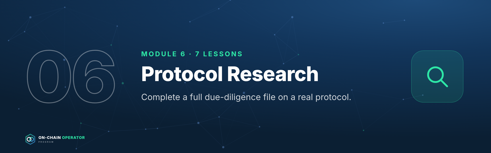
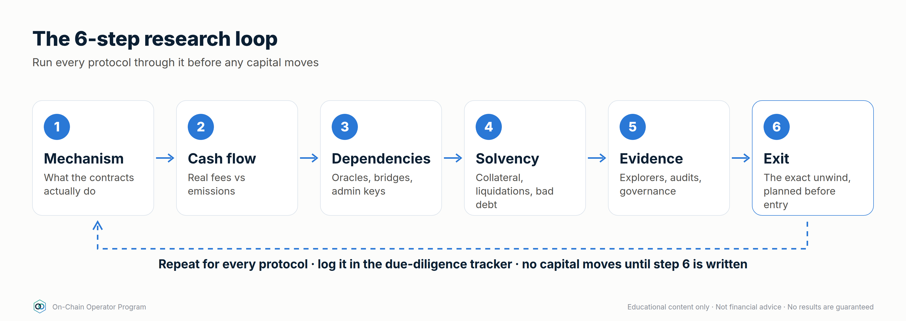

# On-Chain Operator Program — Stage 3 · Analyst

*Section file generated by `build_master.py` from `lessons/` (edit the lessons, not this file). Modules 6, 7. Every module opens with its Mastery Starter (N.0). Educational content only. Not financial advice.*

---

# Module 6 — Protocol Research



*Outcome: complete a full due-diligence file on a real protocol.*
*Stage 3 · Analyst. Source: ATLAS "DeFi & On-Chain" ch. 24–26, 41. Educational content only. Not financial advice.*



---

## Lesson 6.0 — Mastery Starter

*New to this topic? Start here. It takes about 10 minutes and gets you from zero to ready for this module.*

### The 60-second version
Before trusting a protocol with money, a professional researches it the same way every time: what it does, where its money comes from, what it depends on, whether it's solvent, what the evidence says, and how to get out.

### Words you'll need
| Term | Meaning |
|---|---|
| Due diligence | structured research before investing |
| TVL | total value deposited in a protocol |
| FDV | token price × maximum supply |
| Governance | how holders vote on changes |
| Thesis | what must be true for the position to work |

### Before you start
- [ ] Modules 0–5

### Your first safe step
Pick a protocol you've heard of and write one sentence for each of the six research steps, even if it's "don't know yet".

### The mastery ladder
| Level | You can… |
|---|---|
| **Beginner** | Completes the six-step loop with sources |
| **Practitioner** | Reads tokenomics and governance and writes a thesis with invalidation |
| **Master** | Spots failure patterns early and writes verdicts others can act on |

### You've mastered this module when…
…your due-diligence file ends in a verdict with size, conditions and an exit.

---

## Lesson 6.1 — Protocol due diligence *(ch. 24)*

### Objective
Run the 6-step research loop on a protocol and reach a written verdict.

### Explanation
1. **Mechanism:** what the contracts do; users, assets, incentives.
2. **Cash flow:** real fees and interest vs emissions.
3. **Dependencies:** oracles, bridges, admin keys, stablecoins, other protocols.
4. **Solvency:** collateral quality, liquidation design, bad-debt paths.
5. **Evidence:** explorers, audits, governance, independent data.
6. **Exit:** exact unwind, gas, slippage, approvals to revoke.

Log it in the **DeFi Protocol Due Diligence Tracker** (Notion) and tick a box
only when the step is **evidenced**, not assumed.

### Worked example (template verdict)
*"Protocol Y (lending, Arbitrum). Risk: Medium. Fees are real (borrow demand
$2M/yr), but one collateral uses a thin-market oracle and upgrades have a
24h timelock. Verdict: supply stablecoins only, cap at 10% of the DeFi book,
alert on queued upgrades."*

### Checklist
- [ ] All six steps written with sources
- [ ] Risk rating = worst material risk, not an average
- [ ] Verdict states size, conditions and exit

### Quiz
<details><summary>1. Why is the rating the worst risk, not the average?</summary>One failure point is enough to lose the position.</details>
<details><summary>2. Which step prevents getting stuck?</summary>Step 6: Exit.</details>
<details><summary>3. When do you tick a tracker box?</summary>Only when there's evidence for it.</details>

---

## Lesson 6.2 — Tokenomics: supply, unlocks, FDV, value capture *(ch. 25)*

### Objective
Read a token's supply schedule and judge whether protocol success reaches the token.

### Explanation
- **Circulating supply:** tokens tradable now. **Max/total supply:** all that will exist.
- **Market cap** = price × circulating. **FDV** (fully diluted valuation) = price × max supply.
- **Unlocks/vesting:** team and investor tokens released on a schedule; new supply that may be sold.
- **Emissions:** ongoing new tokens (rewards).
- **Value capture:** does protocol revenue actually reach token holders (fee share, buybacks), and how is it enforced?

### Worked example
Price $2, circulating 100M, max 1B: market cap **$200M**, FDV **$2B**.
Next month 50M unlock: circulating supply rises **50%**. Unless demand grows
to match, that's heavy selling pressure. A low market cap with a huge FDV is a warning.

### Checklist
- [ ] Market cap vs FDV compared
- [ ] Next 12 months of unlocks listed
- [ ] Value-capture mechanism identified (or "none")

### Quiz
<details><summary>1. Price $5, circulating 20M, max 100M. FDV?</summary>$500M.</details>
<details><summary>2. Why do unlocks matter?</summary>They add supply that recipients may sell.</details>
<details><summary>3. What is value capture?</summary>An enforceable way protocol success benefits the token.</details>

---

## Lesson 6.3 — Governance & DAOs *(ch. 26)*

### Objective
Read how a protocol is controlled and spot governance risk before it hits your position.

### Explanation
- **Governance tokens** vote on parameters, upgrades and treasury.
- **Proposal lifecycle:** forum discussion → vote → timelock → execution.
- **Delegation** lets holders assign votes to representatives.
- **Risks:** low turnout, concentrated voting power, borrowed votes, rushed proposals, weak timelocks.

### Worked example
A proposal to raise a collateral's LTV passes with 8% turnout, 70% of it from
three wallets. Lenders now carry more bad-debt risk, decided by a few voters.
**Track governance for markets you're in.** It changes your risk without you doing anything.

### Checklist
- [ ] Governance forum/alerts followed for protocols I use
- [ ] Voting concentration checked
- [ ] Timelock length known

### Quiz
<details><summary>1. What's a governance attack?</summary>Using concentrated or borrowed voting power to pass harmful changes.</details>
<details><summary>2. Why follow governance as a user?</summary>Parameter changes alter your risk.</details>
<details><summary>3. Order of the proposal lifecycle?</summary>Discussion → vote → timelock → execution.</details>

---

## Lesson 6.4 — The on-chain research workflow *(ch. 41)*

### Objective
Turn research into a written thesis with invalidation and monitoring.

### Explanation
**Question first** → primary sources (docs, contracts, governance) → economic
reality (fees vs incentives) → cross-check with independent data → **thesis**:
what must be true, what would prove it wrong, what to monitor.

### Worked example (thesis template)
*"Thesis: stablecoin lending on Protocol Z earns ~5% from real borrow demand.
Must be true: utilisation 60–85%, oracle unchanged, no new risky collateral.
Invalidation: utilisation > 95% for 48h, a governance change adding thin
collateral, or an incident. Monitor: weekly utilisation, governance feed."*

### Checklist
- [ ] Research question written first
- [ ] Thesis, invalidation and monitoring written
- [ ] Evidence from at least two independent sources

### Quiz
<details><summary>1. Why start with a question?</summary>To avoid hunting for data that confirms what you already believe.</details>
<details><summary>2. What makes a thesis useful?</summary>A clear invalidation you'll act on.</details>
<details><summary>3. What should monitoring track?</summary>Only the metrics that would change the thesis.</details>

---

## Lesson 6.5 — Case studies: how DeFi failures happened *(new)*

### Objective
Learn the patterns behind major failures so you recognise them early.

### Explanation — seven failures, seven patterns
| Case | What broke | Pattern | Warning signs |
|---|---|---|---|
| **Black Thursday, March 2020** (Maker) | ETH crashed; congested network and failing keeper bots let some collateral auctions clear at 0 DAI bids (~$8M lost) | Liquidation mechanism failure under stress | Auctions relying on keepers during congestion; no minimum bid |
| **TerraUSD (UST), May 2022** | Algorithmic stablecoin lost its peg and collapsed | Reflexive design: confidence was the collateral | Yield (~20%) far above any real cash flow; peg defended by a sister token |
| **Ronin bridge, March 2022** (~$600M) | Attackers got 5 of 9 validator keys | Weak bridge trust model | Small signer set; keys concentrated |
| **Mango Markets, Oct 2022** (~$110M) | Collateral price pumped on thin markets, then borrowed against | Oracle manipulation | Thin-market collateral valued at spot |
| **FTX, Nov 2022** | Exchange used customer funds | Custodial (CeFi) counterparty failure | Opaque reserves; "not your keys" |
| **Euler Finance, March 2023** (~$197M, later largely returned) | Logic flaw in a lending function | Contract bug missed by audits | Complex new function added after earlier audits |
| **Curve pools, July 2023** | Reentrancy guard broken by a compiler bug | Toolchain risk | Rare. Shows audited code can fail from below |

Figures are approximate, from public reporting.

### Worked example
Using the table: a new stablecoin offers 18% "sustainable" yield, backed by its own
governance token. That's the UST pattern: reflexive collateral and yield with no
matching cash flow. Rating: High. Verdict: don't hold.

### Checklist
- [ ] For every position, I've asked which failure pattern it resembles
- [ ] My register (8.2) includes these seven patterns

### Quiz
<details><summary>1. What pattern did Mango Markets show?</summary>Oracle manipulation of thin-market collateral.</details>
<details><summary>2. What did FTX show DeFi users?</summary>Custodial counterparty risk: "not your keys, not your coins".</details>
<details><summary>3. UST's main warning sign?</summary>High yield with no matching real cash flow, backed by a reflexive sister token.</details>

---

## Lesson 6.6 — Vote-escrow tokenomics, bribes and governance markets *(expert)*

### Objective
Understand vote-escrow ("ve") systems and bribe markets, a major source of DeFi yield and power.

### Explanation
- **Vote-escrow:** you lock a governance token for a period (often up to 4 years) and get **ve-tokens** with voting power that decays as the unlock approaches. Longer lock = more power.
- **Gauges:** ve-holders vote on which pools receive the protocol's token **emissions**. Emissions attract liquidity, so votes are valuable.
- **Bribes / voting incentives:** protocols that want liquidity pay ve-holders to vote for their pool. Voters earn this as yield (plus a share of fees in some designs).
- **Liquid lockers / meta-governance:** protocols that lock on your behalf and give you a tradable token. It's liquid, but it can trade at a discount, and it adds a layer of risk.
- **Risks:** long locks (you can't sell), the token's price over the lock, emissions diluting holders, and governance capture.

### Worked example
$10,000 of a ve-token earning ~15% APR in bribes ≈ **$1,500/yr**, paid in various tokens.
But the underlying is locked for 4 years: if the token falls 60%, the position is worth
$4,000 plus the bribes collected. A liquid-locker version lets you exit, but it traded at a
20% discount during the last sell-off. Price the lock, not just the APR.

### Checklist
- [ ] Lock length and decay understood
- [ ] Bribe income valued at a realistic sale price
- [ ] Liquid-locker discount history checked before using one

### Quiz
<details><summary>1. What do ve-holders vote on?</summary>Which pools receive emissions (gauge weights) and other governance decisions.</details>
<details><summary>2. Why do protocols pay bribes?</summary>Votes direct emissions to their pools, attracting liquidity.</details>
<details><summary>3. Main cost of a 4-year lock?</summary>You can't sell during the lock, whatever the token's price does.</details>

---

## Lesson 6.7 — Valuing DeFi protocols: fees, revenue, earnings and multiples *(expert)*

### Objective
Compare protocols on their economics, not their narratives.

### Explanation
- **Fees:** everything users pay. **Revenue:** the part that goes to the protocol or token holders (the rest goes to LPs/lenders). **Earnings:** revenue minus token incentives paid out.
- **Multiples:** price-to-fees (P/F), price-to-sales (P/S, on revenue), price-to-earnings (P/E). Use **FDV** as well as market cap, since unlocks will arrive (6.2).
- **Quality checks:** is revenue growing without rising incentives? Is it concentrated in one pool or chain? Does it survive a bear market? Does the token actually receive it (value capture)?
- Multiples compare protocols; they don't set a "right" price.

### Worked example
FDV **$2B**, annual revenue **$100M**, token incentives **$60M** → earnings **$40M**.
P/S (FDV) = **20×**; P/E (FDV) = **50×**. A rival with the same revenue but no incentives
has earnings of $100M: at the same FDV its P/E is 20×. Same revenue, very different economics.

### Checklist
- [ ] Fees, revenue and earnings separated, with sources
- [ ] Multiples on FDV and market cap
- [ ] Revenue quality and value capture assessed

### Quiz
<details><summary>1. Revenue vs earnings?</summary>Earnings are revenue minus token incentives (and other costs).</details>
<details><summary>2. Why use FDV in multiples?</summary>Future unlocks will add supply; FDV shows the fully diluted price.</details>
<details><summary>3. FDV $600M, earnings $20M. P/E?</summary>30×.</details>

---

### Module 6 practical: analyst capstone part 1
Complete a full due-diligence file on one real protocol using lessons 6.1–6.4
and the Notion tracker. (Submitted with Module 7 as the **analyst capstone**.)

---

# Module 7 — On-Chain Analytics


*Outcome: read on-chain data without over-interpreting it.*
*Stage 3 · Analyst. Source: ATLAS "DeFi & On-Chain" ch. 27–34. Educational content only. Not financial advice.*

**The analyst's rule:** a transfer is observable; the owner's intention usually
isn't. Every metric needs a definition, a methodology, and context.

---

## Lesson 7.0 — Mastery Starter

*New to this topic? Start here. It takes about 10 minutes and gets you from zero to ready for this module.*

### The 60-second version
Everything on a public blockchain can be seen, but not everything can be understood. On-chain analytics means reading that data carefully: who moved what, where liquidity sits, how positioned the market is, without jumping to conclusions.

### Words you'll need
| Term | Meaning |
|---|---|
| Explorer | a site showing every transaction |
| Netflow | exchange inflows minus outflows |
| MVRV | market value ÷ realised value |
| Open interest | total open futures contracts |
| Depth | how much a trade moves price |

### Before you start
- [ ] Modules 0–6

### Your first safe step
Find your own last transaction on an explorer and identify: status, fee, method and token transfers.

### The mastery ladder
| Level | You can… |
|---|---|
| **Beginner** | Reads transactions and addresses on explorers |
| **Practitioner** | Uses flows, holder, activity and liquidity metrics with caveats |
| **Master** | Combines on-chain, derivatives and liquidity data into a research view without over-interpreting |

### You've mastered this module when…
…every metric in your research has a definition, a source and a caveat.

---

## Lesson 7.1 — On-chain data foundations *(ch. 27)*

### Objective
Avoid the classic misreads of on-chain data.

### Explanation
- **Address ≠ person:** one person can have many addresses; one exchange address serves millions.
- **Transfer ≠ trade:** moving tokens isn't buying or selling.
- **Labels are probabilistic:** providers guess who owns what; they can be wrong.
- **Active addresses** can be inflated by bots or airdrop farming.
- **Data provenance:** know chain coverage, indexing method and delay.

### Worked example
"Whale moves $100M of BTC!" It's an exchange shuffling between its own cold and
hot wallets. No trade happened. Check labels, destination and history before reacting.

### Checklist
- [ ] I check what an address is before interpreting a move
- [ ] I note each metric's source and definition

### Quiz
<details><summary>1. Does an address equal a person?</summary>No.</details>
<details><summary>2. Is a large transfer a sale?</summary>Not necessarily. It may be internal or custodial.</details>
<details><summary>3. Why can active-address counts mislead?</summary>Bots and farming inflate them.</details>

---

## Lesson 7.2 — Block explorer mastery *(ch. 28)*

### Objective
Read any transaction on an explorer without using the app's interface.

### Explanation
For a transaction: **status** (success/fail), **block**, **from/to**, **value**,
**fee**, **method** called, **token transfers** (events), **internal calls**, and
**logs**. For a contract: **read** (state, parameters) and **write** (call
functions directly, carefully) tabs; **proxy** info; **verified source**.

### Worked example
Your swap on an L2: status Success · method `swap` · token transfers: 100 USDC
out, 0.0331 ETH in · fee 0.00002 ETH. The event log confirms the router and
pool. You've verified the trade without trusting the website.

### Checklist
- [ ] I can find status, fee, method and token transfers
- [ ] I can read a contract's parameters on the Read tab
- [ ] I can check and revoke approvals

### Quiz
<details><summary>1. Where do you see tokens that actually moved?</summary>Token transfers (event logs).</details>
<details><summary>2. What does the Read tab show?</summary>A contract's public state and parameters.</details>
<details><summary>3. Why verify on the explorer?</summary>It's the ground truth, independent of any website.</details>

---

## Lesson 7.3 — Exchange flows *(ch. 29)*

### Objective
Interpret exchange inflows and outflows with the right caveats.

### Explanation
**Inflows** to exchanges *may* precede selling (or collateral posting,
internal moves). **Outflows** *may* mean self-custody or DeFi use.
**Netflow** = inflows − outflows. Exchange reserves on-chain aren't proof of
solvency (liabilities aren't visible).

### Worked example
Netflow +20,000 ETH in a day. Before concluding "selling pressure": check if it's
one exchange reshuffling, whether derivatives open interest rose (collateral), and
whether price and volume confirm. One metric is a hypothesis, not a signal.

### Checklist
- [ ] Flows cross-checked with price, volume and derivatives
- [ ] Internal exchange moves ruled out

### Quiz
<details><summary>1. What is netflow?</summary>Inflows minus outflows over a period.</details>
<details><summary>2. Do exchange reserves prove solvency?</summary>No. Liabilities aren't visible on-chain.</details>
<details><summary>3. Is a large inflow always bearish?</summary>No. It can be collateral or an internal move.</details>

---

## Lesson 7.4 — Whale & entity analysis *(ch. 30)*

### Objective
Use large-holder data without copying wallets blindly.

### Explanation
Separate exchanges and contracts from individuals before measuring
concentration. **Accumulation/distribution** is inferred, not known.
**"Smart money" labels** carry survivorship bias. **Copying wallets** ignores
their hedges, size and private information.

### Worked example
A "smart money" wallet buys a token. You don't see its perp short elsewhere; it
may be hedged and farming. Copying the visible leg makes you the unhedged one.

### Checklist
- [ ] Contracts/exchanges excluded from concentration figures
- [ ] Wallet-following treated as a lead to research, not a signal

### Quiz
<details><summary>1. Why is wallet-copying risky?</summary>You can't see the wallet's hedges, size or intent.</details>
<details><summary>2. What is survivorship bias in labels?</summary>Only wallets that did well get labelled "smart".</details>
<details><summary>3. First step in measuring holder concentration?</summary>Remove exchange and contract addresses.</details>

---

## Lesson 7.5 — Holder & supply metrics *(ch. 31)*

### Objective
Read MVRV, SOPR and HODL waves as context, not signals.

### Explanation
- **Realised cap:** values each coin at the price it last moved (a cost-basis estimate).
- **MVRV** = market cap ÷ realised cap. High = holders in large aggregate profit.
- **SOPR** (spent output profit ratio): >1 means coins moved today were, on average, sold at a profit.
- **HODL waves:** supply by coin age.
- Definitions differ by provider; strongest on UTXO chains like Bitcoin.

### Worked example
Market cap $1.2T, realised cap $0.6T → **MVRV 2.0**: the average holder is at
roughly 2× their cost basis. That's context for risk management (e.g. how much to
de-risk), not a precise top signal.

### Checklist
- [ ] Provider methodology read before using a metric
- [ ] Metrics used for context and sizing, not as triggers alone

### Quiz
<details><summary>1. MVRV formula?</summary>Market cap ÷ realised cap.</details>
<details><summary>2. SOPR above 1 means?</summary>Coins moved were, on average, in profit.</details>
<details><summary>3. Why read the provider's methodology?</summary>Definitions vary, and interpretations depend on them.</details>

---

## Lesson 7.6 — Network activity *(ch. 32)*

### Objective
Judge a chain's real usage beyond transaction counts.

### Explanation
Transaction counts depend on architecture and bots. Better: **fees paid**
(real demand for blockspace), **stablecoin activity**, **DEX volume**, **app
revenue**, and retention of users over time.

### Worked example
Chain A: 5M transactions/day, $20k fees. Chain B: 500k transactions/day, $2M
fees. B's users pay 100× more for blockspace, a stronger sign of valuable activity.

### Checklist
- [ ] Fees and app revenue compared, not just transaction counts
- [ ] Bot activity considered

### Quiz
<details><summary>1. Why are fees a better usage signal than transaction counts?</summary>Paying fees shows real demand; counts are easy to inflate.</details>
<details><summary>2. What distorts transaction counts?</summary>Bots, batching and chain design.</details>
<details><summary>3. Name one strong activity metric.</summary>Fees, app revenue, stablecoin activity or user retention.</details>

---

## Lesson 7.7 — DEX & liquidity analytics *(ch. 33)*

### Objective
Measure whether a pool can actually absorb your trade and pay you as an LP.

### Explanation
- **TVL** can double count and moves with token prices.
- **Depth:** the price impact for a given trade size. The number that matters for execution.
- **Volume/TVL:** rough capital turnover; higher means more fees per dollar (Lesson 2.3).
- **Liquidity migration:** incentives move liquidity quickly between pools and chains.

### Worked example
Pool A: $50M TVL, $5M daily volume (0.1 turnover). Pool B: $10M TVL, $8M
volume (0.8 turnover). B pays LPs far more per dollar, but a $1M trade will
move B's price much more than A's.

### Checklist
- [ ] Depth checked at my trade size
- [ ] Volume/TVL used for LP fee estimates

### Quiz
<details><summary>1. Why is depth more useful than TVL for traders?</summary>It measures price impact at a given size.</details>
<details><summary>2. High volume/TVL means?</summary>More fees per dollar of liquidity.</details>
<details><summary>3. What causes liquidity migration?</summary>Incentives moving between pools and chains.</details>

---

## Lesson 7.8 — Derivatives on-chain *(ch. 34)*

### Objective
Read funding, open interest and liquidation data as positioning context.

### Explanation
- **Perpetual futures (perps):** no expiry; kept near spot by **funding** payments.
- **Positive funding:** longs pay shorts (crowded longs). **Negative:** shorts pay longs.
- **Open interest (OI):** total open contracts. Rising OI with rising price means leverage building.
- **Liquidation data:** bursts of forced closes.

### Worked example
Price +8% in a week, OI +40%, funding at its highest in months: leverage is
crowding into longs. That's a fragile setup (a drop could cascade) and, for
Lesson 10.3, a funding-carry opportunity with a squeeze risk.

### Checklist
- [ ] Funding and OI checked before leveraged or carry trades
- [ ] Liquidation clusters noted

### Quiz
<details><summary>1. What does positive funding mean?</summary>Longs are paying shorts.</details>
<details><summary>2. Rising price + rising OI + high funding suggests?</summary>Leveraged longs are crowding in; the setup is fragile.</details>
<details><summary>3. What keeps a perp near spot?</summary>Funding payments.</details>

---

## Lesson 7.9 — Querying chain data yourself *(expert)*

### Objective
Answer your own research questions with on-chain queries, instead of relying on someone else's dashboard.

### Explanation
- **Query platforms** (e.g. Dune, Flipside, Allium) index blockchain data into SQL tables: raw transactions and logs, **decoded** tables per protocol, and curated "spellbook" tables (e.g. all DEX trades).
- **Indexers / subgraphs** (e.g. The Graph) serve protocol-specific data via APIs.
- **Skills:** SELECT, WHERE, GROUP BY, date truncation, and joining a token price table to convert amounts to USD.
- **Discipline:** check your numbers against the protocol's own dashboard; know table definitions (what counts as "volume"); watch out for wash trading and double counting.

### Worked example (SQL; table and column names vary by platform)
```sql
-- Daily DEX volume on one chain over the last 30 days
SELECT date_trunc('day', block_time) AS day,
       SUM(amount_usd)              AS volume_usd
FROM dex.trades
WHERE blockchain = 'arbitrum'
  AND block_time > now() - interval '30' day
GROUP BY 1
ORDER BY 1;
```
Then cross-check one day against another data source. If they differ a lot, find out
why (different pools, wash-trade filters, price sources) before using either number.

### Checklist
- [ ] I can run and adapt a basic query
- [ ] I cross-check results against a second source
- [ ] I note table definitions and filters in my research

### Quiz
<details><summary>1. What is a decoded table?</summary>Contract events and calls translated into readable columns for a specific protocol.</details>
<details><summary>2. Why cross-check query results?</summary>Definitions, filters and price sources differ; errors are common.</details>
<details><summary>3. What SQL clause groups results by day?</summary>GROUP BY on a date-truncated timestamp.</details>

---

### Module 7 practical: analyst capstone part 2
Add an on-chain section to your Module 6 file: holder concentration, flows,
activity (fees/revenue), liquidity depth and derivatives positioning for the
protocol's token or markets. Submit both parts as the **analyst capstone**
(brief and rubric in `07-program-operations.md`).
