# On-Chain Operator Program — Stage 4 · Strategist

*Section file generated by `build_master.py` from `lessons/` (edit the lessons, not this file). Modules 8, 9, 10, 11. Every module opens with its Mastery Starter (N.0). Educational content only. Not financial advice.*

---

# Module 8 — The DeFi Operating System


*Outcome: a written portfolio plan with risk buckets, limits and an emergency plan.*
*Stage 4 · Strategist. Source: ATLAS "DeFi & On-Chain" ch. 38–40, 42. Lesson 8.3 (the 30-strategy library) is in `03-defi-strategy-mastery.md`. Educational content only. Not financial advice. Figures are illustrative.*

---

## Lesson 8.0 — Mastery Starter

*New to this topic? Start here. It takes about 10 minutes and gets you from zero to ready for this module.*


### The 60-second version
Individual positions don't make a portfolio. This module turns strategies into a system: buckets and caps, a risk register, a strategy library, a routine, honest performance measurement, and rules for your own behaviour.

### Words you'll need
| Term | Meaning |
|---|---|
| Bucket | a portion of capital with a job and a cap |
| Risk register | a scored list of risks and responses |
| Kill rule | a pre-written exit trigger |
| Benchmark | the simple alternative you must beat |
| TWR | return that ignores deposit timing |

### Before you start
- [ ] Modules 0–7

### Your first safe step
Write your current holdings into four buckets (reserve, core, productive, speculative) with a percentage for each.

### The mastery ladder
| Level | You can… |
|---|---|
| **Beginner** | Has buckets, caps and a journal |
| **Practitioner** | Keeps a scored risk register, uses the strategy library, measures TWR vs a benchmark |
| **Master** | Runs a disciplined routine with written rules for behaviour, reviewed monthly |

### You've mastered this module when…
…you have a written portfolio plan and a quarter of honest, benchmarked results.

---

## Lesson 8.1 — DeFi portfolio construction *(ch. 38)*

### Objective
Split capital into risk buckets with caps, so no single failure can sink the portfolio.

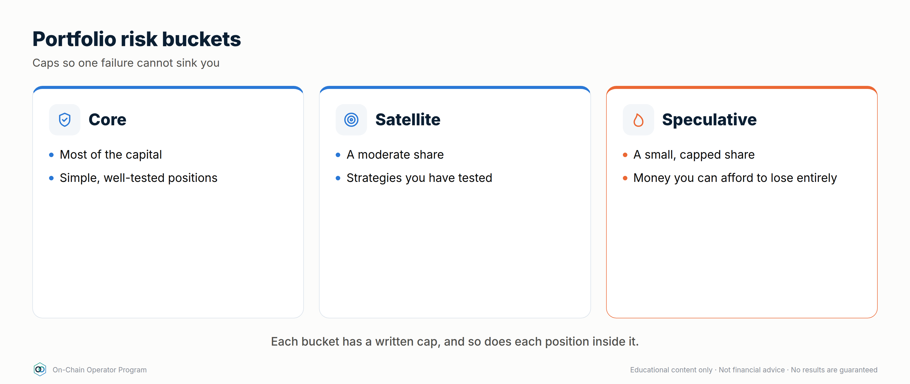

### Explanation
- **Buckets:** liquidity reserve · core (simple, durable) · productive (LP, vaults, carry) · speculative (new, points, experiments).
- **Concentration caps:** per protocol, per chain, per stablecoin issuer, per bridge.
- **Genuine diversification:** two front ends on the same protocol, or two stablecoins with the same backing, are one risk, not two.
- **Rebalancing rules:** thresholds that trigger moving money between buckets.

### Worked example — a $100,000 DeFi book (illustrative)
| Bucket | Share | Example holdings | Cap per protocol |
|---|---|---|---|
| Reserve | 15% | Stablecoins split across 2 issuers, instant access | n/a |
| Core | 45% | Blue-chip stable lending (2 protocols), ETH staking | 20% |
| Productive | 30% | Wide concentrated LP, a vault, a PT | 10% |
| Speculative | ≤10% | Points, new protocols | 5% |

Rebalance when any bucket drifts more than 5 points from target, or after any incident.

### Checklist
- [ ] Buckets and targets written
- [ ] Caps per protocol, chain, issuer, bridge written
- [ ] Rebalancing rule written

### Quiz
<details><summary>1. Two stablecoins backed by the same collateral: diversified?</summary>No. They share one failure point.</details>
<details><summary>2. Why keep a reserve bucket?</summary>To defend debt, meet needs and redeploy without forced selling.</details>
<details><summary>3. When should you rebalance?</summary>When buckets drift past the threshold, or after an incident.</details>

---

## Lesson 8.2 — The DeFi risk framework *(ch. 39)*

### Objective
Keep a risk register that scores every position's risks and names the response.

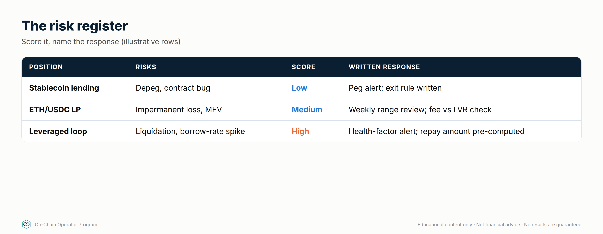

### Explanation
The eight risk surfaces: **smart-contract · economic · oracle · liquidity ·
governance · bridge/chain · counterparty · user-operation.**
Score each for **likelihood (1–5) × impact (1–5)**. Anything ≥ 15 needs a
mitigation or an exit; anything ≥ 20 shouldn't be held.

### Worked example — one register row
| Position | Risk | L | I | Score | Response |
|---|---|---|---|---|---|
| USDC lending, Protocol Y | Oracle on one collateral is thin | 3 | 4 | 12 | Cap 10%, alert on governance changes |
| LST loop | Rate spike above break-even | 3 | 3 | 9 | Alert at 4.5% borrow; unwind rule |
| Bridged stablecoin on new L2 | Bridge exploit | 2 | 5 | 10 | Canonical bridge; cap 5% |
| New farm | Contract bug (unaudited upgrade) | 4 | 5 | **20** | **Don't hold** |

### Checklist
- [ ] Register covers every position and all eight surfaces
- [ ] Scores ≥ 15 have a mitigation or exit
- [ ] Reviewed monthly and after incidents

### Quiz
<details><summary>1. How is a risk scored?</summary>Likelihood × impact, each 1–5.</details>
<details><summary>2. What's a user-operation risk?</summary>Your own mistakes: wrong network, bad signature, lost keys.</details>
<details><summary>3. Score 20. Action?</summary>Don't hold it.</details>

---

## Lesson 8.3 — Strategy library

The full strategy library (30 strategies in 7 levels, each with its profit
engine, maths, execution, kill rules and failure modes) is **Lesson 8.3:
DeFi Strategy Mastery** (`03-defi-strategy-mastery.md`).

---

## Lesson 8.4 — The operating playbook: deploy, monitor, respond, review *(ch. 42)*

### Objective
Run every position through the same four-phase routine.

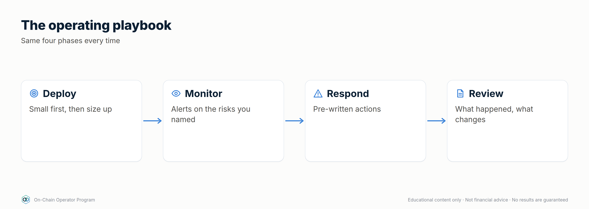

### Explanation
1. **Deploy:** due diligence done · before-signing checklist · test amount · journal row (protocol, chain, contracts, amount, entry, thesis, kill rules, approvals).
2. **Monitor:** daily HF/pegs/ranges/incidents; weekly P&L vs benchmark, harvest, revoke; monthly register review.
3. **Respond:** pre-written actions for each trigger (see Module 11.5 for incidents).
4. **Review:** net return after all costs vs benchmark; simplify anything you can't explain in one sentence.

### Worked example — a journal row
| Field | Entry |
|---|---|
| Position | USDC supply, Protocol Y, Arbitrum |
| Amount / date | $10,000 · 2026-09-01 |
| Thesis | ~5% from real borrow demand |
| Kill rules | Utilisation > 95% for 48h; oracle or collateral change; any incident |
| Approvals | USDC → Protocol Y pool, limited to $10,000 |
| Weekly | Interest earned, utilisation, governance notes |

### Checklist
- [ ] Journal row for every position
- [ ] Daily / weekly / monthly routine in the calendar
- [ ] Response actions written per trigger

### Quiz
<details><summary>1. The four phases?</summary>Deploy, monitor, respond, review.</details>
<details><summary>2. What goes in a journal row?</summary>Position, amount, date, thesis, kill rules, approvals and ongoing results.</details>
<details><summary>3. What to do with a strategy you can't explain simply?</summary>Simplify it or exit.</details>

---

## Lesson 8.5 — Measuring performance honestly *(new)*

### Objective
Measure your results so deposits, withdrawals and lucky markets don't fool you.

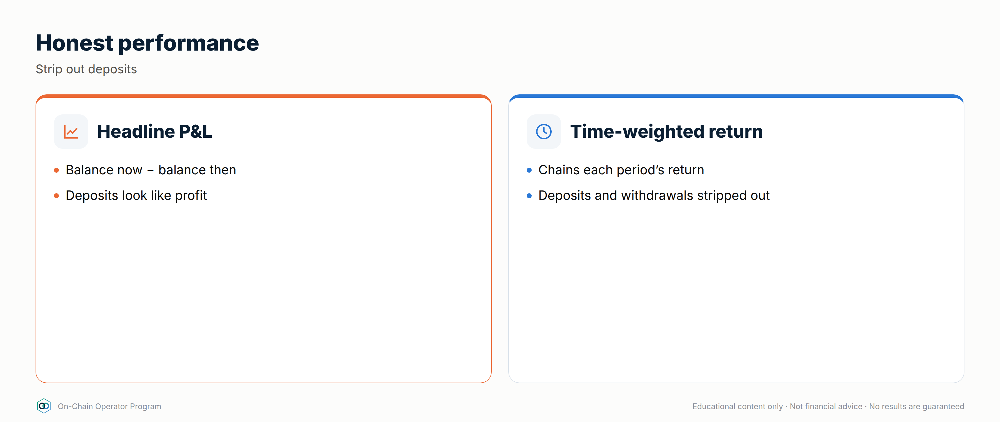

### Explanation
- **Time-weighted return (TWR):** chains the return of each period, ignoring when you added or removed money. It measures your *decisions*.
- **Money-weighted / simple gain:** what your total capital actually did, including the timing of deposits.
- **Benchmark:** compare against what you'd have got doing something simple: holding the same assets, or plain stablecoin lending. Beating zero isn't the test.
- **Attribution:** split the result into sources: price moves, fees, interest, incentives, costs, losses. Only the parts you control show skill.

### Worked example
Start $100,000 → +10% in Q1 ($110,000) → deposit $50,000 ($160,000) → −5% in Q2 → $152,000.
`defi_calc.py twr --period 10 --period -5 --start 100000 --end 152000 --net-deposits 50000`
- TWR: 1.10 × 0.95 − 1 = **4.50%** (your decisions)
- Simple gain on $150,000 put in: **1.33%** (hurt by the deposit landing before a down quarter)
Then compare 4.50% with holding ETH over the same period, and with stablecoin lending.

### Checklist
- [ ] TWR calculated quarterly
- [ ] Benchmark chosen and compared
- [ ] Results attributed by source

### Quiz
<details><summary>1. What does TWR remove?</summary>The effect of when deposits and withdrawals happened.</details>
<details><summary>2. Why use a benchmark?</summary>To see whether the strategy beat doing something simple, not just beat zero.</details>
<details><summary>3. Two quarters, +8% then +2%. TWR?</summary>1.08 × 1.02 − 1 = 10.16%.</details>

---

## Lesson 8.6 — Psychology and discipline *(new)*

### Objective
Recognise the behaviours that turn good strategies into losses, and build rules that stop them.

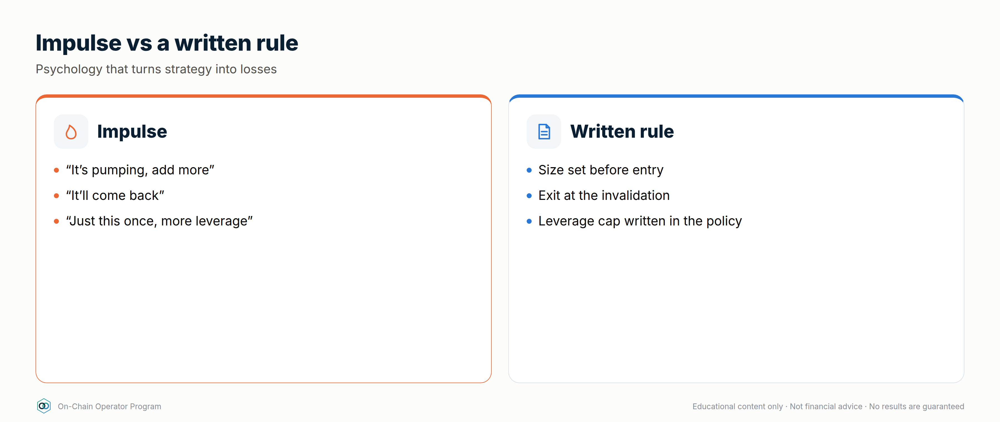

### Explanation
| Bias | What it looks like | Rule that stops it |
|---|---|---|
| **FOMO** | Jumping into a farm because everyone's posting about it | 24-hour change-control wait (14.3) |
| **Loss aversion** | Holding a broken position hoping to "get back to even" | Kill rules written at entry, then followed |
| **Sunk cost** | "I've spent so much gas, I can't exit now" | Judge only the future: would you enter today? |
| **Overconfidence** | Raising size after a winning streak | Caps are percentages; size changes only at review |
| **Revenge trading** | Adding leverage to win back a loss | No new leverage within 7 days of a loss event |
| **Anchoring** | Refusing to sell below a past price | Decisions based on current data and the thesis |

**The operator's defence** is structure: written theses, kill rules, caps, a
journal, cooling-off periods and scheduled reviews. Willpower in the moment is unreliable.

### Worked example
After a 20% loss on a farm, Jordan wants to put 3× leverage on the next idea "to
make it back". The rulebook says: no new leverage within 7 days of a loss event,
and size only changes at the monthly review. Jordan journals the urge, waits,
and at review decides the idea doesn't meet the thesis standard at all.

### Checklist
- [ ] Personal rulebook written (cooling-off, loss rules, sizing rules)
- [ ] Emotions noted in the journal next to decisions
- [ ] Monthly review includes "which rule did I break?"

### Quiz
<details><summary>1. What's the sunk-cost question?</summary>Would I enter this position today, knowing what I know now?</details>
<details><summary>2. Why rely on structure rather than willpower?</summary>Decisions under stress are unreliable; pre-written rules decide for you.</details>
<details><summary>3. Rule against revenge trading?</summary>For example, no new leverage within 7 days of a loss event.</details>

---

## Lesson 8.7 — Quantitative risk: volatility, VaR, drawdown, correlation and sizing *(expert)*

### Objective
Put numbers on portfolio risk and size positions from them.

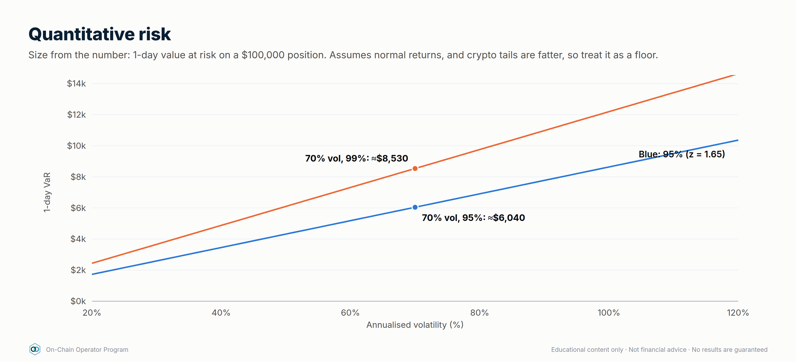

### Explanation
- **Volatility (σ):** annualised standard deviation of returns. **Daily σ ≈ annual σ ÷ √365** (crypto trades every day).
- **Value at risk (VaR):** a loss level you'd expect to exceed only rarely (e.g. 1 day in 20 at 95%). Parametric 1-day VaR ≈ 1.65 × daily σ × position. **It assumes normal returns; crypto has fat tails**, so real losses exceed VaR more often. Use it as a floor, plus stress tests (11.4).
- **Max drawdown:** the largest peak-to-trough fall. Ask: could I live through it, and would my policies survive it?
- **Correlation:** in crashes, correlations between crypto assets rise towards 1. Diversifying within crypto helps less when you need it most.
- **Sizing:** **volatility targeting** (size so each position contributes similar risk); the **Kelly criterion** gives a theoretical maximum bet size from edge and odds, but estimates are noisy, so professionals use a small fraction of it or skip it.

### Worked example
$100,000 of ETH at 70% annual volatility:
`defi_calc.py var --position 100000 --vol 70` → daily σ ≈ **3.66%**, 1-day 95% VaR ≈ **$6,046**.
Real single-day falls have been far larger (in March 2020, ETH fell by roughly 40% in a day).
So: VaR for day-to-day sizing, stress tests for survival.

### Checklist
- [ ] Volatility and VaR computed for my largest positions
- [ ] Portfolio survives the worst historical drawdown of what it holds
- [ ] Correlation assumed to rise in stress
- [ ] Sizing rule written (e.g. volatility targeting)

### Quiz
<details><summary>1. Annual volatility 50%. Daily σ?</summary>About 2.6% (50 ÷ √365).</details>
<details><summary>2. Why is VaR a floor, not a ceiling?</summary>It assumes normal returns; crypto's fat tails make big losses more common.</details>
<details><summary>3. What happens to correlations in a crash?</summary>They tend to rise towards 1.</details>

---

### Module 8 practical
Write your portfolio plan: buckets and caps (8.1), risk register (8.2), your
chosen strategies from 8.3 with kill rules, and your operating calendar (8.4).

---

# DeFi Strategy Mastery — How Strategies Make (and Lose) Money

*On-Chain Operator Program · Strategy module · Built on ATLAS "DeFi & On-Chain" ch. 7–18, 38–42 and the 16-framework Strategy Library, expanded to 30 strategies.*

> **Read this first.** This is educational material, not financial advice.
> No DeFi strategy guarantees profit. Every return in DeFi is payment for
> taking a risk. This module shows **where each strategy's return comes from,
> the maths to test it before you enter, how to run it, and exactly how it
> loses money**, so you only keep positions whose expected return still makes
> sense after costs and risk. All numbers below are illustrative. Use live
> rates from protocol dashboards and independent data (e.g. DefiLlama) when
> you model a real position.

Calculator for every formula here:
`python3 .claude/skills/defi-strategies/scripts/defi_calc.py <command> --help`

---

## Part 1 — Where profit actually comes from

There are only five sources of return in DeFi. Every strategy is a mix of them.


| # | Source | You are paid for… | Example | Lasts? |
|---|---|---|---|---|
| 1 | **Service fees** | providing liquidity traders need | swap fees to LPs | As long as volume lasts |
| 2 | **Interest** | lending capital borrowers need | stablecoin supply APY | As long as borrow demand lasts |
| 3 | **Security rewards** | staking to secure a network | ETH staking yield | Structural, but changes over time |
| 4 | **Structural carry** | taking the other side of crowded positioning | perp funding, basis | Comes and goes with the market |
| 5 | **Incentives** | bringing capital to a protocol | token emissions, points, airdrops | Temporary, and often dilutive |

Price moves (beta) are not a strategy. If a position only made money because
ETH went up, it was a directional bet with extra steps. Strategies 1–4 can pay
in flat markets. Source 5 is only real once the tokens are sold.

### The one equation that matters

```
Net return = base yield (fees + interest + staking)
           + incentives (valued at the price you can actually sell at)
           − impermanent loss / inventory loss
           − borrow cost
           − gas + swap + bridge costs
           − protocol / vault fees
           − losses from risk events
           ± price change on assets held
```

A position is only worth running if **net return beats the simplest
alternative** (holding the assets, or plain stablecoin lending) **by enough to
pay for the extra risk**. Masters compare against a benchmark. Beginners
compare against zero.

### APR vs APY
APY assumes compounding. `APY = (1 + APR/n)^n − 1`. 10% APR compounded daily ≈
10.52% APY, **but only if compounding is free**. On-chain, each compound costs
gas. Compound only when `pending rewards ≥ ~10–20× the gas cost`, or use a vault
that batches it (and charges a fee for doing so).

---

## Part 2 — Strategy selector by market regime

This uses the same thinking as the Grid Bot module: **pick the market regime
first, then the strategy.**

| Regime | Strategies that tend to work | Avoid / reduce |
|---|---|---|
| **Sideways, low–moderate volatility** | Concentrated LP around the range · stable-stable LP · lending · grid bots (CEX) | Leverage loops with thin buffers |
| **Uptrend** | Hold + liquid staking · delta-neutral funding carry (longs usually pay) · conservative borrow against collateral | Narrow LP ranges (they sell your winners early) |
| **Downtrend** | Stablecoin lending · stable-stable LP · cash management | Leveraged loops · volatile/volatile LP · incentive farms paid in falling tokens |
| **High volatility / event risk** | Wider LP ranges or none · larger health-factor buffers · smaller size | New positions right before major news (FOMC, CPI), new or unaudited protocols |

---

## Part 3 — The strategy playbook


Each strategy card has the same sections:
**Profit engine · Key maths · Execute · Monitor · Exit/kill rules · How it loses · Size cap**.
Size caps are suggested maximums as a share of the DeFi portfolio. Tighten
them to fit your own risk budget.

### LEVEL 1 — CORE (start here)

#### 1. Stablecoin lending
- **Profit engine:** interest paid by borrowers (source 2).
- **Key maths:** `supply APY ≈ borrow APY × utilisation × (1 − reserve factor)`.
  Example: 8% borrow × 80% utilisation × 0.9 = **5.76%**.
- **Execute:** pick a stablecoin with a clear peg mechanism (Module 1.5) → pick a
  lending market that passed due diligence (`defi-due-diligence`) → check
  current utilisation and withdrawal liquidity → supply → record the receipt token.
- **Monitor:** utilisation (above ~90% = withdrawals may be stuck), stablecoin
  peg, governance changes, incidents.
- **Exit/kill:** peg below ~0.99 for a sustained period, utilisation pinned at
  100%, exploit news, or the rate falls below your benchmark.
- **How it loses:** stablecoin depeg, protocol exploit, bad debt, frozen withdrawals.
- **Size cap:** can be the largest bucket, but **split across ≥2 independent
  protocols and ≥2 stablecoin issuers**.

#### 2. Native / liquid staking (LSTs)
- **Profit engine:** network security rewards (source 3), minus the provider's fee.
- **Key maths:** `net yield = staking APR × (1 − provider fee)`. Your real
  return is still dominated by the asset's price, so this only improves on
  holding if you'd hold the asset anyway.
- **Execute:** choose the provider (validator spread, fee, track record,
  redemption path) → stake → confirm how the LST earns (rebasing, or an
  exchange rate that rises).
- **Monitor:** LST/underlying ratio on markets (discount), validator
  incidents/slashing, withdrawal queue length.
- **Exit/kill:** discount widens beyond your threshold, a slashing event,
  or the provider's governance or custody changes.
- **How it loses:** asset price falls (main risk), LST depeg, slashing,
  smart-contract risk.
- **Size cap:** "hold-anyway" capital only.

#### 3. Borrowing against collateral (liquidity without selling)


- **Profit engine:** none by itself. It's a tool. The gain comes from what
  the borrowed funds do, or from not triggering a sale.
- **Key maths:**
  - `Health factor (HF) = Σ(collateral value × liquidation threshold) ÷ debt`
  - `Liquidation price = debt ÷ (collateral qty × liquidation threshold)`
  - Example: 10 ETH at $3,000, LT 0.80, borrow $12,000 → HF = 2.0 → liquidation at **$1,500** (−50%).
- **Execute:** borrow only enough that liquidation is beyond a move you'd
  realistically expect to survive (**HF ≥ 2 for volatile collateral** is a
  sane starting rule) → write the defence plan before borrowing.
- **Monitor:** HF daily, borrow rate, oracle price.
- **Exit/kill:** HF < 1.5 → repay or add collateral. Don't wait for 1.1.
- **How it loses:** liquidation penalty (commonly 5–10%+ of the collateral
  seized), borrow rate spikes, oracle issues.
- **Size cap:** debt ≤ what you could repay from outside the position.

### LEVEL 2 — LIQUIDITY

#### 4. 50/50 AMM liquidity (full range)


- **Profit engine:** swap fees (source 1), sometimes plus incentives.
- **Key maths — impermanent loss (IL) vs just holding**, where `r` = price ratio change:
  `IL = 2√r ÷ (1 + r) − 1`

  | Price change | 1.25× | 1.5× | 2× | 3× | 4× | 5× |
  |---|---|---|---|---|---|---|
  | IL vs holding | −0.6% | −2.0% | −5.7% | −13.4% | −20.0% | −25.5% |

  (Same IL whether price goes up or down by the same ratio. 0.5× = 2×.)
- **Break-even rule:** `fees earned over the holding period ≥ IL`.
  Example: expect up to a 1.5× move within 90 days → IL ≈ 2.0% → you need fee
  APR ≥ **~8.2%** just to match holding.
- **Execute:** pick a pair you're happy to own either side of → check real
  fee APR over 30 days (not the peak day) → deposit → record entry prices.
- **Monitor:** fees accrued vs IL vs "just hold" benchmark, weekly.
- **Exit/kill:** fees stop covering IL, volume dies, or the pair enters a strong trend.
- **How it loses:** strong trends (you end up holding more of the losing asset), low volume, token risk.

#### 5. Concentrated liquidity (the on-chain grid bot)
- **Profit engine:** swap fees on a chosen range. It's economically very close
  to a grid bot: it sells as price rises through the range and buys as it
  falls (Module 9).
- **Key maths:** capital efficiency vs full range (price at the geometric
  middle of the range) ≈ `1 ÷ (1 − (P_low / P_high)^¼)`.
  A ±10% range (P_high/P_low ≈ 1.22) is ~**20×** as capital-efficient, so it
  earns ~20× the fees per dollar *while in range*. IL is also amplified by
  about the same factor, and **out of range earns 0% and leaves you holding
  100% of one asset.**
- **Execute:** set the range from structure and volatility, exactly like a
  grid range (`grid-bot-design`: regime → range → invalidation) → wider in
  high volatility → decide the rebalance rule *before* entry.
- **Monitor:** % of time in range, fees vs IL, gas cost of each rebalance.
- **Exit/kill:** range invalidated (price breaks structure) → don't chase
  every move. Rebalancing too often locks in losses and burns gas.
- **How it loses:** trending markets, over-rebalancing, gas on small positions.
- **Size cap:** active capital only. Needs weekly (or better) attention.

#### 6. Stable-stable LP
- **Profit engine:** swap fees between similarly priced assets. Very low IL *while the pegs hold*.
- **Execute:** only pair stables you'd accept holding 100% of (in a depeg the
  pool fills up with the weaker coin).
- **Kill:** either stable trades below ~0.99, or the pool balance goes heavily one-sided.
- **How it loses:** depeg (you end up holding the broken coin), contract risk.

### LEVEL 3 — YIELD

#### 7. Auto-compounding vaults
- **Profit engine:** the underlying strategy, plus compounding without you paying the gas.
- **Key maths:** `net APY = gross APY − performance fee share − management fee`.
  Compare against doing it yourself: vaults win on small positions (gas) and
  lose on large ones (fees).
- **Due diligence:** vault contract + **every** protocol it deposits into
  (the risks stack). Read withdrawal limits and fees.
- **How it loses:** any protocol in the chain fails, strategy change by the vault operator, withdrawal limits.

#### 8. Incentive farming
- **Profit engine:** token emissions (source 5) on top of a base yield.
- **The rule:** value rewards at the price you can **actually sell at after
  slippage**, and assume the token price falls while emissions continue.
  Harvest and sell on a schedule (e.g. weekly) unless you'd buy the token with cash.
- **Quick test:** remove the incentive APR. If the base yield alone doesn't
  justify the risk, you're being paid in a token that's likely to keep falling.
- **How it loses:** reward token price collapse, mercenary liquidity leaving,
  IL on the underlying LP.

#### 9. Airdrops and points
- **Profit engine:** possible future token distribution.
- **Key maths:** `EV = P(airdrop) × expected value to you − (gas + bridge + opportunity cost + risk)`.
- **Rule:** only farm with actions you'd do anyway, or with capital you've
  capped as speculative. Claim only from verified links (scam defence, Module 1.6).

### LEVEL 4 — ADVANCED (only after Levels 1–3 are routine)

#### 10. Leveraged lending loop


- **Profit engine:** amplifies a *positive spread* between collateral yield and borrow cost.
- **Key maths:**
  - Leverage after n loops at LTV L: `(1 − L^(n+1)) ÷ (1 − L)`, max `1 ÷ (1 − L)` (L = 0.7 → 3.33×)
  - `Net APY on equity = collateral yield × Lev − borrow rate × (Lev − 1)`
  - Example: 3.5% collateral yield, 2.5% borrow, 3× → **5.5%**. If borrow rises
    to 4.5% → **1.5%**. If it rises to 5.25% → **0%**. The spread is everything.
- **Execute:** only loop assets that move closely together (e.g. an LST
  against its underlying, or stable against stable) → stay well below max
  leverage → set HF alerts.
- **Kill:** spread turns negative, HF < your floor, depeg of the collateral.
- **How it loses:** borrow rate spikes (they can happen quickly), liquidation
  cascades, depeg of correlated collateral, unwind costs.

#### 11. LST collateral loop
Strategy 10 using an LST as collateral against its own underlying asset.
Liquidation risk depends mainly on the **LST/underlying ratio and on how the
protocol's oracle prices it**, less on the asset's price. Check which oracle
the market uses before assuming "it can't be liquidated".

#### 12. Delta-neutral funding carry
- **Profit engine:** perpetual funding (source 4). In bullish markets longs
  usually pay shorts. Hold spot long + perp short at equal size, so price
  moves roughly cancel and you collect funding.
- **Key maths:** `funding APR ≈ rate per 8h × 3 × 365`. 0.01%/8h ≈ **10.95% APR on the hedged size**.
  Return on *total capital* is lower because capital sits in both legs:
  $10k spot + $10k margin (1× short) → ~5.5% on $20k; 2× short ($5k margin)
  → ~7.3% on $15k, but the short gets liquidated if price rises ~50%.
- **Execute:** open both legs at the same time, at the same size → keep a
  margin buffer → track funding every period.
- **Kill:** funding negative for a sustained period (you now pay), margin
  buffer thin, venue risk.
- **How it loses:** funding flips negative, short-leg liquidation in a squeeze,
  execution slippage/basis, exchange/venue failure (CEX or perp DEX).

#### 13. LP hedge
Concentrated or 50/50 LP plus a partial perp short to offset its directional
exposure. The hedge ratio changes as price moves (LP inventory changes), so it
needs rebalancing. It narrows the P&L range but adds funding + execution cost.
Only worth doing if fees exceed IL + hedge cost.

### LEVEL 5 — TREASURY & RESEARCH

#### 14. DeFi cash management
Build a ladder for idle stablecoins: instant-access tier (lending), core tier
(split across protocols and issuers), and a cap per protocol. Goal: earn a
reasonable return on cash **without any single failure costing more than
you've decided you can afford to lose**.

#### 15–16. On-chain accumulation screen / protocol growth screen
Research, not yield. Track users, fees/revenue, TVL quality, holder
concentration, exchange flows and unlocks to decide *what* to hold or provide
liquidity for. Never act on one metric (ATLAS ch. 27–34).

---

### LEVEL 6 — PROFESSIONAL (structured, fixed and hedged yield)

These are the strategies professional desks and treasuries use. Each one
swaps a risk you don't want for one you've chosen, so **name what you're
short before you enter.** Full lessons: Module 10 (Advanced Yield
Engineering), Module 11 (Hedging) and Module 12 (Own Bank).

#### 17. Fixed-rate yield with principal tokens (PT)


- **Profit engine:** yield tokenization splits a yield-bearing asset into a
  **principal token (PT)**, which redeems 1:1 for the underlying at maturity,
  and a **yield token (YT)**, which collects all the variable yield until then.
  Buying PT at a discount locks in a fixed return (source 2/3, bought forward).
- **Key maths:** `fixed APY = (1 ÷ PT price)^(365 ÷ days) − 1`.
  PT at 0.96 with 180 days left → **8.63%** fixed if held to maturity.
  `defi_calc.py pt --price 0.96 --days 180`
- **Execute:** pick a PT on an underlying you'd hold anyway → check pool depth
  (for early exit) → buy → hold to maturity → redeem.
- **Kill:** underlying depeg or exploit. You're still exposed to the underlying asset; the rate is fixed, the asset risk isn't.
- **How it loses:** underlying fails; selling before maturity at a worse price; illiquid PT pools.

#### 18. Yield tokens (YT): buying variable yield
- **Profit engine:** YT collects all yield (and often points) on the underlying until maturity, then goes to zero.
- **Key maths:** a YT costs ~`1 − PT price` (0.04 above). It profits only if
  **realised variable yield plus points beats the implied rate (~8.6%)**.
- **Use:** a speculative, time-decaying position. Size it as speculation.
- **How it loses:** yields fall, points turn out worthless; the YT is worth zero at maturity by design.

#### 19. Cash-and-carry basis
- **Profit engine:** dated futures often trade above spot in bull markets.
  Buy spot, short the future at the same size, and the premium (basis) converges to zero at expiry (source 4).
- **Key maths:** `annualised basis = (future ÷ spot − 1) × 365 ÷ days`.
  Spot 3,000, 90-day future 3,060 → 2% → **8.11%** annualised.
  `defi_calc.py basis --spot 3000 --future 3060 --days 90`
- **Execute:** open both legs together → keep enough margin that the short survives a large rally → hold to expiry.
- **How it loses:** short-leg margin call in a squeeze, venue/counterparty failure, closing early at a wider basis.

#### 20. Covered calls and options vaults
- **Profit engine:** sell upside you're willing to give away. The option premium is paid to you (source 4: selling volatility).
- **Key maths:** ETH at 3,000, sell a 7-day 3,300 call for 0.4% →
  **20.9%** annualised *if* repeated at that premium (it won't be exactly).
  Max gain per week = 0.4% + 10% = 10.4%. Break-even price 2,988.
  `defi_calc.py covered-call --spot 3000 --strike 3300 --premium 0.4`
- **Execute:** only on assets you'd hold anyway → strikes above levels you'd happily sell at → roll weekly or monthly.
- **How it loses:** the asset falls (the premium is a small cushion); you miss big rallies; options-vault contract risk.

#### 21. Cash-secured puts: getting paid to wait for a lower entry
- **Profit engine:** sell a put at a price you'd buy at anyway, holding the cash to pay for it.
- **Key maths:** sell a 2,700 put for $12 with $2,700 of stablecoins reserved
  → **0.44%** for the week on the cash. If assigned, your effective entry is **$2,688**.
- **How it loses:** price falls far below the strike (you buy at 2,688 while the market is lower); you miss the move if price rips upward.

#### 22. Fixed-rate borrowing
- **Profit engine:** none by itself. It's insurance on your cost of credit (Module 12.3).
- **Worked comparison:** borrow $50,000 for a year. Fixed at 6% costs **$3,000**.
  Variable at 4% for 9 months, then spiking to 12% for 3 months, costs
  50,000 × (4% × 0.75 + 12% × 0.25) = **$3,000**. Same cost, but fixed let you plan.
  If the spike lasted longer, variable costs more; if rates stayed at 4%, fixed cost $1,000 more.
- **Use:** when the borrowing funds something with a fixed payoff, or when a rate spike would force a bad sale.

#### 23. Being the lender: curated lending vaults
- **Profit engine:** supply stablecoins to a vault whose curator spreads them
  across isolated lending markets (source 2). You're the bank's depositor
  *and* its credit committee.
- **Key maths:** judge risk-adjusted, not headline: 7% headline with an
  assumed 2%/yr chance of a loss event losing half → **6.0%** risk-adjusted.
  `defi_calc.py expected --yield-apy 7 --loss-prob 0.02 --lgd 0.5`
- **Due diligence:** which markets, which collateral, which oracles, what
  liquidation LTVs, the curator's record, and how fast you can withdraw.
- **How it loses:** bad debt in any one market, oracle failure, curator error, withdrawal queues in stress.

#### 24. Hedged restaking / points farming
- **Profit engine:** hold a liquid restaking token (staking yield + points)
  and short the underlying perp to remove price exposure. When funding is
  positive, the short *receives* funding too.
- **Key maths:** `net ≈ staking yield + funding received + points value − costs`.
  **Value the points at zero for planning.** Anything they pay is upside.
- **How it loses:** the restaking token depegs from the asset you hedged with
  (the hedge doesn't cover that), slashing, funding turns negative, short-leg liquidation.

#### 25. The yield-covered credit line
- **Profit engine:** borrow against yield-bearing collateral where the collateral's yield pays the interest.
- **Key maths:** $200,000 of an LST at 3.2% earns **$6,400/yr**. A $40,000
  stablecoin loan at 5% costs **$2,000/yr**, so yield covers interest 3.2×.
  LTV 20%, health factor 4.0 at an 0.8 liquidation threshold.
  `defi_calc.py bank --collateral 200000 --debt 40000 --borrow-apy 5`
- **Use:** access to liquidity without selling, as a bank client would (Module 12.3).
- **How it loses:** the collateral price falls (the LTV rises even if the
  interest is covered), the borrow rate spikes above the yield, the LST depegs.

### LEVEL 7 — EXPERT (market structure)

Strategies that come from understanding how DeFi's machinery works: minting,
governance markets, being the counterparty, arbitrage and rates. Full lessons in
Modules 3, 6 and 10 (3.7, 6.6, 10.7, 10.8, 10.9).

#### 26. Minting against collateral (CDP stablecoins)
- **Profit engine:** none by itself. It's how you create liquidity from your assets (Module 12's credit line), paying a stability fee.
- **Key maths:** 10 ETH at $3,000, 150% minimum ratio: max mint $20,000. Mint $10,000 → ratio 300%, liquidation at $1,500, fee $600/yr at 6%. `defi_calc.py cdp --qty 10 --price 3000 --mint 10000 --fee 6`
- **How it loses:** collateral falls through the ratio (liquidation penalty), stability fee rises, the minted stablecoin depegs.

#### 27. Vote-escrow and bribe income
- **Profit engine:** voting incentives (bribes) and fee shares paid to locked governance tokens (source 5, sometimes 1).
- **Key maths:** $10,000 locked earning 15% in bribes = $1,500/yr, *valued at the price you can sell the bribe tokens*; subtract the locked token's price risk over the whole lock.
- **How it loses:** the locked token falls while you can't sell; bribe markets dry up; liquid-locker discounts.

#### 28. Being the house: perp liquidity vaults
- **Profit engine:** trading fees, funding and traders' losses on a perp exchange.
- **Key maths:** split history into fees vs trader P&L; the trader-P&L part can swing from +7% to −20% in a trend.
- **How it loses:** profitable traders, one-sided open interest, oracle problems, withdrawal cooldowns.

#### 29. Peg and redemption arbitrage (patient version)
- **Profit engine:** buying an asset below its redemption value and redeeming (source 4: providing liquidity to forced sellers).
- **Key maths:** 2% LST discount with a 20-day redemption queue ≈ 36.5% annualised simple, *once*, if redemption works.
- **How it loses:** the discount was pricing a real problem; the queue lengthens; redemption is restricted.

#### 30. Rates positioning: fixed vs floating
- **Profit engine:** choosing when to lock fixed rates (PTs, fixed borrowing) or stay floating, based on the yield curve (source 2/3).
- **Key maths:** 3-month 7% vs 12-month 9%: lock 12 months at 9% if you need the money in a year and expect rates to fall.
- **How it loses:** rates move the other way (opportunity cost); PT liquidity if you exit early; the underlying's risk remains.

---

## Part 4 — Execution system (what turns strategies into results)

### Position sizing rules (starting point, tighten as needed)
- Max **20–25%** of DeFi capital in any one protocol. Max **10%** in anything
  unaudited, new (< 6 months) or reliant on a single bridge.
- Max **~30–40%** on any one non-Ethereum chain / L2.
- Keep **10–20%** instantly liquid (not in any position) to defend debt and
  take opportunities.
- Leverage: total debt small enough that a −50% market day doesn't liquidate anything.

### Before every entry (5 gates)
1. **Due diligence** file complete (`defi-due-diligence`: 6-step loop).
2. **Profit engine named.** Which of the 5 sources pays you?
3. **Maths done.** Net return after costs beats the benchmark (use `defi_calc.py`).
4. **Kill rules written down.** Exact numbers: HF floor, peg level, spread, range break.
5. **Before-signing checklist** (chain, contract, token, amount, spender, slippage, gas).

### Journal (one row per position)
Protocol · chain · strategy # · entry date · amount · entry prices · profit
engine · expected net APY · benchmark · kill rules · approvals granted ·
weekly: fees/interest earned, IL, costs, net vs benchmark.

### Review rhythm
- **Daily:** health factors, pegs, LP ranges, incident feeds.
- **Weekly:** net P&L vs benchmark per position, harvest and sell incentive
  tokens, revoke unused approvals.
- **Monthly:** cut the bottom performer when judged against its risk, rebalance buckets,
  simplify anything you can't explain in one sentence.

### Take profits and keep them
- Sweep realised yield to stablecoins or cold storage on a schedule. Rewards
  sitting in a farm are still exposed to the farm's risks.
- Compound only what still passes the 5 gates. Compounding into a
  deteriorating position is how gains are given back.
- Track **net realised gains** after all costs. That's the only number that counts.

---

## Part 5 — Progression path

| Stage | Strategies | Graduate when… |
|---|---|---|
| 1. Foundation | #1 stable lending, #2 staking | You can do the full before-signing checklist without notes |
| 2. Liquidity | #4 50/50 LP, #6 stable LP | You've tracked LP vs hold for 30+ days |
| 3. Active | #5 concentrated LP, #7 vaults, #8 farming | You can say how much of a position's return is fees, IL and incentives |
| 4. Leverage | #3 borrowing, #10–11 loops | You've written and rehearsed a defence plan |
| 5. Carry & hedging | #12 funding carry, #13 LP hedge | You understand perp margin, funding and venue risk |
| 6. Operator | #14 treasury + #15–16 research | Your portfolio has caps, a journal, and a review you actually run |
| 7. Professional | #17–21 fixed, basis and options yield · #22–25 credit and hedged yield | You can state what every position is short, and your stress test survives a −50% day |
| 8. Expert | #26 CDP minting · #27 ve/bribe income · #28 perp vaults · #29 peg arbitrage · #30 rates positioning | You understand the machinery (AMM design, MEV, lending internals, rates) well enough to explain why each opportunity exists |

---

## Part 6 — Mastery quiz

<details><summary>1. A farm shows 60% APY: 5% fees, 55% token emissions. What's your first question?</summary>
What does the base 5% pay me for the risk, and at what price can I actually sell the reward token? Judge the farm on base yield plus rewards valued at a realistic, falling price.</details>

<details><summary>2. ETH doubles while you're in a 50/50 ETH/USDC pool. How did you do vs holding?</summary>
About 5.7% behind holding, before fees. Fees need to exceed that for LPing to have been worth it.</details>

<details><summary>3. A loop earns 3.5% on collateral and pays 2.5% to borrow at 3×. What borrow rate wipes out the return?</summary>
0 = 3.5×3 − b×2 → b = 5.25%.</details>

<details><summary>4. Funding is +0.01% per 8 hours. What is the APR on the hedged size, and why is your return on capital lower?</summary>
~10.95%. Capital sits in both the spot leg and the perp margin, so the return on total capital is roughly half to three-quarters of that, depending on the short's leverage.</details>

<details><summary>5. Your concentrated LP just went out of range after a breakout. What's the operator move?</summary>
Treat it as a range invalidation, just as with a grid bot: follow the pre-written rule (re-centre with a wider range, or exit). Don't chase every move with narrow rebalances.</details>

---

*Operating rule: if you can't name the profit engine and explain the unwind,
don't enter the position.*

---

# Module 9 — DeFi vs Grid Bots


*Outcome: choose the right tool for the market, and run both as one system.*
*New content linking the On-Chain Operator Program to Grid Bot Builder. Educational only. Not financial advice. All figures illustrative.*

---

## Lesson 9.0 — Mastery Starter

*New to this topic? Start here. It takes about 10 minutes and gets you from zero to ready for this module.*


### The 60-second version
A grid bot on an exchange and a liquidity position on a DEX both buy as price falls and sell as it rises inside a range. This module shows when each is the better tool, and how to run both without doubling your risk.

### Words you'll need
| Term | Meaning |
|---|---|
| Grid bot | automated buy/sell orders at set price levels |
| Range | the price band a strategy works in |
| Concentrated liquidity | LP capital placed in a chosen range |
| Correlation | positions that move together |
| Invalidation | the event that ends a range thesis |

### Before you start
- [ ] Modules 0–8 (Grid Bot Builder helpful but not required)

### Your first safe step
Take one asset and write the range you'd use for a grid bot and for an LP. Would they be the same?

### The mastery ladder
| Level | You can… |
|---|---|
| **Beginner** | Explains the grid–LP similarity |
| **Practitioner** | Chooses the right tool by size, custody and pair |
| **Master** | Runs grid bots and DeFi as one system with exposure counted by asset and range |

### You've mastered this module when…
…your exposure is counted by underlying asset and range, not by number of positions.

---

## Lesson 9.1 — Same idea, different machine

### Objective
Explain why a concentrated liquidity position and a grid bot are
economically close cousins, and where they differ.

### Explanation
Both strategies do the same basic thing inside a price range:
**sell as price rises, buy as price falls, and profit from price moving back and forth.**

| | Grid bot (e.g. Grid Bot Builder on an exchange) | Concentrated LP (on-chain AMM) |
|---|---|---|
| How it trades | Discrete orders at set levels | Continuous. Every trade in range moves your inventory |
| What it earns | Spread between grid levels, minus exchange fees | Share of the pool's swap fee on every trade in range |
| Who pays whom | You pay trading fees | Traders pay *you* fees |
| At the range low | Holds mostly/all the base asset | Holds 100% of the base asset |
| At the range high | Holds mostly/all quote (USDT/USDC) | Holds 100% of the quote asset |
| Outside the range | Stops trading, holding one side | Stops earning, holding one side |
| Custody | Exchange holds funds (you keep API control) | You hold keys, and the contract holds the position |
| Main extra risk | Exchange / counterparty | Smart contract, oracle, MEV, gas |
| Automation | Built into the tool | Manual, or a third-party manager (extra contract risk) |

### Worked example — same range, same inventory behaviour


Range **$2,700–$3,300**, ETH at **$3,000**.

**Price falls to $2,700:**
- *Grid* (20 arithmetic levels, $30 apart): buys at 2,970, 2,940 … 2,700 → average buy ≈ **$2,835**.
- *Concentrated LP:* converts USDC to ETH continuously on the way down at the
  geometric average `√(2,700 × 3,000)` ≈ **$2,846**.

**Price rises to $3,300:**
- *Grid*: sells at 3,030 … 3,300 → average ≈ **$3,165**.
- *LP:* sells ETH at `√(3,000 × 3,300)` ≈ **$3,146**.

Almost the same inventory path. The real difference is **how money is made on
the way**: grid profit per completed level (after paying fees), versus LP fee
income on all trading volume in range (after impermanent loss).

### Checklist
- [ ] I can explain why both end up 100% in one asset at a range edge
- [ ] I know which one pays fees and which one earns them
- [ ] I treat a range break as an invalidation event in both

### Quiz
<details><summary>1. Price breaks below the range. What do the grid bot and the LP both hold?</summary>All, or nearly all, the base asset, bought on the way down. Both stop earning until price returns or you act.</details>
<details><summary>2. Who pays trading fees in each?</summary>The grid bot pays exchange fees. The LP earns fees from traders.</details>
<details><summary>3. Name one risk the LP has that the grid bot doesn't, and vice versa.</summary>LP: smart-contract/MEV/gas risk. Grid bot: exchange/counterparty risk.</details>

---

## Lesson 9.2 — When each one wins

### Objective
Pick grid bot, LP, both, or neither, for a given market and account.

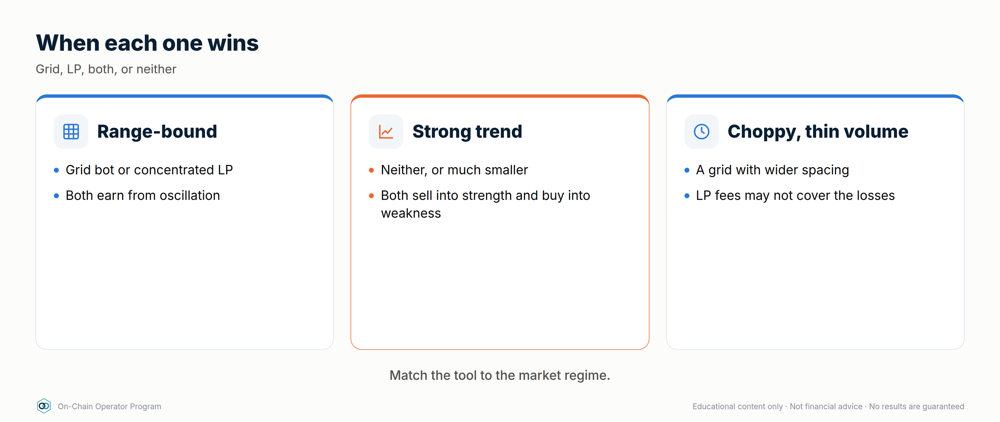

### Explanation
| Factor | Favours grid bot | Favours on-chain LP |
|---|---|---|
| Position size | Small–medium (no gas per action) | Larger (gas becomes a smaller share of returns) |
| Pair | Major pairs listed on your exchange | Tokens only traded on-chain; pairs with deep pool volume |
| Fee economics | Low maker fees on your exchange | High-volume pools with a good fee tier (e.g. 0.05% / 0.3% / 1%) |
| Management | Want automation (Grid Bot Builder) | Happy to set ranges and rebalance by hand |
| Custody preference | Comfortable with exchange custody | Want self-custody |
| Counterparty view | Trust the exchange more than contracts | Trust audited contracts more than an exchange |
| Leverage wanted | Futures grid (advanced) | Not applicable (LP is unlevered unless you borrow) |

**Neither**, same as in the grid module: strong breakouts, parabolic moves,
major news, thin liquidity. Waiting is a position.

### Worked example — three traders
1. **$3k, trades BTC/ETH, wants automation** → grid bot. Gas would eat a small on-chain LP.
2. **$80k, holds ETH long-term, self-custody, checks weekly** → a wide-range
   ETH/USDC concentrated LP could earn fees on part of the stack. Size it as
   ETH they're willing to sell higher and USDC they're willing to spend lower.
3. **A token that's only liquid on a DEX** → only an LP is possible. Apply
   full due diligence (Module 6) and small size.

### Checklist
- [ ] I've matched the tool to position size, pair, custody and management time
- [ ] I've compared expected fee income to costs (gas or exchange fees)
- [ ] I've checked the regime before choosing either

### Quiz
<details><summary>1. Why does position size matter more on-chain?</summary>Gas is a roughly fixed cost per action, so it's a bigger percentage of a small position.</details>
<details><summary>2. When is an LP the only option?</summary>When the pair trades only on-chain.</details>
<details><summary>3. Market just broke out on huge news. Grid or LP?</summary>Neither, until a new range forms.</details>

---

## Lesson 9.3 — Building a combined system

### Objective
Design a portfolio that uses exchange grid bots and DeFi together without
doubling up on the same risk.

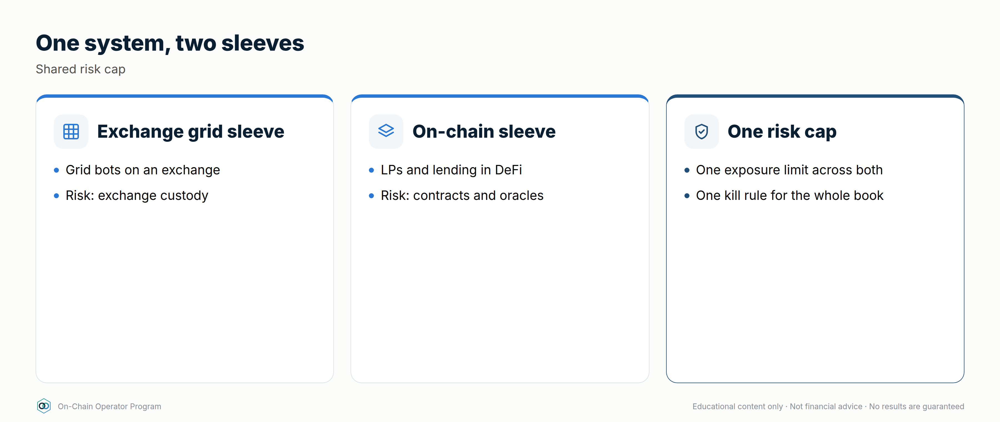

### Explanation
Each tool is good at a different job:
- **Grid bots** → capture oscillation in range-bound major pairs, fully automated.
- **DeFi lending / stable LP** → earn on idle stablecoins and reserves.
- **Staking / LSTs** → earn on assets you'd hold anyway.
- **Concentrated LP** → earn fees on-chain in ranges, for larger, self-custodied sizes.

**The trap: correlation.** An ETH grid bot + an ETH/USDC LP + an LST loop are
*three* bets on ETH staying in a range. If ETH breaks down, they all lose
together. Add up your exposure by **underlying asset and by range**, not by
number of positions.

### Worked example — an illustrative allocation framework
*Percentages are an example structure, not a recommendation. Set your own from your risk budget.*

| Bucket | Share | Tool | Job |
|---|---|---|---|
| Reserve | 15% | Stablecoin lending (split across 2 protocols) | Liquidity to defend positions and redeploy after range breaks |
| Core yield | 25% | Stable-stable LP / stable lending | Base return on cash |
| Hold-anyway assets | 25% | Staking / LSTs | Earn on long-term holdings |
| Range income | 30% | Grid bots on liquid majors (+ optional wide on-chain LP) | Capture oscillation |
| Speculative | ≤5% | Burner-wallet farms, airdrops, new protocols | Capped experiments |

Rules for this system:
1. **One range thesis per asset.** If a grid bot and an LP both run on ETH, their combined size must fit your ETH range-risk cap.
2. **Reserve funds the defence.** Range breaks and health-factor defence draw from reserve, never from other positions.
3. **Sweep profits up.** Realised grid profits and harvested yield go to reserve or vault on a schedule.
4. **Review together.** One weekly review across CEX and on-chain positions, using the same journal.

### Checklist
- [ ] Exposure added up by underlying asset, not by bot/position count
- [ ] Reserve sized and kept out of positions
- [ ] Profit sweep schedule set
- [ ] One journal covering bots and DeFi positions

### Quiz
<details><summary>1. ETH grid bot + ETH/USDC LP + ETH LST loop. How many independent bets?</summary>Essentially one: ETH staying in range or rising. They're correlated.</details>
<details><summary>2. What is the reserve for?</summary>Defending debt positions and redeploying after invalidations, without forced selling.</details>
<details><summary>3. Why sweep profits out of positions?</summary>Profits left in a position stay exposed to its risks. Sweeping locks them in.</details>

---

### Module 9 next step
- **Not a Grid Bot Builder customer yet?** Grid Bot Builder automates the "range
  income" bucket on your exchange: self-serve, delivered instantly. → Checkout link on the program page.
- **Want daily range and market intel?** Elite Intel Community: 3-day free trial → elite-intel-community.whop.site

---

# Module 10 — Advanced Yield Engineering


*Outcome: build fixed, hedged and structured yield, and know exactly what each position is short.*
*Stage 4 · Strategist. Prerequisites: Modules 1–9. Educational content only. Not financial advice. Figures are illustrative; use live rates.*

**The professional's rule for this module:** every structured position swaps
one risk for another. Before entering, write one sentence: *"This position
is short ___."* If you can't fill the blank, you're not ready to enter.

---

## Lesson 10.0 — Mastery Starter

*New to this topic? Start here. It takes about 10 minutes and gets you from zero to ready for this module.*


### The 60-second version
Professionals don't just take the yield on offer: they engineer it. Fixed rates, hedged carry, option income and managed ranges each swap one risk for another. This module teaches you to build them and say exactly what each one is short.

### Words you'll need
| Term | Meaning |
|---|---|
| PT / YT | principal and yield tokens splitting a yield-bearing asset |
| Basis | a future's premium over spot |
| Funding | payments between perp longs and shorts |
| Covered call | selling upside for a premium |
| Delta-neutral | price moves roughly cancel out |

### Before you start
- [ ] Modules 0–9, including perps (3.5) and LP maths (Module 2)

### Your first safe step
Price one live PT with `defi_calc.py pt` and write: "This position is short ___."

### The mastery ladder
| Level | You can… |
|---|---|
| **Beginner** | Understands each structure and its payoff |
| **Practitioner** | Sizes and runs one structured position with written exits |
| **Master** | Combines fixed, carry, options and LP yield inside caps, naming every short exposure |

### You've mastered this module when…
…you can complete "this position is short ___" for every structured position you hold.

---

## Lesson 10.1 — Fixed-rate yield: principal and yield tokens (PT/YT)

### Objective
Lock a fixed return using principal tokens, and price a yield token against its implied rate.

### Explanation
**Yield tokenization** takes a yield-bearing asset (a staked asset, a lending
receipt, a stablecoin savings token) and splits it into two tokens that
mature on a set date:

- **PT (principal token):** redeems 1:1 for the underlying at maturity. It
  trades at a **discount** before then. Buy the discount, hold to maturity,
  and your return is fixed.
- **YT (yield token):** receives *all* the variable yield (and often points)
  the underlying earns until maturity, then is worth zero.

PT + YT = one unit of the underlying. The PT price implies a fixed rate; the
YT is a bet that realised yield beats it.

`fixed APY = (1 ÷ PT price)^(365 ÷ days) − 1`


### Worked example
A stablecoin savings token has a PT maturing in **180 days**, priced at **0.96**.
- `defi_calc.py pt --price 0.96 --days 180` → **8.63%** fixed APY if held to maturity.
- $100,000 buys ~104,167 PT → redeems for ~104,167 of the underlying at maturity.
- The YT costs ~0.04 per unit. It only profits if the underlying's realised
  yield (plus any points) averages above ~8.6% for the 180 days.

**Near maturity, small discounts are big rates:** PT at 0.985 with 60 days left
→ **9.63%** APY. Check liquidity before chasing these; exiting early means
selling into the pool.

### What this position is short
PT: the underlying's credit/depeg risk, and liquidity if you exit early.
YT: falling yields, and time (it decays to zero).

### Checklist
- [ ] I'd hold the underlying asset anyway
- [ ] Maturity date matches when I'll need the money (Module 12.4 ladder)
- [ ] Pool depth checked for an early exit
- [ ] YT sized as speculation, not income

### Quiz
<details><summary>1. PT at 0.97, 120 days to maturity. Fixed APY?</summary>(1/0.97)^(365/120) − 1 ≈ 9.7%.</details>
<details><summary>2. Does buying PT remove the underlying's risk?</summary>No. It fixes the rate. If the underlying depegs or is exploited, the PT redeems into a damaged asset.</details>
<details><summary>3. What must happen for a YT to profit?</summary>Realised variable yield plus points must beat the implied rate priced into the PT.</details>

---

## Lesson 10.2 — Cash-and-carry basis trades

### Objective
Capture the premium of a dated future over spot without taking a view on price.


### Explanation
In rising markets, dated futures usually trade **above** spot. The gap (basis)
shrinks to zero at expiry because the future settles at spot.
**Buy spot + short the future at the same size** and you lock that gap,
whatever the price does, as long as both legs survive to expiry.

`annualised basis = (future ÷ spot − 1) × 365 ÷ days`

### Worked example
ETH spot **3,000**, 90-day future **3,060**.
- Basis = 2.0% → **8.11%** annualised (`defi_calc.py basis --spot 3000 --future 3060 --days 90`).
- At expiry, if ETH is 2,000: spot leg −1,000, short future +1,060 → +60 per ETH.
- At expiry, if ETH is 4,500: spot leg +1,500, short future −1,440 → +60 per ETH.
- **The catch:** before expiry, a rally to 4,500 means the short leg shows
  −1,440 per ETH. Without enough margin on the futures venue, it's closed out
  and you're left long spot at the top.

### What this position is short
Margin and venue risk: a squeeze on the short leg, or the venue failing.

### Checklist
- [ ] Both legs opened together, same size
- [ ] Futures margin survives at least a +100% move, or a rule to top up
- [ ] Venue risk sized (cap per venue)
- [ ] Plan to hold to expiry; early exit may be at a worse basis

### Quiz
<details><summary>1. Spot 2,000, 180-day future 2,080. Annualised basis?</summary>4% × 365/180 ≈ 8.1%.</details>
<details><summary>2. Why is the return "locked" at expiry?</summary>The future settles at spot, so the gain on one leg offsets the loss on the other, leaving the entry basis.</details>
<details><summary>3. What breaks the trade before expiry?</summary>A margin call or liquidation on the short future during a rally, or venue failure.</details>

---

## Lesson 10.3 — Delta-neutral funding carry, done properly

### Objective
Run a funding-carry position with proper sizing, venue limits and exit rules.


### Explanation
Perpetual futures pay **funding** between longs and shorts to keep the perp
near spot. In bullish markets longs usually pay shorts. Long spot + short
perp at the same size = no net price exposure, while collecting funding.

Professional rules:
1. **Measure funding over time, not today.** Use a 7- and 30-day average.
2. **Exit rule:** close when the 7-day average turns negative (you'd start paying).
3. **Margin buffer:** the short leg's leverage decides how big a rally it survives.
4. **Venue limits:** split across venues; cap each one.

### Worked example
Funding **+0.01% per 8h** ≈ **10.95% APR** on the hedged size.
| Short-leg leverage | Capital per $1 hedged | Return on capital | Short liquidates on a rally of roughly |
|---|---|---|---|
| 1× | $2.00 | ~5.5% | +100% |
| 2× | $1.50 | ~7.3% | +50% |
| 3× | $1.33 | ~8.2% | +33% |

`defi_calc.py carry --rate-8h 0.01 --short-lev 3`

Higher leverage improves return on capital a little and makes the position
much more fragile. Most operators stay at 1–2× and top up margin from reserve.

### What this position is short
Funding turning negative, short squeezes, and venue failure.

### Checklist
- [ ] 7- and 30-day funding averages checked
- [ ] Exit rule written (e.g. 7-day average < 0)
- [ ] Short-leg leverage ≤ 2×, top-up plan from reserve
- [ ] Per-venue cap set

### Quiz
<details><summary>1. Funding is +0.005%/8h. APR on hedged size?</summary>≈ 5.5%.</details>
<details><summary>2. Why not run the short at 5×?</summary>A ~20% rally would liquidate the short and leave you unhedged long.</details>
<details><summary>3. What's the exit signal?</summary>Average funding turning negative, meaning shorts start paying.</details>

---

## Lesson 10.4 — Options income: covered calls, cash-secured puts, options vaults

### Objective
Earn option premium on assets you'd hold or buy anyway, knowing exactly what you give up.


### Explanation
- **Covered call:** you hold the asset and sell someone the right to buy it
  from you at a higher **strike**. You keep the premium, and your upside is capped at the strike.
- **Cash-secured put:** you hold stablecoins and sell someone the right to sell
  you the asset at a lower strike. You keep the premium. If price falls below
  the strike, you buy at the strike.
- **The wheel:** sell puts until assigned → hold the asset → sell calls until
  called away → repeat.
- **Options vaults** automate this on-chain. They add contract risk and you
  don't choose the strikes.

### Worked example
ETH at **3,000**.
- **Covered call:** sell a 7-day **3,300** call for **0.4%** ($12).
  ≈ **20.9%** annualised *if* repeated at that premium, which it won't be exactly.
  Max gain for the week 10.4%. Break-even **2,988**.
  `defi_calc.py covered-call --spot 3000 --strike 3300 --premium 0.4`
- **Cash-secured put:** sell a 7-day **2,700** put for **$12** with $2,700 reserved
  → **0.44%** on the cash for the week. If assigned, effective entry **$2,688**.

### What this position is short
Covered call: upside above the strike, plus the full downside of the asset.
Cash-secured put: a crash through the strike.

### Checklist
- [ ] Only on assets I'd hold (calls) or buy at the strike (puts)
- [ ] Strike chosen from levels, not from the premium
- [ ] Annualised premium treated as "if repeated", never promised
- [ ] Vault due diligence done if automating

### Quiz
<details><summary>1. What do you give up by selling a covered call?</summary>Gains above the strike for that period.</details>
<details><summary>2. Put strike 2,700, premium $15. Effective entry if assigned?</summary>$2,685.</details>
<details><summary>3. Does premium protect you in a crash?</summary>Only by the size of the premium. The asset's downside remains.</details>

---

## Lesson 10.5 — Active concentrated-liquidity management

### Objective
Choose a range width and a rebalance rule that fee income can actually pay for.


### Explanation
Narrower ranges earn more fees per dollar *while in range* and go out of range sooner.

| Range around $3,000 | Capital efficiency vs full range |
|---|---|
| $2,400–$3,600 (±20%) | ~10.4× |
| $2,700–$3,300 (±10%) | ~20.4× |
| $2,850–$3,150 (±5%) | ~40.5× |

`defi_calc.py cl --low 2850 --high 3150`

Every rebalance costs gas and swap fees and **locks in** the impermanent loss
so far. Professionals set a rule before entering:
- **Width from volatility:** at least ~1.5× the typical weekly move.
- **Rebalance trigger:** out of range for 24h+, *and* the range thesis still holds.
- **Invalidation:** a structural break (as with a grid bot) means exit, not re-centre.
- **Budget:** rebalancing costs capped at a share of expected fees (e.g. ≤ 25%).

### Worked example
ETH typically moves ±7% a week. A ±5% range would be out of range most
weeks. The rule points to **±10–12%**: ~20× efficiency, and time in range to earn.

### What this position is short
Trending markets and volatility above what the range was sized for.

### Checklist
- [ ] Width ≥ 1.5× typical weekly move
- [ ] Rebalance trigger and invalidation written
- [ ] Rebalance cost budget set
- [ ] P&L tracked against holding (Lesson 2.4)

### Quiz
<details><summary>1. Why does a ±5% range earn ~2× the fees of ±10% while in range?</summary>The same capital is concentrated in half the price range, so it provides about twice the liquidity there.</details>
<details><summary>2. What does a rebalance lock in?</summary>The impermanent loss accrued so far, plus gas and swap costs.</details>
<details><summary>3. Price breaks structure and exits the range. Re-centre?</summary>No. That's an invalidation. Exit per plan.</details>

---

## Lesson 10.6 — Restaking and points: pricing speculative yield

### Objective
Value restaking and points programmes without letting unknown rewards drive position size.


### Explanation
Restaking reuses staked assets to secure more services, paying extra rewards
and often **points**: an off-chain score that may or may not become a token.
The risk stack grows at each layer: staking → liquid restaking token →
restaking protocol → each service it secures → slashing conditions.

Professional rules:
- **Plan with points at zero.** Base the decision on yield you can measure.
- **Treat points as an airdrop bet:** `EV = P(payout) × value − costs`.
- **Hedge price if you only want the yield:** short the underlying perp (strategy #24), knowing the hedge doesn't cover a depeg of the restaking token.
- **Cap it:** speculative bucket only (≤ 5–10% of DeFi capital).

### Worked example
$20,000 in a liquid restaking token: base staking yield ~3% ($600/yr).
Points: you estimate a 30% chance of a payout worth $1,500, costing $200 in
gas and bridging: `defi_calc.py airdrop --probability 0.3 --value 1500 --costs 200`
→ EV **$250**. Worth doing only if the position still makes sense at $600/yr
and the risk stack is acceptable.

### What this position is short
Slashing, depeg of the restaking token, and the chance that points never become anything.

### Checklist
- [ ] Decision still works with points valued at zero
- [ ] Full risk stack written, layer by layer
- [ ] Sized inside the speculative bucket
- [ ] Hedge (if any) and its gap understood

### Quiz
<details><summary>1. Why value points at zero?</summary>They're not guaranteed to become anything, so a decision that needs them is a speculation.</details>
<details><summary>2. What does a perp hedge on the underlying miss?</summary>The restaking token depegging from the underlying.</details>
<details><summary>3. Name three layers of the restaking risk stack.</summary>Any three: staking/validators, the liquid restaking token, the restaking protocol, each service secured, slashing conditions.</details>

---

## Lesson 10.7 — Being the house: perp-exchange liquidity vaults *(expert)*

### Objective
Understand what you're really taking on when you provide liquidity to a perpetuals exchange.


### Explanation
Many on-chain perp exchanges let you deposit into a **liquidity vault** that acts as the
**counterparty** to traders (the "house"). The vault earns trading fees, borrowing/funding fees
and part of liquidations, and **loses when traders win**.
- **Returns:** fees + traders' losses − traders' profits.
- **Risks:** a run of profitable traders (or a few very large ones), open interest concentrated on one side, oracle manipulation or latency, the market-making strategy of the vault (some vaults actively trade), and exchange contract risk.
- **Check:** the vault's historical P&L split (fees vs trader P&L), its open-interest caps, how it prices assets (oracle), and withdrawal rules (cooldowns, fees).

### Worked example
A vault shows 25% APR: 18% from fees, 7% from traders' net losses over the last 6 months.
In a strong one-directional trend, traders who are long win, so the vault's "trader P&L"
component can swing to −20% or worse, wiping out the fees. Size it as an **active trading
exposure**, not as fixed income, and check whether withdrawals are delayed in stress.

### What this position is short
Trader skill and trending markets; oracle quality; the exchange's own risk controls.

### Checklist
- [ ] Vault returns split into fees vs trader P&L, with history
- [ ] Open-interest caps and oracle design reviewed
- [ ] Withdrawal cooldowns and stress behaviour known

### Quiz
<details><summary>1. When does a perp liquidity vault lose money?</summary>When traders are net profitable, e.g. in strong trends.</details>
<details><summary>2. Why isn't it fixed income?</summary>Part of the return is traders' losses, which can reverse sharply.</details>
<details><summary>3. Name two things to check before depositing.</summary>Any two: fee vs trader-P&L history, OI caps, oracle design, withdrawal rules, contract risk.</details>

---

## Lesson 10.8 — DeFi rates: term structure, fixed vs floating *(expert)*

### Objective
Read DeFi's interest-rate curve and position for fixed or floating rates deliberately.

### Explanation
- **Floating rates:** lending and borrowing APYs that change with utilisation (Module 3).
- **Fixed rates:** PTs (10.1), fixed-rate lending markets and fixed-rate borrowing (#22).
- **Term structure:** PT implied yields across maturities form a **yield curve** (e.g. 3-month vs 12-month). Upward sloping: the market expects rates to stay high or rise. Inverted: it expects them to fall.
- **Positioning:** buying PT = receiving a fixed rate (you win if floating rates fall). Buying YT = receiving the floating rate (you win if floating rates rise). Fixed-rate borrowing = paying a fixed rate (you win if floating borrow rates rise).
- **Basis between venues:** the same asset's rates can differ across protocols and chains; the gap reflects risk, liquidity and friction as much as opportunity.


### Worked example
Stablecoin PT implied yields: 3-month **7%**, 12-month **9%**. You need the money in
12 months and think rates will fall: buy the 12-month PT and lock 9%. If you think rates
will rise instead, stay floating (supply to lending) or buy YT with a small, capped amount.

### Checklist
- [ ] I can state whether each position is fixed or floating
- [ ] I compare implied rates across maturities before locking
- [ ] Maturities match my liquidity ladder (12.4)

### Quiz
<details><summary>1. You buy a PT. Are you receiving fixed or floating?</summary>Fixed.</details>
<details><summary>2. An inverted curve suggests?</summary>The market expects rates to fall.</details>
<details><summary>3. You think borrow rates will spike. How do you protect a loan?</summary>Switch to fixed-rate borrowing.</details>

---

## Lesson 10.9 — Peg and redemption arbitrage *(expert)*

### Objective
Understand the arbitrages that keep stablecoins and LSTs near their value, and when a retail operator can take part.


### Explanation
- **Stablecoin peg arbitrage:** if a stablecoin trades at 0.995 on a DEX and a **PSM** or issuer redeems it at 1.00 (minus a fee), buy-and-redeem closes the gap. It's competitive, needs fast execution, and is often limited to whoever can redeem.
- **LST discount arbitrage:** if an LST trades below its redemption value, buy it and **queue a redemption**. Your return is the discount over the waiting time, with the risk that the discount reflects a real problem (slashing, a bug) or that the queue lengthens.
- **Who wins:** professional searchers take most instant arbitrage (14.6). What's left to patient operators is the **slow** kind: buying discounts and waiting, sized small.

### Worked example
An LST trades at a **2% discount**; the redemption queue is about 20 days.
Return ≈ 2% over 20 days ≈ **36.5% annualised (simple)**, but only this once, only if
redemption works as expected, and only if the discount wasn't pricing a real problem.
Research why the discount exists first (Module 6); cap it in the speculative bucket.

### What this position is short
The reason the discount exists: an actual problem with the asset, or redemption delays.

### Checklist
- [ ] Redemption path and eligibility confirmed
- [ ] Reason for the discount researched
- [ ] Queue length and worst case written

### Quiz
<details><summary>1. What closes a stablecoin's discount?</summary>Arbitrageurs buying below peg and redeeming at 1.00 (e.g. via a PSM or issuer).</details>
<details><summary>2. 1% discount, 10-day redemption. Simple annualised return?</summary>About 36.5%.</details>
<details><summary>3. Why might a discount be a warning, not an opportunity?</summary>It may reflect a real problem (slashing, exploit, insolvency).</details>

---

### Module 10 practical
1. Price three live PTs with `defi_calc.py pt` and choose the one whose maturity fits your liquidity ladder.
2. Paper-trade a basis position: record entry basis, margin, and the rally it would survive.
3. Write the "this position is short ___" sentence for every strategy in this module.
4. Size a concentrated LP range from a real asset's weekly volatility and write its rebalance rule.

---

# Module 11 — Hedging & Risk Engineering

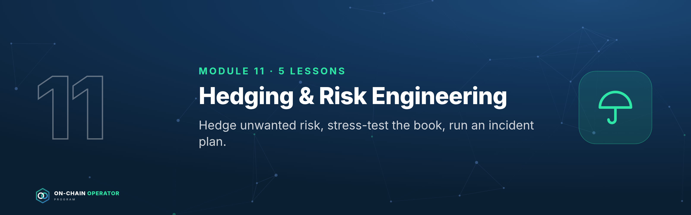

*Outcome: hedge the risks you don't want, stress-test the portfolio, and have an incident plan ready.*
*Stage 4 · Strategist. Prerequisites: Modules 1–10. Educational content only. Not financial advice. Figures are illustrative.*

---

## Lesson 11.0 — Mastery Starter

*New to this topic? Start here. It takes about 10 minutes and gets you from zero to ready for this module.*


### The 60-second version
Risk you don't want can often be hedged, insured or engineered away, at a cost. This module covers hedging, cover, liquidation protection, stress testing and what to do in the first hour of a crisis.

### Words you'll need
| Term | Meaning |
|---|---|
| Hedge | a position that offsets another's risk |
| Protective put | an option capping downside below a price |
| Cover | on-chain insurance for defined events |
| Stress test | a what-if shock on your book |
| Incident | an exploit, depeg or compromise |

### Before you start
- [ ] Modules 0–10

### Your first safe step
Write down the single event that would hurt your portfolio most, and what you'd do in the first 10 minutes.

### The mastery ladder
| Level | You can… |
|---|---|
| **Beginner** | Knows the hedge tools and what they cost |
| **Practitioner** | Hedges one real exposure and runs the five stress tests |
| **Master** | Runs a stress-tested book with a rehearsed incident playbook |

### You've mastered this module when…
…your book survives all five stress scenarios and your incident playbook is saved offline.

---

## Lesson 11.1 — Hedging price exposure with perps and options

### Objective
Reduce price exposure deliberately, and know what each hedge costs.

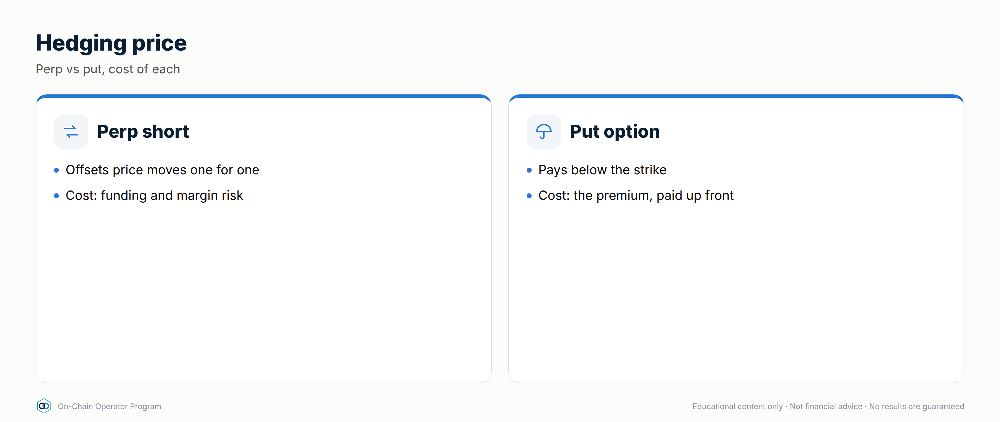

### Explanation
- **Perp hedge:** short a perpetual future against spot you hold. Cheap to open;
  pays or earns funding; needs margin; the hedge ratio is your choice.
- **Protective put:** buy the right to sell at a strike. Costs a premium, and your loss is capped below the strike.
- **Collar:** buy a put and sell a call to pay for it. Cheaper protection in exchange for capped upside.
- A hedge **costs** something (premium, funding, capped upside). Hedge the risk you can't afford, not every risk.

### Worked example
You hold **10 ETH at $3,000** ($30,000).
- **50% perp hedge** (short 5 ETH): ETH falls 30% → spot −$9,000, short +$4,500 → **−$4,500** (−15%) instead of −30%.
- **Protective put:** buy a 30-day $2,700 put for 2% ($60/ETH). Worst case per ETH = $300 drop to the strike + $60 premium = **$360 (12%)**, however far ETH falls in that month.

### Checklist
- [ ] Hedge target stated (which risk, how much)
- [ ] Cost computed (premium, funding, capped upside)
- [ ] Margin buffer for perp hedges set

### Quiz
<details><summary>1. What does a protective put cap?</summary>Your loss below the strike, for the option's term, at the cost of the premium.</details>
<details><summary>2. What does a collar trade away?</summary>Upside above the call strike, to pay for the put.</details>
<details><summary>3. 20 ETH, 25% perp hedge, ETH −40%. Net loss if ETH was $3,000?</summary>Spot −$24,000, short +$6,000 → −$18,000.</details>

---

## Lesson 11.2 — Depeg, protocol and smart-contract cover

### Objective
Evaluate on-chain cover products as insurance: what they pay, when, and what they don't.

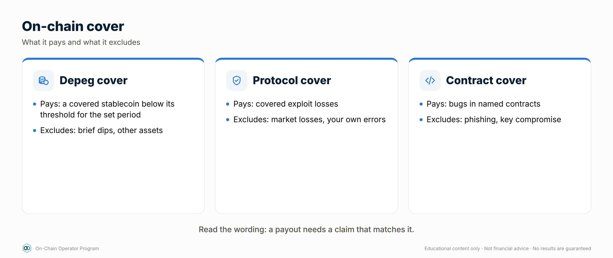

### Explanation
Cover protocols sell protection against defined events (a protocol hack, a
depeg beyond a threshold). Read: **what's covered** (exact wording), **exclusions**,
**claim process** (who decides, how long), **payout asset**, and the cover
provider's **own** solvency and contract risk.

### Worked example
Cover $50,000 in a lending protocol at 2.5%/yr = **$1,250/yr**. If your
risk-adjusted yield there is 4.5%, cover takes more than half of it. Worth it
for a large, concentrated position; often not for a small, diversified one.

### Checklist
- [ ] Cover wording and exclusions read
- [ ] Claim process and payout asset understood
- [ ] Cost compared with the yield it protects

### Quiz
<details><summary>1. Name two things to check in cover terms.</summary>Any two: covered events, exclusions, claim process, payout asset, provider solvency.</details>
<details><summary>2. Cover costs 3%/yr on a 5% yield. Net?</summary>About 2%.</details>
<details><summary>3. Does cover remove all risk?</summary>No. The cover provider has its own claim, solvency and contract risks.</details>

---

## Lesson 11.3 — Liquidation protection: buffers, alerts and automated deleveraging

### Objective
Make liquidation practically impossible with buffers, alerts and pre-computed repayment.

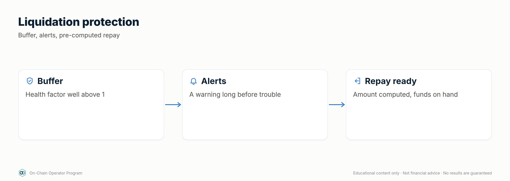

### Explanation
Three layers: **buffer** (HF ≥ 2–2.5 at entry) → **alerts** (HF 2.0 and 1.7,
Module 14.1) → **action** (repay, add collateral, or automated deleveraging tools
that repay debt when HF crosses a trigger; these add their own contract and permission risk).
**Pre-compute** the repayment needed to restore your target HF:
`debt to keep = collateral value × LT ÷ target HF`.

### Worked example
10 ETH falls to $2,400 → collateral $24,000, LT 0.8, debt $12,000 → **HF 1.6**.
To restore HF 2.5: debt must be 24,000 × 0.8 ÷ 2.5 = $7,680 → **repay $4,320** from the reserve.

### Checklist
- [ ] Alerts at HF 2.0 and 1.7
- [ ] Repayment to restore target HF pre-computed
- [ ] Reserve covers that repayment

### Quiz
<details><summary>1. Collateral $40,000, LT 0.8, target HF 2. Max debt?</summary>$16,000.</details>
<details><summary>2. What do automated deleveraging tools add?</summary>Their own contract and permission risk.</details>
<details><summary>3. Why pre-compute the repayment?</summary>So you act immediately, not while calculating under stress.</details>

---

## Lesson 11.4 — Stress-testing a portfolio

### Objective
Run standard shock scenarios on your book and fix what fails before markets test it.

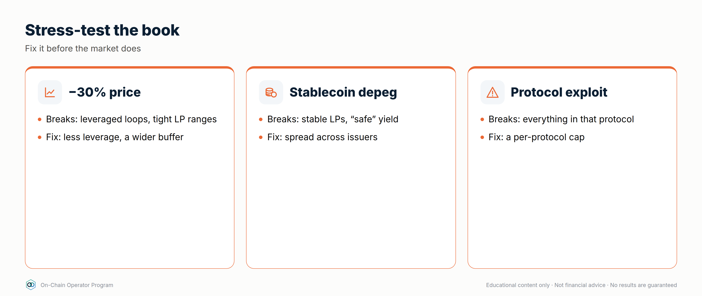

### Explanation
Scenarios every operator runs: **crypto −50% in a day** · **a stablecoin depegs 10%**
· **borrow rates spike to 20%** · **your largest protocol is hacked** · **your main L2 halts for 48h**.
For each: loss, liquidations, liquidity, and whether the payout policy survives.

### Worked example — $200,000 book
Holdings: ETH spot $60k · LST collateral $60k with $12k debt · stable lending $50k
($25k each in two protocols) · ETH/USDC LP $20k · PT stable $10k.

| Scenario | Impact | Passes? |
|---|---|---|
| ETH −50% | Spot −$30k; collateral −$30k (HF 4.0 → 2.0, no liquidation); LP $20k → $14.1k (−$5.9k) → **−$65.9k (−32.9%)** | Survives, but the payout must fall |
| One stablecoin −10% | −$2.5k on $25k | Yes |
| Borrow rate 20% | Interest on $12k rises from ~$600 to $2,400/yr | Yes: covered by reserve |
| One lending protocol hacked (total loss) | −$25k (−12.5%) | Survives; cap was 12.5% |
| L2 halted 48h | Positions frozen; the reserve on another chain covers needs | Yes, *if* the reserve isn't on the same L2 |

### Checklist
- [ ] Five scenarios run on the current book
- [ ] Every "fail" has a fix (smaller cap, bigger buffer, move the reserve)
- [ ] Re-run quarterly and after big changes

### Quiz
<details><summary>1. Why did the collateral position survive −50%?</summary>It started at HF 4.0; halving the price took it to 2.0.</details>
<details><summary>2. What does the L2-halt scenario test?</summary>Whether your liquidity depends on a single chain.</details>
<details><summary>3. What's the output of a stress test?</summary>Fixes: smaller caps, bigger buffers, better-placed reserves.</details>

---

## Lesson 11.5 — Incident response: the first 60 minutes

### Objective
Know exactly what to do when a protocol you use is exploited, a stablecoin depegs, or your wallet is compromised.

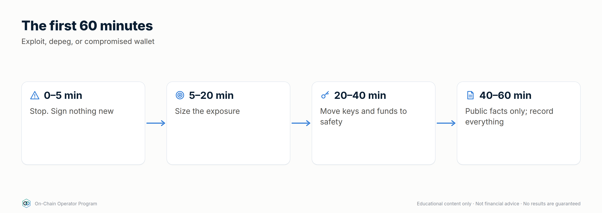

### Explanation — the 60-minute playbook
**0–5 min: Verify.** Official channels only (bookmarked X/Discord/status page,
security firms). Don't click links in DMs, and don't sign anything "to protect funds".
**5–20 min: Contain.**
- *Protocol exploit:* withdraw if still possible and safe; revoke approvals to affected contracts.
- *Depeg:* follow your written peg rule (e.g. exit below 0.99 for X hours); don't panic-sell far below it on a thin book.
- *Wallet compromise:* move remaining assets to a **fresh** wallet (new seed, clean device); revoke approvals; assume the old seed is burned.

**20–60 min: Stabilise.** Check HFs across all positions (prices may be
moving), top up from the reserve, and journal every action with timestamps.
**After: Review.** What was the signal, what worked, and what changes in the caps and the register?

### Worked example
A lending protocol you use announces a paused market after an exploit. You
verify on its bookmarked status page, see withdrawals still work on unaffected
markets, withdraw your USDC, revoke the pool approval, check your other HFs,
and journal it. Total time: 25 minutes. Loss: none. Because the steps were written in advance.

### Checklist
- [ ] Incident playbook printed/saved offline
- [ ] Official channels bookmarked for every protocol I use
- [ ] A clean "fresh wallet" procedure written

### Quiz
<details><summary>1. First thing to do in an incident?</summary>Verify through official, bookmarked channels.</details>
<details><summary>2. Someone offers a link to "rescue your funds". What do you do?</summary>Ignore it. It's a common scam during incidents.</details>
<details><summary>3. Wallet compromised: can you keep using the seed?</summary>No. Move to a fresh wallet with a new seed; the old one is burned.</details>

---

### Module 11 practical
1. Price one hedge (perp and put) for your largest price exposure.
2. Run the five stress scenarios on your book and write the fixes.
3. Write and save your incident playbook, with bookmarks.
