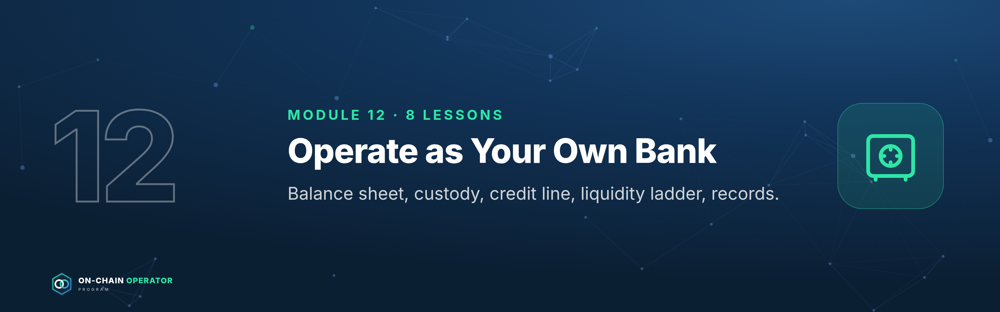
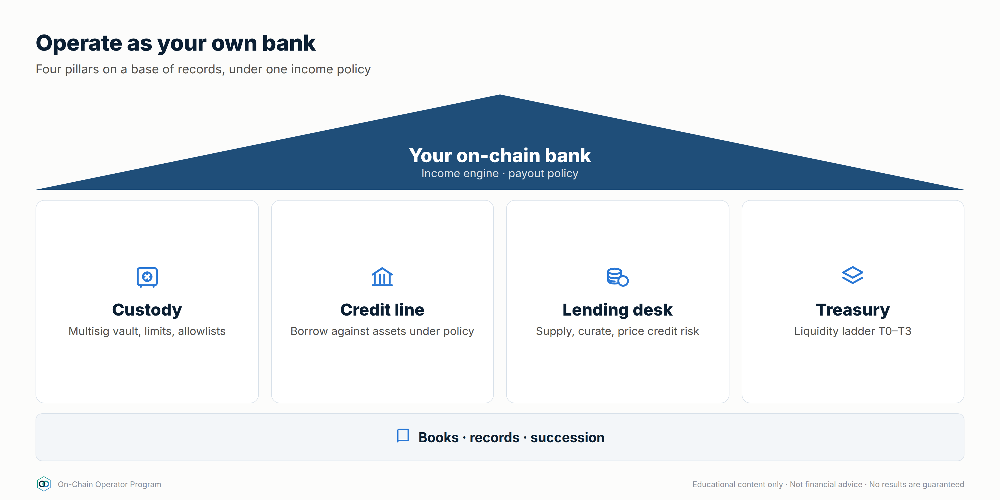
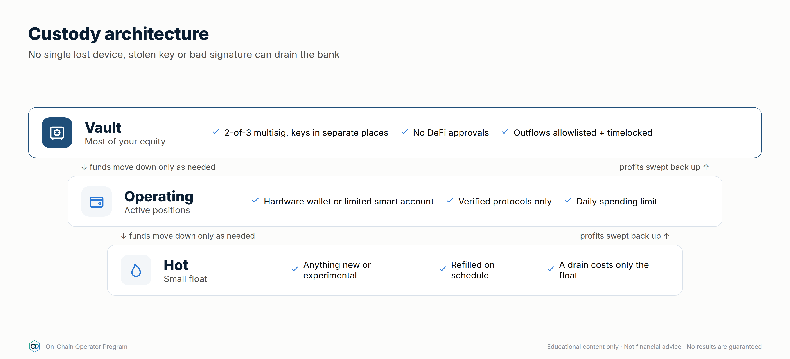
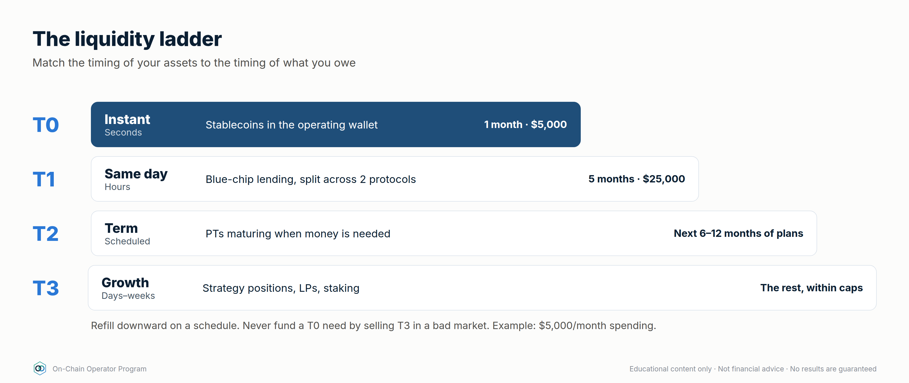

# On-Chain Operator Program — Stage 5 · Operator

*Section file generated by `build_master.py` from `lessons/` (edit the lessons, not this file). Modules 12, 13, 14. Every module opens with its Mastery Starter (N.0). Educational content only. Not financial advice.*

---

# Module 12 — Operate as Your Own Bank



*Outcome: run your crypto the way a bank runs its book: a balance sheet, a custody policy, a credit line, a liquidity ladder, a lending desk and records someone else could follow.*
*Stage 5 · Operator. Prerequisites: Modules 1–11. Educational content only. Not financial, tax or legal advice. Figures are illustrative.*

A bank does four things: it **keeps assets safe**, **lends**, **borrows**,
and **manages liquidity** so it can always meet what it owes. DeFi lets you
do all four yourself, with no one to call when something goes wrong. This
module turns that into written policy.



---

## Lesson 12.0 — Mastery Starter

*New to this topic? Start here. It takes about 10 minutes and gets you from zero to ready for this module.*

### The 60-second version
A bank keeps assets safe, lends, borrows and always has cash for what it owes. With DeFi you can run those four jobs yourself, with written policies, because there's nobody to call when something goes wrong.

### Words you'll need
| Term | Meaning |
|---|---|
| Balance sheet | assets, liabilities and equity |
| Liquidity ladder | reserves tiered by how fast you can access them |
| Credit line | borrowing against assets under a policy |
| Runway | months your reserve can cover |
| Succession | how others recover your assets if you can't |

### Before you start
- [ ] Modules 0–11

### Your first safe step
Fill in the balance sheet worksheet (W6) with rough numbers: equity, LTV and runway.

### The mastery ladder
| Level | You can… |
|---|---|
| **Beginner** | Has a balance sheet and a basic custody split |
| **Practitioner** | Runs written custody, credit, ladder and lending policies |
| **Master** | Operates a complete bank with books, tax-ready records, succession and quarterly reviews |

### You've mastered this module when…
…a stranger could run your bank from your written policies, with no keys in any document.

---

## Lesson 12.1 — Your balance sheet

### Objective
Build a personal on-chain balance sheet and read the three numbers that matter: equity, LTV and liquidity runway.

### Explanation
- **Assets:** everything you own, at market value: collateral, yield positions, reserves.
- **Liabilities:** everything you owe: loans, margin, any payables.
- **Equity** = assets − liabilities. This is what's actually yours.
- **LTV** = debt ÷ collateral. Your bank's leverage.
- **Liquidity runway** = liquid reserve ÷ monthly obligations (spending + interest).

Banks fail from **liquidity** (can't pay today) more often than from
**solvency** (owe more than they own). Track both.

### Worked example
$300,000 collateral, $60,000 debt at 5%, $40,000 stablecoin reserve, $5,000/month spending:

`defi_calc.py bank --collateral 300000 --debt 60000 --borrow-apy 5 --reserve 40000 --monthly-spend 5000`
- Equity **$280,000** · LTV **20%** · health factor **4.0**
- Obligations $5,250/month ($250 of it interest) → reserve covers **7.6 months**
- Policy checks: LTV ≤ 30% ✓ · HF ≥ 2 ✓ · reserve ≥ 6 months ✓

### Checklist
- [ ] Balance sheet updated weekly
- [ ] Equity, LTV and runway tracked over time
- [ ] Policy limits written (max LTV, min HF, min runway)

### Quiz
<details><summary>1. Assets $500k, debt $100k. Equity?</summary>$400k.</details>
<details><summary>2. Reserve $30k, obligations $6k/month. Runway?</summary>5 months, below a 6-month policy.</details>
<details><summary>3. Why track liquidity separately from equity?</summary>You can be solvent and still be forced to sell at the worst time if you can't meet obligations today.</details>

---

## Lesson 12.2 — Custody architecture: vault, multisig and spending policies

### Objective
Design custody so that no single lost device, stolen key or mistaken signature can drain the bank.

### Explanation
Scale Module 1's three wallets into a bank-grade setup:

| Tier | Holds | Control | Rules |
|---|---|---|---|
| **Vault** | Most of your equity | **Multisig**, e.g. 2-of-3 hardware keys in separate locations | No DeFi approvals. Moves only to the Operating tier, to allowlisted addresses |
| **Operating** | Active positions | Hardware wallet or a smart account with limits | Verified protocols only. Spending limit per day |
| **Hot** | Small float | Hot wallet | Anything new or experimental. Refilled on schedule |

Smart-account features to use where available:
- **Spending limits** per day/week
- **Allowlists** (it can only send to addresses you pre-approved)
- **Timelocks** on large moves (a delay you can cancel if it wasn't you)
- **Recovery** paths agreed and tested in advance



### Worked example
Vault: 2-of-3 multisig, with key A at home, key B in a safe-deposit box and
key C with a trusted person or a professional co-signer. Losing any one key
is survivable; stealing any one key is useless. **Test it:** move $10 through
every path once a quarter.

### Checklist
- [ ] Vault is multisig; keys in separate physical locations
- [ ] Operating tier has a daily limit
- [ ] Allowlist on vault outflows
- [ ] Quarterly recovery test done and logged

### Quiz
<details><summary>1. Why 2-of-3 rather than 1-of-1?</summary>One key can be lost or stolen without losing the funds or giving an attacker control.</details>
<details><summary>2. What does a timelock buy you?</summary>Time to notice and cancel an unauthorised large move.</details>
<details><summary>3. Why test recovery with a small amount?</summary>A recovery plan you've never run is an assumption. Testing proves every key and path works.</details>

---

## Lesson 12.3 — The credit line: borrowing like a bank client

### Objective
Use your assets as collateral for liquidity without selling, under a written credit policy.

### Explanation
Wealthy clients rarely sell appreciating assets to raise cash; they borrow
against them. DeFi money markets offer the same: deposit collateral, borrow
stablecoins, repay when it suits you, with no credit check. **The collateral
is liquidated if you breach the threshold**, and nobody calls first.

**A credit policy (write yours):**
- Max LTV **25–30%** on volatile collateral (liquidation is often near 80%+)
- Health factor floor **2.5**; act at **2.0**
- Prefer collateral whose **yield covers the interest** (strategy #25)
- Consider **fixed-rate** borrowing when a rate spike would force a sale (strategy #22)
- **Repayment source** named before borrowing (income, reserve, maturing PT)
- Tax treatment of borrowing varies by country: **check with a tax professional**

### Worked example
$200,000 of liquid-staked ETH earning 3.2% ($6,400/yr). Borrow **$40,000** stablecoins at 5% ($2,000/yr).
- Yield covers interest **3.2×**. LTV 20%. HF **4.0** at a 0.8 threshold.
- ETH would have to fall **~75%** before liquidation (HF falls in proportion to price).
- Defence plan: at HF 2.0, repay from reserve; at HF 1.7, sell part of the collateral deliberately rather than let a liquidator do it at a penalty.

### Checklist
- [ ] Credit policy written: max LTV, HF floor, action levels
- [ ] Repayment source named
- [ ] Alerts set at the action levels (Module 14.1)
- [ ] Fixed vs variable decision made on purpose

### Quiz
<details><summary>1. Why borrow against assets instead of selling them?</summary>You keep the asset and its upside (and in some jurisdictions avoid a taxable sale), at the cost of interest and liquidation risk.</details>
<details><summary>2. HF is 4.0. Roughly how far can collateral fall before liquidation?</summary>About 75%, since HF scales with collateral price (HF 1.0 at a quarter of the current price).</details>
<details><summary>3. What should happen at your action level?</summary>Repay or add collateral per the written plan. Sell deliberately before a liquidator does it at a penalty.</details>

---

## Lesson 12.4 — Treasury and the liquidity ladder

### Objective
Structure reserves so money is available when it's needed, earning a return at every tier.

### Explanation
Banks match the timing of assets to the timing of what they owe. Your ladder:

| Tier | Access | Holds | Size (example: $5,000/month spend) |
|---|---|---|---|
| **T0 Instant** | Seconds | Stablecoins in the operating wallet | 1 month: $5,000 |
| **T1 Same day** | Hours | Blue-chip stablecoin lending, split across 2 protocols | 5 months: $25,000 |
| **T2 Term** | Scheduled | PTs maturing on dates you'll need the money (Lesson 10.1) | Next 6–12 months of planned spending |
| **T3 Growth** | Days–weeks | Strategy positions, LPs, staking | The rest, within caps |



Refill downward on a schedule: T1 tops up T0 monthly; maturing PTs top up T1.
Never fund a T0 need by selling a T3 position in a bad market. That's what the
ladder exists to prevent.

### Worked example
T0 $5,000 + T1 $25,000 = **6 months** instantly available. T2 holds three PTs
maturing in 3, 6 and 9 months, each sized for 3 months of spending. A −50%
market day touches none of it.

### Checklist
- [ ] T0 + T1 ≥ 6 months of obligations
- [ ] T2 maturities matched to planned spending
- [ ] Monthly refill schedule set
- [ ] T3 never used for day-to-day needs

### Quiz
<details><summary>1. Why hold T0 in plain stablecoins earning little?</summary>Instant, certain access. It's the tier that pays today's bills without selling anything.</details>
<details><summary>2. What's T2 for?</summary>Known future spending, with maturities matched to when the money is needed and a fixed return locked in.</details>
<details><summary>3. What does the ladder prevent?</summary>Forced selling of growth positions at bad prices to meet short-term needs.</details>

---

## Lesson 12.5 — Being the lender: supplying, curating and pricing credit risk

### Objective
Act as the lending side of the bank: choose markets, price the risk, and know when to pull liquidity.

### Explanation
When you supply to a money market, you're the bank's depositor, and
effectively its credit desk. Your return:
`supply APY ≈ borrow APY × utilisation × (1 − reserve factor)`.

Modern designs split lending into **isolated markets** (one collateral, one
loan asset, one oracle, one liquidation LTV). **Curated vaults** spread
deposits across several of these; the curator decides the allocation.

What a lender must check:
- **Collateral quality and liquidation LTV:** the higher the LTV, the thinner the buffer before bad debt
- **Oracle:** what prices the collateral, and can it be manipulated? (Module 5.3)
- **Utilisation:** near 100% means you may not be able to withdraw
- **Curator:** track record, how allocations are changed, timelocks
- **Risk-adjusted return**, not headline

### Worked example
Vault A: 7% headline, exposure to newer collateral; you assume a 2%/yr chance of a loss event losing half the deposit → **6.0%** risk-adjusted.
Vault B: 4.5% headline, blue-chip collateral; 0.5%/yr, total loss assumed → **4.0%**.
`defi_calc.py expected --yield-apy 7 --loss-prob 0.02 --lgd 0.5`

A pays more after the haircut, *if* your loss estimates are honest. Split
between them, and cap A lower because its tail is fatter and less known.

### Checklist
- [ ] Every market's collateral, oracle and LTV listed
- [ ] Loss probability and loss-given-default written down (your assumptions)
- [ ] Utilisation alert (e.g. > 90%)
- [ ] Per-vault and per-curator caps

### Quiz
<details><summary>1. Borrow APY 10%, utilisation 70%, reserve factor 10%. Supply APY?</summary>6.3%.</details>
<details><summary>2. Why is utilisation at 100% a lender's problem?</summary>All liquidity is lent out, so withdrawals wait until borrowers repay or new deposits arrive.</details>
<details><summary>3. What's a curated vault's extra risk?</summary>The curator's allocation decisions and permissions, on top of each market's risk.</details>

---

## Lesson 12.6 — Books, records and succession

### Objective
Keep books a stranger could follow, and make sure your family could recover everything if you couldn't.

### Explanation
**Books** (update weekly from your journal, Module 8):
- Every position: protocol, chain, contract, amount, entry date and price, cost basis
- Every loan: collateral, debt, rate, HF, action levels
- Every approval granted, and when it was revoked
- Income received, by source and date
- Keep exportable records for tax. Rules differ by country, so **use a crypto-aware tax professional.**

**Succession:** self-custody means that if you're gone and nobody can sign,
the money is gone too.
- A **letter of instruction** that explains the setup (wallets, multisig, where
  the documents are, who to contact), **stored separately from any seed or key**
- Multisig with a trusted co-signer or professional service, so recovery doesn't depend on one person
- Legal documents (will, powers of attorney) that reference the digital assets: **use a lawyer**
- **Annual drill:** walk a trusted person through the letter without revealing secrets

### Worked example
A 2-of-3 vault: you hold two keys (home + safe-deposit box); a professional
co-signer holds the third under an agreed recovery process. Your letter of
instruction, stored with your will, explains how your executor works with
the co-signer. No single document contains enough to steal the funds.

### Checklist
- [ ] Books current within a week
- [ ] Tax records exportable; professional engaged
- [ ] Letter of instruction written and stored apart from keys
- [ ] Annual succession drill done

### Quiz
<details><summary>1. Why keep the letter of instruction apart from seeds and keys?</summary>So finding the letter isn't enough to steal the funds.</details>
<details><summary>2. What's the risk of single-key self-custody for your family?</summary>If you can't sign and no one else can, the assets are unrecoverable.</details>
<details><summary>3. What goes in the books for each loan?</summary>Collateral, debt, rate, health factor and your action levels.</details>

---

## Lesson 12.7 — Tax, regulation and compliance awareness *(new)*

### Objective
Know which on-chain actions may have tax or legal consequences, keep the records to handle them, and know when to get professional help.

### Explanation
**This lesson is awareness, not advice. Rules differ by country and change. Use a crypto-aware tax professional and, for legal questions, a lawyer.**
- **Events that may be taxable** in many countries: selling crypto for cash, swapping one token for another, spending crypto, and receiving income (interest, staking rewards, LP fees, airdrops). Some treat borrowing, wrapping, LP deposits or bridging differently. Ask.
- **Cost basis:** what you paid, including fees. Methods (e.g. FIFO, specific identification) depend on local rules.
- **Records:** every buy, sell, swap, transfer, fee and income event, with dates, amounts and prices (W1 records sheet). On-chain data can be exported, but self-transfers must be labelled or they may look like disposals.
- **Regulation:** use services legally available where you live; don't use tools to get around geo-restrictions; never interact with sanctioned addresses or services; exchanges must run KYC/AML checks, and some DeFi front ends block certain regions.
- **Reporting:** some countries require reporting of foreign accounts or digital assets. Ask your professional.

### Worked example
In one year: bought ETH, swapped half to USDC, lent USDC for interest, received an
airdrop, bridged to an L2 and moved funds between your own wallets. For your tax
professional, you'd prepare: the records sheet, labelled self-transfers (not
disposals), interest and airdrop income with dates and values, and exchange
statements. **They** tell you what's taxable where you live.

### Checklist
- [ ] Records sheet complete, with self-transfers labelled
- [ ] Crypto-aware tax professional engaged
- [ ] Only legally available services used; no geo-restriction workarounds
- [ ] Sanctions awareness: never interact with sanctioned addresses or services

### Quiz
<details><summary>1. Name three events that are often taxable.</summary>Any three: selling for cash, swapping tokens, spending crypto, receiving interest, staking rewards, LP fees or airdrops.</details>
<details><summary>2. Why label self-transfers?</summary>So moves between your own wallets aren't mistaken for disposals.</details>
<details><summary>3. Who decides what's taxable for you?</summary>Your local rules, applied by a qualified tax professional.</details>

---

## Lesson 12.8 — Institutional-grade custody: MPC, custodians and policy engines *(expert)*

### Objective
Know the custody options institutions use, and when they make sense for a large personal or family book.

### Explanation
- **Multisig** (12.2): several keys, rules enforced **on-chain**, transparent and verifiable.
- **MPC (multi-party computation):** one key is split into shares held by different devices or parties; signatures are created together without ever assembling the key. The rules are enforced **off-chain** by the provider's software. It works on any chain, but you depend on the vendor and can't verify the policy on-chain.
- **Qualified custodians:** regulated firms that hold assets for clients. Strong legal protections in some jurisdictions; you give up self-custody and on-chain flexibility.
- **Policy engines:** approval workflows (who can approve what, above which amount), allowlists, time windows and velocity limits, available in both institutional MPC platforms and smart-account setups.
- **Hybrid:** many large holders use a custodian or MPC for long-term reserves and multisig/smart accounts for active DeFi.


### Worked example
A $5M family book: cold reserves ($3M) with a qualified custodian (legal title,
insurance terms read); active DeFi ($1.5M) in a 2-of-3 multisig with a policy of
two approvers above $50,000 and an allowlist; hot float ($20,000) in a limited smart
account. The succession plan (12.6) covers all three.

### Checklist
- [ ] Custody option chosen per tier, with reasons
- [ ] Vendor/custodian terms, insurance and recovery read
- [ ] Policy engine rules written: approvers, thresholds, allowlists

### Quiz
<details><summary>1. MPC vs multisig: where are the rules enforced?</summary>MPC: off-chain by the provider's software. Multisig: on-chain by the contract.</details>
<details><summary>2. What do you give up with a qualified custodian?</summary>Self-custody and on-chain flexibility.</details>
<details><summary>3. What is a policy engine?</summary>Rules for approvals, thresholds, allowlists and limits on transactions.</details>

---

### Module 12 practical: your bank's founding documents
1. Balance sheet with equity, LTV and runway (`defi_calc.py bank`).
2. Custody policy: tiers, multisig setup, limits, allowlists, recovery test log.
3. Credit policy: max LTV, HF floor, action levels, repayment source.
4. Liquidity ladder: T0–T3 sizes and refill schedule.
5. Lending policy: markets, caps, risk assumptions.
6. Books template and letter of instruction (stored separately).

---

# Module 13 — The Income Engine


*Outcome: design an income portfolio, measure expected income after expected losses, and set a payout you can sustain.*
*Stage 5 · Operator. Prerequisites: Modules 1–12. Educational content only. Not financial or tax advice. No income is guaranteed. Loss probabilities are your own assumptions; figures are illustrative.*

**The operator's income rule:** plan on **expected** income (yield minus
expected losses), pay out **less** than that, and never pay out of principal.

---

## Lesson 13.0 — Mastery Starter

*New to this topic? Start here. It takes about 10 minutes and gets you from zero to ready for this module.*

### The 60-second version
Income from DeFi should be planned like a pension, not chased like a jackpot: build it from durable sources, subtract the losses you should expect, and pay yourself less than that.

### Words you'll need
| Term | Meaning |
|---|---|
| Durability | how long and reliably a source tends to pay |
| Risk-adjusted yield | yield minus expected losses |
| LGD | how much you lose if a loss event happens |
| Payout ratio | share of expected income you take out |
| Principal | the capital itself, never spent as income |

### Before you start
- [ ] Modules 0–12

### Your first safe step
Take one position and compute its risk-adjusted yield with `defi_calc.py expected`.

### The mastery ladder
| Level | You can… |
|---|---|
| **Beginner** | Ranks income sources by durability |
| **Practitioner** | Builds an income portfolio with risk-adjusted expected income |
| **Master** | Runs a payout policy that survives bad years, with annual reviews and scaling rules |

### You've mastered this module when…
…your payout is set below risk-adjusted expected income and never draws on principal.

---

## Lesson 13.1 — Income sources ranked by durability

### Objective
Rank income sources by how long and how reliably they're likely to pay, not by their headline rate.

### Explanation
| Source | Typical driver | Durability | Variability |
|---|---|---|---|
| Blue-chip stablecoin lending | Borrower demand | High | Medium: moves with demand |
| Staking / LSTs | Network security rewards | High | Low–medium |
| Fixed-rate PTs to maturity | Locked at purchase | Fixed for the term | None until maturity |
| Curated lending vaults | Borrower demand in isolated markets | Medium | Medium |
| LP fees (major pairs) | Trading volume | Medium | High |
| Funding / basis carry | Market positioning | Low–medium | High: can turn negative |
| Options premium | Volatility | Medium | High |
| Incentives / points | Protocol budgets | Low | Very high |

A durable income engine is built mostly from the top of this table. The
bottom rows are **boosters** you size small and expect to switch off.

### Checklist
- [ ] Every income position tagged with its source and durability
- [ ] Core income from high-durability sources

### Quiz
<details><summary>1. Why is funding carry low durability?</summary>It depends on market positioning and can turn negative for long periods.</details>
<details><summary>2. Which source gives a known rate for a set term?</summary>Fixed-rate PTs held to maturity.</details>
<details><summary>3. How should incentive income be treated?</summary>As a temporary booster, sold on a schedule and not relied on.</details>

---

## Lesson 13.2 — Risk-adjusted yield: subtracting expected losses

### Objective
Convert every headline yield into an expected yield after the losses it statistically carries.

### Explanation
`risk-adjusted yield = headline − (annual loss probability × loss given default) − costs`

You don't know the true loss probability, so **write down an assumption and
be conservative.** Newer protocols, more dependencies and higher leverage
deserve higher numbers. The point isn't precision; it's making you compare
positions on the same footing.

### Worked example
| Position | Headline | Assumed loss prob. | LGD | Risk-adjusted |
|---|---|---|---|---|
| New protocol vault | 9.0% | 3%/yr | 100% | **6.0%** |
| Blue-chip lending | 4.5% | 0.5%/yr | 100% | **4.0%** |

`defi_calc.py expected --yield-apy 9 --loss-prob 0.03`

The 9% vault still wins on expectation, but by 2 points, not 4.5. Its bad
outcome is also far worse, so size it smaller (Lesson 13.3).

### Checklist
- [ ] Loss probability and LGD written for every position
- [ ] Decisions made on risk-adjusted, not headline

### Quiz
<details><summary>1. 12% headline, 5%/yr loss probability, 60% LGD. Risk-adjusted?</summary>12 − 3 = 9%.</details>
<details><summary>2. Why assume conservatively?</summary>Losses cluster in stress, when many positions fail together; optimistic assumptions overstate income.</details>
<details><summary>3. Two positions, same risk-adjusted yield. Which gets more capital?</summary>The one with the smaller and better-understood worst case.</details>

---

## Lesson 13.3 — Building the income portfolio

### Objective
Assemble an income portfolio and calculate its blended risk-adjusted yield and expected income.

### Explanation
Build in layers: **core** (high-durability, 60–80%), **term** (fixed PTs matched
to the liquidity ladder), **boosters** (carry, options, LP; small). Apply
Module 8's caps: per protocol, per chain, per stablecoin issuer.

### Worked example — $500,000 income portfolio
`defi_calc.py income --pos "Stable lending A:100000:5:0.005:1" --pos "Stable lending B:100000:4.5:0.005:1" --pos "LST staking:150000:3.2:0.01:0.5" --pos "PT fixed stable:100000:8:0.02:0.5" --pos "Funding carry:50000:9:0.05:0.3"`

| Position | Amount | Yield | Expected loss | Net | Income/yr |
|---|---|---|---|---|---|
| Stable lending A | 100,000 | 5.0% | 0.5% | 4.5% | 4,500 |
| Stable lending B | 100,000 | 4.5% | 0.5% | 4.0% | 4,000 |
| LST staking | 150,000 | 3.2% | 0.5% | 2.7% | 4,050 |
| PT fixed stable | 100,000 | 8.0% | 1.0% | 7.0% | 7,000 |
| Funding carry | 50,000 | 9.0% | 1.5% | 7.5% | 3,750 |
| **Total** | **500,000** | | | **4.66%** | **23,300** |


Note: the LST line is priced in ETH, so its dollar value, and therefore the
dollar income, moves with ETH. The rest is stablecoin-denominated.

### Checklist
- [ ] Core ≥ 60% from high-durability sources
- [ ] Caps respected per protocol, chain and issuer
- [ ] Blended risk-adjusted yield calculated

### Quiz
<details><summary>1. Which line contributes the most expected income, and why?</summary>PT fixed stable ($7,000): a high locked rate on a sizeable allocation, even after the haircut.</details>
<details><summary>2. Why is the carry line only $50,000?</summary>It's a low-durability booster with a higher assumed loss rate.</details>
<details><summary>3. What makes the LST income variable in dollars?</summary>It's denominated in ETH, so the dollar value moves with the ETH price.</details>

---

## Lesson 13.4 — The payout policy: how much you can take out

### Objective
Set a payout you can sustain through bad years, and the rules that change it.

### Explanation
- **Pay out a share of *expected* income, not headline** (e.g. 70%).
- **Retain the rest** as a loss buffer; it absorbs the losses you assumed in 13.2.
- **Pay from the T0/T1 ladder** (Module 12.4), refilled by income, so payouts never depend on selling anything that day.
- **Never pay from principal.** If income falls short, the payout falls.
- **Review quarterly:** if realised income is below expected for two quarters, cut the payout to 70% of the new realised level.

### Worked example
Expected income **$23,300/yr** × 70% = **$16,310/yr** paid out (**$1,359/month**).
**$6,990/yr** retained. If a position fails as assumed, the buffer absorbs it
and the payout continues.

### Checklist
- [ ] Payout ratio written (≤ 70–80% of expected income)
- [ ] Paid from the ladder, not from positions
- [ ] Quarterly review rule written
- [ ] "Never from principal" rule written

### Quiz
<details><summary>1. Expected income $40,000. Payout at 70%?</summary>$28,000/yr (~$2,333/month).</details>
<details><summary>2. What's the retained 30% for?</summary>Absorbing expected losses and bad years without cutting into principal.</details>
<details><summary>3. Realised income lags expected for two quarters. What happens?</summary>Cut the payout to the policy share of the new realised level.</details>

---

## Lesson 13.5 — Scaling, compounding and the annual review

### Objective
Grow the engine safely and review it like a bank's annual report.

### Explanation
**Compounding:** reinvesting the retained share grows principal, and income
with it. At a 4.66% risk-adjusted yield with 30% retained, principal grows
~**1.4%/yr** from retention alone. The payout grows at about the same rate:
$16,310 → ~$17,480 after five years (before any new capital).

**Scaling rules as the book grows:**
- Caps are **percentages**, so position sizes rise, and so does market impact.
  Check pool depth and exit liquidity at the new size.
- Add independent protocols and issuers before adding size to existing ones.
- More size means more value at stake in custody: revisit Module 12.2.

**Annual review (one page):**
1. Balance sheet: start vs end equity, LTV, runway
2. Income: expected vs realised, by source
3. Losses and near-misses: what happened, what changed
4. Payout: paid vs policy
5. Risk assumptions: update loss probabilities from the year's incidents
6. Custody and succession drill: done?

### Checklist
- [ ] Retained income reinvested per policy
- [ ] Exit liquidity checked at current size
- [ ] Annual review completed and filed with the books

### Quiz
<details><summary>1. Yield 5%, 40% retained. Growth from retention alone?</summary>~2% a year.</details>
<details><summary>2. Why check exit liquidity as the book grows?</summary>A position that was easy to exit at $50k may move the market at $500k.</details>
<details><summary>3. What should the annual review update?</summary>Loss-probability assumptions, from the year's incidents and near-misses.</details>

---

### Module 13 practical
1. Tag every position by source and durability (13.1).
2. Write loss assumptions and compute risk-adjusted yields (13.2).
3. Build your income portfolio with `defi_calc.py income` (13.3).
4. Write your payout policy (13.4) and first annual-review template (13.5).

---

# Module 14 — Automation & Mastery


*Outcome: monitor and automate safely, run multisig operations, and complete the operator capstone.*
*Stage 5 · Operator. Prerequisites: Modules 0–13. Educational content only. Not financial advice.*

**The automation rule:** automate *watching* freely; automate *acting* only with
limited permissions you can revoke, and never by handing over your keys.

---

## Lesson 14.0 — Mastery Starter

*New to this topic? Start here. It takes about 10 minutes and gets you from zero to ready for this module.*

### The 60-second version
At mastery, you watch everything automatically and act through rules and limited permissions, never by handing over keys. Then you prove it with the operator capstone.

### Words you'll need
| Term | Meaning |
|---|---|
| Alert | an automatic notification tied to an action |
| Keeper | an automated service that executes conditions |
| Session key | a limited, revocable permission |
| Change control | a written, delayed process for new risks |
| RPC | a connection that lets software read the chain |

### Before you start
- [ ] Modules 0–13

### Your first safe step
Set one alert today: a health factor, a peg or any outflow from your vault wallet.

### The mastery ladder
| Level | You can… |
|---|---|
| **Beginner** | Has alerts mapped to actions |
| **Practitioner** | Automates one task with scoped permissions and writes signing procedures |
| **Master** | Builds read-only tools and passes the operator capstone |

### You've mastered this module when…
…you've passed the operator capstone.

---

## Lesson 14.1 — Monitoring: dashboards, alerts and on-chain watchers

### Objective
Set up monitoring so you hear about problems before they cost money.

### Explanation
Watch four things:
1. **Positions:** health factors, LP ranges, pegs, utilisation of markets you lend to.
2. **Protocols:** governance proposals, queued upgrades (timelocks), incidents.
3. **Wallets:** any outgoing transaction or new approval from your vault/operating wallets.
4. **Market:** funding, large depegs, liquidations.

Tools: portfolio dashboards, protocol-native alerts, wallet-activity watchers,
block-explorer address alerts, and official status/X accounts. Alerts should reach your **phone**.

### Worked example — alert sheet
| Alert | Threshold | Action (from your policies) |
|---|---|---|
| HF, credit line | < 2.0 / < 1.7 | Repay per 11.3 |
| Stablecoin peg | < 0.99 for 2h | Peg rule |
| Market utilisation | > 95% for 24h | Withdraw per kill rule |
| Vault wallet outflow | Any | Verify immediately (11.5) |
| Queued upgrade | Any, on protocols > 10% of book | Review within timelock |

### Checklist
- [ ] Alerts for all four categories, delivered to phone
- [ ] Every alert maps to a written action

### Quiz
<details><summary>1. Why alert on any vault-wallet outflow?</summary>The vault should almost never move; any movement could be a compromise.</details>
<details><summary>2. Why watch queued upgrades?</summary>The timelock is your window to exit before the change takes effect.</details>
<details><summary>3. An alert with no action attached is…?</summary>Noise. Every alert needs a written response.</details>

---

## Lesson 14.2 — Automation: keepers, bots and agents without handing over the keys

### Objective
Automate routine actions with the least permission possible.

### Explanation
- **Keeper / automation networks** execute pre-defined actions when conditions
  are met (e.g. repay when HF < 1.8, rebalance an LP range).
- **Smart-account permissions / session keys:** grant a bot the right to do
  *one thing* (e.g. repay debt on one protocol, up to $X per day), revocable at any time.
- **AI agents and bots:** treat them like any other contract permission. They get
  scoped rights, never your seed phrase or unlimited approvals.
- **Test on a testnet or with tiny amounts first; log every automated action.**

### Worked example
Automated repay: a session key allowed only to call `repay` on your lending
position, from your operating wallet, capped at $5,000/day, expiring in 30 days.
Worst case if the bot is compromised: it repays your debt, which is annoying, not catastrophic.

### Checklist
- [ ] Each automation has a scoped, capped, expiring permission
- [ ] No automation holds seed phrases or unlimited approvals
- [ ] Tested small; actions logged; revoke procedure known

### Quiz
<details><summary>1. What's a session key?</summary>A limited, revocable permission for a specific action.</details>
<details><summary>2. Should an AI agent ever get your seed phrase?</summary>No. Give it scoped, revocable permissions only.</details>
<details><summary>3. Worst case of a well-scoped repay bot?</summary>It repays debt within its cap. No funds leave your control.</details>

---

## Lesson 14.3 — Operating procedures: multisig signing, change control, reviews

### Objective
Run your bank with procedures that prevent single-point mistakes.

### Explanation
- **Multisig signing procedure:** every signer independently verifies the
  transaction (destination, amount, calldata) on their **own device screen**, not a shared screenshot.
- **Change control:** new protocol, new chain, new strategy, or a cap change is
  written up (thesis, risk register row, size) and waits 24h before execution.
- **Separation:** the person proposing a vault transaction isn't the only one approving it.
- **Review calendar:** weekly books · monthly register · quarterly stress test and recovery drill · annual review (Module 13.5).

### Worked example
A 2-of-3 vault moves $40,000 to the operating wallet. Signer 1 proposes; Signer 2
checks the destination against the allowlist and the amount against the ladder
refill schedule on their hardware wallet screen, then signs. Logged in the books with both names.

### Checklist
- [ ] Signing procedure written for every signer
- [ ] Change-control template and 24h rule
- [ ] Review calendar set

### Quiz
<details><summary>1. Why verify on your own device screen?</summary>Screens and screenshots can be faked; the hardware display shows what you're actually signing.</details>
<details><summary>2. What is change control for?</summary>Forcing new risks through thesis, register and a cooling-off period.</details>
<details><summary>3. How often is the stress test re-run?</summary>Quarterly, and after big changes.</details>

---

## Lesson 14.4 — Operator capstone and certification

### Objective
Assemble your complete on-chain bank and have it assessed.

### Explanation — the operator capstone
Submit one document (template in `07-program-operations.md`) containing:
1. **Balance sheet** with equity, LTV and runway (12.1)
2. **Custody policy** and recovery-test log (12.2)
3. **Credit policy** with action levels (12.3)
4. **Liquidity ladder** T0–T3 (12.4)
5. **Lending policy** with risk assumptions (12.5)
6. **Books template** and letter of instruction location (12.6; never the seed)
7. **Income portfolio** with risk-adjusted expected income (13.3)
8. **Payout policy** (13.4)
9. **Stress test**, five scenarios, with fixes (11.4)
10. **Incident playbook** (11.5), **alert sheet** (14.1) and **automation permissions** (14.2)

**Certification levels** (assessed against the rubric in `07-program-operations.md`):
- **Analyst:** passed the analyst capstone (Modules 6–7)
- **Operator:** passed the operator capstone
- **Operator with distinction:** operator capstone scored ≥ 90%, plus one quarter of books kept to standard

### Checklist
- [ ] All ten sections complete
- [ ] Calculators used for every number
- [ ] Submitted (Live tier: booked for review)

### Quiz
<details><summary>1. What must never appear in the capstone?</summary>Seed phrases, private keys or anything that grants access.</details>
<details><summary>2. Which lesson's output shows income is sustainable?</summary>13.4: the payout policy, based on risk-adjusted expected income.</details>
<details><summary>3. What's needed for "with distinction"?</summary>≥ 90% on the operator capstone plus a quarter of books kept to standard.</details>

---

## Lesson 14.5 — Building your own tools: reading contracts, data and simple scripts *(new)*

### Objective
Read on-chain data directly and build simple read-only tools, so you're not dependent on any one dashboard.

### Explanation
- **Reading without code:** block explorers' Read tabs show a contract's public state (e.g. a lending market's parameters, your position).
- **Public data APIs** (e.g. protocol analytics sites, explorers) return TVL, fees, yields and prices as JSON.
- **RPC:** a node endpoint that lets a script read chain state directly (balances, contract calls). Use a reputable provider; reading is free or cheap.
- **Scripts that only read** (never hold keys) can check health factors, pegs and utilisation, and send you alerts.
- **Rule:** tools that *read* are low-risk; tools that *sign* follow Lesson 14.2 (scoped, capped, revocable permissions). Never put a seed phrase or private key in a script, a file or an environment variable on a shared machine.

### Worked example (read-only, pseudo-code)
```
every 15 minutes:
    position = lending_protocol.getUserAccountData(my_address)   # public read call
    if position.health_factor < 1.8: send_phone_alert("HF " + position.health_factor)
    peg = price_api.get("USDC")
    if peg < 0.99: send_phone_alert("USDC peg " + peg)
```
Uses only public reads, holds no keys, and can't move funds. Worst case if it
breaks: you miss an alert, so keep your other alerts (14.1) as a backup.

### Checklist
- [ ] I can read a contract's state on an explorer
- [ ] My monitoring scripts are read-only and hold no keys
- [ ] Backup alerts exist if my script fails

### Quiz
<details><summary>1. Why prefer read-only tools?</summary>They can't move funds, so a bug or breach costs little.</details>
<details><summary>2. Where should a private key go in a script?</summary>Nowhere. Use scoped permissions (14.2) if a tool must act.</details>
<details><summary>3. What's an RPC endpoint?</summary>A node connection that lets software read (and submit to) the blockchain.</details>

---

## Lesson 14.6 — Searchers, keepers and arbitrage bots: how they work *(expert)*

### Objective
Understand the professional bot economy that shapes DeFi prices, and why competing in it is hard.

### Explanation
- **Searchers** run bots that find and capture opportunities: **DEX arbitrage** (price gaps between pools/venues), **liquidations** (repay debt, take the bonus), **backruns** (trading right after a large swap), and, harmfully, sandwiches.
- **Keepers** perform maintenance jobs for protocols (liquidations, auction bids, rebalancing) for a fee.
- **The economics:** bots bid for inclusion by paying builders/validators (2.8). Competition drives profits towards zero; the winners have the lowest latency, best infrastructure, private order flow and capital.
- **Why it matters to you:** these bots are why pool prices track the market (and cause LVR, 2.7), why liquidations happen within seconds (3.3), and why tight slippage and protected routing matter (2.5).
- **For a learner:** build read-only monitors (14.5) and understand the mechanics. Running competitive bots is a professional engineering business with real losses from failed transactions and bugs.

### Worked example
A liquidation worth a $300 bonus (3.3) appears. Dozens of bots see it in the same block;
the winner pays most of the $300 to the block builder to be included first. The
"profit" left after fees and gas might be a few dollars, and losing bots may still pay gas.
That's why liquidations are near-instant, and why your buffer (not a liquidator's delay) is your protection.

### Checklist
- [ ] I can name the main searcher strategies and their effect on me
- [ ] My protections (slippage, private routing, HF buffers) assume bots act within seconds

### Quiz
<details><summary>1. Where does most of a competitive searcher's profit go?</summary>To builders/validators, through bids for inclusion.</details>
<details><summary>2. What do keepers do?</summary>Paid maintenance for protocols: liquidations, auctions, rebalancing.</details>
<details><summary>3. Why do liquidations happen so fast?</summary>Competing bots race to capture the bonus.</details>

---

### Module 14 practical
Build your alert sheet, scope one automation, write your signing procedure, then complete the operator capstone.
